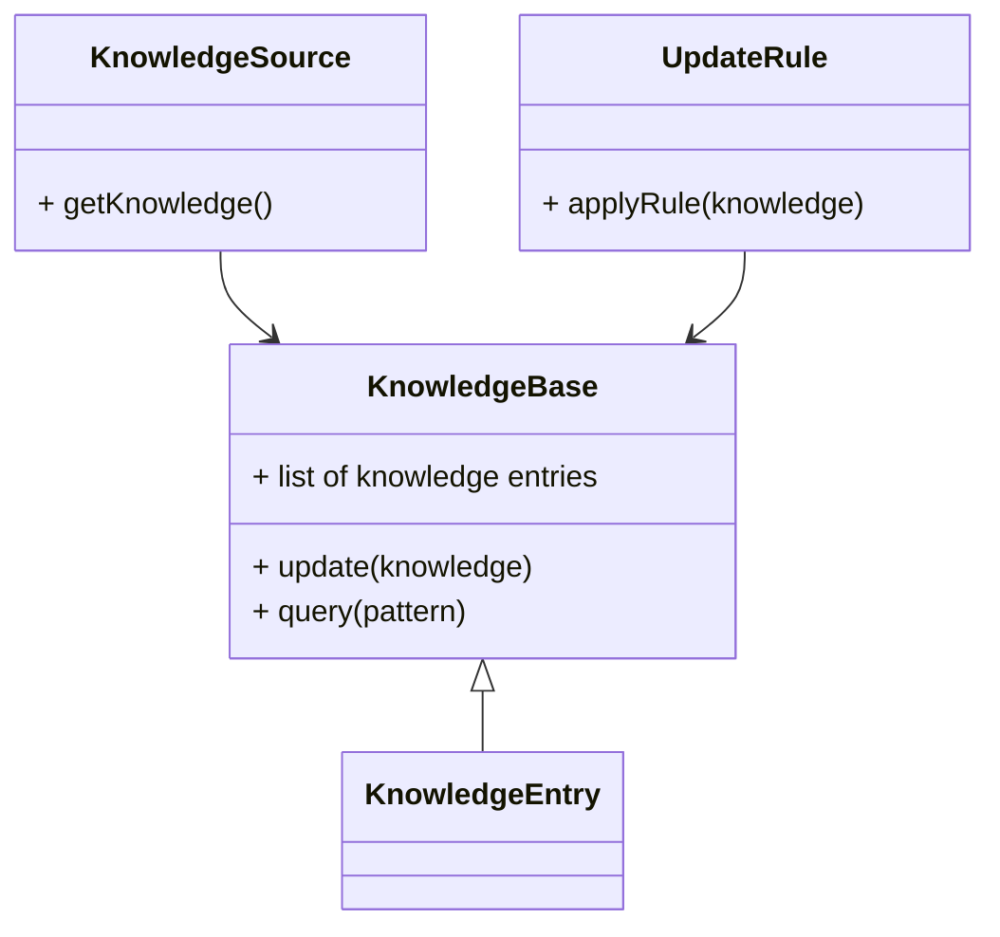
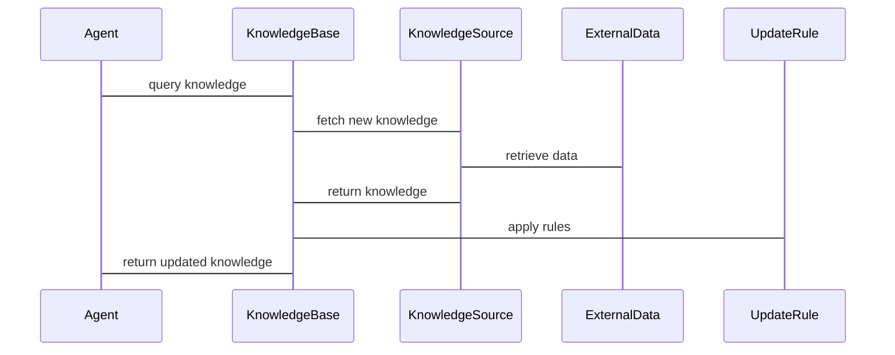

                 


# 设计AI Agent的动态知识库更新机制

## 关键词：AI Agent, 知识库更新, 动态知识库, 知识表示, 知识推理

## 摘要：  
AI Agent的动态知识库更新机制是实现智能系统高效运作的核心技术之一。本文从AI Agent的基本概念出发，深入探讨动态知识库的更新机制，包括知识表示、更新算法、系统架构设计以及实际应用案例。通过分析增量式和全量式更新算法的优缺点，结合数学模型和实际代码实现，为读者提供一个全面而系统的知识库更新解决方案。

---

# 第1章: AI Agent与动态知识库概述

## 1.1 AI Agent的基本概念

### 1.1.1 AI Agent的定义与特点
AI Agent（人工智能代理）是一种能够感知环境、自主决策并执行任务的智能实体。其特点包括：
- **自主性**：能够在没有外部干预的情况下独立运作。
- **反应性**：能够根据环境变化动态调整行为。
- **目标导向**：以明确的目标为导向执行任务。
- **知识驱动**：依赖知识库中的信息进行推理和决策。

### 1.1.2 动态知识库的定义与作用
动态知识库是指能够实时更新和适应环境变化的知识存储系统。其作用包括：
- **实时更新**：能够快速响应环境变化，保持知识的准确性。
- **动态适应**：支持AI Agent在复杂环境中灵活调整策略。
- **高效推理**：提供结构化的知识表示，支持高效的推理和决策。

### 1.1.3 AI Agent与知识库的关系
AI Agent通过与知识库的交互，实现对环境的理解和决策。知识库为AI Agent提供所需的知识支持，而AI Agent则通过与环境的交互不断更新知识库。

## 1.2 动态知识库更新的背景与意义

### 1.2.1 知识库更新的必要性
在动态环境中，知识库的内容需要不断更新以反映最新的信息和变化。例如，在自然语言处理中，语言模型需要实时更新语料库以适应新的语言现象。

### 1.2.2 动态环境中的知识更新需求
AI Agent在动态环境中面临不确定性，需要通过知识库的动态更新来保持对环境的准确理解。例如，在自动驾驶系统中，道路状况和交通规则的变化需要实时更新。

### 1.2.3 动态知识库更新的挑战与机遇
动态知识库更新的挑战包括数据噪声、知识冲突和计算效率等问题。而机遇在于通过高效的更新机制，AI Agent能够更好地适应环境变化，提升决策的准确性和实时性。

## 1.3 本章小结
本章介绍了AI Agent的基本概念及其与动态知识库的关系，分析了动态知识库更新的必要性、需求和挑战。这些内容为后续章节的深入探讨奠定了基础。

---

# 第2章: 动态知识库更新机制的核心概念

## 2.1 动态知识库更新的核心原理

### 2.1.1 知识表示与存储
知识表示是动态知识库更新的基础。常见的知识表示方法包括：
- **符号表示**：使用符号逻辑表示知识。
- **语义网络**：通过节点和边表示知识的关系。
- **知识图谱**：使用图结构表示实体及其关系。

### 2.1.2 知识更新的触发条件
动态知识库更新的触发条件包括：
- **时间触发**：定期更新知识库。
- **事件触发**：当环境中的某些事件发生时，触发更新。
- **推理触发**：当推理过程中发现知识不足时，触发更新。

### 2.1.3 知识验证与冲突处理
在动态知识库更新过程中，需要对新知识进行验证，并处理可能的知识冲突。例如，在知识融合过程中，如何处理新知识与已有知识的矛盾。

## 2.2 动态知识库更新的关键技术

### 2.2.1 知识抽取与融合
知识抽取是从外部数据中提取有用信息的过程，而知识融合则是将新知识与已有知识整合的过程。

### 2.2.2 知识推理与验证
知识推理是通过逻辑推理生成新的知识，而知识验证则是对新知识的正确性进行验证。

### 2.2.3 知识存储与检索优化
动态知识库的存储和检索需要考虑效率问题。通过优化存储结构和检索算法，可以提高知识库的更新和查询效率。

## 2.3 本章小结
本章详细探讨了动态知识库更新的核心原理和技术，包括知识表示、更新触发条件、知识验证与冲突处理，以及知识抽取、推理、存储与检索优化等方面。

---

# 第3章: 动态知识库更新机制的算法与实现

## 3.1 增量式知识更新算法

### 3.1.1 增量式更新的基本原理
增量式更新是一种基于已有知识库进行局部更新的方法，适用于知识库变化较小的场景。

### 3.1.2 基于规则的增量更新
基于规则的增量更新通过预定义的规则来判断哪些知识需要更新。例如，在自然语言处理中，可以通过语法规则来更新句法分析结果。

### 3.1.3 基于概率的增量更新
基于概率的增量更新通过概率模型来判断知识的更新概率。例如，在机器学习中，可以通过贝叶斯定理更新模型参数。

## 3.2 全量式知识更新算法

### 3.2.1 全量式更新的基本原理
全量式更新是一种将知识库全部重新构建的方法，适用于知识库变化较大的场景。

### 3.2.2 基于时间戳的全量更新
基于时间戳的全量更新通过记录知识的修改时间戳，定期进行全量更新。

### 3.2.3 基于版本控制的全量更新
基于版本控制的全量更新通过版本控制系统来管理知识库的修改版本，确保知识库的最新性。

## 3.3 算法对比与优化

### 3.3.1 增量式与全量式算法的对比
增量式算法适用于知识库变化较小的场景，而全量式算法适用于知识库变化较大的场景。

### 3.3.2 算法优化策略
通过结合增量式和全量式算法的优点，可以设计更高效的混合式更新算法。

### 3.3.3 算法复杂度分析
增量式算法的时间复杂度较低，而全量式算法的时间复杂度较高。

## 3.4 本章小结
本章详细探讨了增量式和全量式知识更新算法的原理、优缺点以及优化策略，为实际应用提供了参考。

---

# 第4章: 动态知识库更新机制的数学模型与公式

## 4.1 知识表示的数学模型

### 4.1.1 基于向量的知识表示
向量空间模型是自然语言处理中常用的知识表示方法。例如，词嵌入（Word Embedding）通过向量表示单词的语义信息。

### 4.1.2 基于图的知识表示
知识图谱是一种基于图的知识表示方法，通过节点和边表示实体及其关系。

### 4.1.3 基于概率的知识表示
概率图模型（如贝叶斯网络）是一种基于概率的知识表示方法，适用于不确定性的知识表示。

## 4.2 知识更新的数学公式

### 4.2.1 增量式更新公式
假设当前知识库的状态为$S_t$，新知识为$\Delta S$，则增量式更新公式为：
$$
S_{t+1} = S_t \cup \Delta S
$$

### 4.2.2 全量式更新公式
全量式更新公式为：
$$
S_{t+1} = f(S_t, \Delta S)
$$
其中$f$表示知识融合函数。

### 4.2.3 知识验证公式
通过概率模型验证知识的正确性：
$$
P(\text{正确}|E) = \frac{P(E|\text{正确})P(\text{正确})}{P(E)}
$$
其中$E$表示观测证据。

## 4.3 本章小结
本章通过数学模型和公式，详细探讨了知识表示和更新的原理，为动态知识库更新的实现提供了理论基础。

---

# 第5章: 动态知识库更新机制的系统架构设计

## 5.1 问题场景介绍
动态知识库更新系统需要在复杂环境中实时更新知识库，支持AI Agent的高效决策。

## 5.2 系统功能设计

### 5.2.1 知识抽取模块
知识抽取模块负责从外部数据源中提取有用的知识。

### 5.2.2 知识融合模块
知识融合模块负责将新知识与已有知识进行整合。

### 5.2.3 知识推理模块
知识推理模块负责通过逻辑推理生成新的知识。

## 5.3 系统架构设计

### 5.3.1 领域模型类图


### 5.3.2 系统架构图
```mermaid
graph TD
    Agent -> KnowledgeBase: uses
    KnowledgeBase -> KnowledgeSource: queries
    KnowledgeBase -> UpdateRule: applies
    KnowledgeSource -> ExternalData: retrieves
```

### 5.3.3 系统接口设计
系统接口包括知识库查询接口和知识库更新接口。

### 5.3.4 系统交互流程图


## 5.4 本章小结
本章通过系统架构设计，详细探讨了动态知识库更新系统的组成和交互流程，为实际实现提供了指导。

---

# 第6章: 动态知识库更新机制的项目实战

## 6.1 环境安装与配置
安装必要的依赖库，如Python的numpy、pandas等。

## 6.2 核心代码实现

### 6.2.1 知识抽取模块
```python
def extract_knowledge(data):
    # 示例代码：从文本中提取关键词
    keywords = []
    for text in data:
        keywords.extend(extract(text))
    return keywords
```

### 6.2.2 知识融合模块
```python
def merge_knowledge(old, new):
    # 示例代码：合并新旧知识
    merged = old.copy()
    for k, v in new.items():
        if k in old:
            merged[k] = merge(old[k], v)
        else:
            merged[k] = v
    return merged
```

### 6.2.3 知识推理模块
```python
def infer_knowledge(knowledge):
    # 示例代码：基于知识进行推理
    result = {}
    for fact in knowledge:
        if fact not in result:
            result[fact] = True
    return result
```

## 6.3 代码实现与解读
通过具体代码实现，详细解读动态知识库更新的实现细节。

## 6.4 案例分析与总结
通过实际案例分析，总结动态知识库更新机制的应用效果和优化方向。

## 6.5 本章小结
本章通过项目实战，详细探讨了动态知识库更新机制的实现过程，为读者提供了实际操作的经验。

---

# 第7章: 动态知识库更新机制的最佳实践

## 7.1 小结
总结全文的主要内容和关键点。

## 7.2 注意事项
在实际应用中需要注意的问题，如数据质量、算法选择等。

## 7.3 拓展阅读
推荐相关的进一步学习资料，如动态知识库的分布式实现、多模态知识表示等。

## 7.4 本章小结
本章通过总结和建议，为读者提供了动态知识库更新机制的实际应用指导。

---

# 作者：AI天才研究院/AI Genius Institute & 禅与计算机程序设计艺术 /Zen And The Art of Computer Programming

---

这篇文章详细探讨了AI Agent的动态知识库更新机制，从理论到实践，为读者提供了全面而深入的指导。通过数学模型、算法实现和系统架构设计的详细讲解，结合实际案例分析，帮助读者更好地理解和应用动态知识库更新技术。

