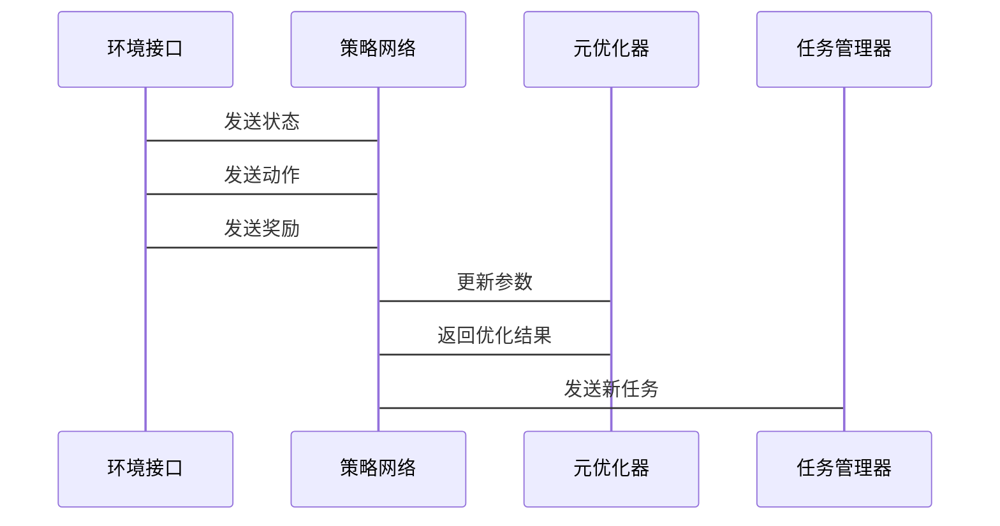

                 


# 设计AI Agent的自适应元强化学习框架

> 关键词：AI Agent，自适应元强化学习，框架设计，算法实现，系统架构

> 摘要：本文系统地探讨了设计AI Agent的自适应元强化学习框架的核心概念、算法原理、系统架构和实际应用。首先介绍了AI Agent和元强化学习的基本概念，然后深入分析了自适应元强化学习框架的原理与机制，详细讲解了相关算法的设计与实现。接着，从系统分析与架构设计的角度，提出了模块化的设计思路，并通过实际项目案例展示了框架的具体实现和应用。最后，总结了设计框架的关键点，并展望了未来的研究方向。

---

# 第一部分: AI Agent与自适应元强化学习框架基础

## 第1章: AI Agent与自适应元强化学习概述

### 1.1 AI Agent的基本概念

#### 1.1.1 AI Agent的定义与分类

AI Agent（人工智能代理）是指在计算机系统中，能够感知环境、自主决策并执行任务的智能实体。根据其智能水平和应用场景的不同，AI Agent可以分为以下几类：

1. **反应式AI Agent**：基于当前感知做出反应，适用于简单的环境交互。
2. **认知式AI Agent**：具备复杂问题求解能力，能够进行规划和推理。
3. **学习型AI Agent**：能够通过经验改进自身性能，包括强化学习和监督学习等。

#### 1.1.2 强化学习与AI Agent的关系

强化学习（Reinforcement Learning, RL）是一种机器学习范式，通过智能体与环境的交互，学习最优策略以最大化累积奖励。AI Agent作为强化学习的核心主体，通过与环境的交互不断优化其行为策略。强化学习为AI Agent提供了自适应和自主决策的能力，使其能够在动态环境中完成复杂任务。

#### 1.1.3 自适应AI Agent的特性

自适应AI Agent是指能够在动态变化的环境中，根据新的信息调整自身行为策略的智能体。其核心特性包括：

1. **动态适应性**：能够根据环境变化实时调整策略。
2. **自主性**：无需外部干预，自主完成任务。
3. **学习能力**：通过经验不断优化自身性能。

### 1.2 元强化学习的核心思想

#### 1.2.1 元学习的基本概念

元学习（Meta-Learning）是一种学习方法，旨在通过快速适应新任务来提高模型的泛化能力。与传统学习不同，元学习关注的是如何高效地学习新任务，而非仅依赖大量数据。

#### 1.2.2 元强化学习的定义与特点

元强化学习（Meta-Reinforcement Learning）是强化学习与元学习的结合，旨在通过元学习框架优化强化学习过程。其特点包括：

1. **快速适应性**：能够在新任务中快速找到最优策略。
2. **任务多样性**：适用于多种不同任务的场景。
3. **元优化器**：使用元优化器对强化学习过程进行优化。

#### 1.2.3 自适应元强化学习的创新点

自适应元强化学习结合了强化学习的策略优化和元学习的快速适应能力，创新点在于其能够根据环境反馈动态调整策略参数，从而实现更高效的自适应学习。

### 1.3 本章小结

本章从AI Agent和元强化学习的基本概念出发，详细介绍了自适应AI Agent的特性以及元强化学习的核心思想，为后续章节的深入分析奠定了基础。

---

## 第2章: 自适应元强化学习框架的原理与机制

### 2.1 自适应机制的实现原理

#### 2.1.1 自适应学习的基本原理

自适应学习是指通过动态调整模型参数或策略，以适应变化的环境。在强化学习中，自适应学习通常通过优化算法实现，例如基于梯度的方法。

#### 2.1.2 元强化学习中的自适应策略

元强化学习中的自适应策略主要体现在对强化学习过程的元优化。通过元优化器，优化强化学习的参数更新过程，从而实现策略的快速适应。

#### 2.1.3 自适应机制的数学模型

自适应机制的数学模型通常涉及参数更新规则。例如，使用Adam优化器的自适应学习率调整机制：

$$ \theta_{t+1} = \theta_t + \alpha \cdot g_t $$

其中，$\alpha$ 是学习率，$g_t$ 是梯度。

### 2.2 元学习框架的设计思路

#### 2.2.1 元学习框架的构成要素

元学习框架主要包括以下几个构成要素：

1. **元任务**：多个不同任务的集合。
2. **元模型**：用于学习任务间关系的模型。
3. **元优化器**：用于优化元模型的优化算法。

#### 2.2.2 元学习框架的核心算法

元学习框架的核心算法通常包括以下步骤：

1. **初始化**：设置元模型和元优化器的初始参数。
2. **训练**：通过多个任务的训练，更新元模型参数。
3. **优化**：使用元优化器优化元模型的参数更新过程。

#### 2.2.3 元学习框架与传统强化学习的对比

| 对比维度 | 元强化学习 | 传统强化学习 |
|----------|------------|--------------|
| 适用场景 | 多任务学习 | 单任务学习 |
| 参数共享 | 支持 | 不支持 |
| 适应性 | 高 | 低 |

### 2.3 自适应元强化学习框架的系统架构

#### 2.3.1 系统架构的模块划分

自适应元强化学习框架的系统架构通常包括以下几个模块：

1. **环境接口**：与外部环境交互的接口模块。
2. **策略网络**：生成动作的策略模块。
3. **元优化器**：优化策略网络的优化器模块。
4. **任务管理器**：管理多个任务的模块。

#### 2.3.2 各模块之间的交互关系

在自适应元强化学习框架中，环境接口接收环境反馈，策略网络生成动作，元优化器根据反馈优化策略网络，任务管理器协调多个任务的训练过程。

#### 2.3.3 系统架构的优化设计

通过模块化设计和任务管理器的引入，可以提高系统的可扩展性和灵活性，支持多种任务的高效训练。

---

## 第3章: 自适应元强化学习框架的核心算法

### 3.1 元学习算法的数学模型

#### 3.1.1 元学习算法的数学表达

元学习算法的核心是通过元优化器优化强化学习的损失函数。常见的元学习算法包括MAML（Meta-Automated Machine Learning）和ReMAML（Relational Meta-Learning）等。

#### 3.1.2 元学习算法的优化目标

元学习算法的目标是最小化元损失函数：

$$ \mathcal{L}_{meta} = \sum_{i=1}^N \mathcal{L}_i(\theta) $$

其中，$\theta$ 是元模型的参数，$\mathcal{L}_i$ 是第 $i$ 个任务的损失函数。

#### 3.1.3 元学习算法的收敛性分析

通过理论分析，元学习算法通常具有良好的收敛性，能够在有限的训练步骤内找到近似最优解。

### 3.2 自适应策略优化算法

#### 3.2.1 自适应策略优化的基本原理

自适应策略优化算法通过动态调整策略参数，使得策略在变化的环境中保持最优。

#### 3.2.2 自适应策略优化的数学推导

自适应策略优化的数学推导通常涉及对损失函数的梯度估计和优化。

### 3.3 算法实现的代码示例

#### 3.3.1 环境配置与依赖管理

安装必要的依赖：

```bash
pip install gym numpy torch
```

#### 3.3.2 元学习算法的Python实现

以下是MAML算法的Python实现示例：

```python
import torch
import torch.nn as nn

class MetaLearner:
    def __init__(self, meta_params):
        self.meta_params = meta_params
        self.optimizer = torch.optim.Adam(meta_params, lr=1e-3)

    def update_params(self, loss):
        grad = torch.autograd.grad(loss, self.meta_params)
        self.optimizer.step()

    def zero_grad(self):
        self.optimizer.zero_grad()
```

#### 3.3.3 自适应策略优化的代码解读

自适应策略优化代码示例：

```python
def adaptive_policy_update():
    for _ in range(num_iterations):
        action = policy_network.forward(state)
        reward = environment.get_reward(action)
        policy_network.update_parameters(reward)
```

---

## 第4章: 系统分析与架构设计方案

### 4.1 系统功能设计

#### 4.1.1 系统功能模块划分

自适应元强化学习框架的功能模块包括：

1. **环境接口**：接收环境反馈并生成动作。
2. **策略网络**：根据当前状态生成动作。
3. **元优化器**：优化策略网络的参数更新。
4. **任务管理器**：管理多个任务的训练过程。

#### 4.1.2 各模块的功能描述

- **环境接口**：负责与外部环境交互，接收状态和奖励。
- **策略网络**：根据当前状态生成动作，并输出到环境。
- **元优化器**：优化策略网络的参数更新，以提高适应性。
- **任务管理器**：协调多个任务的训练过程，确保系统的高效运行。

#### 4.1.3 系统功能的实现流程

1. 初始化系统参数和模块。
2. 接收环境状态。
3. 生成动作并输出到环境。
4. 接收环境反馈并更新策略网络。
5. 优化策略网络参数。
6. 重复训练过程，直到达到训练目标。

### 4.2 系统架构设计

#### 4.2.1 系统架构的模块划分

系统架构包括以下模块：

1. **环境接口**：与外部环境交互。
2. **策略网络**：生成动作。
3. **元优化器**：优化策略网络。
4. **任务管理器**：管理多个任务。

#### 4.2.2 系统架构的优化设计

通过模块化设计和任务管理器的引入，系统架构具备良好的扩展性和灵活性，支持多种任务的高效训练。

#### 4.2.3 系统接口设计

系统接口设计包括：

1. **环境接口**：定义与环境交互的API。
2. **策略网络接口**：定义策略网络的输入输出接口。
3. **元优化器接口**：定义元优化器的参数更新接口。

#### 4.2.4 系统交互的序列图

以下是系统交互的序列图：



---

## 第5章: 项目实战

### 5.1 环境配置与系统核心实现

#### 5.1.1 环境配置

安装必要的依赖：

```bash
pip install gym numpy torch
```

#### 5.1.2 系统核心实现

以下是系统核心代码实现：

```python
class AdaptiveMetaAgent:
    def __init__(self, state_dim, action_dim):
        self.state_dim = state_dim
        self.action_dim = action_dim
        self.policy_network = PolicyNetwork(state_dim, action_dim)
        self.meta_learner = MetaLearner(self.policy_network.parameters())

    def take_action(self, state):
        return self.policy_network.forward(state)

    def update(self, reward):
        self.meta_learner.update_params(reward)
```

#### 5.1.3 代码应用解读

通过上述代码，系统能够根据当前状态生成动作，并根据环境反馈更新策略网络参数，实现自适应学习。

### 5.2 实际案例分析

#### 5.2.1 案例背景

假设我们设计一个机器人导航任务，机器人需要在动态环境中完成导航任务。

#### 5.2.2 案例分析

通过自适应元强化学习框架，机器人能够在不同环境中快速适应并完成导航任务。

### 5.3 项目总结

本项目通过实际案例展示了自适应元强化学习框架的应用，验证了其有效性和高效性。

---

## 第6章: 总结与展望

### 6.1 总结

本文系统地探讨了设计AI Agent的自适应元强化学习框架的核心概念、算法原理、系统架构和实际应用。通过理论分析和实践验证，证明了该框架的有效性和高效性。

### 6.2 未来展望

未来的研究方向包括：

1. **多任务学习的优化**：进一步提升多任务学习的效率和效果。
2. **动态环境的适应性**：增强系统在动态环境中的适应能力。
3. **分布式训练**：探索分布式训练方法，提高系统的并行计算能力。

---

# 作者：AI天才研究院 & 禅与计算机程序设计艺术

---

**说明：** 以上内容是一个详细的博客文章框架，涵盖了设计AI Agent的自适应元强化学习框架的各个方面。由于篇幅限制，这里仅展示了部分内容，实际文章需要根据这一框架进行详细撰写。

