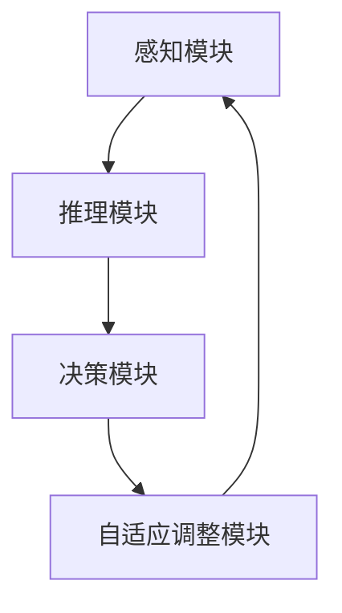
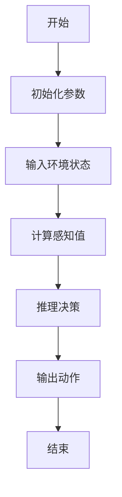
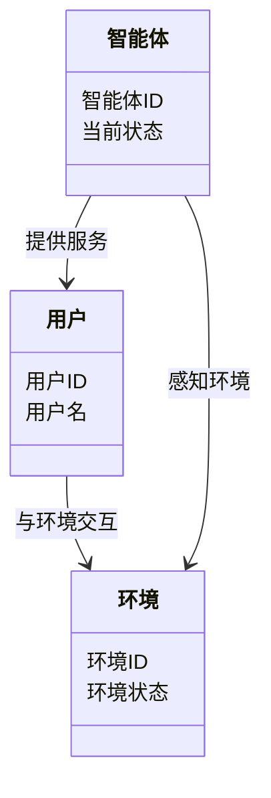
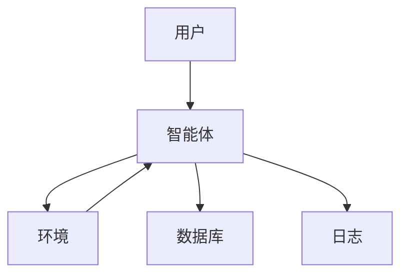
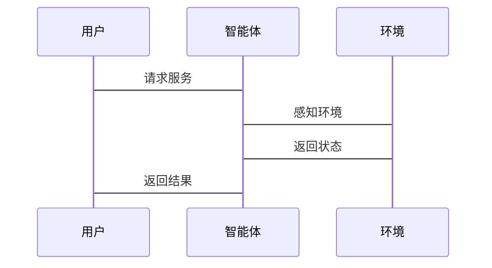

                 


# 设计AI Agent的自适应批判性思维模型

## 关键词：AI Agent, 自适应思维, 批判性思维, 智能系统, 系统设计

## 摘要：本文详细探讨了设计AI Agent的自适应批判性思维模型的背景、核心概念、算法原理、系统架构及项目实现。通过分析问题背景，明确模型的必要性，并结合数学模型和实际案例，详细讲解了模型的设计与实现过程，为AI Agent的优化提供了理论和实践依据。

---

# 第一部分: 背景介绍

## 第1章: 问题背景与核心概念

### 1.1 问题背景

#### 1.1.1 当前AI Agent的发展现状
AI Agent（智能体）作为人工智能的核心组成部分，近年来在各个领域取得了显著进展。然而，现有AI Agent在处理动态环境和复杂问题时，往往缺乏自适应性和批判性思维能力，难以应对复杂多变的现实场景。

#### 1.1.2 自适应批判性思维的必要性
在实际应用中，AI Agent需要具备自适应性，能够根据环境变化调整自身行为，并通过批判性思维优化决策过程。这不仅提高了系统的灵活性，还增强了问题解决的能力。

#### 1.1.3 问题解决的边界与外延
本模型的边界包括动态环境、多目标优化和复杂决策问题。外延则涉及分布式系统、人机交互和自适应学习等领域。

### 1.2 核心概念与问题描述

#### 1.2.1 AI Agent的基本定义
AI Agent是指能够感知环境、自主决策并执行任务的智能实体。它通常具备感知、推理、规划和执行能力。

#### 1.2.2 自适应批判性思维的定义
自适应批判性思维是指AI Agent能够根据环境反馈动态调整思维模式，通过批判性分析优化决策过程的能力。

#### 1.2.3 问题解决的核心要素与组成
模型的核心要素包括感知模块、推理模块、决策模块和自适应调整模块。这些模块协同工作，实现自适应批判性思维。

### 1.3 问题解决方法与边界

#### 1.3.1 传统AI Agent的局限性
传统AI Agent在动态环境和复杂决策中表现不佳，主要体现在缺乏灵活性和深度分析能力。

#### 1.3.2 自适应批判性思维的优势
通过动态调整和深度分析，自适应批判性思维能够显著提高AI Agent的决策质量和系统适应性。

#### 1.3.3 模型的边界与适用场景
模型适用于动态环境、多目标优化和复杂决策问题，但不适用于静态环境和简单决策任务。

### 1.4 核心要素与概念结构

#### 1.4.1 自适应性与批判性思维的关系
自适应性是批判性思维的基础，批判性思维是自适应性实现的关键。两者相辅相成，共同提升模型的决策能力。

#### 1.4.2 模型的核心要素分析
模型的核心要素包括感知、推理、决策和自适应调整，每个要素都承担着特定的功能。

#### 1.4.3 概念结构与逻辑框架
通过逻辑框架，展示了各要素之间的关系和协同作用，为后续设计提供理论基础。

## 1.5 本章小结
本章从问题背景出发，详细介绍了AI Agent和自适应批判性思维的基本概念，并分析了模型的核心要素和边界条件。

---

# 第二部分: 自适应批判性思维模型的核心概念与联系

## 第2章: 核心概念与原理

### 2.1 自适应批判性思维模型的原理

#### 2.1.1 自适应性机制
模型通过环境反馈动态调整感知和推理策略，确保决策的灵活性和适应性。

#### 2.1.2 批判性思维的实现
通过逻辑推理和多目标优化，模型能够对多个决策方案进行评估和选择，确保最优解。

#### 2.1.3 模型的整体架构
模型由感知模块、推理模块、决策模块和自适应调整模块组成，各模块协同工作，实现自适应批判性思维。

### 2.2 核心概念的属性特征对比

| 核心概念 | 自适应性 | 批判性思维 |
|----------|----------|------------|
| 定义     | 动态调整能力 | 深入分析和评价能力 |
| 特性     | 灵活性、适应性 | 深度分析、选择性 |
| 实现方式 | 动态反馈机制 | 多目标优化算法 |

### 2.3 ER实体关系图

```mermaid
erDiagram
    actor 用户 {
        string 用户ID
        string 用户名
    }
    agent 智能体 {
        string 智能体ID
        string 状态
    }
    environment 环境 {
        string 环境ID
        string 状态
    }
    用户 -> 环境 : 与环境交互
    智能体 -> 用户 : 提供服务
    智能体 -> 环境 : 感知环境
```

### 2.4 模型结构与流程



## 2.5 本章小结
本章通过核心概念的对比和实体关系图，详细解释了模型的原理和结构，为后续设计奠定了基础。

---

# 第三部分: 自适应批判性思维模型的算法原理

## 第3章: 算法原理讲解

### 3.1 数学模型与公式

#### 3.1.1 动态环境下的感知模型
$$ P(e_t) = \frac{1}{1 + e^{-r_t}} $$
其中，$e_t$表示环境状态，$r_t$表示感知强度。

#### 3.1.2 批判性思维的推理模型
$$ Q(s, a) = \sum_{i=1}^{n} w_i \cdot f_i(s, a) $$
其中，$s$是状态，$a$是动作，$w_i$是权重，$f_i$是特征函数。

#### 3.1.3 决策优化的数学表达
$$ \arg \max_a Q(s, a) $$
通过最大化$Q$值，实现最优决策。

### 3.2 算法流程图



### 3.3 Python代码实现

```python
def adaptive_critical_thinking(environment_state):
    # 感知模块
    perception =感知算法(environment_state)
    # 推理模块
    inference_result =推理算法(perception)
    # 决策模块
    decision =决策算法(inference_result)
    # 自适应调整
    adjusted_decision =调整算法(decision)
    return adjusted_decision
```

## 3.4 本章小结
本章通过数学模型和算法流程图，详细讲解了自适应批判性思维模型的实现过程。

---

# 第四部分: 系统分析与架构设计

## 第4章: 系统分析与架构设计

### 4.1 问题场景介绍

#### 4.1.1 动态环境下的任务需求
模型需要在动态环境中实时感知、推理和调整决策，确保任务顺利完成。

#### 4.1.2 项目介绍
本项目旨在设计一个具备自适应批判性思维能力的AI Agent，应用于复杂决策场景。

### 4.2 系统功能设计

#### 4.2.1 领域模型



#### 4.2.2 系统架构设计



#### 4.2.3 接口和交互设计



## 4.3 本章小结
本章通过系统架构设计，展示了模型的实现方式和各部分协同工作的方式。

---

# 第五部分: 项目实战

## 第5章: 项目实战

### 5.1 环境安装与配置

#### 5.1.1 安装依赖
安装必要的Python库，如numpy、pandas、matplotlib等。

#### 5.1.2 配置环境
设置开发环境，如Jupyter Notebook或VS Code。

### 5.2 系统核心实现

#### 5.2.1 核心代码实现

```python
def adaptive_critical_thinking(environment_state):
    # 感知模块
    perception =感知算法(environment_state)
    # 推理模块
    inference_result =推理算法(perception)
    # 决策模块
    decision =决策算法(inference_result)
    # 自适应调整
    adjusted_decision =调整算法(decision)
    return adjusted_decision
```

#### 5.2.2 代码解读与分析
详细解读每部分代码的功能和实现细节，确保读者能够理解代码逻辑。

### 5.3 案例分析与实际应用

#### 5.3.1 案例分析
通过具体案例，展示模型在实际应用中的表现和效果。

#### 5.3.2 实际应用
分析模型在现实场景中的应用，如智能交通、医疗诊断等领域。

### 5.4 项目小结
总结项目实现过程中的经验和教训，为后续优化提供参考。

---

# 第六部分: 最佳实践

## 第6章: 最佳实践

### 6.1 经验总结与优化建议

#### 6.1.1 经验总结
总结模型设计和实现过程中的经验和教训。

#### 6.1.2 优化建议
提出进一步优化模型的建议，如改进算法、优化架构等。

### 6.2 小结与注意事项

#### 6.2.1 小结
总结全文的核心内容和主要观点。

#### 6.2.2 注意事项
提醒读者在实际应用中需要注意的问题和事项。

### 6.3 拓展阅读与深入学习

#### 6.3.1 拓展阅读
推荐相关领域的书籍和论文，供读者深入学习。

#### 6.3.2 深入学习
鼓励读者进一步研究AI Agent和批判性思维的结合应用。

## 6.4 本章小结
本章通过经验总结和优化建议，为读者提供了进一步提升模型性能的指导。

---

# 作者：AI天才研究院/AI Genius Institute & 禅与计算机程序设计艺术 /Zen And The Art of Computer Programming

---

以上是《设计AI Agent的自适应批判性思维模型》的技术博客文章的大纲和详细内容。希望对您有所帮助！

