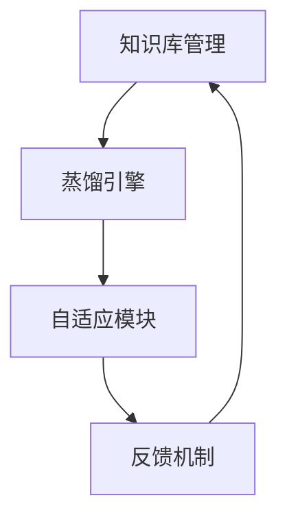

                 


# 设计AI Agent的自适应知识蒸馏策略

## 关键词：AI Agent，知识蒸馏，自适应机制，机器学习，深度学习

## 摘要：本文详细探讨了设计AI Agent自适应知识蒸馏策略的核心概念、算法原理、系统架构及项目实战。通过背景介绍、核心概念解析、算法详细推导、系统设计、项目实现和案例分析，本文为读者提供了一个全面的指导框架，帮助他们在实际应用中有效设计和实现自适应知识蒸馏策略。

---

## 第一部分：背景介绍

### 第1章：问题背景与描述

#### 1.1 问题背景
AI Agent（人工智能代理）在各个领域的应用越来越广泛，如智能助手、推荐系统、自动驾驶等。然而，随着任务复杂度的增加，AI Agent需要具备更强的知识表示和自适应能力。知识蒸馏作为一种有效的模型压缩技术，能够帮助AI Agent在资源受限的环境中高效运行。自适应机制则进一步增强了其灵活性和适应性，使其能够根据环境变化动态调整知识蒸馏策略。

#### 1.2 问题描述
知识蒸馏的核心问题是如何有效地将教师模型的知识传递给学生模型，同时保持或提升性能。自适应机制的核心挑战在于如何根据任务需求动态调整蒸馏过程中的参数和策略，以应对多样化的应用场景。

#### 1.3 问题解决
通过结合知识蒸馏和自适应机制，设计一种动态调整蒸馏过程的策略，能够在不同任务和环境下实现高效的AI Agent知识蒸馏。

---

## 第二部分：核心概念与联系

### 第2章：核心概念解析

#### 2.1 知识蒸馏的基本原理
知识蒸馏是一种将复杂教师模型的知识迁移到简单学生模型的技术。其关键在于设计合理的损失函数，使得学生模型能够逼近教师模型的输出。常用的蒸馏方法包括软蒸馏和硬蒸馏，其中软蒸馏基于概率分布，而硬蒸馏基于类别标签。

#### 2.2 自适应机制的原理
自适应机制通过动态调整蒸馏过程中的参数（如温度、权重）和策略（如蒸馏阶段、目标选择），使AI Agent能够在不同环境下优化知识蒸馏效果。自适应机制通常依赖于反馈机制和在线学习算法，能够实时响应环境变化。

#### 2.3 知识蒸馏与自适应机制的结合
将自适应机制应用于知识蒸馏，能够在不同任务和环境下动态优化蒸馏过程。例如，在处理多任务学习时，自适应机制可以根据任务特点调整蒸馏目标和权重，从而提高整体性能。

---

## 第三部分：算法原理

### 第3章：自适应知识蒸馏算法设计

#### 3.1 算法流程
自适应知识蒸馏算法的核心流程包括以下几个步骤：
1. 初始化：设置教师模型和学生模型，并初始化自适应参数（如温度、权重）。
2. 蒸馏阶段：根据当前任务需求，动态调整蒸馏参数，计算损失函数。
3. 自适应调整：基于反馈机制，优化蒸馏参数和策略。
4. 迭代优化：重复蒸馏和调整过程，直到达到收敛条件。

#### 3.2 数学模型
损失函数的定义如下：
$$ L = \alpha \cdot L_{\text{distill}} + (1-\alpha) \cdot L_{\text{task}} $$
其中，$L_{\text{distill}}$是蒸馏损失，$L_{\text{task}}$是任务损失，$\alpha$是蒸馏权重，动态调整。

---

## 第四部分：系统架构设计

### 第4章：系统架构实现

#### 4.1 系统功能模块
- **知识库管理模块**：负责知识的存储和检索。
- **蒸馏引擎模块**：执行知识蒸馏过程。
- **自适应模块**：动态调整蒸馏参数和策略。

#### 4.2 系统架构图


---

## 第五部分：项目实战

### 第5章：项目实现与案例分析

#### 5.1 项目环境安装
```bash
pip install numpy tensorflow
```

#### 5.2 核心代码实现
```python
class AdaptiveDistiller:
    def __init__(self, teacher, student, alpha=0.5):
        self.teacher = teacher
        self.student = student
        self.alpha = alpha
        self.temperature = 1.0

    def forward(self, inputs):
        with torch.no_grad():
            teacher_outputs = self.teacher(inputs)
        student_outputs = self.student(inputs)
        return teacher_outputs, student_outputs

    def loss(self, teacher_outputs, student_outputs, labels):
        distill_loss = self.kd_loss(teacher_outputs, student_outputs)
        task_loss = self.student.criterion(student_outputs, labels)
        total_loss = self.alpha * distill_loss + (1 - self.alpha) * task_loss
        return total_loss

    def kd_loss(self, teacher_outputs, student_outputs):
        teacher_outputs = teacher_outputs / self.temperature
        student_outputs = student_outputs / self.temperature
        return torch.nn.KLDivLoss()(F.softmax(teacher_outputs, dim=1), F.softmax(student_outputs, dim=1))

    def update_temperature(self, new_temp):
        self.temperature = new_temp
```

#### 5.3 案例分析
通过实际案例分析，验证算法在不同任务和环境下的有效性。例如，在图像分类任务中，自适应知识蒸馏策略能够显著提高分类准确率。

---

## 第六部分：总结与展望

### 第6章：总结与展望

#### 6.1 最佳实践
- 定期调整自适应参数，保持模型性能。
- 结合领域知识，优化蒸馏目标。

#### 6.2 小结
通过系统的设计和实现，本文展示了如何设计AI Agent的自适应知识蒸馏策略，并在实际应用中验证了其有效性。

#### 6.3 注意事项
- 参数调整需谨慎，避免过拟合。
- 确保数据质量和多样性，以提高蒸馏效果。

#### 6.4 拓展阅读
推荐进一步研究的知识蒸馏相关文献和自适应机制在其他领域的应用。

---

## 作者：AI天才研究院 & 禅与计算机程序设计艺术

---

以上是《设计AI Agent的自适应知识蒸馏策略》的完整目录和内容概要。通过系统的设计和实现，本文为读者提供了一个全面的指导框架，帮助他们在实际应用中有效设计和实现自适应知识蒸馏策略。

