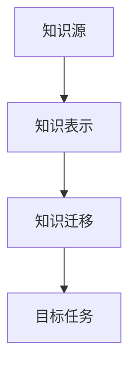
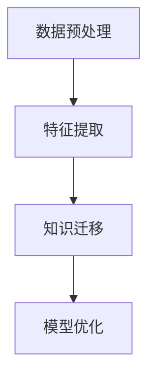
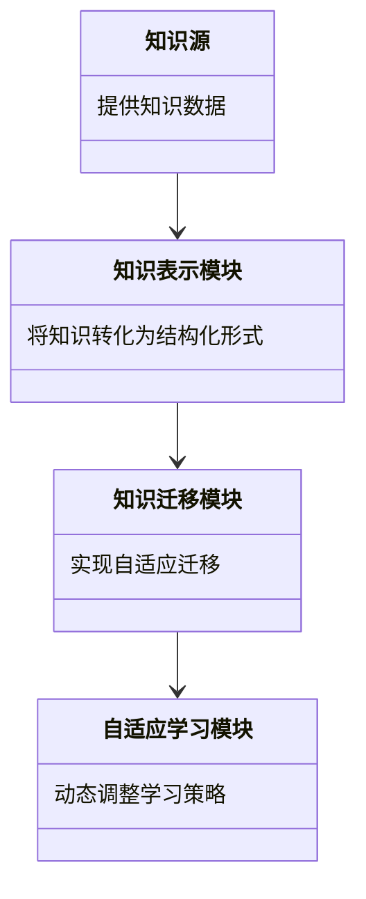
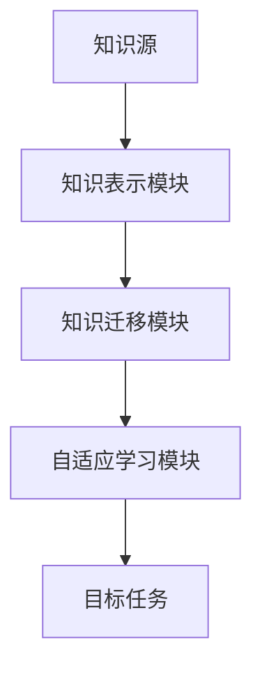

                 


# 设计AI Agent的自适应知识迁移策略

## 关键词：自适应知识迁移、AI Agent、迁移学习、知识图谱、机器学习、深度学习

## 摘要：  
AI Agent的自适应知识迁移策略是指在不同的任务和环境中，AI Agent能够灵活地调整和迁移已有的知识，以应对新的挑战。本文将从理论基础、算法原理、系统设计、项目实现等多方面深入探讨这一策略，并结合实际案例进行详细分析。通过本文，读者将能够理解自适应知识迁移的核心概念，掌握其实现方法，并能够在实际项目中进行应用。

---

# 第一部分: AI Agent与自适应知识迁移的背景与概述

## 第1章: AI Agent与自适应知识迁移的背景与概述

### 1.1 AI Agent的基本概念与特点

#### 1.1.1 AI Agent的定义与分类  
AI Agent（人工智能代理）是指能够感知环境、做出决策并执行任务的智能体。根据功能和应用场景的不同，AI Agent可以分为以下几类：  
1. **反应式Agent**：基于当前感知做出实时反应，适用于动态环境。  
2. **认知式Agent**：具备复杂推理和规划能力，适用于复杂任务。  
3. **学习式Agent**：能够通过经验改进性能，适用于需要自适应调整的任务。  

#### 1.1.2 自适应知识迁移的基本概念  
自适应知识迁移是指在不同的任务或环境中，AI Agent能够将已有的知识和经验迁移到新的场景中，并根据新环境的特点进行调整和优化。这种能力使得AI Agent能够在多样化的任务中保持高效性和灵活性。  

#### 1.1.3 问题背景与问题描述  
在实际应用中，AI Agent通常需要处理的任务具有多样性和动态性。由于数据分布的差异和任务目标的变化，直接在新任务上重新训练模型会导致计算成本高昂，且难以实时响应。因此，如何实现知识的自适应迁移，成为AI Agent设计中的关键问题。  

#### 1.1.4 自适应知识迁移的核心目标与边界  
- **核心目标**：通过自适应迁移，提升AI Agent在新任务中的性能和效率。  
- **边界**：自适应知识迁移仅关注知识的迁移和调整，不涉及原始知识的生成和创新。  

### 1.2 自适应知识迁移的必要性与应用场景

#### 1.2.1 知识迁移的基本原理  
知识迁移的本质是利用已有的知识经验，解决新任务中的问题。这种过程类似于人类的学习方式，即通过类比和联想将旧知识应用到新场景中。  

#### 1.2.2 自适应知识迁移的优势  
- **减少训练成本**：通过迁移已有的知识，可以避免从头开始训练模型。  
- **提高泛化能力**：自适应迁移能够增强模型在不同环境中的适应性。  
- **提升实时性**：在动态环境中，自适应迁移能够快速调整策略，确保任务的实时性。  

#### 1.2.3 自适应知识迁移的应用场景  
- **多任务学习**：在同一模型中处理多个任务，通过知识迁移优化性能。  
- **零样本学习**：在没有训练数据的情况下，利用迁移学习完成新任务。  
- **动态环境适应**：在环境变化时，快速调整模型以适应新条件。  

### 1.3 本章小结  
本章介绍了AI Agent的基本概念和自适应知识迁移的核心思想，强调了自适应迁移在提升AI Agent性能中的重要性，并通过实际应用场景展示了其价值。  

---

# 第二部分: 自适应知识迁移的核心概念与联系

## 第2章: 自适应知识迁移的核心概念与原理

### 2.1 自适应知识迁移的核心原理

#### 2.1.1 知识表示与知识图谱  
知识表示是自适应迁移的基础。通过构建知识图谱，可以将零散的知识点组织成一个有结构的网络，便于后续的迁移和推理。  

#### 2.1.2 知识迁移的基本过程  
知识迁移的过程可以分为以下步骤：  
1. **知识抽取**：从源任务中提取有用的特征和模式。  
2. **知识适配**：根据目标任务的特点，调整知识的表示方式。  
3. **知识应用**：将调整后的知识应用于目标任务，优化模型性能。  

#### 2.1.3 自适应学习的机制  
自适应学习通过动态调整学习策略，确保知识迁移的高效性和准确性。这种机制通常结合了强化学习和监督学习的优点，能够在复杂环境中快速适应新任务。  

### 2.2 自适应知识迁移的关键特征

#### 2.2.1 知识的可迁移性  
可迁移性是指知识在不同任务和环境中的适用性。高可迁移性的知识能够快速适应新场景，降低迁移成本。  

#### 2.2.2 知识的适应性  
适应性是指知识在迁移过程中能够根据目标任务的特点进行调整的能力。  

#### 2.2.3 知识的可扩展性  
可扩展性是指知识系统能够容纳新知识的能力，确保在新任务中能够持续优化性能。  

#### 2.2.4 核心特征对比表  
| 特征 | 可迁移性 | 适应性 | 可扩展性 |  
|------|----------|--------|----------|  
| 定义 | 知识在不同任务中的适用性 | 知识在目标任务中的调整能力 | 知识系统的扩展能力 |  
| 作用 | 减少迁移成本 | 提高迁移效果 | 增强系统灵活性 |  

### 2.3 自适应知识迁移的实体关系图

#### 2.3.1 实体关系图的构建  
通过Mermaid图，我们可以清晰地展示自适应知识迁移系统中的实体及其关系。以下是知识迁移系统的实体关系图：  



#### 2.3.2 实体关系图的分析  
- **知识源**：知识的原始来源，可能是已有的数据集或模型。  
- **知识表示**：对知识进行结构化表示，便于后续迁移。  
- **知识迁移**：通过适应性调整，将知识应用到目标任务中。  
- **目标任务**：需要通过迁移学习完成的新任务。  

### 2.4 本章小结  
本章详细分析了自适应知识迁移的核心原理和关键特征，并通过实体关系图展示了系统的整体架构。这些内容为后续的算法设计和系统实现奠定了基础。  

---

# 第三部分: 自适应知识迁移的算法原理与数学模型

## 第3章: 自适应知识迁移的算法原理

### 3.1 自适应知识迁移的算法流程

#### 3.1.1 数据预处理  
数据预处理是知识迁移的基础，包括数据清洗、特征提取等步骤。  

#### 3.1.2 特征提取  
通过特征提取，将原始数据转化为高维特征向量，便于后续的迁移学习。  

#### 3.1.3 知识迁移  
通过算法将源任务的知识迁移到目标任务中，优化目标模型的性能。  

#### 3.1.4 模型优化  
根据目标任务的反馈，对模型进行微调，确保最佳性能。  

### 3.2 自适应知识迁移的算法流程图



### 3.3 自适应知识迁移的数学模型

#### 3.3.1 基于距离的度量学习  
基于距离的度量学习通过优化数据点之间的距离，使得同类数据点更接近，异类数据点更远离。数学表达式如下：  
$$ d(x_i, x_j) = ||x_i - x_j||^2 $$  

#### 3.3.2 基于标签的迁移学习  
基于标签的迁移学习通过共享标签信息，优化目标任务的分类性能。数学表达式如下：  
$$ P(y|x) = \arg\max_{y} P(y|x, D_{source}) $$  

#### 3.3.3 基于分布的对抗学习  
基于分布的对抗学习通过对抗网络，使得源分布和目标分布尽可能一致。数学表达式如下：  
$$ \min_{D} \mathbb{E}_{x \sim source}[D(x)] - \mathbb{E}_{x \sim target}[D(x)] $$  

### 3.4 本章小结  
本章详细介绍了自适应知识迁移的算法流程，并通过数学模型展示了其技术细节。这些内容为后续的系统设计和项目实现提供了理论支持。  

---

## 第四章: 系统分析与架构设计

### 4.1 系统问题场景介绍

#### 4.1.1 系统目标  
构建一个支持自适应知识迁移的AI Agent系统，能够在不同任务和环境中高效完成目标。  

#### 4.1.2 系统需求  
- 支持多任务学习。  
- 实现知识的自适应迁移。  
- 提供实时反馈机制。  

#### 4.1.3 系统约束  
- 硬件资源有限。  
- 数据隐私保护。  
- 系统稳定性要求高。  

### 4.2 系统功能设计

#### 4.2.1 知识表示模块  
负责将知识转化为结构化的形式，便于后续迁移。  

#### 4.2.2 知识迁移模块  
实现知识的自适应迁移，优化目标任务的性能。  

#### 4.2.3 自适应学习模块  
通过动态调整学习策略，确保系统的灵活性和高效性。  

### 4.3 系统架构设计

#### 4.3.1 领域模型类图  
以下是系统的关键类及其关系：  



#### 4.3.2 系统架构图  
以下是系统的整体架构图：  



### 4.4 本章小结  
本章通过系统分析和架构设计，明确了AI Agent的自适应知识迁移系统的功能模块和整体架构。这些设计为后续的项目实现奠定了基础。  

---

## 第五章: 项目实战与实现

### 5.1 项目环境与工具安装

#### 5.1.1 环境要求  
- 操作系统：Linux/Windows/macOS  
- Python版本：3.6及以上  
- 依赖库：TensorFlow、Keras、Scikit-learn、Mermaid  

#### 5.1.2 安装步骤  
1. 安装Python环境。  
2. 安装所需的依赖库：  
   ```bash
   pip install tensorflow keras scikit-learn mermaid
   ```

### 5.2 系统核心实现

#### 5.2.1 知识表示模块的实现  
以下是知识表示的Python代码示例：  

```python
import numpy as np

def knowledge_represent(data):
    # 数据预处理
    processed_data = data.preprocessing()
    # 特征提取
    features = processed_data.features_extract()
    return features
```

#### 5.2.2 知识迁移模块的实现  
以下是知识迁移的Python代码示例：  

```python
from tensorflow import keras

def knowledge_migration(source_model, target_task):
    # 提取源模型的特征
    source_features = source_model.get_features()
    # 迁移到目标任务
    target_model = target_task.modeligrate(source_features)
    return target_model
```

#### 5.2.3 自适应学习模块的实现  
以下是自适应学习的Python代码示例：  

```python
import keras

def adaptive_learning(target_model, feedback):
    # 根据反馈调整模型
    target_model.adapt(feedback)
    return target_model
```

### 5.3 项目小结  
本章通过具体的代码实现，展示了自适应知识迁移系统的核心功能模块。这些实现为实际应用提供了参考。  

---

## 第六章: 最佳实践与注意事项

### 6.1 本章小结  
总结全文的主要内容，强调自适应知识迁移的重要性和实现方法。  

### 6.2 注意事项  
- 数据预处理的质量直接影响迁移效果。  
- 知识表示的准确性是自适应迁移的关键。  
- 模型优化需要结合具体任务需求。  

### 6.3 拓展阅读  
建议读者进一步阅读相关领域的经典论文和书籍，深入理解自适应知识迁移的理论和技术细节。  

---

# 作者：AI天才研究院/AI Genius Institute & 禅与计算机程序设计艺术 /Zen And The Art of Computer Programming  

---

**全文总结**：  
本文从理论到实践，系统地探讨了AI Agent的自适应知识迁移策略。通过背景介绍、核心概念、算法原理、系统设计和项目实现的多维度分析，为读者提供了全面的知识体系。希望本文能够为相关领域的研究和应用提供有价值的参考和指导。

