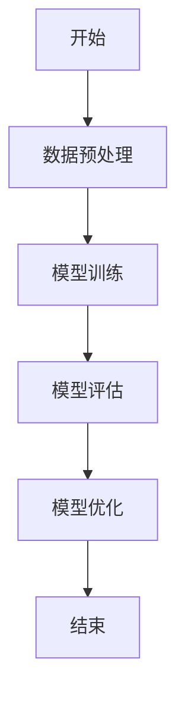
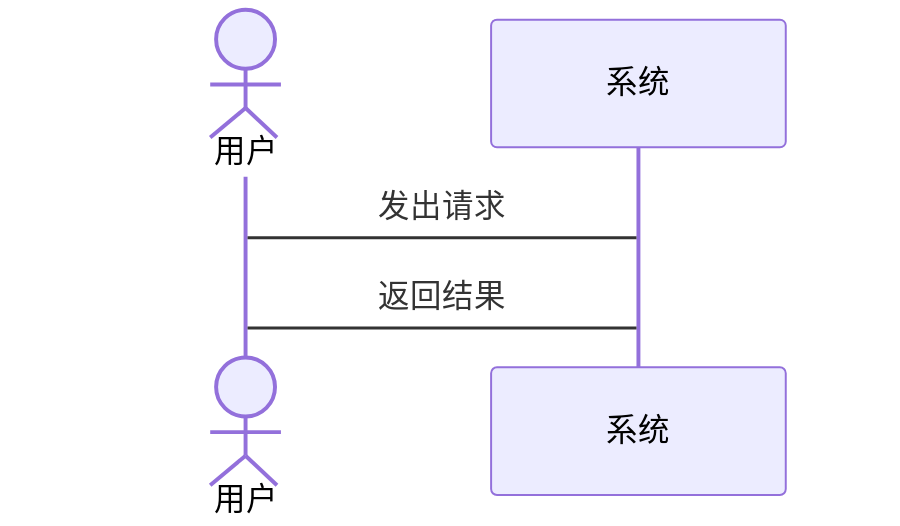

                 


# 第三章: 自适应学习的算法原理

## 3.1 算法原理概述
### 3.1.1 自适应学习的基本算法
### 3.1.2 算法的核心思想
### 3.1.3 算法的数学模型

## 3.2 算法实现步骤
### 3.2.1 数据预处理
### 3.2.2 模型训练
### 3.2.3 模型评估与优化

## 3.3 算法的数学模型与公式
### 3.3.1 损失函数的定义
$$L(y, \hat{y}) = \frac{1}{2}(y - \hat{y})^2$$
### 3.3.2 优化算法的选择
### 3.3.3 模型更新公式

## 3.4 算法实现的代码示例
### 3.4.1 环境安装
### 3.4.2 核心代码实现
```python
def adaptive_learning_algorithm(data, model):
    # 数据预处理
    processed_data = preprocess(data)
    # 模型训练
    model.train(processed_data)
    # 模型评估
    loss = evaluate(model, processed_data)
    # 模型优化
    optimize(model, loss)
    return model
```

## 3.5 算法的流程图


## 3.6 算法的优缺点分析
### 3.6.1 优点
### 3.6.2 缺点
### 3.6.3 改进建议

## 3.7 本章小结

# 第四章: 系统架构设计

## 4.1 系统功能设计
### 4.1.1 功能模块划分
### 4.1.2 每个模块的功能说明
### 4.1.3 功能模块之间的关系

## 4.2 系统架构设计
### 4.2.1 系统架构图


## 4.3 系统接口设计
### 4.3.1 接口定义
### 4.3.2 接口调用流程
### 4.3.3 接口的实现细节

## 4.4 系统交互流程图


## 4.5 系统架构的优缺点分析
### 4.5.1 优点
### 4.5.2 缺点
### 4.5.3 改进建议

## 4.6 本章小结

# 第五章: 项目实战

## 5.1 环境安装
### 5.1.1 安装Python
### 5.1.2 安装所需的库
### 5.1.3 配置开发环境

## 5.2 核心代码实现
### 5.2.1 数据预处理代码
### 5.2.2 模型训练代码
### 5.2.3 模型评估代码
### 5.2.4 模型优化代码

## 5.3 案例分析
### 5.3.1 案例背景
### 5.3.2 案例实施过程
### 5.3.3 案例结果分析

## 5.4 项目总结
### 5.4.1 项目成果
### 5.4.2 项目经验
### 5.4.3 项目改进建议

## 5.5 本章小结

# 第六章: 案例分析与最佳实践

## 6.1 案例分析
### 6.1.1 案例背景
### 6.1.2 案例实施过程
### 6.1.3 案例结果分析

## 6.2 最佳实践
### 6.2.1 技术上的建议
### 6.2.2 实施上的建议
### 6.2.3 维护上的建议

## 6.3 经验教训总结
### 6.3.1 成功经验
### 6.3.2 失败教训
### 6.3.3 总结与展望

## 6.4 本章小结

# 第七章: 总结与展望

## 7.1 全文总结
### 7.1.1 核心内容回顾
### 7.1.2 主要结论
### 7.1.3 未来展望

## 7.2 未来研究方向
### 7.2.1 新技术的发展
### 7.2.2 现有技术的改进
### 7.2.3 新应用场景的探索

## 7.3 本章小结

# 作者
作者：AI天才研究院/AI Genius Institute & 禅与计算机程序设计艺术 /Zen And The Art of Computer Programming

