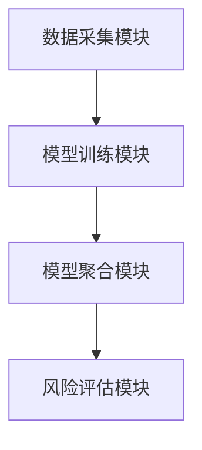
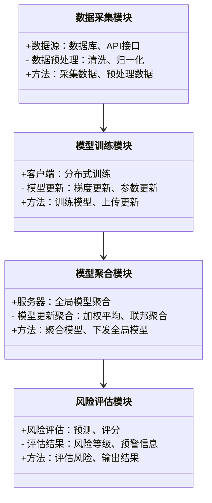

                 


# 设计基于联邦学习的跨境支付风险评估系统

## 关键词：
联邦学习，跨境支付，风险评估，数据隐私，金融安全

## 摘要：
随着全球化的发展，跨境支付日益频繁，风险评估成为保障金融安全的重要环节。然而，传统风险评估方法面临数据隐私泄露和模型泛化能力不足的挑战。联邦学习作为一种新兴的人工智能技术，能够在保护数据隐私的前提下，协同多个机构的数据进行模型训练，为跨境支付风险评估提供新的解决方案。本文将系统地介绍联邦学习的基本原理、在跨境支付风险评估中的应用，以及基于联邦学习的系统设计与实现，旨在为金融行业提供一种高效、安全的风险评估方法。

---

# 第一部分: 联邦学习与跨境支付风险评估系统概述

## 第1章: 联邦学习的背景与概念

### 1.1 联邦学习的起源与发展
#### 1.1.1 联邦学习的起源
联邦学习（Federated Learning）起源于分布式机器学习领域的研究，其核心思想是通过在多个分布式数据源上进行局部模型训练，并将这些局部模型聚合，形成一个全局模型。这种方式能够避免将数据集中到一个中心点，从而保护数据隐私。

#### 1.1.2 联邦学习的核心理念
联邦学习的核心理念是“数据不动，模型移动”。通过在数据源端进行模型训练，避免数据的集中存储和传输，从而保护数据隐私。这种模式特别适合需要处理敏感数据的场景，如金融、医疗等领域。

#### 1.1.3 联邦学习在金融领域的应用
在金融领域，联邦学习已经被应用于信用评分、欺诈检测、客户画像等多个场景。特别是在跨境支付中，联邦学习可以通过多个金融机构的数据协作，提升风险评估的准确性，同时保护各方的数据隐私。

### 1.2 跨境支付风险评估的现状与挑战
#### 1.2.1 跨境支付的主要风险
跨境支付涉及多个国家和金融机构，风险包括欺诈风险、汇率风险、合规风险等。其中，欺诈风险是最受关注的类型之一。

#### 1.2.2 当前风险评估方法的局限性
传统的风险评估方法依赖于中心化数据，存在以下问题：
- 数据隐私泄露风险：集中式数据存储容易成为攻击目标。
- 数据孤岛问题：不同金融机构之间的数据难以有效整合。
- 模型泛化能力不足：单一机构的数据量有限，模型的泛化能力受到限制。

#### 1.2.3 联邦学习在跨境支付中的潜力
联邦学习可以通过多个金融机构的数据协作，构建更准确的风控模型，同时保护各方的隐私数据。这为跨境支付风险评估提供了新的解决方案。

---

## 第2章: 联邦学习的核心概念与原理

### 2.1 联邦学习的基本原理
#### 2.1.1 联邦学习的定义
联邦学习是一种分布式机器学习技术，允许多个数据源（客户端）在不共享原始数据的情况下，协作训练一个全局模型。每个客户端仅上传模型参数更新，而不是实际数据。

#### 2.1.2 联邦学习的核心要素
- **数据源**：分布在不同机构的原始数据。
- **模型聚合**：将各客户端的模型更新聚合，形成全局模型。
- **通信机制**：客户端与服务器之间的通信协议，确保数据安全和隐私。

#### 2.1.3 联邦学习的分类与特点
联邦学习主要分为横向联邦学习和纵向联邦学习：
- **横向联邦学习**：适用于数据特征相同但样本不同的场景，常用于分类任务。
- **纵向联邦学习**：适用于数据特征不同但样本相同的场景，常用于回归任务。

---

### 2.2 联邦学习与数据隐私保护
#### 2.2.1 数据隐私保护的重要性
数据隐私保护是联邦学习的核心目标之一。通过联邦学习，可以在不共享原始数据的情况下，进行模型训练，从而保护用户隐私。

#### 2.2.2 联邦学习中的隐私保护机制
- **同态加密**：允许在加密数据上进行计算，确保数据在计算过程中保持加密状态。
- **差分隐私**：通过添加噪声，使得查询结果无法推断出单个样本的信息。

#### 2.2.3 同态加密与差分隐私
- **同态加密**：适用于需要在加密数据上进行线性运算的场景。
- **差分隐私**：适用于需要保护数据隐私的统计查询场景。

---

## 第3章: 联邦学习的算法原理

### 3.1 联邦学习的横向联邦学习
#### 3.1.1 横向联邦学习的定义
横向联邦学习适用于数据特征相同但样本不同的场景。例如，多个机构的客户数据具有相同的特征维度，但样本是不同的客户。

#### 3.1.2 横向联邦学习的流程
1. 初始化全局模型参数。
2. 各客户端根据本地数据训练模型，并将模型参数更新上传到服务器。
3. 服务器将所有客户端的模型更新聚合，形成新的全局模型。
4. 重复步骤2和3，直到模型收敛。

#### 3.1.3 横向联邦学习的优缺点
- **优点**：能够充分利用多机构的数据，提高模型的泛化能力。
- **缺点**：通信成本较高，模型收敛速度较慢。

### 3.2 联邦学习的纵向联邦学习
#### 3.2.1 纵向联邦学习的定义
纵向联邦学习适用于数据特征不同但样本相同的场景。例如，不同机构的客户数据具有不同的特征维度，但样本是相同的客户。

#### 3.2.2 纵向联邦学习的流程
1. 初始化全局模型参数。
2. 各客户端根据本地数据训练模型，并将模型参数更新上传到服务器。
3. 服务器将所有客户端的模型更新聚合，形成新的全局模型。
4. 重复步骤2和3，直到模型收敛。

#### 3.2.3 纵向联邦学习的优缺点
- **优点**：能够充分利用多机构的数据，提高模型的泛化能力。
- **缺点**：模型训练复杂度较高，需要复杂的通信协议。

### 3.3 联邦学习的算法选择与优化
#### 3.3.1 常见联邦学习算法的选择
- **随机梯度下降（SGD）**：适用于横向联邦学习。
- **异步联邦学习**：适用于大规模分布式场景。

#### 3.3.2 联邦学习中的模型优化
- **模型剪枝**：通过剪枝技术减少模型的复杂度，提高训练效率。
- **模型蒸馏**：通过知识蒸馏技术，将大模型的知识迁移到小模型中。

#### 3.3.3 联邦学习中的通信效率优化
- **压缩技术**：通过压缩模型参数，减少通信成本。
- **量化技术**：通过量化技术，降低模型参数的精度，减少通信带宽。

---

## 第4章: 联邦学习的数学模型与公式

### 4.1 联邦学习的基本数学模型
#### 4.1.1 联邦学习的目标函数
全局模型的目标函数可以表示为：
$$
\min_{\theta} \sum_{i=1}^{n} f_i(\theta)
$$
其中，$f_i(\theta)$ 表示第 $i$ 个客户端的损失函数，$\theta$ 表示全局模型参数。

#### 4.1.2 联邦学习的优化目标
全局模型的优化目标是最小化各个客户端损失函数的和：
$$
\min_{\theta} \sum_{i=1}^{n} f_i(\theta)
$$

#### 4.1.3 联邦学习的损失函数
常用的损失函数包括：
- **均方误差（MSE）**：
$$
\text{MSE} = \frac{1}{m} \sum_{i=1}^{m} (y_i - \hat{y}_i)^2
$$
- **交叉熵损失**：
$$
\text{CE} = -\frac{1}{m} \sum_{i=1}^{m} y_i \log(\hat{y}_i) + (1 - y_i) \log(1 - \hat{y}_i)
$$

### 4.2 联邦学习中的隐私保护模型
#### 4.2.1 同态加密的数学基础
同态加密允许在加密数据上进行加法和乘法运算，例如：
$$
\text{Enc}(a + b) = \text{Enc}(a) + \text{Enc}(b)
$$
$$
\text{Enc}(a \times b) = \text{Enc}(a) \times \text{Enc}(b)
$$

#### 4.2.2 差分隐私的数学模型
差分隐私通过在查询结果中添加噪声，使得单个样本的信息无法被推断。例如：
$$
\text{Query}(D) = \text{Query}(D') + \text{Noise}
$$
其中，$D$ 和 $D'$ 是两个相邻的数据集。

#### 4.2.3 联邦学习中的隐私保护公式
在联邦学习中，客户端的模型更新可以表示为：
$$
\Delta \theta_i = \theta_i' - \theta_i
$$
服务器将所有客户端的模型更新聚合：
$$
\theta' = \theta + \frac{1}{n} \sum_{i=1}^{n} \Delta \theta_i
$$

---

## 第5章: 跨境支付风险评估系统的系统分析与架构设计

### 5.1 系统需求分析
#### 5.1.1 系统功能需求
- 数据采集与预处理
- 模型训练与优化
- 风险评估与预测
- 数据隐私保护

#### 5.1.2 系统性能需求
- 响应时间小于1秒
- 模型准确率大于95%
- 支持大规模数据处理

#### 5.1.3 系统安全性需求
- 数据加密传输
- 访问权限控制
- 模型更新安全

### 5.2 系统架构设计
#### 5.2.1 系统架构的模块划分
- 数据采集模块
- 模型训练模块
- 模型聚合模块
- 风险评估模块

#### 5.2.2 系统架构的流程图


#### 5.2.3 系统架构的类图


---

## 第6章: 项目实战

### 6.1 环境安装
#### 6.1.1 安装Python环境
- 使用Anaconda安装Python 3.8及以上版本。

#### 6.1.2 安装依赖库
- 使用pip安装以下库：
  ```bash
  pip install numpy pandas scikit-learn tensorflow
  ```

### 6.2 系统核心实现源代码
#### 6.2.1 数据预处理代码
```python
import pandas as pd
import numpy as np

# 加载数据
data = pd.read_csv('data.csv')

# 数据清洗
data.dropna(inplace=True)

# 数据归一化
from sklearn.preprocessing import StandardScaler
scaler = StandardScaler()
data_scaled = scaler.fit_transform(data)
```

#### 6.2.2 模型训练代码
```python
import tensorflow as tf
from tensorflow.keras import layers

# 初始化模型
model = tf.keras.Sequential([
    layers.Dense(64, activation='relu'),
    layers.Dense(1, activation='sigmoid')
])

# 编译模型
model.compile(optimizer='adam', loss='binary_crossentropy', metrics=['accuracy'])
```

#### 6.2.3 联邦学习聚合代码
```python
# 模型聚合
global_model_weights = np.zeros_like(local_model_weights)
for i in range(len(local_model_weights)):
    global_model_weights += local_model_weights[i]
global_model_weights /= len(local_model_weights)
```

---

## 第7章: 最佳实践与小结

### 7.1 最佳实践
- 数据预处理：确保数据的完整性和一致性。
- 模型优化：选择合适的算法和参数，提高模型的准确率。
- 数据隐私保护：采用同态加密和差分隐私技术，确保数据安全。

### 7.2 小结
本文系统地介绍了联邦学习的基本原理及其在跨境支付风险评估中的应用。通过设计基于联邦学习的系统架构，解决了传统风险评估方法中的数据隐私和模型泛化能力问题。未来，随着联邦学习技术的不断发展，其在金融领域的应用前景将更加广阔。

---

## 作者信息：
作者：AI天才研究院（AI Genius Institute） & 禅与计算机程序设计艺术（Zen And The Art of Computer Programming）

---

**注**：由于篇幅限制，本文档未展示所有内容，实际文章将包含完整的章节展开和详细的技术实现。

