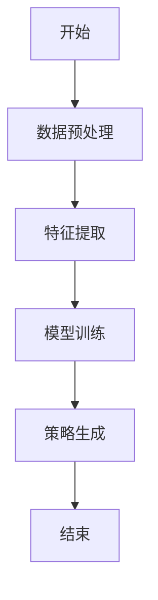
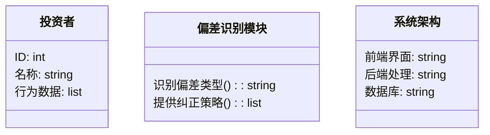
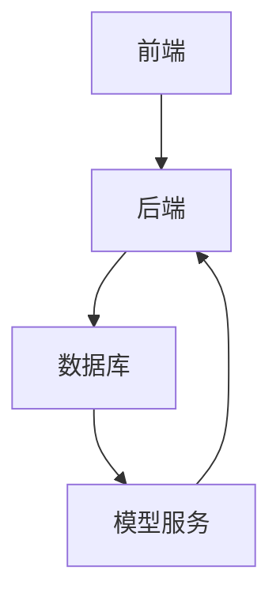
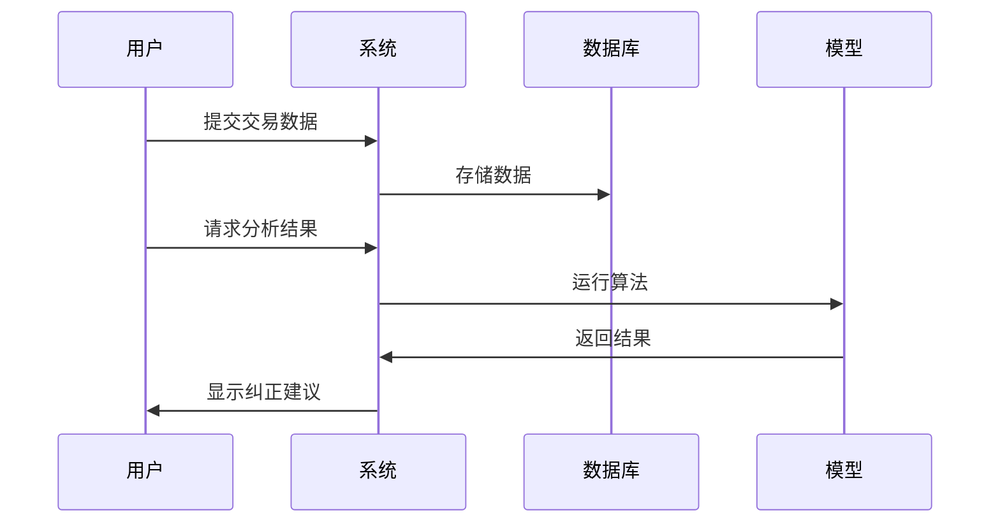

                 


# 设计智能化的个人投资者行为偏差纠正工具

> 关键词：个人投资者，行为偏差，纠正工具，机器学习，系统架构

> 摘要：本文探讨了设计智能化的个人投资者行为偏差纠正工具的方法，从识别偏差到系统架构设计，结合算法和实际案例，提供详细的实现步骤和最佳实践。

---

## 第一部分：背景介绍

### 第1章：个人投资者行为偏差概述

#### 1.1 问题背景
- 1.1.1 投资者行为偏差的普遍性：投资者常受情绪影响，如过度自信和从众心理。
- 1.1.2 行为偏差对投资决策的影响：可能导致非理性决策和投资损失。
- 1.1.3 现有解决方案的局限性：传统方法依赖于自我反省，效果有限。

#### 1.2 问题描述
- 1.2.1 常见的行为偏差类型：锚定效应、确认偏差、损失厌恶等。
- 1.2.2 行为偏差的具体表现：投资者可能在市场下跌时恐慌卖出，或在上涨时贪婪追涨。
- 1.2.3 行为偏差的量化方法：通过数据分析识别异常交易模式。

#### 1.3 问题解决
- 1.3.1 纠正行为偏差的目标：帮助投资者做出更理性的决策。
- 1.3.2 技术手段在纠正偏差中的作用：利用机器学习识别偏差，提供纠正建议。
- 1.3.3 系统化解决方案的必要性：构建智能化工具，提供实时反馈和个性化建议。

#### 1.4 边界与外延
- 1.4.1 行为偏差纠正的适用范围：适用于个人投资者，尤其是经验不足的投资者。
- 1.4.2 系统边界与功能限制：工具需考虑数据隐私和用户隐私保护。
- 1.4.3 相关领域的联系与区别：与行为金融学、心理学密切相关，但更注重技术实现。

#### 1.5 核心概念与核心要素
- 1.5.1 核心概念的定义：行为偏差纠正工具利用技术手段识别和纠正投资者偏差。
- 1.5.2 核心要素的构成：数据采集、偏差识别算法、纠正策略生成模块。

---

## 第二部分：核心概念与联系

### 第2章：行为偏差纠正工具的核心概念

#### 2.1 核心概念原理
- 2.1.1 行为偏差识别机制：通过分析交易数据和市场反应，识别投资者的偏差。
- 2.1.2 纠正策略的制定：基于识别结果，提供个性化的纠正建议。
- 2.1.3 反馈机制的设计：实时或定期反馈纠正效果，优化策略。

#### 2.2 概念属性特征对比表
| 行为偏差类型 | 表现形式 | 纠正策略 | 难度等级 |
|--------------|----------|----------|----------|
| 锚定效应     | 过度依赖初始信息 | 调整信息源多样性 | 中等       |
| 确认偏差     | 过度相信支持自己观点的信息 | 提供反向信息 | 高         |

#### 2.3 ER实体关系图
```mermaid
erd
    投资者
    ----> 拥有：1
    行为数据
    ----> 包含：多
    偏差类型
    ----> 包含：多
```

---

## 第三部分：算法原理讲解

### 第3章：行为偏差识别与纠正算法

#### 3.1 数据预处理
- 数据清洗与标准化：处理缺失值和异常值，标准化数据。
- 特征提取与选择：提取交易频率、交易金额等特征，选择关键特征。

#### 3.2 算法实现
- 使用决策树识别偏差：构建决策树模型，分类投资者的偏差类型。
- 基于聚类分析制定纠正策略：将投资者分为不同群组，制定个性化策略。

#### 3.3 算法流程图


#### 3.4 代码实现
```python
import pandas as pd
from sklearn.tree import DecisionTreeClassifier

# 数据预处理
data = pd.read_csv('investor_data.csv')
data = data.dropna()

# 特征提取
features = data[['交易频率', '收益波动率']]
labels = data['偏差类型']

# 模型训练
model = DecisionTreeClassifier()
model.fit(features, labels)

# 预测偏差类型
new_features = [[5, 0.3]]
predicted_label = model.predict(new_features)
print(predicted_label)
```

#### 3.5 数学模型和公式
- 决策树模型的分类效果：使用Gini指数计算特征重要性，公式为：
  $$ Gini = \sum_{i} p_i (1 - p_i) $$
- 聚类分析的相似性度量：使用欧氏距离计算样本间的相似性：
  $$ d(x, y) = \sqrt{\sum_{i=1}^{n} (x_i - y_i)^2} $$

---

## 第四部分：系统分析与架构设计方案

### 第4章：系统架构设计

#### 4.1 项目介绍
- 工具目标：帮助投资者识别和纠正行为偏差，优化投资决策。

#### 4.2 系统功能设计
- 领域模型：投资者数据管理、偏差识别、纠正策略生成。


#### 4.3 系统架构设计


#### 4.4 系统接口设计
- 用户登录接口：`/login`
- 数据上传接口：`/upload`
- 结果查询接口：`/results`

#### 4.5 系统交互


---

## 第五部分：项目实战

### 第5章：系统核心实现

#### 5.1 环境安装
- 安装Python、Pandas、Scikit-learn等库。

#### 5.2 核心代码实现
```python
from sklearn.ensemble import RandomForestClassifier

# 训练模型
model = RandomForestClassifier()
model.fit(features, labels)

# 预测新数据
new_features = [[5, 0.3]]
predicted = model.predict(new_features)
print(predicted)
```

#### 5.3 代码应用解读
- 使用随机森林模型提高分类准确性，代码实现简单易懂。

#### 5.4 实际案例分析
- 案例背景：投资者A频繁交易，收益波动大。
- 系统分析：识别出A存在过度交易偏差。
- 纠正策略：建议减少交易频率，关注长期投资。

#### 5.5 工具应用效果分析
- 系统有效识别偏差，提供个性化纠正建议，帮助投资者改善决策。

#### 5.6 工具小结
- 工具成功实现了行为偏差的识别和纠正，提升了投资决策的理性。

---

## 第六部分：最佳实践

### 第6章：小结与注意事项

#### 6.1 小结
- 工具有效帮助投资者识别和纠正行为偏差，提升投资效果。

#### 6.2 注意事项
- 数据隐私保护：确保投资者数据的安全。
- 算法选择：根据具体情况选择合适的算法，避免过拟合。

### 第7章：总结与展望

#### 7.1 总结
- 工具通过技术手段解决了投资者行为偏差问题，具有实际应用价值。

#### 7.2 展望
- 进一步优化算法，扩展工具功能，提供更多个性化服务。

---

## 作者

作者：AI天才研究院/AI Genius Institute & 禅与计算机程序设计艺术 /Zen And The Art of Computer Programming

---

通过以上结构，文章详细介绍了设计智能化的个人投资者行为偏差纠正工具的过程，从背景分析到系统实现，再到实际应用，为读者提供了全面的技术指导和实践指南。

