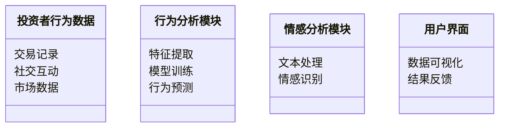

                 


# 设计智能化的个人投资者行为分析工具

> 关键词：个人投资者行为分析，智能化工具，机器学习，自然语言处理，系统架构，项目实战

> 摘要：本文详细探讨了设计智能化个人投资者行为分析工具的核心概念、算法原理、系统架构以及项目实现。通过结合数据驱动和算法驱动的方法，分析投资者行为特征，构建情感分析模型，优化投资决策，实现智能化的工具设计。

---

# 第一部分: 背景介绍与核心概念

# 第1章: 个人投资者行为分析工具的背景与问题背景

## 1.1 问题背景

### 1.1.1 个人投资者行为分析的重要性
在金融市场中，个人投资者的行为往往受到情绪、认知偏差和外部环境的影响，这些行为特征可以通过数据分析和算法建模来揭示其内在规律。通过智能化工具分析投资者行为，可以帮助他们更好地理解自身决策模式，优化投资策略，降低风险。

### 1.1.2 当前市场环境对投资者行为的影响
现代金融市场信息透明度高，投资者面临海量数据和复杂决策。投资者的行为不仅受市场波动影响，还与其认知、情绪和社交网络密切相关。传统工具难以全面捕捉这些行为特征，智能化工具的出现弥补了这一不足。

### 1.1.3 现有工具的局限性
现有投资者行为分析工具多依赖简单的统计分析，难以深入挖掘行为背后的复杂因素。此外，工具的交互性和用户体验也有待提升，难以满足个性化需求。

## 1.2 问题描述

### 1.2.1 投资者行为的复杂性
投资者行为受到多种因素影响，包括市场环境、个体心理、社交互动等。行为特征多样且动态变化，需要多维度数据和复杂算法的支持。

### 1.2.2 行为分析的难点
- 数据获取困难：投资者行为数据分散，难以整合。
- 数据维度复杂：需要处理文本、交易记录、市场数据等多种信息。
- 情感分析挑战：情绪识别需要自然语言处理技术，且情绪与行为的关系复杂。

### 1.2.3 智能化工具的需求
投资者需要个性化的行为分析工具，能够实时反馈行为特征，提供优化建议。智能化工具应具备数据采集、分析、反馈和优化的闭环能力。

## 1.3 问题解决

### 1.3.1 智能化工具的核心目标
通过数据驱动和算法驱动的方法，全面分析投资者行为特征，构建行为预测模型，优化投资决策。

### 1.3.2 数据驱动与算法驱动的结合
数据驱动：通过采集投资者的历史交易数据、社交媒体互动数据等，提取行为特征。
算法驱动：利用机器学习算法，预测投资者行为，并优化行为模型。

### 1.3.3 用户体验与功能平衡
工具需注重用户体验，界面简洁，功能强大，能够实时反馈分析结果，帮助投资者做出决策。

## 1.4 边界与外延

### 1.4.1 工具的功能边界
- 数据采集与处理：仅限于投资者行为相关数据。
- 行为分析：不涉及市场预测，但可提供基于行为的优化建议。

### 1.4.2 相关领域的区别与联系
- 区别：与市场预测工具不同，专注于行为分析。
- 联系：可与市场预测工具结合，提供更全面的投资建议。

### 1.4.3 智能化工具的未来发展
随着AI技术进步，工具将更加智能化，能够实时反馈、主动优化，甚至具备一定的情感识别能力。

## 1.5 核心概念与结构

### 1.5.1 智能化工具的核心要素
- 数据采集模块：获取投资者行为数据。
- 行为分析模块：分析行为特征，构建行为模型。
- 情感分析模块：识别投资者情绪，预测行为变化。

### 1.5.2 行为分析模型的构建逻辑
数据采集 → 特征提取 → 模型训练 → 行为预测 → 反馈优化。

### 1.5.3 数据、算法、用户三者的关联
数据是基础，算法是工具，用户是目标。三者协同，实现智能化分析。

---

# 第二部分: 核心概念与联系

# 第2章: 智能化个人投资者行为分析模型

## 2.1 行为分析模型的原理

### 2.1.1 数据驱动的分析方法
通过收集投资者的历史交易数据、社交媒体互动数据等，提取行为特征，如交易频率、仓位调整、市场情绪等。

### 2.1.2 算法驱动的预测机制
利用机器学习算法（如随机森林、神经网络）训练行为预测模型，预测投资者未来的交易行为。

### 2.1.3 用户反馈的闭环优化
通过用户反馈不断优化模型，提升分析精度。

## 2.2 数据特征提取与行为建模

### 2.2.1 用户行为数据的特征提取
- 交易频率：每天交易次数。
- 仓位调整：买卖决策的频率。
- 情绪波动：情绪指标的变化。

### 2.2.2 行为特征与投资决策的关系
行为特征反映投资者的心理状态，影响其投资决策。例如，情绪波动大的投资者可能倾向于频繁交易。

### 2.2.3 基于特征的行为预测模型
构建机器学习模型，输入行为特征，输出行为预测结果。

## 2.3 情感分析与情绪识别

### 2.3.1 投资者情绪对决策的影响
情绪波动影响投资者的理性决策，导致非理性交易。

### 2.3.2 基于NLP的情感分析方法
利用自然语言处理技术，分析投资者在社交媒体上的言论，提取情绪特征。

### 2.3.3 情绪识别在行为分析中的应用
将情绪特征作为行为预测的输入，提升模型的预测精度。

## 2.4 模型之间的关系与优化

### 2.4.1 数据驱动与算法驱动的关系
数据驱动提供基础，算法驱动提供工具，两者协同优化模型。

### 2.4.2 行为预测与情绪识别的关联
情绪识别为行为预测提供额外信息，提高预测准确性。

---

# 第3章: 算法原理

## 3.1 机器学习算法原理

### 3.1.1 监督学习
- 输入：投资者行为特征。
- 输出：行为预测结果。

### 3.1.2 特征工程
- 数据预处理：标准化、归一化。
- 特征选择：基于特征重要性选择关键特征。

### 3.1.3 模型训练
- 使用训练数据训练模型，评估模型性能。

## 3.2 自然语言处理（NLP）算法

### 3.2.1 情感分析
- 使用文本分类算法（如SVM、LSTM）分析投资者情绪。

### 3.2.2 实例分析
- 示例代码：使用Python的scikit-learn库进行情感分类。

---

# 第4章: 系统分析与架构设计

## 4.1 问题场景介绍

### 4.1.1 系统目标
设计一个智能化的个人投资者行为分析工具，帮助投资者优化决策。

### 4.1.2 系统需求
- 数据采集：实时采集投资者行为数据。
- 行为分析：实时分析行为特征。
- 情感分析：实时识别投资者情绪。

## 4.2 系统功能设计

### 4.2.1 领域模型类图


### 4.2.2 系统架构图


## 4.3 接口设计与交互流程

### 4.3.1 系统接口设计
- API接口：提供RESTful API，供客户端调用。
- 数据接口：与数据源（如交易所API）对接。

### 4.3.2 交互流程
1. 用户发起请求，发送行为数据。
2. 服务端接收数据，进行分析。
3. 分析结果返回用户界面。

---

# 第5章: 项目实战

## 5.1 环境安装

### 5.1.1 安装Python
- 安装Python 3.x。
- 安装必要的库：numpy、pandas、scikit-learn、tensorflow。

### 5.1.2 安装其他工具
- 安装Jupyter Notebook用于数据分析。
- 安装Flask用于搭建Web界面。

## 5.2 系统核心实现

### 5.2.1 行为分析模块实现
```python
import numpy as np
from sklearn.ensemble import RandomForestClassifier

# 示例数据
X = np.array([[1, 2, 3], [4, 5, 6]])
y = np.array([0, 1])

# 训练模型
model = RandomForestClassifier()
model.fit(X, y)
```

### 5.2.2 情感分析模块实现
```python
from tensorflow.keras import layers

# 示例情感分类模型
model = tf.keras.Sequential()
model.add(layers.Dense(64, activation='relu', input_shape=(100,)))
model.add(layers.Dense(1, activation='sigmoid'))
model.compile(optimizer='adam', loss='binary_crossentropy', metrics=['accuracy'])
```

## 5.3 案例分析与详细解读

### 5.3.1 数据采集与处理
- 采集投资者的历史交易数据和社交媒体数据。
- 数据清洗和特征提取。

### 5.3.2 模型训练与评估
- 使用训练数据训练模型。
- 评估模型性能，调整参数。

## 5.4 项目小结

### 5.4.1 实践中的注意事项
- 数据质量影响模型性能。
- 模型需要定期更新。

### 5.4.2 项目总结
通过实战项目，掌握了智能化工具的设计方法，积累了宝贵的经验。

---

# 第六部分: 最佳实践与总结

# 第6章: 最佳实践与总结

## 6.1 最佳实践

### 6.1.1 数据采集
确保数据全面、准确，避免偏差。

### 6.1.2 模型优化
定期更新模型，结合最新数据优化性能。

### 6.1.3 用户体验
设计友好的用户界面，提升用户体验。

## 6.2 小结

### 6.2.1 核心内容回顾
本文详细讲解了智能化个人投资者行为分析工具的设计方法，包括背景、核心概念、算法原理、系统架构和项目实战。

## 6.3 注意事项

### 6.3.1 数据隐私
注意数据隐私保护，遵守相关法律法规。

### 6.3.2 模型局限性
模型无法预测所有市场情况，需结合其他工具使用。

## 6.4 拓展阅读

### 6.4.1 推荐书籍
- 《机器学习实战》
- 《自然语言处理入门》

### 6.4.2 推荐论文
- 智能化行为分析领域的最新研究成果。

---

# 作者：AI天才研究院/AI Genius Institute & 禅与计算机程序设计艺术 /Zen And The Art of Computer Programming

