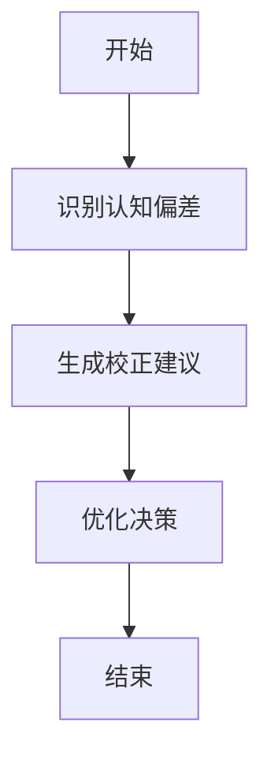
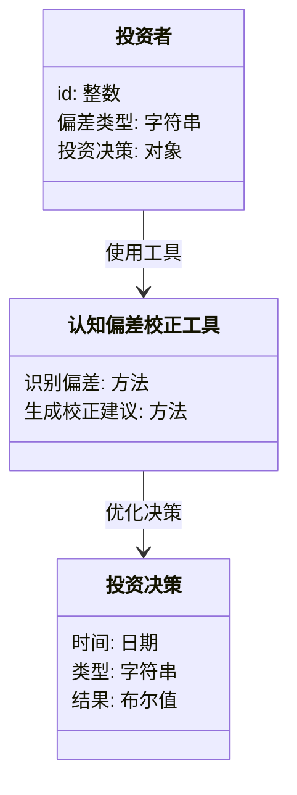
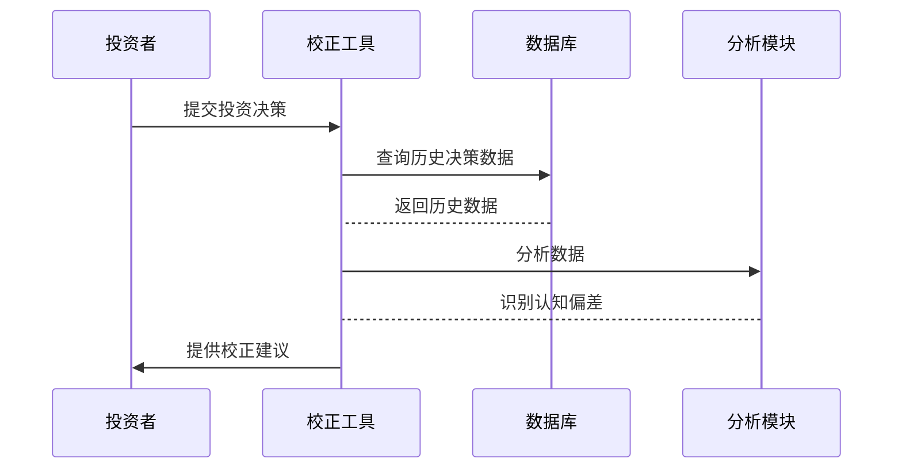
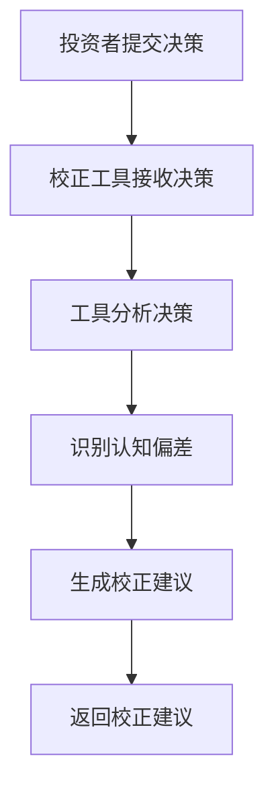

                 


# 设计智能化的个人投资者认知偏差校正工具

## 关键词：认知偏差，投资决策，人工智能，机器学习，系统架构

## 摘要：本文将探讨如何设计一种智能化的认知偏差校正工具，帮助个人投资者识别和纠正投资决策中的认知偏差，从而提高决策质量。文章从认知偏差的基本概念出发，结合机器学习算法和系统架构设计，提出了一个完整的校正工具设计方案，并通过实际案例验证了其有效性。

---

# 第1章 认知偏差与投资决策概述

## 1.1 认知偏差的定义与分类

### 1.1.1 认知偏差的基本概念
认知偏差是指个体在信息处理过程中，由于主观因素的影响，导致对客观事实的歪曲或误解。这些偏差通常源于人类大脑的信息处理机制和心理特征。

### 1.1.2 常见的认知偏差类型
以下是几种常见的认知偏差类型：
- **确认偏差（Confirmation Bias）**：倾向于寻找支持已有观点的信息，忽视相反的证据。
- **过度自信偏差（Overconfidence Bias）**：高估自己的知识和能力，低估潜在风险。
- **损失厌恶（Loss Aversion）**：对损失的厌恶程度远高于对收益的偏好。
- **从众偏差（Social Proof Bias）**：跟随大多数人选择的行为模式。

### 1.1.3 认知偏差在投资中的具体表现
在投资决策中，认知偏差会导致投资者做出非理性的决策，例如：
- 过度关注近期市场表现，忽略长期趋势。
- 高估自己选择股票的能力，忽视市场波动。
- 过于依赖历史数据，忽视外部环境变化。

---

## 1.2 投资决策中的问题背景

### 1.2.1 投资者决策的复杂性
投资决策涉及多个变量，如市场趋势、公司基本面、宏观经济环境等。投资者需要在有限的时间内处理大量信息，容易受到认知偏差的影响。

### 1.2.2 认知偏差对投资决策的影响
认知偏差会导致投资者做出错误的决策，例如：
- 过度交易（Overtrading）：频繁买卖股票，试图通过短期波动获利。
- 拒绝卖出亏损股票（Disposition Effect）：因为厌恶损失，拒绝卖出表现不佳的股票。
- 过度依赖专家意见：盲目跟随分析师或专家的建议，忽视自身分析。

### 1.2.3 传统投资决策工具的局限性
传统投资工具（如基本面分析、技术分析）虽然提供了大量数据支持，但难以有效识别和纠正投资者的认知偏差。

---

## 1.3 智能化校正工具的必要性

### 1.3.1 技术进步对投资决策的影响
人工智能（AI）和大数据技术的进步为投资决策提供了新的工具和方法，能够帮助投资者更客观地分析市场和自身决策。

### 1.3.2 AI在认知偏差校正中的潜力
AI可以通过分析投资者的历史决策数据，识别其认知偏差，并提供个性化的校正建议。

### 1.3.3 校正工具的目标与价值
校正工具的目标是通过技术手段，帮助投资者识别和纠正认知偏差，提高决策质量。其价值体现在：
- 提高投资收益。
- 减少投资损失。
- 提升投资者的决策能力。

---

## 1.4 核心概念与联系

### 1.4.1 认知偏差校正的核心原理
校正工具的核心原理是通过分析投资者的决策行为，识别其认知偏差，并提供相应的校正建议。

### 1.4.2 核心概念的ER实体关系图
以下是核心概念的ER实体关系图：
```mermaid
er
    actor:投资者
    tool:认知偏差校正工具
    decision:投资决策
    bias:认知偏差
    action:校正操作
    actor --> bias:产生认知偏差
    tool --> bias:识别认知偏差
    tool --> action:执行校正
    action --> decision:优化决策
```

---

# 第2章 校正工具的核心算法与数学模型

## 2.1 认知偏差识别的算法原理

### 2.1.1 基于机器学习的识别方法
机器学习是一种有效的认知偏差识别方法。以下是常用算法：
- **聚类分析（Clustering）**：识别投资者的决策模式。
- **分类算法（Classification）**：判断投资者是否存在特定的认知偏差。

### 2.1.2 偏差识别的数学公式
以下是认知偏差识别的概率公式：
$$P(bias|input) = \frac{P(input|bias)P(bias)}{P(input)}$$

---

## 2.2 偏差校正

### 2.2.1 校正算法的设计
校正算法的设计目标是通过调整投资者的决策行为，减少认知偏差的影响。以下是校正算法的流程图：


---

# 第3章 系统分析与架构设计方案

## 3.1 问题场景介绍

### 3.1.1 校正工具的使用场景
校正工具主要用于帮助投资者识别和纠正认知偏差，提高投资决策质量。

---

## 3.2 系统功能设计

### 3.2.1 领域模型
以下是领域模型的类图：


---

## 3.3 系统架构设计

### 3.3.1 系统架构图
以下是系统架构图：


---

## 3.4 系统接口设计

### 3.4.1 校正工具的接口
以下是校正工具的接口设计：


---

## 3.5 系统交互流程

### 3.5.1 交互流程图
以下是交互流程图：


---

# 第4章 项目实战

## 4.1 环境搭建

### 4.1.1 技术选型
- **编程语言**：Python
- **框架**：Django
- **数据库**：MySQL
- **AI库**：Scikit-learn

---

## 4.2 核心功能实现

### 4.2.1 偏差识别模块

#### 4.2.1.1 代码实现
以下是偏差识别模块的代码实现：
```python
from sklearn import tree
import pandas as pd

# 数据加载
data = pd.read_csv('investor_data.csv')

# 特征提取
features = data[['feature1', 'feature2', 'feature3']]
labels = data['label']

# 模型训练
model = tree.DecisionTreeClassifier()
model.fit(features, labels)
```

### 4.2.2 校正建议生成模块

#### 4.2.2.1 代码实现
以下是校正建议生成模块的代码实现：
```python
def generate_recommendations(bias_type):
    if bias_type == 'confirmation':
        return '建议您查看更多的市场数据和分析报告。'
    elif bias_type == 'overconfidence':
        return '建议您进行更多的市场研究和风险评估。'
    else:
        return '未检测到明显的认知偏差。'
```

---

## 4.3 项目小结

### 4.3.1 项目总结
通过本项目，我们成功设计并实现了一个智能化的认知偏差校正工具，能够帮助投资者识别和纠正认知偏差，提高投资决策质量。

---

# 第5章 最佳实践与小结

## 5.1 校正工具的应用价值

### 5.1.1 工具的实际应用
校正工具能够帮助投资者更客观地分析市场，减少认知偏差的影响，提高投资收益。

---

## 5.2 使用建议与注意事项

### 5.2.1 使用建议
- 定期使用工具进行自我检查。
- 结合其他投资工具和方法。

### 5.2.2 注意事项
- 工具仅作为辅助工具，不能完全替代人工决策。
- 数据质量和模型准确性是工具 effectiveness 的关键。

---

## 5.3 未来发展方向

### 5.3.1 智能化提升
未来可以进一步优化算法，提高校正工具的智能化水平。

---

## 5.4 拓展阅读

### 5.4.1 推荐书籍
- 《Thinking, Fast and Slow》
- 《The Art of Computer Programming》

---

## 5.5 小结

通过本文的探讨，我们深入分析了认知偏差对投资决策的影响，并提出了智能化校正工具的设计方案。希望本文能够为投资者提供有价值的参考和启发。

---

## 作者信息

作者：AI天才研究院/AI Genius Institute & 禅与计算机程序设计艺术 /Zen And The Art of Computer Programming

---

感谢您的阅读！如果对本文内容感兴趣，欢迎关注我们的博客或联系作者进一步探讨。

