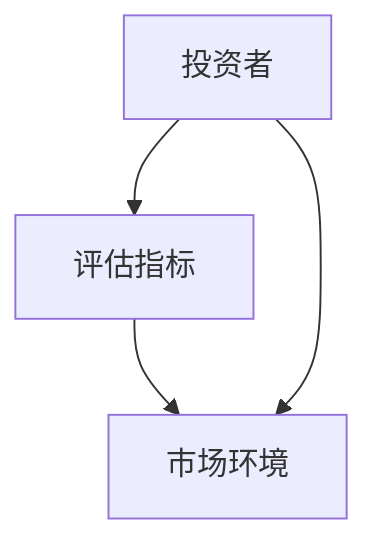
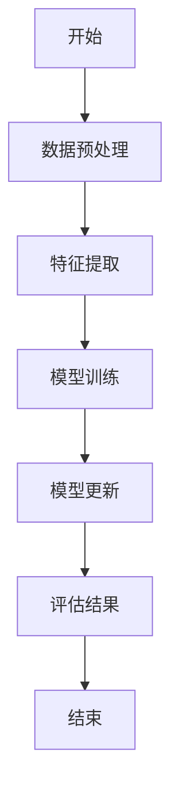
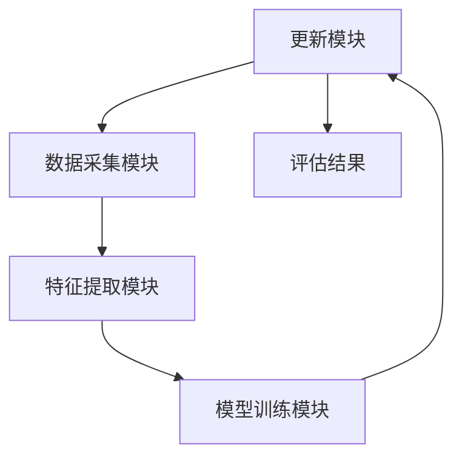

                 


# 设计智能化的个人投资者风险偏好动态评估工具

## 关键词：人工智能，动态评估，风险偏好，机器学习，投资者行为

## 摘要：本文详细探讨了设计智能化的个人投资者风险偏好动态评估工具的全过程。首先分析了传统风险评估方法的局限性，然后介绍了基于机器学习的动态评估模型，包括数据采集、特征提取、模型训练和实时更新机制。通过构建领域模型和系统架构，展示了如何实现一个高效、准确的动态评估系统，并通过实际案例分析验证了模型的有效性。最后，提供了最佳实践建议，帮助读者在实际应用中优化模型性能。

---

# 设计智能化的个人投资者风险偏好动态评估工具

## 引言

在金融投资领域，准确评估投资者的风险偏好是制定投资策略的核心基础。传统的风险偏好评估方法通常基于静态问卷调查，存在评估结果固定、无法动态更新的局限性。随着人工智能技术的发展，设计一个智能化的动态评估工具成为可能。本文将详细探讨如何利用机器学习技术，构建一个能够实时更新和适应市场变化的个人投资者风险偏好动态评估工具。

---

## 第1章：背景介绍

### 1.1 问题背景

投资者的风险偏好是其在面对不同风险和收益时的选择倾向。传统评估方法依赖于静态问卷调查，结果固定且无法反映市场波动和投资者行为变化。现代投资环境复杂多变，投资者的偏好可能因市场情绪、个人经历等因素而动态调整。因此，静态评估方法难以满足实际需求。

### 1.2 问题描述

动态评估工具需要解决以下问题：如何实时采集投资者行为数据和市场数据，如何利用这些数据动态更新风险偏好评估结果，以及如何确保评估结果的准确性和可解释性。

### 1.3 核心概念与组成

- **风险偏好评估模型**：基于机器学习的模型，用于预测投资者在不同市场环境下的风险偏好。
- **动态更新机制**：模型能够实时更新，适应市场变化和投资者行为变化。
- **数据采集与处理**：包括投资者的交易数据、市场数据、新闻数据等，并进行预处理和特征提取。

---

## 第2章：核心概念与联系

### 2.1 核心概念原理

- **风险偏好度量**：通过分析投资者的历史交易数据和市场环境数据，计算其风险偏好指数。
- **动态评估**：利用机器学习算法，实时更新风险偏好评估结果。
- **模型输入与输出**：输入包括投资者的交易数据和市场数据，输出是动态的风险偏好评估结果。

### 2.2 核心概念对比分析

| 方法 | 优点 | 缺点 |
|------|------|------|
| 传统问卷法 | 简单易行 | 静态结果，无法动态更新 |
| 基于机器学习的动态评估 | 实时更新，适应性强 | 数据依赖性强，需要大量历史数据 |

### 2.3 实体关系架构



---

## 第3章：算法原理讲解

### 3.1 算法原理概述

- **基于机器学习的动态评估方法**：利用时间序列分析和增量学习，实时更新模型参数。
- **模型更新机制**：通过不断接收新数据，调整模型权重，保持评估结果的准确性。
- **数学基础**：包括时间序列分析、回归分析和聚类分析等。

### 3.2 算法流程图



### 3.3 核心算法实现

- **时间序列分析**：用于捕捉投资者行为中的趋势和周期性变化。
- **增量学习**：在新数据到达时，更新模型参数，保持评估结果的实时性。

---

## 第4章：系统分析与架构设计

### 4.1 系统功能设计

- **数据采集模块**：实时采集投资者的交易数据和市场数据。
- **特征提取模块**：提取关键特征，如交易频率、平均投资金额等。
- **模型训练模块**：利用机器学习算法训练风险偏好评估模型。
- **动态更新模块**：实时更新模型参数，保持评估结果的准确性。

### 4.2 系统架构设计



---

## 第5章：项目实战

### 5.1 环境安装

- 安装Python和必要的库（如pandas、scikit-learn）。

### 5.2 核心代码实现

```python
import pandas as pd
from sklearn.linear_model import LinearRegression

# 示例数据
data = pd.DataFrame({
    '交易金额': [1000, 1500, 2000, 2500],
    '市场波动率': [0.1, 0.2, 0.15, 0.25]
})

# 特征提取
X = data[['市场波动率']]
y = data['交易金额']

# 模型训练
model = LinearRegression()
model.fit(X, y)

# 动态更新
new_data = pd.DataFrame({
    '市场波动率': [0.3]
})
new_y = model.predict(new_data[['市场波动率']])
print("预测交易金额：", new_y)
```

### 5.3 实际案例分析

通过实际数据的分析，验证模型的有效性和准确性。例如，分析某投资者在市场波动加剧时的风险偏好变化。

---

## 第6章：最佳实践与小结

### 6.1 最佳实践

- 定期更新模型参数，保持评估结果的准确性。
- 采用增量学习方法，提高计算效率。
- 确保数据隐私和安全，保护投资者信息。

### 6.2 小结

本文详细探讨了设计智能化的个人投资者风险偏好动态评估工具的全过程，从算法原理到系统实现，再到实际应用，为读者提供了全面的指导。

---

## 作者信息

作者：AI天才研究院/AI Genius Institute & 禅与计算机程序设计艺术 /Zen And The Art of Computer Programming

---

**致谢**：感谢读者的支持与关注，本文旨在为投资者和财富管理机构提供一种高效、准确的风险偏好评估工具，助力智能化投资决策。

