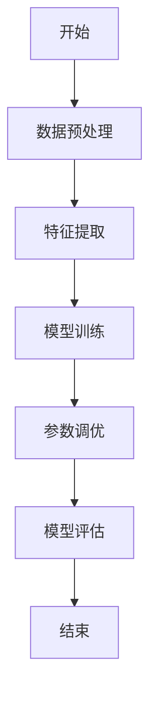
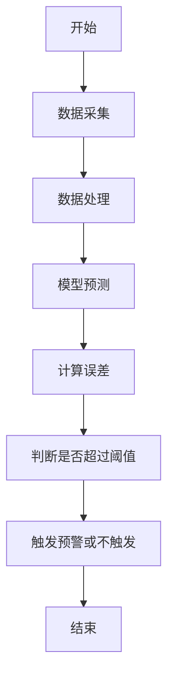
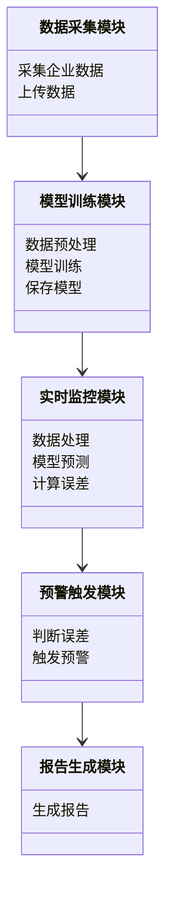
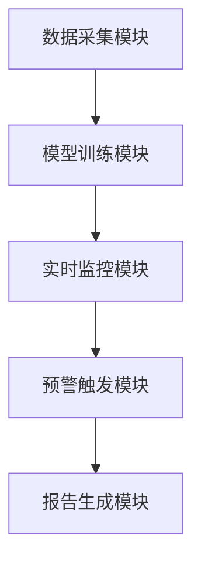

                 


# 设计智能化的企业信用评级模型性能监控与预警系统

---

## 关键词
企业信用评级、智能化监控、预警系统、模型性能、算法优化

---

## 摘要
本文详细探讨了设计智能化企业信用评级模型性能监控与预警系统的核心方法。通过分析信用评级模型的原理、算法优化、系统架构以及实际应用场景，本文提出了构建一个高效、智能的监控与预警系统的方法。该系统能够实时监控信用评级模型的性能，及时发现异常情况并发出预警，从而帮助企业规避风险，提升信用评级的准确性。

---

# 第1章: 企业信用评级模型概述

## 1.1 企业信用评级的重要性
企业信用评级是衡量企业信用状况的重要指标，直接影响企业的融资能力、合作伙伴的选择以及市场信任度。传统的信用评级方法依赖人工经验，存在主观性强、效率低、成本高等问题。随着人工智能和大数据技术的发展，智能化信用评级成为趋势，能够提高评级的准确性和效率。

## 1.2 信用评级模型的背景
信用评级模型经历了从简单的财务指标分析到复杂的机器学习模型的演变。传统的模型主要基于财务数据，而智能化模型则引入了更多的非结构化数据，如市场动态、社交数据等，显著提升了评级的全面性和及时性。

## 1.3 性能监控与预警系统的核心概念
性能监控是指对信用评级模型的运行状态进行实时跟踪，确保模型输出的稳定性和准确性。预警系统则基于监控数据，识别潜在风险并及时发出警报，帮助企业在问题发生前采取应对措施。

---

# 第2章: 信用评级模型的核心概念与联系

## 2.1 信用评级模型的原理
信用评级模型通过收集和分析企业的财务、市场、管理等多方面数据，利用机器学习算法对企业的信用状况进行评分。评分结果反映了企业在特定时间段内的信用风险水平。

## 2.2 监控与预警系统的原理
监控系统通过采集模型的输出结果和运行数据，结合预设的监控指标，评估模型的性能。当模型性能出现异常或预测结果偏离预期时，预警系统会触发警报，提示相关人员采取措施。

## 2.3 核心概念的ER实体关系图
以下是一个简化的ER实体关系图，展示了信用评级模型和监控系统之间的关系：

```mermaid
erd
    左右方向
    实体: 企业
    实体: 信用评级模型
    实体: 监控系统
    关系: 企业 -> 信用评级模型: 输入数据
    关系: 信用评级模型 -> 监控系统: 输出结果
    关系: 监控系统 -> 企业: 预警信息
```

---

# 第3章: 企业信用评级模型的算法原理

## 3.1 信用评级模型的算法选择
智能化信用评级模型通常采用逻辑回归、支持向量机（SVM）或随机森林等算法。这些算法能够处理非线性关系，提高模型的预测能力。

## 3.2 模型训练的流程
模型训练包括数据预处理、特征提取、模型训练与调优、以及模型评估等步骤。以下是训练流程图：



## 3.3 监控与预警算法的设计
监控系统通过设置阈值，实时跟踪模型的预测误差和运行状态。当误差超过阈值时，系统会触发预警。以下是预警算法的流程图：



---

# 第4章: 数学模型与公式详解

## 4.1 信用评分函数的定义
信用评分函数通常是一个加权求和的函数，表示为：

$$ credit\_score = \sum_{i=1}^{n} w_i x_i $$

其中，$w_i$为特征权重，$x_i$为特征值。

## 4.2 模型训练的损失函数
常用的损失函数是均方误差（MSE），表示为：

$$ loss = \frac{1}{m} \sum_{j=1}^{m} (y_j - \hat{y_j})^2 $$

其中，$m$为样本数量，$y_j$为真实值，$\hat{y_j}$为预测值。

---

# 第5章: 系统架构与设计

## 5.1 系统功能设计
系统主要功能包括数据采集、模型训练、实时监控、预警触发和报告生成。以下是系统功能类图：



## 5.2 系统架构设计
系统采用微服务架构，各模块独立运行，通过API进行通信。以下是系统架构图：



---

# 第6章: 项目实战与案例分析

## 6.1 环境安装
需要安装Python、TensorFlow、Scikit-learn等工具。以下是安装命令：

```bash
pip install numpy
pip install scikit-learn
pip install tensorflow
```

## 6.2 核心代码实现
以下是信用评级模型的训练代码：

```python
from sklearn.model_selection import train_test_split
from sklearn.linear_model import LogisticRegression
import numpy as np

# 数据预处理
X = np.array([[feature1, feature2, ...], ...])
y = np.array([label1, label2, ...])

# 划分训练集和测试集
X_train, X_test, y_train, y_test = train_test_split(X, y, test_size=0.2)

# 模型训练
model = LogisticRegression()
model.fit(X_train, y_train)

# 模型评估
score = model.score(X_test, y_test)
print("模型准确率：", score)
```

## 6.3 案例分析
以某企业为例，假设模型预测其信用评分为75分，实际评分为80分。误差为5分，未超过阈值，因此不触发预警。如果误差超过10分，则触发预警。

---

# 第7章: 总结与展望

## 7.1 总结
本文详细介绍了设计智能化企业信用评级模型性能监控与预警系统的方法，涵盖了模型原理、算法优化、系统架构以及项目实战等方面。

## 7.2 展望
未来，可以进一步优化模型算法，引入更多的数据源，提升模型的准确性和实时性。同时，可以开发更智能化的预警系统，实现自动化风险应对。

---

作者：AI天才研究院  
日期：2023年10月

