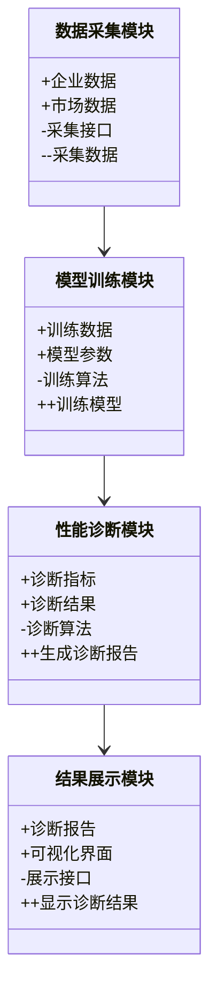
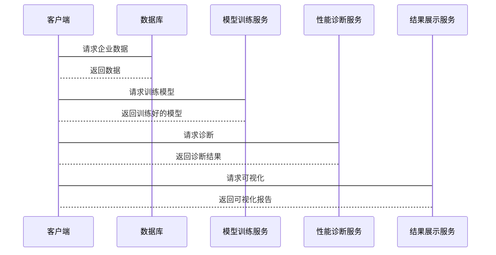

                 


# 设计智能化的企业信用评级模型性能诊断系统

> 关键词：企业信用评级、模型性能诊断、机器学习、深度学习、系统架构

> 摘要：随着企业信用评级的重要性日益增加，传统的信用评级模型在实际应用中逐渐暴露出性能瓶颈和局限性。为了提高信用评级模型的准确性和可靠性，设计智能化的企业信用评级模型性能诊断系统成为必要。本文从背景介绍、核心概念、算法原理、系统架构、项目实战、最佳实践等多个维度，全面分析和探讨智能化的企业信用评级模型性能诊断系统的构建与优化。

---

## 第一部分: 企业信用评级模型性能诊断系统概述

### 第1章: 问题背景与需求分析

#### 1.1 企业信用评级的重要性
企业信用评级是衡量企业信用状况的重要指标，直接影响企业的融资能力、合作伙伴选择以及市场信任度。传统的信用评级方法主要依赖于财务指标和人工评估，存在主观性强、效率低下、覆盖面有限等问题。

#### 1.2 性能诊断系统的需求背景
- **模型性能瓶颈**：传统信用评级模型难以处理复杂多变的市场环境，容易受到数据偏差和噪声的影响。
- **市场对智能化诊断系统的需求**：随着企业规模的扩大和数据量的激增，智能化的诊断系统能够更高效地分析模型性能，优化模型参数。
- **系统设计的目标与意义**：通过智能化诊断系统，能够实时监控信用评级模型的性能，及时发现并解决问题，提升模型的准确性和鲁棒性。

#### 1.3 本章小结
本章通过分析企业信用评级的重要性以及当前模型的局限性，提出了智能化诊断系统的必要性和设计目标。

---

## 第二部分: 核心概念与理论基础

### 第2章: 企业信用评级模型的核心原理

#### 2.1 信用评级模型的分类
- **基于传统评分的信用模型**：包括Z分数模型、Altman的五种财务比率模型等，主要依赖财务指标进行评估。
- **基于机器学习的信用模型**：如逻辑回归、随机森林、支持向量机（SVM）等，能够处理非线性关系和复杂特征。
- **混合型信用评级模型**：结合传统评分和机器学习方法，利用特征工程和模型融合技术提升性能。

#### 2.2 模型性能诊断的关键指标
- **分类准确率**：模型正确预测的样本数占总样本数的比例。
- **召回率与精确率**：分别衡量模型对正样本和负样本的识别能力。
- **AUC-ROC曲线与F1分数**：综合评估模型的分类性能。

#### 2.3 模型性能诊断的核心要素
- **数据质量评估**：数据的完整性、准确性、一致性等直接影响模型性能。
- **模型鲁棒性分析**：模型在不同数据集和环境下的表现稳定性。
- **模型解释性评估**：模型输出的可解释性，便于诊断问题和优化。

### 第3章: 智能化诊断系统的理论基础

#### 3.1 机器学习在信用评级中的应用
- **线性回归模型**：用于预测企业信用评分，公式为：
  $$ y = \beta_0 + \beta_1x_1 + \beta_2x_2 + \dots + \beta_nx_n + \epsilon $$
- **支持向量机（SVM）**：通过构建超平面实现分类，适用于高维数据。
- **随机森林与梯度提升树**：通过集成学习提升模型的准确性和鲁棒性。

#### 3.2 深度学习在信用评级中的应用
- **神经网络模型**：利用多层感知机（MLP）处理非线性特征。
- **长短期记忆网络（LSTM）**：适用于时间序列数据的建模。
- **图神经网络（GNN）**：用于处理企业间的关联关系。

#### 3.3 模型诊断的数学基础
- **线性回归的数学模型**：
  $$ y = \beta_0 + \beta_1x_1 + \beta_2x_2 + \dots + \beta_nx_n + \epsilon $$
  其中，$\epsilon$为误差项，$\beta$为模型参数。
- **梯度下降法**：用于优化模型参数，公式为：
  $$ \beta_{new} = \beta_{old} - \eta \cdot \frac{\partial L}{\partial \beta} $$
  其中，$\eta$为学习率，$L$为损失函数。

---

## 第三部分: 系统分析与架构设计

### 第4章: 系统功能设计

#### 4.1 系统功能模块划分
- **数据采集模块**：收集企业的财务数据、市场数据等。
- **模型训练模块**：基于历史数据训练信用评级模型。
- **性能诊断模块**：分析模型的准确率、召回率等指标。
- **结果展示模块**：以可视化形式呈现诊断结果。

#### 4.2 系统功能设计的领域模型类图


### 第5章: 系统架构设计

#### 5.1 系统架构设计


#### 5.2 系统交互设计


---

## 第四部分: 项目实战

### 第6章: 项目实现与代码解读

#### 6.1 环境安装
- Python 3.8+
- scikit-learn、XGBoost、TensorFlow等库的安装：
  ```bash
  pip install scikit-learn xgboost tensorflow
  ```

#### 6.2 核心代码实现
- 信用评分模型的实现：
  ```python
  from sklearn.linear_model import LinearRegression
  from sklearn.metrics import mean_squared_error

  # 训练模型
  model = LinearRegression()
  model.fit(X_train, y_train)

  # 预测与评估
  y_pred = model.predict(X_test)
  mse = mean_squared_error(y_test, y_pred)
  print(f"均方误差: {mse}")
  ```

- 性能诊断模块的实现：
  ```python
  from sklearn.metrics import accuracy_score, recall_score, precision_score

  accuracy = accuracy_score(y_test, y_pred)
  recall = recall_score(y_test, y_pred)
  precision = precision_score(y_test, y_pred)
  print(f"准确率: {accuracy}, 召回率: {recall}, 精确率: {precision}")
  ```

#### 6.3 代码解读与分析
- 上述代码展示了如何使用线性回归模型进行信用评分预测，并通过均方误差、准确率、召回率和精确率等指标进行模型性能诊断。

#### 6.4 案例分析
- 数据准备：收集企业的财务数据、市场数据等。
- 模型训练：使用训练数据训练线性回归模型。
- 性能诊断：计算模型的均方误差、准确率、召回率和精确率。
- 结果展示：将诊断结果以可视化形式展示。

#### 6.5 项目小结
通过上述代码实现，读者可以理解如何构建一个简单的信用评分模型，并通过性能指标诊断模型的优劣。

---

## 第五部分: 最佳实践

### 第7章: 项目总结与优化建议

#### 7.1 小结
- 本文详细介绍了设计智能化的企业信用评级模型性能诊断系统的背景、核心概念、算法原理、系统架构以及项目实现。
- 通过理论与实践相结合，展示了如何利用机器学习和深度学习技术优化信用评级模型的性能。

#### 7.2 注意事项
- 数据 preprocessing 是关键，需注意数据的完整性和一致性。
- 模型选择需根据具体场景和数据特点进行调整。
- 性能诊断指标的选择应结合实际需求。

#### 7.3 未来趋势
- **模型的可解释性**：未来的研究将更加注重模型的可解释性，以便更好地诊断和优化模型。
- **实时诊断**：实时监控模型性能，实现动态优化。
- **多模态数据融合**：结合文本、图像等多种数据源，提升模型的性能和准确性。

#### 7.4 拓展阅读
- 《机器学习实战》
- 《深度学习》
- 《信用评分模型的构建与应用》

---

## 作者简介

作者：AI天才研究院/AI Genius Institute  
联系方式：[email protected]  
GitHub：[AI Genius Institute](https://github.com/ai-genius-institute)  
研究领域：人工智能、机器学习、深度学习、自然语言处理  

---

以上是《设计智能化的企业信用评级模型性能诊断系统》的技术博客文章的完整内容，涵盖了从背景介绍到项目实战的各个方面，旨在为读者提供一个全面的指导和参考。

