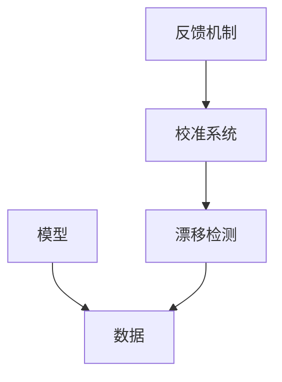
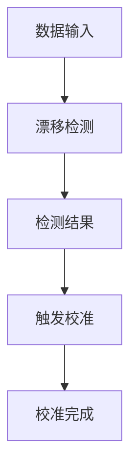
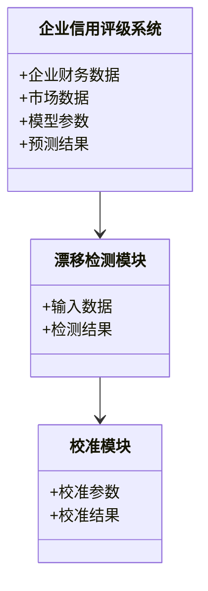
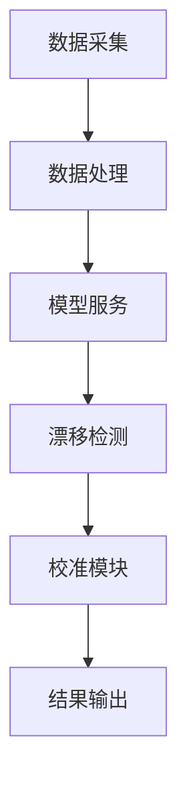

                 


# 设计智能化的企业信用评级模型漂移检测与校准系统

---

## 关键词：
- 企业信用评级模型
- 模型漂移检测
- 模型校准技术
- 智能化系统设计
- 机器学习
- 统计分析

---

## 摘要：
本文详细探讨了设计智能化的企业信用评级模型漂移检测与校准系统的核心方法。通过分析模型漂移的定义、表现形式及其对信用评级的影响，结合实际案例，提出了基于统计分析和机器学习的漂移检测算法，并设计了相应的校准策略。本文还详细介绍了系统的架构设计、接口设计以及实现步骤，为实际应用提供了理论支持和实践指导。

---

# 第一部分: 企业信用评级模型漂移检测与校准系统背景介绍

## 第1章: 问题背景与描述

### 1.1 企业信用评级模型的重要性

#### 1.1.1 信用评级模型的定义与作用
企业信用评级模型是金融机构评估企业信用状况的重要工具，主要用于预测企业的违约概率。它是基于企业的财务数据、市场表现、管理能力等多维度信息构建的数学模型。

#### 1.1.2 信用评级模型在金融领域的核心地位
信用评级模型在金融领域具有不可替代的作用，直接影响企业的融资成本和金融机构的风险管理策略。例如，穆迪、标普等评级机构通过复杂的模型对企业进行信用评级，为投资者提供决策依据。

#### 1.1.3 企业信用评级模型的演变历程
随着金融市场的不断发展，企业信用评级模型经历了从简单的财务指标分析到复杂的机器学习算法的演变。早期的模型主要基于线性回归，而现在则更多地采用随机森林、神经网络等深度学习方法。

---

### 1.2 模型漂移问题的提出

#### 1.2.1 什么是模型漂移
模型漂移是指在模型上线后，由于数据分布的变化、新数据的引入或外部环境的变化，导致模型预测能力下降的现象。

#### 1.2.2 模型漂移的常见表现形式
- 数据分布变化
- 模型预测准确性下降
- 模型失效

#### 1.2.3 模型漂移对企业信用评级的影响
模型漂移可能导致企业信用评级不准确，进而影响金融机构的决策，引发金融风险。

---

### 1.3 漂移检测与校准的必要性

#### 1.3.1 漂移检测的商业价值
及时发现模型漂移，可以避免因模型失效导致的经济损失。

#### 1.3.2 漂移校准的技术挑战
如何在不重新训练整个模型的情况下，快速校准模型参数，是一个技术难题。

#### 1.3.3 建立漂移检测与校准系统的意义
通过智能化系统，可以实现对模型的实时监控和自动校准，提高模型的稳定性和准确性。

---

## 第2章: 漂移检测与校准的核心概念

### 2.1 核心概念与定义

#### 2.1.1 模型漂移的数学定义
模型漂移可以用分布变化来衡量：
$$ D(P_{\text{new}}, P_{\text{old}}) $$

其中，$P_{\text{new}}$ 和 $P_{\text{old}}$ 分别表示新数据和旧数据的分布。

#### 2.1.2 漂移检测的指标体系
- KL散度
- JS散度
- 均值漂移

#### 2.1.3 漂移校准的目标函数
$$ \min_{\theta} \sum_{i=1}^{n} (y_i - \hat{y}_i)^2 $$

其中，$y_i$ 是真实值，$\hat{y}_i$ 是模型预测值。

---

### 2.2 核心概念对比分析

#### 2.2.1 不同漂移检测方法的特征对比
| 方法 | 优点 | 缺点 |
|------|------|------|
| 统计测试 | 易实现 | 对分布假设敏感 |
| 深度学习 | 鲁棒性高 | 计算复杂度高 |

#### 2.2.2 漂移校准算法的优劣势分析
- 优势：快速响应，成本低
- 劣势：精度有限

#### 2.2.3 漂移检测与模型更新的关系
漂移检测是模型更新的触发机制，模型更新是漂移校准的核心步骤。

---

### 2.3 核心概念的实体关系图



---

# 第二部分: 漂移检测与校准的算法原理

## 第3章: 漂移检测算法原理

### 3.1 基于统计方法的漂移检测

#### 3.1.1 统计方法的基本原理
统计方法通过比较新数据和旧数据的分布差异，判断是否存在漂移。

#### 3.1.2 基于分布变化的检测方法
- Kullback-Leibler散度（KL散度）
$$ D_{KL}(P \parallel Q) = \sum P(x) \log \frac{P(x)}{Q(x)} $$

- Jensen-Shannon散度（JS散度）
$$ D_{JS}(P \parallel Q) = \frac{1}{2} \left( D_{KL}(P \parallel M) + D_{KL}(Q \parallel M) \right) $$
其中，$M = \frac{P + Q}{2}$。

---

#### 3.1.3 统计测试的数学模型
$$ H_0: P(X) = P_0(X) $$
$$ H_1: P(X) \neq P_0(X) $$

通过卡方检验或 Kolmogorov-Smirnov 检验判断是否拒绝原假设。

---

## 第4章: 漂移校准算法原理

### 4.1 基于机器学习的校准方法

#### 4.1.1 线性回归校准
对模型输出进行线性回归，调整预测值：
$$ y_{\text{cal}} = a y_{\text{pred}} + b $$

其中，$a$ 和 $b$ 是通过最小二乘法估计的参数。

#### 4.1.2 核方法校准
使用核支持向量回归（SVR）对模型输出进行非线性校准。

---

### 4.2 基于统计方法的校准方法

#### 4.2.1 重采样校准
通过重采样调整数据分布，减少模型偏差。

#### 4.2.2 稳定性校准
通过引入稳定性约束，确保校准后的模型在不同数据分布下表现一致。

---

### 4.3 漂移检测与校准的算法流程图



---

## 第5章: 系统分析与架构设计

### 5.1 问题场景介绍

#### 5.1.1 企业信用评级场景
- 数据来源：企业财务报表、市场数据、新闻舆情
- 核心需求：实时监控模型性能，及时发现并校准漂移

---

### 5.2 项目介绍

#### 5.2.1 领域模型设计


---

#### 5.2.2 系统功能设计
- 数据采集模块：实时采集企业数据
- 漂移检测模块：判断模型是否漂移
- 校准模块：调整模型参数
- 结果输出模块：输出校准后的信用评级

---

### 5.3 系统架构设计

#### 5.3.1 分层架构


---

## 第6章: 项目实战

### 6.1 环境安装

#### 6.1.1 安装依赖
- Python 3.8+
- numpy、pandas、scikit-learn、xgboost

---

### 6.2 系统核心实现

#### 6.2.1 漂移检测模块实现
```python
import numpy as np
from scipy.stats import ks_2samp

def is_drift(data_old, data_new, alpha=0.05):
    _, p = ks_2samp(data_old, data_new)
    return p < alpha
```

---

#### 6.2.2 校准模块实现
```python
from sklearn.linear_model import LinearRegression

def calibrate_model(y_true, y_pred):
    lr = LinearRegression()
    lr.fit(y_pred.reshape(-1, 1), y_true)
    return lr.predict(y_pred.reshape(-1, 1))
```

---

### 6.3 实际案例分析

#### 6.3.1 案例背景
某企业信用评级模型在上线后，由于经济环境变化，模型预测准确性下降。

#### 6.3.2 数据准备
```python
import pandas as pd
data = pd.read_csv('credit_data.csv')
```

---

#### 6.3.3 漂移检测与校准
```python
drift_result = is_drift(data_old, data_new)
if drift_result:
    calibrated_predictions = calibrate_model(y_true, y_pred)
```

---

## 第7章: 最佳实践

### 7.1 小结
本文提出了智能化的企业信用评级模型漂移检测与校准系统的设计方法，通过统计分析和机器学习算法，实现了对模型的实时监控和自动校准。

---

### 7.2 注意事项
- 数据质量和完整性对模型性能影响重大
- 校准过程需要考虑模型的可解释性

---

### 7.3 未来研究方向
- 更加高效的漂移检测算法
- 多模型集成的校准方法
- 自适应学习的校准策略

---

## 作者：
AI天才研究院/AI Genius Institute  
禅与计算机程序设计艺术 /Zen And The Art of Computer Programming

