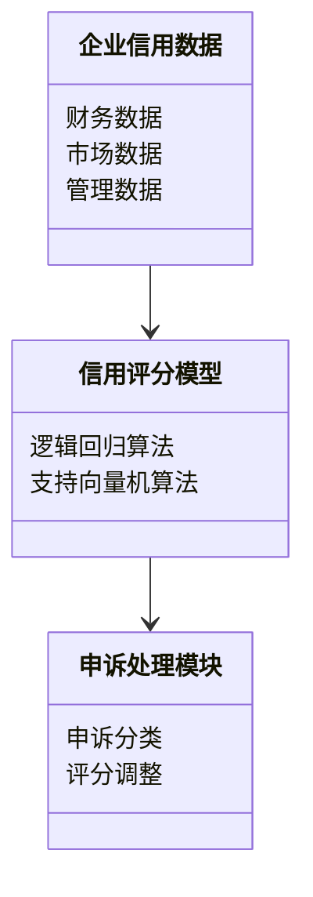
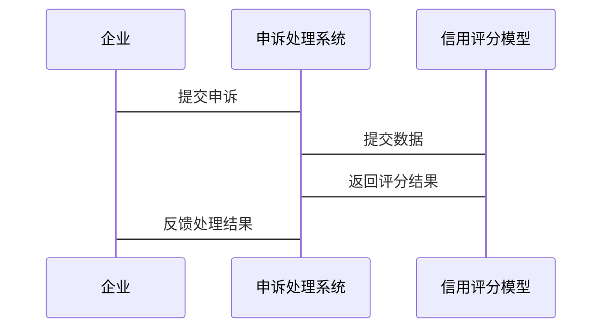

                 


# 设计智能化的企业信用评级申诉处理系统

> 关键词：企业信用评级、申诉处理系统、人工智能、大数据、机器学习、自然语言处理

> 摘要：本文详细探讨了设计智能化的企业信用评级申诉处理系统的核心思路，从问题背景到系统架构，从算法原理到项目实战，全面解析了如何利用人工智能和大数据技术实现高效、智能的信用评级申诉处理。文章结合实际案例，深入分析了系统设计的关键点，并提供了具体的实现方案和代码示例。

---

# 第一部分: 企业信用评级申诉处理系统背景与概述

# 第1章: 企业信用评级申诉处理系统背景

## 1.1 问题背景

### 1.1.1 企业信用评级的重要性
企业信用评级是衡量企业信用状况的重要指标，直接影响企业的融资能力、合作伙伴的选择以及市场信任度。然而，传统信用评级过程中，人工处理申诉的方式效率低下，容易出错，且难以快速响应企业的诉求。

### 1.1.2 信用评级申诉处理的痛点
- **人工处理效率低**：传统申诉处理依赖人工审核，耗时长，难以满足大量企业的需求。
- **规则复杂**：信用评级涉及多个维度，申诉处理需要考虑复杂的规则和权重分配。
- **数据量大**：企业信用数据量大，人工处理难以快速提取关键信息。

### 1.1.3 智能化处理的必要性
随着人工智能和大数据技术的快速发展，利用智能化手段处理信用评级申诉成为必然趋势。智能化系统能够快速处理大量数据，准确识别申诉原因，并提供科学的决策支持。

## 1.2 问题描述

### 1.2.1 传统信用评级申诉处理的流程
传统申诉处理流程包括企业提交申诉、人工审核、评分调整等步骤，流程繁琐且效率低下。

### 1.2.2 人工处理的局限性
- **主观性强**：人工审核容易受到主观因素影响，导致评分不公。
- **效率低**：人工处理需要大量时间，难以满足企业的快速响应需求。

### 1.2.3 数据量大、规则复杂的技术挑战
企业信用评级涉及大量数据，包括财务数据、交易记录、市场表现等。申诉处理需要考虑多个维度的规则和权重，传统人工处理难以快速准确地完成。

## 1.3 问题解决思路

### 1.3.1 智能化处理的核心思想
利用人工智能技术，如机器学习、自然语言处理等，实现信用评级申诉的自动化处理。

### 1.3.2 数据驱动的决策优势
通过大数据分析，提取企业的关键信用指标，为申诉处理提供科学依据。

### 1.3.3 人工智能技术的应用前景
人工智能技术能够快速处理大量数据，准确识别申诉原因，并提供智能化的决策支持。

## 1.4 系统边界与外延

### 1.4.1 系统的功能边界
系统主要负责企业信用评级申诉的自动处理，包括申诉提交、数据采集、评分调整等。

### 1.4.2 与企业其他系统的交互
系统需要与企业内部的信用评分系统、财务系统等进行数据交互，确保数据的准确性和一致性。

### 1.4.3 系统的可扩展性与灵活性
系统设计应具备良好的扩展性，能够根据企业需求快速调整功能模块，支持新的数据源和处理规则。

## 1.5 核心概念与结构

### 1.5.1 核心概念的定义
- **企业信用评级**：根据企业的财务状况、市场表现、管理水平等多维度指标，对企业信用状况进行评分。
- **申诉处理**：企业对信用评级结果有异议时，提交申诉并要求重新评估的过程。

### 1.5.2 概念之间的关系
企业信用评级与申诉处理密切相关，申诉处理是对信用评级结果的补充和修正。

### 1.5.3 系统的核心要素组成
- 数据采集模块：负责采集企业的信用数据。
- 数据处理模块：对数据进行清洗、整合和分析。
- 信用评分模型：基于机器学习算法，对企业信用进行评分。
- 申诉处理模块：根据申诉理由，自动审核并调整信用评分。

---

# 第二部分: 核心概念与联系

# 第2章: 核心概念原理

## 2.1 企业信用评级的关键要素

### 2.1.1 企业信用评级的维度
- **财务状况**：包括资产负债率、利润率等财务指标。
- **市场表现**：包括市场份额、增长率等市场相关指标。
- **管理水平**：包括企业治理结构、管理团队稳定性等。

### 2.1.2 各维度的权重分配
根据企业的行业特点和具体需求，对各维度的权重进行合理分配。

### 2.1.3 评级结果的影响因素
企业信用评级结果受多个因素影响，包括财务数据的准确性、市场环境的变化等。

## 2.2 申诉处理的逻辑流程

### 2.2.1 申诉的触发条件
- 企业对信用评级结果有异议时，可以提交申诉。
- 申诉处理系统收到申诉后，自动启动审核流程。

### 2.2.2 申诉处理的规则
- 根据申诉理由，系统自动提取相关数据进行重新评估。
- 申诉处理结果需要符合相关法规和企业内部的信用评分标准。

### 2.2.3 处理结果的反馈机制
系统在处理完申诉后，将结果反馈给企业，并说明评分调整的原因。

## 2.3 系统的核心算法与模型

### 2.3.1 信用评分模型
使用逻辑回归、支持向量机等机器学习算法，对企业信用数据进行建模和评分。

### 2.3.2 申诉分类算法
利用自然语言处理技术，对申诉内容进行分类，识别申诉的主要原因。

### 2.3.3 自然语言处理技术
通过对申诉文本的分析，提取关键词和情感倾向，辅助评分调整。

---

# 第三部分: 算法原理与数学模型

# 第3章: 信用评分模型的数学基础

## 3.1 线性回归模型

### 3.1.1 线性回归的原理
线性回归是一种简单且常用的回归分析方法，适用于线性关系的预测。

### 3.1.2 模型的数学表达式
$$ y = \beta_0 + \beta_1x_1 + \beta_2x_2 + \dots + \beta_nx_n $$

### 3.1.3 示例
假设我们有一个简单的线性回归模型，用于预测企业的信用评分：
$$ \text{信用评分} = 50 + 10 \times \text{年收入} + 8 \times \text{利润率} $$

## 3.2 逻辑回归模型

### 3.2.1 逻辑回归的原理
逻辑回归用于分类问题，适用于二分类或多分类场景。

### 3.2.2 模型的数学表达式
$$ P(y=1|x) = \frac{1}{1 + e^{-(\beta_0 + \beta_1x_1 + \dots + \beta_nx_n)}} $$

### 3.2.3 示例
假设我们使用逻辑回归模型预测企业的信用等级：
$$ P(\text{信用等级为A}|x) = \frac{1}{1 + e^{-(\beta_0 + \beta_1x_1 + \beta_2x_2)}} $$

## 3.3 支持向量机模型

### 3.3.1 SVM的原理
支持向量机是一种监督学习算法，适用于分类和回归问题。

### 3.3.2 线性可分与非线性可分的处理
对于线性可分数据，SVM通过找到一个超平面将数据分成两类。对于非线性可分数据，使用核函数进行处理。

### 3.3.3 核函数的使用
常用核函数包括线性核、多项式核、径向基函数（RBF）核等。

---

# 第四部分: 系统分析与架构设计

# 第4章: 企业信用评级申诉处理系统分析与设计

## 4.1 问题场景介绍

### 4.1.1 企业信用评级申诉处理的典型场景
企业提交申诉后，系统需要快速处理并反馈结果。

### 4.1.2 系统需要解决的核心问题
- 如何高效处理大量申诉？
- 如何准确识别申诉原因？
- 如何确保评分调整的公正性？

## 4.2 系统功能设计

### 4.2.1 领域模型


### 4.2.2 系统架构设计
```mermaid
rectangle 数据库 {
    企业信用数据
    申诉记录
    评分结果
}
class 数据采集模块 {
    接收企业数据
    提交申诉
}
class 数据处理模块 {
    数据清洗
    数据整合
}
class 信用评分模块 {
    训练模型
    评分预测
}
class 申诉处理模块 {
    分类申诉
    调整评分
}
 数据采集模块 --> 数据处理模块
 数据处理模块 --> 信用评分模块
 信用评分模块 --> 申诉处理模块
 申诉处理模块 --> 数据库
```

## 4.3 系统接口设计

### 4.3.1 数据采集接口
```python
def collect_data(company_id):
    # 从数据库中获取企业的信用数据
    pass
```

### 4.3.2 申诉处理接口
```python
def process_complaint(company_id, complaint_reason):
    # 根据申诉理由，调整信用评分
    pass
```

## 4.4 系统交互流程

### 4.4.1 申诉处理流程


---

# 第五部分: 项目实战

# 第5章: 项目实战与案例分析

## 5.1 环境安装

### 5.1.1 安装Python
```bash
python --version
pip install --upgrade pip
```

### 5.1.2 安装依赖库
```bash
pip install numpy pandas scikit-learn spacy
```

## 5.2 系统核心实现

### 5.2.1 数据采集模块
```python
import pandas as pd

def collect_data(company_id):
    data = pd.read_csv(f'data/company_{company_id}.csv')
    return data
```

### 5.2.2 数据处理模块
```python
import spacy

def preprocess_data(data):
    # 文本数据清洗
    nlp = spacy.load('en_core_web_sm')
    cleaned_data = []
    for text in data['comment']:
        doc = nlp(text)
        cleaned_text = ' '.join([token.text for token in doc if not token.is_stop])
        cleaned_data.append(cleaned_text)
    return cleaned_data
```

### 5.2.3 信用评分模块
```python
from sklearn.linear_model import LogisticRegression

def train_model(X, y):
    model = LogisticRegression()
    model.fit(X, y)
    return model
```

### 5.2.4 申诉处理模块
```python
from sklearn.svm import SVC

def process_complaint(model, data):
    # 假设data是经过处理的申诉数据
    prediction = model.predict(data)
    return prediction
```

## 5.3 项目小结

### 5.3.1 经验总结
- 数据预处理是关键，尤其是文本数据的清洗和特征提取。
- 选择合适的算法和模型，能够显著提高系统的准确率。

### 5.3.2 注意事项
- 确保数据安全，避免敏感信息泄露。
- 定期更新模型，以适应市场环境的变化。

---

# 第六部分: 最佳实践与展望

# 第6章: 最佳实践与未来展望

## 6.1 最佳实践 tips

### 6.1.1 数据质量管理
确保数据的准确性和完整性，避免因数据质量问题影响模型的性能。

### 6.1.2 模型可解释性
在复杂模型中，确保评分结果的可解释性，方便企业理解和信任。

## 6.2 小结

### 6.2.1 系统设计的核心要素
- 数据采集与处理
- 模型训练与优化
- 申诉处理与反馈

## 6.3 注意事项

### 6.3.1 数据隐私保护
确保系统的数据安全，符合相关法律法规。

### 6.3.2 系统稳定性
定期进行系统维护，确保系统的稳定运行。

## 6.4 未来展望

### 6.4.1 技术创新
探索更多的人工智能技术，如深度学习、强化学习等，进一步提升系统的智能化水平。

### 6.4.2 行业应用
将智能化信用评级申诉处理系统推广到更多行业，提升企业的信用管理水平。

---

# 作者信息

作者：AI天才研究院/AI Genius Institute & 禅与计算机程序设计艺术 /Zen And The Art of Computer Programming

