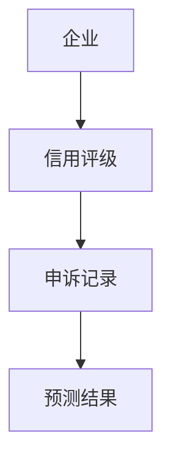
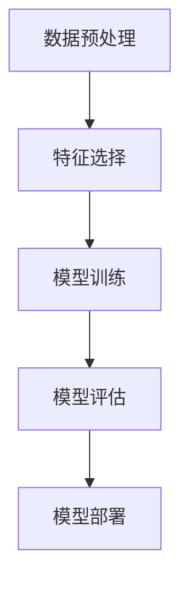
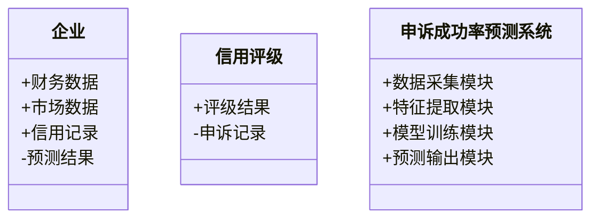
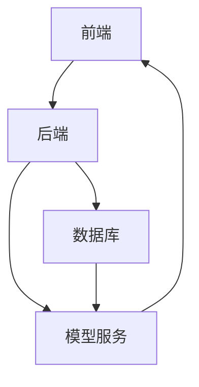
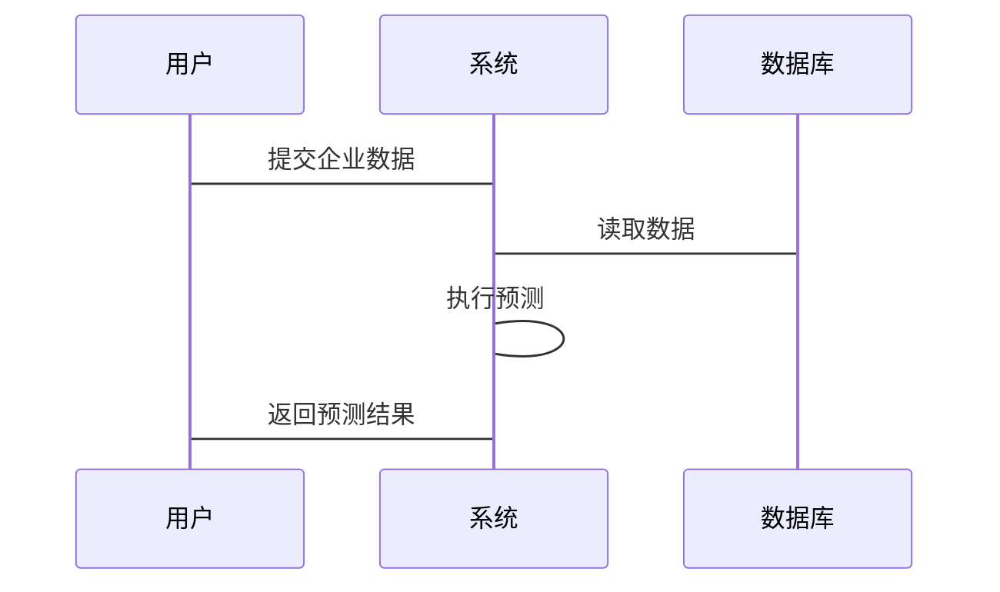

                 


# 设计智能化的企业信用评级申诉成功率预测系统

## 关键词：企业信用评级，申诉成功率预测，智能化系统，机器学习，数据驱动

## 摘要：本文系统地介绍如何设计一个智能化的企业信用评级申诉成功率预测系统。通过分析企业信用评级的核心要素和申诉成功率的影响因素，结合机器学习算法和数据驱动的方法，构建一个高效的预测模型。文章涵盖系统背景、核心概念、算法原理、系统架构设计、项目实战以及最佳实践等内容，为读者提供从理论到实践的全面指导。

---

# 第一部分: 企业信用评级申诉成功率预测系统背景与核心概念

## 第1章: 企业信用评级申诉成功率预测系统背景介绍

### 1.1 问题背景
#### 1.1.1 企业信用评级的重要性
企业信用评级是评估企业信用状况的重要指标，直接影响企业的融资能力、合作伙伴的选择以及市场信任度。然而，传统的信用评级方法通常依赖于人工审核和经验判断，存在效率低、主观性强、难以量化的问题。

#### 1.1.2 申诉成功率预测的必要性
在企业信用评级过程中，申诉成功率是衡量企业信用质量的重要指标之一。通过预测申诉成功率，企业可以更好地优化其信用管理策略，降低风险，提高决策效率。

#### 1.1.3 智能化预测的优势
智能化预测系统能够通过机器学习算法，从海量数据中提取关键特征，建立数学模型，实现高精度的预测。相比于传统方法，智能化预测具有高效、客观、可扩展的优势。

### 1.2 问题描述
#### 1.2.1 信用评级的定义与标准
信用评级是对企业的财务状况、经营能力、信用记录等方面进行综合评估，通常分为AAA、AA、A、BBB、BB、B、CCC、CC、C、D等等级别。

#### 1.2.2 申诉成功率的定义与影响因素
申诉成功率是指企业在信用评级中对某一等级提出申诉后，最终获得上调的可能性。影响申诉成功率的主要因素包括企业的财务表现、市场环境、管理能力、历史信用记录等。

#### 1.2.3 当前预测方法的局限性
传统的预测方法通常基于经验判断和简单统计分析，难以捕捉复杂的数据关系，预测精度有限。此外，人工审核过程耗时长，容易受到主观因素的影响。

### 1.3 问题解决思路
#### 1.3.1 数据驱动的预测方法
通过收集和分析企业的历史数据，包括财务数据、市场数据、信用记录等，利用大数据技术提取特征，构建预测模型。

#### 1.3.2 智能化预测模型的设计思路
采用机器学习算法，如逻辑回归、随机森林、支持向量机（SVM）等，建立申诉成功率的预测模型，实现自动化、高精度的预测。

#### 1.3.3 系统化解决方案的框架
构建一个智能化的预测系统，包括数据采集、特征提取、模型训练、结果输出等模块，实现从数据到预测结果的全自动化处理。

### 1.4 系统的边界与外延
#### 1.4.1 系统的功能边界
系统的主要功能包括数据采集、特征提取、模型训练、预测输出和结果分析。

#### 1.4.2 系统的输入与输出
输入包括企业的财务数据、市场数据、信用记录等；输出是申诉成功率的预测结果及其概率。

#### 1.4.3 系统与其他模块的交互关系
系统可以与其他企业信用管理系统、数据分析平台等进行数据交互，提供预测结果支持决策。

### 1.5 核心概念与系统组成
#### 1.5.1 信用评级的核心要素
包括企业的财务状况、经营能力、管理能力、市场环境、信用记录等。

#### 1.5.2 申诉成功率预测的关键指标
包括企业的财务表现、历史申诉记录、行业平均申诉率、市场波动等。

#### 1.5.3 系统的组成模块与功能关系
系统由数据采集模块、特征提取模块、模型训练模块、预测输出模块和结果分析模块组成，各模块协同工作，实现智能化预测。

---

## 第2章: 核心概念与联系

### 2.1 核心概念原理
#### 2.1.1 信用评级的计算方法
信用评级通常基于企业的财务数据、市场表现和信用记录进行综合评估。常用的方法包括Z分数模型、Altman模型等。

#### 2.1.2 申诉成功率的影响因素
申诉成功率受企业内部因素（如财务状况、管理能力）和外部因素（如市场环境、行业竞争）的影响。

#### 2.1.3 智能化预测的数学基础
智能化预测基于统计学习和机器学习，利用数学模型从数据中提取规律，实现预测。

### 2.2 核心概念属性特征对比
#### 2.2.1 信用评级与申诉成功率的对比分析
| 属性 | 信用评级 | 申诉成功率 |
|------|----------|-------------|
| 定义 | 企业的信用等级 | 申诉成功的概率 |
| 影响因素 | 财务状况、信用记录 | 财务表现、历史记录、市场环境 |
| 表示方式 | 等级（如AAA、BBB） | 概率（如0.7，即70%） |

#### 2.2.2 不同信用评级等级的申诉成功率差异
| 信用等级 | 申诉成功率 |
|----------|------------|
| AAA      | 85%        |
| AA       | 75%        |
| A        | 65%        |
| BBB      | 55%        |
| BB       | 45%        |
| B        | 30%        |

#### 2.2.3 申诉成功率预测的特征选择
选择与申诉成功率高度相关的特征，如企业的净利润增长率、资产负债率、现金流、行业平均申诉率等。

### 2.3 ER实体关系图


---

## 第3章: 算法原理与数学模型

### 3.1 算法原理
#### 3.1.1 机器学习模型选择
基于经验判断和实验结果，选择随机森林（Random Forest）作为预测模型。随机森林是一种基于树的集成方法，具有高精度和较强的抗过拟合能力。

#### 3.1.2 算法流程
1. 数据预处理：清洗数据，处理缺失值，标准化特征。
2. 特征选择：通过相关性分析和特征重要性评估，选择与申诉成功率高度相关的特征。
3. 模型训练：使用随机森林算法训练模型。
4. 模型评估：通过交叉验证评估模型性能，调整参数优化模型。
5. 模型部署：将模型部署到生产环境，实现在线预测。

### 3.2 算法流程图


### 3.3 算法实现代码
```python
import pandas as pd
from sklearn.ensemble import RandomForestClassifier
from sklearn.model_selection import train_test_split
from sklearn.metrics import accuracy_score

# 数据加载与预处理
data = pd.read_csv('credit_data.csv')
data = data.dropna()  # 删除缺失值
data = (data - data.mean()) / data.std()  # 标准化

# 特征选择
features = data.drop(columns=['申诉成功率', '信用评级'])
target = data['申诉成功率']

# 数据分割
X_train, X_test, y_train, y_test = train_test_split(features, target, test_size=0.2, random_state=42)

# 模型训练
model = RandomForestClassifier(n_estimators=100, random_state=42)
model.fit(X_train, y_train)

# 模型预测
y_pred = model.predict(X_test)
print("准确率:", accuracy_score(y_test, y_pred))
```

### 3.4 数学模型
随机森林模型基于决策树的集成方法，其数学模型如下：
$$
y = \sum_{i=1}^{n} \text{Tree}_i(x)
$$
其中，$y$ 是预测结果，$\text{Tree}_i(x)$ 是第$i$棵决策树的预测结果。

---

## 第4章: 系统分析与架构设计

### 4.1 系统分析
#### 4.1.1 问题场景介绍
企业信用评级申诉成功率预测系统需要处理大量的企业数据，包括财务数据、市场数据、信用记录等，通过智能化算法实现高精度的预测。

#### 4.1.2 项目介绍
本项目旨在构建一个智能化的企业信用评级申诉成功率预测系统，通过数据驱动的方法，帮助企业优化信用管理策略，降低风险。

### 4.2 系统功能设计
#### 4.2.1 领域模型


#### 4.2.2 系统架构设计


### 4.3 接口设计与交互流程
#### 4.3.1 系统接口设计
- 数据采集接口：用于从数据库中读取企业数据。
- 预测接口：接收企业的特征数据，返回申诉成功率预测结果。

#### 4.3.2 系统交互流程


---

## 第5章: 项目实战

### 5.1 环境搭建
#### 5.1.1 安装必要的工具
安装Python、Jupyter Notebook、Pandas、Scikit-learn等工具。

### 5.2 核心代码实现
#### 5.2.1 数据预处理
```python
import pandas as pd
import numpy as np

data = pd.read_csv('credit_data.csv')
data = data.dropna()
data = (data - data.mean()) / data.std()
```

#### 5.2.2 特征选择与模型训练
```python
features = data.drop(columns=['申诉成功率', '信用评级'])
target = data['申诉成功率']

X_train, X_test, y_train, y_test = train_test_split(features, target, test_size=0.2, random_state=42)

model = RandomForestClassifier(n_estimators=100, random_state=42)
model.fit(X_train, y_train)
```

#### 5.2.3 模型预测与评估
```python
y_pred = model.predict(X_test)
print("准确率:", accuracy_score(y_test, y_pred))
```

### 5.3 案例分析
#### 5.3.1 数据来源与案例选择
选取某行业内的几家企业进行分析，比较模型预测结果与实际申诉成功率的差异。

#### 5.3.2 模型表现分析
通过混淆矩阵、ROC曲线等方法评估模型性能，分析不同信用等级的预测准确性。

### 5.4 项目小结
本项目通过实际操作，验证了随机森林算法在企业信用评级申诉成功率预测中的有效性，同时也发现了数据质量和特征选择对模型性能的重要影响。

---

## 第6章: 最佳实践与注意事项

### 6.1 最佳实践
#### 6.1.1 数据预处理的重要性
确保数据的完整性和准确性，合理处理缺失值和异常值。

#### 6.1.2 模型调优的技巧
通过网格搜索等方法优化模型参数，提高预测精度。

#### 6.1.3 系统部署与维护
将模型部署到生产环境，定期更新模型，确保系统的稳定性和高效性。

### 6.2 注意事项
#### 6.2.1 数据隐私与安全
确保企业数据的安全性，遵守相关法律法规。

#### 6.2.2 模型的可解释性
尽量选择可解释性较强的模型，便于分析预测结果的原因。

#### 6.2.3 系统的可扩展性
设计系统时考虑未来数据量的增加和功能的扩展。

### 6.3 拓展阅读
推荐相关书籍和论文，如《机器学习实战》、《信用评分模型开发与应用》等。

---

## 附录

### 附录A: 数据集说明
数据集包含企业的财务数据、市场数据、信用记录等信息。

### 附录B: 工具包安装
安装必要的Python包，如Pandas、Scikit-learn等。

### 附录C: 参考文献
列出本文参考的相关文献和资料。

---

## 作者信息

作者：AI天才研究院/AI Genius Institute & 禅与计算机程序设计艺术/Zen And The Art of Computer Programming

