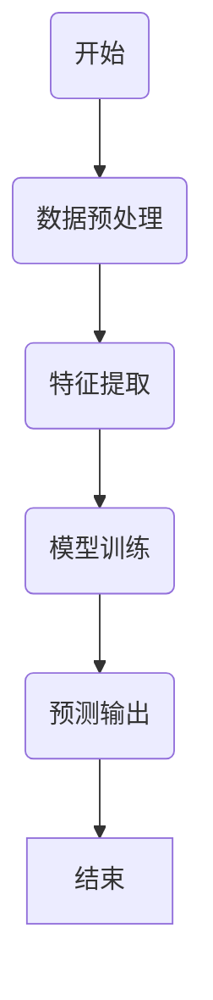
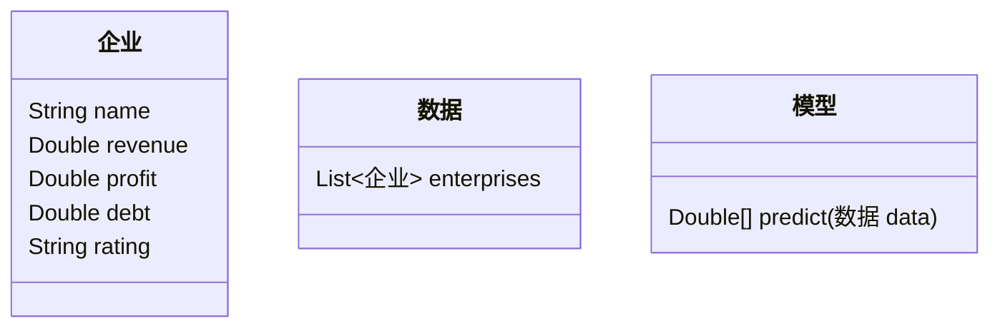
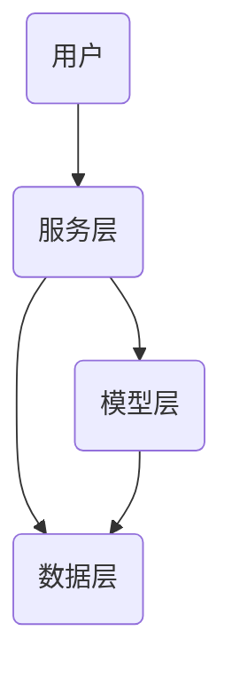
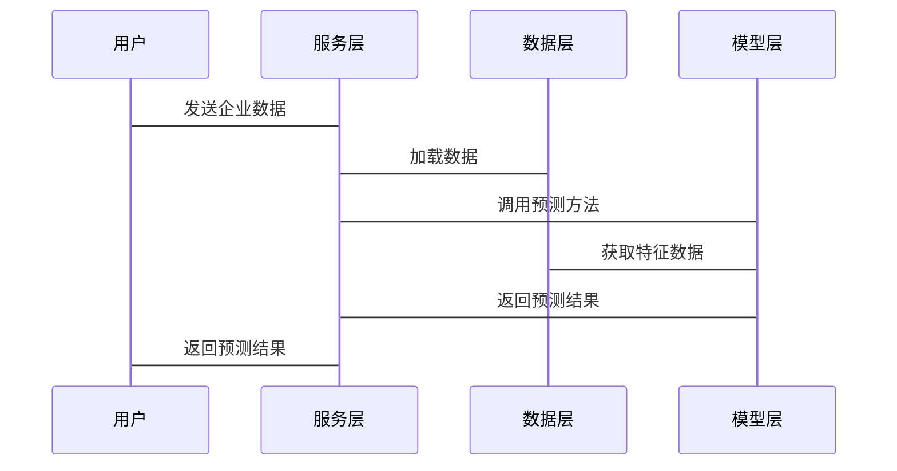

                 


# 设计智能化的企业信用评级迁移矩阵预测模型

**关键词：企业信用评级、迁移矩阵、预测模型、机器学习、时间序列、算法设计、风险控制**

**摘要：**  
本文旨在探讨如何设计智能化的企业信用评级迁移矩阵预测模型。通过对企业信用评级的基本概念、迁移矩阵预测的核心原理以及智能化预测方法的深入分析，结合实际应用场景，提出一种基于机器学习和时间序列分析的解决方案。本文将从背景介绍、核心概念、算法原理、系统架构设计到项目实战，全面阐述该模型的设计思路和实现方法，并通过实际案例分析验证模型的有效性。

---

## 第1章: 企业信用评级与迁移矩阵概述

### 1.1 问题背景
#### 1.1.1 企业信用评级的重要性
企业信用评级是衡量企业信用状况的重要指标，直接关系到企业的融资能力、投资决策以及风险管理。信用评级的准确性对企业和金融机构的健康发展至关重要。

#### 1.1.2 迁移矩阵预测的必要性
企业信用评级的变化是一个动态过程，传统的静态评级方法难以捕捉这种变化。通过设计迁移矩阵预测模型，可以动态跟踪企业信用状况的变化趋势，为金融机构提供更精准的决策支持。

#### 1.1.3 智能化预测的行业需求
随着大数据和人工智能技术的快速发展，智能化预测方法逐渐成为行业趋势。企业信用评级的智能化预测不仅提高了效率，还能降低风险。

### 1.2 问题描述
#### 1.2.1 企业信用评级的基本定义
企业信用评级是根据企业的财务状况、经营能力、偿债能力等多维度指标，对其信用风险进行量化评估的过程。

#### 1.2.2 迁移矩阵预测的核心问题
迁移矩阵预测是指通过历史数据和机器学习算法，预测企业在未来某一时间段内信用评级的变化情况。

#### 1.2.3 当前预测方法的局限性
传统的信用评级方法多基于静态分析，难以捕捉企业的动态变化。同时，人工分析效率低、主观性强，容易受到人为因素的干扰。

### 1.3 问题解决
#### 1.3.1 数据驱动的解决方案
通过收集和分析企业的历史数据，构建数据驱动的预测模型，实现对信用评级变化的智能化预测。

#### 1.3.2 智能化预测的优势
智能化预测方法能够快速处理大量数据，发现数据中的潜在规律，并通过模型不断优化预测结果。

#### 1.3.3 迁移矩阵预测的实现路径
从数据收集、特征提取、模型训练到结果验证，构建完整的预测流程。

### 1.4 边界与外延
#### 1.4.1 企业信用评级的边界条件
信用评级的范围和适用场景需要明确，例如企业的类型、规模和行业差异。

#### 1.4.2 迁移矩阵预测的适用范围
适用于需要动态调整信用评级的场景，例如银行贷款审批、债券评级调整等。

#### 1.4.3 相关概念的外延分析
迁移矩阵预测不仅适用于企业信用评级，还可以扩展到其他领域的信用评估和风险控制。

### 1.5 概念结构与核心要素
#### 1.5.1 核心概念的层次结构
企业信用评级 -> 迁移矩阵预测 -> 智能化预测模型。

#### 1.5.2 核心要素的定义与关系
- 数据输入：企业财务数据、经营数据、市场数据等。
- 预测输出：信用评级的变化趋势。
- 模型输入：特征提取、数据预处理。
- 模型输出：信用评级变化的概率和趋势。

#### 1.5.3 模型的输入输出关系
输入：企业历史数据、实时数据；输出：信用评级变化的预测结果。

---

## 第2章: 核心概念与联系

### 2.1 核心概念原理
#### 2.1.1 企业信用评级的数学模型
企业信用评级可以通过多种数学模型实现，例如线性回归、逻辑回归、随机森林等。

#### 2.1.2 迁移矩阵预测的算法原理
迁移矩阵预测的核心在于通过机器学习算法，捕捉企业信用评级的变化规律。

#### 2.1.3 智能化预测的核心机制
智能化预测通过深度学习算法，如LSTM（长短期记忆网络），捕捉时间序列数据中的长期依赖关系。

### 2.2 概念属性特征对比
#### 表格: 核心概念属性特征对比
| 概念 | 输入 | 输出 | 方法 | 特性 |
|------|------|------|------|------|
| 信用评级 | 企业数据 | 信用等级 | 评分模型 | 数据驱动 |
| 迁移矩阵 | 信用变化 | 预测结果 | 矩阵模型 | 动态调整 |

### 2.3 ER实体关系图


---

## 第3章: 算法原理讲解

### 3.1 算法流程


### 3.2 算法实现
#### 3.2.1 数据预处理
```python
import pandas as pd
data = pd.read_csv('enterprise_data.csv')
data = data.dropna()  # 删除缺失值
data = data[['revenue', 'profit', 'debt', 'rating']]  # 选择相关特征
```

#### 3.2.2 特征提取
```python
from sklearn.preprocessing import MinMaxScaler
scaler = MinMaxScaler()
data_scaled = scaler.fit_transform(data)
```

#### 3.2.3 模型训练
```python
from tensorflow.keras.models import Sequential
from tensorflow.keras.layers import LSTM, Dense

model = Sequential()
model.add(LSTM(64, input_shape=(None, 4)))  # 输入特征维度为4
model.add(Dense(1))  # 输出层
model.compile(loss='mean_squared_error', optimizer='adam')
model.fit(data_scaled[:-100], data_scaled[100:], epochs=100, batch_size=32)
```

#### 3.2.4 预测输出
```python
predicted_ratings = model.predict(data_scaled[-100:])
predicted_ratings = scaler.inverse_transform(predicted_ratings)
```

### 3.3 数学模型
#### LSTM模型
LSTM（长短期记忆网络）是一种特殊的RNN（循环神经网络），适用于时间序列数据的预测。其核心在于通过门控机制捕捉数据中的长期依赖关系。

#### 损失函数
使用均方误差（Mean Squared Error，MSE）作为损失函数：
$$
\text{MSE} = \frac{1}{n}\sum_{i=1}^{n}(y_i - \hat{y}_i)^2
$$

---

## 第4章: 系统分析与架构设计

### 4.1 问题场景介绍
企业信用评级迁移矩阵预测系统的应用场景包括银行贷款审批、债券评级调整、企业信用风险管理等。

### 4.2 系统功能设计
#### 4.2.1 领域模型


#### 4.2.2 系统架构设计


#### 4.2.3 系统接口设计
- API接口：POST /predict，接收企业数据，返回信用评级预测结果。

#### 4.2.4 系统交互


---

## 第5章: 项目实战

### 5.1 环境安装
- 安装Python和相关库：
  ```bash
  pip install numpy pandas tensorflow keras sklearn
  ```

### 5.2 核心代码实现
#### 5.2.1 数据预处理
```python
import pandas as pd
import numpy as np
from sklearn.preprocessing import MinMaxScaler
from tensorflow.keras.models import Sequential
from tensorflow.keras.layers import LSTM, Dense

# 加载数据
data = pd.read_csv('enterprise_data.csv')

# 删除缺失值
data = data.dropna()

# 选择相关特征
data = data[['revenue', 'profit', 'debt', 'rating']]

# 数据归一化
scaler = MinMaxScaler()
data_scaled = scaler.fit_transform(data)
```

#### 5.2.2 模型训练
```python
model = Sequential()
model.add(LSTM(64, input_shape=(None, 4)))  # 输入特征维度为4
model.add(Dense(1))  # 输出层
model.compile(loss='mean_squared_error', optimizer='adam')
model.fit(data_scaled[:-100], data_scaled[100:], epochs=100, batch_size=32)
```

#### 5.2.3 预测与结果分析
```python
predicted_ratings = model.predict(data_scaled[-100:])
predicted_ratings = scaler.inverse_transform(predicted_ratings)

# 可视化结果
import matplotlib.pyplot as plt
plt.plot(predicted_ratings[:, 0], label='预测评级')
plt.plot(data['rating'][-100:], label='实际评级')
plt.legend()
plt.show()
```

### 5.3 案例分析
通过实际案例分析，验证模型的预测准确性。例如，使用真实企业的财务数据进行预测，并与实际评级结果进行对比。

---

## 第6章: 最佳实践与总结

### 6.1 小结
本文详细介绍了企业信用评级迁移矩阵预测模型的设计与实现过程，包括背景介绍、核心概念、算法原理、系统架构设计和项目实战。

### 6.2 注意事项
- 数据质量对模型预测结果影响重大，需确保数据的完整性和准确性。
- 模型的泛化能力需要通过交叉验证进行评估。
- 在实际应用中，需结合业务场景对模型进行调优。

### 6.3 拓展阅读
- 《时间序列分析与应用》
- 《机器学习实战》
- 《深度学习入门：基于Python的理论与实现》

---

**作者：AI天才研究院/AI Genius Institute & 禅与计算机程序设计艺术 /Zen And The Art of Computer Programming**

