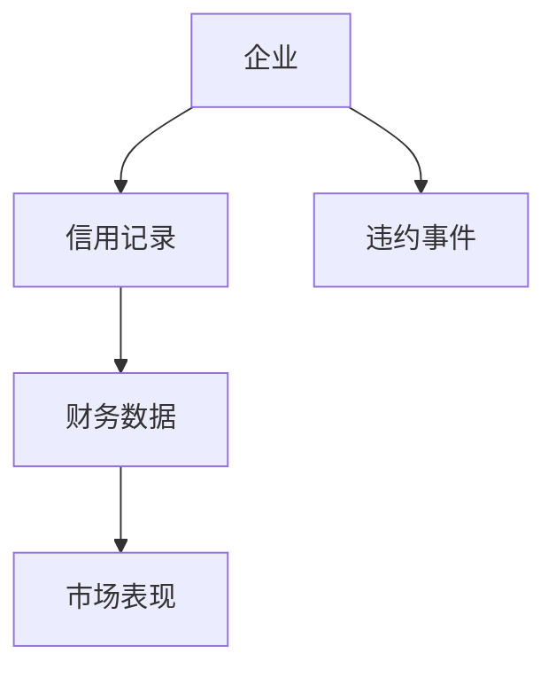
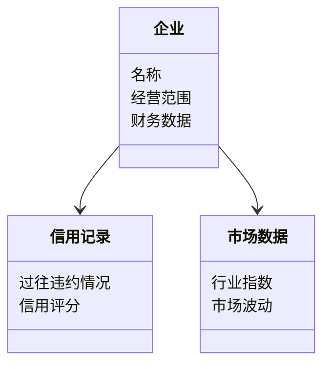
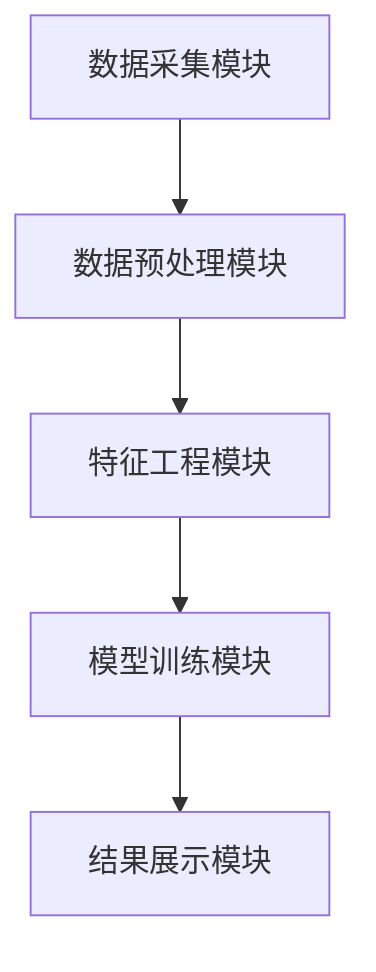
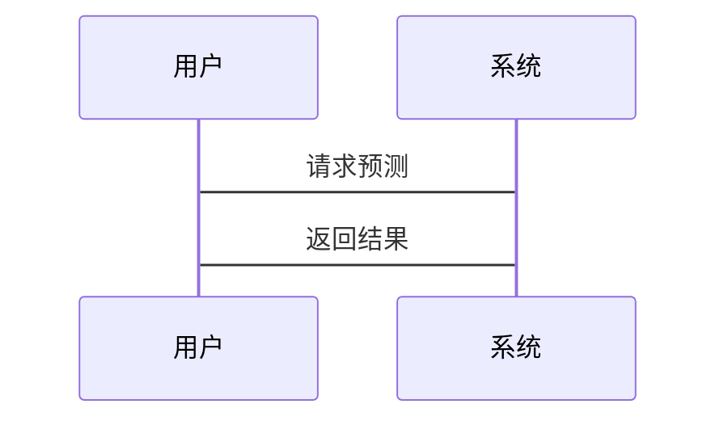

                 


# 设计智能化的企业信用违约预测模型

> 关键词：企业信用违约预测，人工智能，机器学习，风险管理，信用评估，大数据分析

> 摘要：本文详细探讨了设计智能化企业信用违约预测模型的全过程，包括背景分析、核心概念、算法原理、系统架构、项目实战和最佳实践。通过结合逻辑回归和随机森林等算法，利用大数据技术，构建高效、准确的信用违约预测系统，为企业风险管理提供有力支持。

---

## 第1章: 信用违约预测模型的背景与意义

### 1.1 信用违约的基本概念

#### 1.1.1 信用违约的定义与特征
信用违约是指借款方或债务人未能按约定履行债务偿还义务的行为。其主要特征包括：
- **违约概率**：企业在一定时间内的违约可能性。
- **违约损失率**：违约发生时的预期损失比例。
- **信用风险**：企业信用违约带来的潜在损失。

#### 1.1.2 企业信用评估的重要性
企业信用评估是金融风险管理的核心环节，直接影响企业的融资成本和市场信任度。有效的信用评估可以帮助金融机构识别高风险客户，降低损失。

#### 1.1.3 信用违约预测的必要性
随着经济波动加剧，企业信用风险逐渐增加。传统的信用评估方法难以应对复杂多变的市场环境，智能化预测模型成为必要选择。

### 1.2 传统信用评估方法的局限性

#### 1.2.1 传统信用评分模型的局限性
传统评分模型依赖少量的财务指标，忽视了市场、行业等多方面因素，导致预测准确性不足。

#### 1.2.2 传统模型在实际应用中的不足
- 数据维度有限。
- 模型泛化能力弱。
- 难以捕捉复杂非线性关系。

#### 1.2.3 传统模型与现代智能化预测的差距
智能化模型通过大数据和AI技术，能够处理更多维度的数据，捕捉复杂模式，提高预测精度。

### 1.3 智能化信用违约预测的必要性

#### 1.3.1 AI与大数据技术对企业信用评估的推动作用
- 提供多维度数据支持。
- 优化特征选择和模型训练。
- 实现实时监控和动态评估。

#### 1.3.2 智能化模型在信用违约预测中的优势
- 高精度预测。
- 强大的特征提取能力。
- 灵活性和可扩展性。

#### 1.3.3 企业智能化信用评估的未来发展趋势
随着技术进步，信用评估将更加智能化、个性化和动态化，为企业和金融机构提供更精准的支持。

### 1.4 本章小结
本章介绍了信用违约的基本概念，分析了传统评估方法的局限性，强调了智能化预测的重要性，并展望了未来的发展趋势。

---

## 第2章: 信用违约预测的核心概念与联系

### 2.1 信用违约预测的核心要素

#### 2.1.1 违约概率（PD）的定义与计算
违约概率是企业在特定时间内的违约可能性，常用逻辑回归模型进行计算：
$$ P(Y=1|X) = \frac{e^{\beta X}}{1 + e^{\beta X}} $$

#### 2.1.2 违约损失率（LGD）的定义与计算
违约损失率是违约发生时的平均损失比例，通常通过历史数据和回归分析确定。

#### 2.1.3 信用风险的其他关键指标
- **暴露在风险（EAD）**：企业未偿还的贷款金额。
- **信用调整的净额（CVA）**：考虑信用风险的净额调整。

### 2.2 信用违约预测模型的属性特征对比

#### 2.2.1 不同模型的特征对比表格
| 模型类型 | 输入特征 | 输出结果 | 优点 | 缺点 |
|----------|----------|----------|------|------|
| 逻辑回归 | 金融指标 | 概率值 | 简单易解释 | 非线性关系处理差 |
| 随机森林 | 多维数据 | 概率值 | 高精度 | 黑箱模型难解释 |
| 神经网络 | 多维数据 | 概率值 | 高精度 | 训练时间长 |

### 2.3 ER实体关系图架构

#### 2.3.1 实体关系图的 mermaid 流程图


### 2.4 本章小结
本章详细分析了信用违约预测的核心要素，并通过对比表格和ER图展示了模型的属性和数据结构。

---

## 第3章: 信用违约预测的核心算法原理

### 3.1 逻辑回归算法

#### 3.1.1 逻辑回归的定义与原理
逻辑回归是一种用于分类的统计方法，适用于二分类问题。其核心思想是通过logistic函数将线性回归的结果映射到概率空间。

#### 3.1.2 逻辑回归的数学模型
$$ P(Y=1|X) = \frac{e^{\beta X}}{1 + e^{\beta X}} $$

#### 3.1.3 逻辑回归的实现步骤
1. 数据预处理：特征标准化、缺失值处理。
2. 模型训练：使用极大似然估计求解参数。
3. 模型评估：计算AUC-ROC曲线。

#### 3.1.4 逻辑回归的优缺点
- 优点：简单易解释，适合线性关系。
- 缺点：对非线性关系处理能力差。

### 3.2 随机森林算法

#### 3.2.1 随机森林的定义与原理
随机森林是一种基于决策树的集成学习算法，通过随机采样和特征选择提高模型的泛化能力。

#### 3.2.2 随机森林的数学模型
随机森林通过构建多棵决策树，并取平均结果来降低过拟合风险。

#### 3.2.3 随机森林的实现步骤
1. 数据分割：随机采样生成多个训练集。
2. 模型训练：构建决策树。
3. 结果集成：投票或平均得到最终结果。

#### 3.2.4 随机森林的优缺点
- 优点：高精度，抗过拟合。
- 缺点：解释性差，计算资源消耗大。

### 3.3 神经网络算法

#### 3.3.1 神经网络的定义与原理
神经网络是一种模拟人脑结构的深度学习算法，能够处理复杂的非线性关系。

#### 3.3.2 神经网络的数学模型
$$ y = \sigma(w x + b) $$
其中，σ表示激活函数，如ReLU或sigmoid。

#### 3.3.3 神经网络的实现步骤
1. 网络构建：定义层数和节点数。
2. 模型训练：使用梯度下降优化权重。
3. 模型评估：计算准确率、F1分数等指标。

#### 3.3.4 神经网络的优缺点
- 优点：强大的非线性处理能力。
- 缺点：训练时间长，需要大量数据。

### 3.4 各算法的对比分析

#### 3.4.1 算法性能对比
| 模型类型 | 训练时间 | 解释性 | 准确率 |
|----------|----------|--------|--------|
| 逻辑回归 | 短 | 高 | 中 |
| 随机森林 | 中 | 低 | 高 |
| 神经网络 | 长 | 低 | 高 |

#### 3.4.2 算法适用场景
- 逻辑回归：适合线性关系。
- 随机森林：适合多维数据，高精度需求。
- 神经网络：适合复杂非线性关系。

### 3.5 本章小结
本章详细介绍了逻辑回归、随机森林和神经网络三种算法的原理、实现步骤和优缺点，并通过对比分析帮助读者选择合适的模型。

---

## 第4章: 系统架构设计与实现

### 4.1 问题场景介绍

#### 4.1.1 项目背景
某银行希望利用智能化模型预测企业信用违约，降低风险。

#### 4.1.2 项目目标
构建一个高效的信用违约预测系统，支持实时监控和动态评估。

### 4.2 系统功能设计

#### 4.2.1 领域模型设计


#### 4.2.2 系统架构设计


#### 4.2.3 系统接口设计
- 数据接口：提供REST API，接收企业数据。
- 模型接口：提供预测API，返回违约概率。

#### 4.2.4 系统交互设计


### 4.3 本章小结
本章详细设计了系统的架构，包括功能模块、接口设计和交互流程，为后续实现奠定了基础。

---

## 第5章: 项目实战与案例分析

### 5.1 环境搭建

#### 5.1.1 安装Python环境
使用Anaconda安装Python 3.8以上版本。

#### 5.1.2 安装依赖库
```bash
pip install numpy pandas scikit-learn
```

### 5.2 系统核心实现

#### 5.2.1 数据采集与预处理
```python
import pandas as pd
data = pd.read_csv('credit_data.csv')
```

#### 5.2.2 特征工程
```python
from sklearn.preprocessing import StandardScaler
scaler = StandardScaler()
X_scaled = scaler.fit_transform(data.drop('target', axis=1))
```

#### 5.2.3 模型实现
```python
from sklearn.ensemble import RandomForestClassifier
model = RandomForestClassifier()
model.fit(X_scaled, data['target'])
```

#### 5.2.4 模型评估
```python
from sklearn.metrics import accuracy_score
accuracy_score(y_true, model.predict(X_test))
```

### 5.3 案例分析

#### 5.3.1 数据分析
通过可视化工具分析特征与目标变量的关系。

#### 5.3.2 模型优化
调整超参数，如n_estimators和max_depth，提高模型性能。

#### 5.3.3 结果解释
解释模型输出的违约概率，帮助企业进行风险决策。

### 5.4 本章小结
本章通过具体案例展示了系统的实现过程，包括数据处理、模型训练和结果分析。

---

## 第6章: 最佳实践与经验分享

### 6.1 小结

#### 6.1.1 本项目的核心发现
- 随机森林模型在预测中表现最优。
- 特征工程对模型性能影响显著。

### 6.2 注意事项

#### 6.2.1 数据质量的重要性
确保数据的完整性和准确性，避免偏差。

#### 6.2.2 模型选择的策略
根据数据特征和业务需求选择合适的模型。

### 6.3 拓展阅读

#### 6.3.1 推荐的技术资料
- 《机器学习实战》
- 《Python机器学习》

#### 6.3.2 相关开源项目
- scikit-learn
- xgboost

### 6.4 本章小结
本章总结了项目的实践经验，提出了改进建议，并推荐了进一步学习的资源。

---

## 作者：AI天才研究院 & 禅与计算机程序设计艺术

---

感谢您的阅读！如需进一步探讨或获取代码示例，请随时联系！

