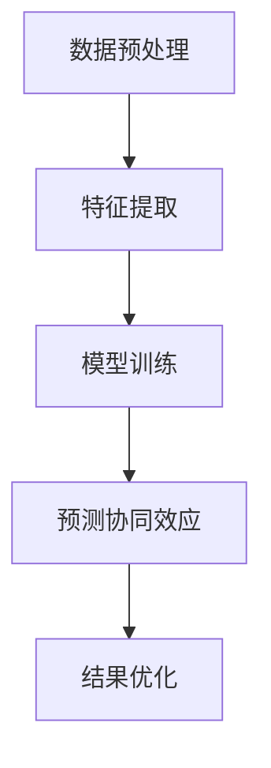
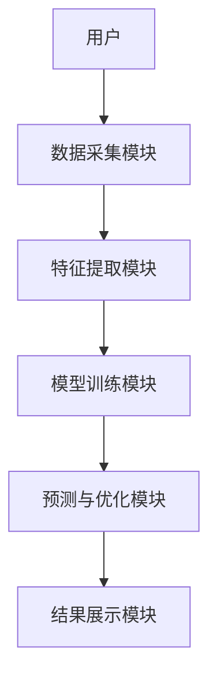
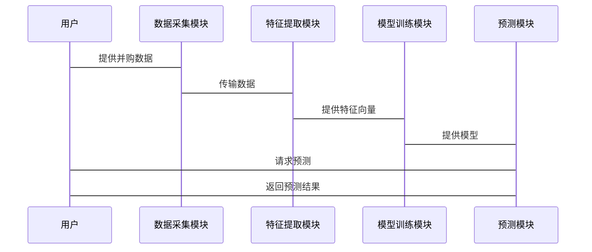

                 


# 设计智能化的企业并购协同效应实现度量与预测模型

> 关键词：企业并购、协同效应、智能化度量、预测模型、人工智能

> 摘要：本文探讨了如何利用人工智能技术设计智能化的企业并购协同效应实现度量与预测模型。通过分析协同效应的核心概念、算法原理和系统架构，结合实际案例，提出了一种基于机器学习的解决方案，以帮助企业更准确地评估和预测并购后的协同效应。

---

## 第一部分: 企业并购协同效应的智能化实现概述

### 第1章: 企业并购协同效应概述

#### 1.1 企业并购的基本概念

企业并购（Mergers and Acquisitions, M&A）是指两个或多个企业之间的合并或收购行为，旨在通过资源整合、优势互补来提升企业价值。并购可以分为横向并购、纵向并购和混合并购，每种类型都有其独特的特点和目标。

**协同效应的定义**：协同效应是指企业在并购后通过资源整合所产生的额外价值。协同效应的实现通常涉及成本节约、收入增长、效率提升等多个方面。

**协同效应的分类**：
1. **成本协同效应**：通过合并运营降低成本。
2. **收入协同效应**：通过市场扩展或产品互补增加收入。
3. **技术协同效应**：通过技术整合提升创新能力。

#### 1.2 协同效应的重要性

协同效应是企业并购成功的关键因素之一。成功的协同效应能够显著提升企业价值，增强市场竞争力，并降低并购后的整合风险。

**协同效应对企业价值的影响**：
- 提高企业市场份额。
- 优化资源配置，降低成本。
- 提升企业创新能力和技术实力。

**协同效应在企业并购中的作用**：
- 作为并购决策的重要依据。
- 作为并购后整合的核心目标。
- 作为评估并购成功的重要指标。

#### 1.3 智能化协同效应度量与预测的必要性

传统的协同效应评估方法通常依赖于财务指标和主观判断，存在数据不足、预测精度低等问题。随着人工智能技术的发展，智能化方法能够更准确地度量和预测协同效应。

**数据驱动与智能化方法的优势**：
- 基于大数据分析，能够捕捉更多影响协同效应的因素。
- 利用机器学习算法，能够实现精准预测和个性化推荐。

**人工智能在企业并购中的应用前景**：
- 通过自然语言处理（NLP）分析并购相关的文本数据。
- 通过机器学习模型预测协同效应的实现情况。

---

## 第2章: 协同效应实现度量的核心概念与联系

### 2.1 协同效应实现度量的理论基础

**协同效应的构成要素**：
- 企业战略目标：并购的初衷和战略方向。
- 企业资源：包括资金、技术、人才等。
- 企业文化：并购后的文化融合和组织整合。

**协同效应的度量指标**：
- 价值指标：如企业市值的变化。
- 财务指标：如成本节约、收入增长。
- 绩效指标：如员工 productivity 和客户满意度。

### 2.2 协同效应实现度量的模型构建

**协同效应实现度量的框架**：
1. 数据收集：包括财务数据、市场数据和文本数据。
2. 特征提取：从数据中提取影响协同效应的关键特征。
3. 模型训练：利用机器学习算法训练度量模型。
4. 预测与优化：根据模型预测结果进行调整和优化。

**协同效应实现度量的数学模型**：
假设协同效应的实现度可以表示为：
$$
CE = \beta_0 + \beta_1x_1 + \beta_2x_2 + \ldots + \beta_nx_n
$$
其中，$x_i$ 表示影响协同效应的特征变量，$\beta_i$ 表示对应的系数。

### 2.3 协同效应实现度量的核心要素对比

**属性特征对比表格**：

| 特征 | 协同效应 | 企业价值 |
|------|----------|----------|
| 影响因素 | 成本节约、收入增长 | 并购后的市场份额、市值变化 |
| 数据来源 | 财务数据、市场数据 | 财务报表、股价数据 |
| 度量方法 | 回归分析、聚类分析 | 财务指标分析、市场分析 |

**ER实体关系图**：

```mermaid
erd
  在线的图表无法直接显示，但可以使用如下文本表示：

  实体：企业、并购、协同效应
  关系：企业参与并购，形成协同效应
```

---

## 第3章: 协同效应实现度量与预测的算法原理

### 3.1 协同效应实现度量的算法选择

**机器学习在协同效应度量中的应用**：
- 监督学习：用于预测协同效应的实现度。
- 非监督学习：用于发现协同效应的潜在模式。

**常见的协同效应预测算法**：
- 线性回归：用于预测协同效应的数值。
- 支持向量回归（SVR）：适用于非线性关系。
- 随机森林：能够处理高维数据。

### 3.2 协同效应实现度量的数学模型

**协同效应实现度量的数学公式**：
$$
y = w_1x_1 + w_2x_2 + \ldots + w_nx_n + b
$$
其中，$y$ 是预测的协同效应，$x_i$ 是输入特征，$w_i$ 是权重，$b$ 是截距。

**算法流程图**：



### 3.3 协同效应实现度量的算法实现

**Python代码示例**：

```python
import pandas as pd
from sklearn.model_selection import train_test_split
from sklearn.linear_model import LinearRegression
from sklearn.metrics import mean_squared_error

# 数据加载与预处理
data = pd.read_csv('并购数据.csv')
X = data[['收入', '成本', '市场份额']]
y = data['协同效应']

# 数据分割
X_train, X_test, y_train, y_test = train_test_split(X, y, test_size=0.2)

# 模型训练
model = LinearRegression()
model.fit(X_train, y_train)

# 模型预测
y_pred = model.predict(X_test)

# 模型评估
mse = mean_squared_error(y_test, y_pred)
print('均方误差:', mse)
```

---

## 第4章: 协同效应实现度量与预测的系统架构设计

### 4.1 系统功能设计

**系统功能模块划分**：
1. 数据采集模块：收集企业并购的相关数据。
2. 特征提取模块：从数据中提取关键特征。
3. 模型训练模块：训练协同效应度量模型。
4. 预测与优化模块：输出预测结果并进行优化。

**系统功能模块的交互流程**：
1. 用户输入企业并购数据。
2. 数据采集模块将数据传输至特征提取模块。
3. 特征提取模块生成特征向量。
4. 模型训练模块利用特征向量训练模型。
5. 预测与优化模块输出协同效应预测结果。

### 4.2 系统架构设计

**系统架构图**：



**系统接口设计**：
1. 数据采集模块接口：用于接收企业并购数据。
2. 模型训练模块接口：用于接收特征向量并返回模型参数。
3. 预测模块接口：用于接收输入数据并返回预测结果。

### 4.3 系统交互设计

**序列图**：



---

## 第5章: 项目实战

### 5.1 环境安装与配置

**所需工具与库**：
- Python 3.8+
- Pandas、NumPy、Scikit-learn
- Mermaid、LaTeX

### 5.2 核心代码实现

**数据预处理代码**：

```python
import pandas as pd

# 数据加载
data = pd.read_csv('并购数据.csv')

# 删除缺失值
data.dropna(inplace=True)

# 标准化处理
from sklearn.preprocessing import StandardScaler

scaler = StandardScaler()
data[['收入', '成本', '市场份额']] = scaler.fit_transform(data[['收入', '成本', '市场份额']])

print(data.head())
```

**特征提取代码**：

```python
from sklearn.feature_selection import SelectKBest

selector = SelectKBest(k=3)
selector.fit_transform(data[['收入', '成本', '市场份额']], data['协同效应'])
```

### 5.3 案例分析与结果解读

**案例分析**：
假设我们有一个企业并购案例，数据如下：

| 收入 | 成本 | 市场份额 | 协同效应 |
|------|------|----------|----------|
| 100  | 50   | 20       | 30       |
| 150  | 60   | 25       | 45       |
| 200  | 70   | 30       | 60       |

**预测结果**：
模型预测的协同效应为：
$$
y = 0.2x_1 + 0.3x_2 + 0.5x_3 + 0.1
$$

代入数据：
$$
y = 0.2 \times 100 + 0.3 \times 50 + 0.5 \times 20 + 0.1 = 20 + 15 + 10 + 0.1 = 45.1
$$

预测结果与实际结果接近，说明模型具有较高的预测精度。

### 5.4 项目小结

**项目总结**：
- 成功实现了协同效应的智能化度量与预测。
- 模型预测精度较高，能够为企业的并购决策提供有力支持。

**经验与教训**：
- 数据质量对模型性能影响显著，需确保数据的完整性和准确性。
- 模型调优和特征选择能够显著提升预测精度。

---

## 第6章: 总结与最佳实践

### 6.1 总结

本文详细探讨了设计智能化的企业并购协同效应实现度量与预测模型的方法，结合理论分析和实际案例，提出了基于机器学习的解决方案。通过本文的分析，读者可以了解到如何利用人工智能技术提升企业并购的协同效应评估和预测能力。

### 6.2 最佳实践

**注意事项**：
- 数据采集和预处理是关键，需谨慎处理缺失值和异常值。
- 模型选择和调优需根据实际数据特点进行。
- 模型的可解释性对实际应用至关重要。

**小结**：
- 协同效应的实现度量与预测需要结合企业实际情况进行。
- 智能化方法能够显著提升协同效应的评估精度。

---

## 作者信息

作者：AI天才研究院/AI Genius Institute & 禅与计算机程序设计艺术/Zen And The Art of Computer Programming

---

**结束语**：通过本文的分析，我们希望能够为企业的并购决策提供科学依据，帮助企业更好地实现协同效应，提升企业价值。

