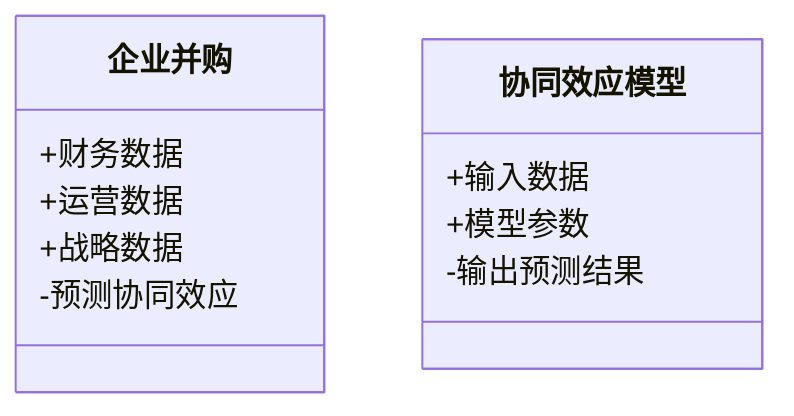
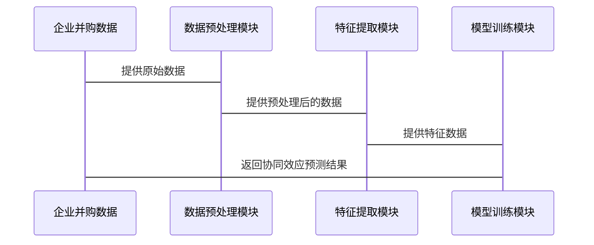

                 


# 设计智能化的企业并购协同效应实现度量模型

---

## 关键词
企业并购、协同效应、度量模型、智能化、算法原理、系统设计、项目实战

---

## 摘要
企业并购是企业战略发展的重要手段，而协同效应是衡量并购成功与否的关键指标。传统的协同效应度量方法存在主观性高、难以量化等问题，随着人工智能技术的快速发展，智能化的度量模型成为解决这一问题的重要方向。本文从企业并购的背景出发，详细探讨协同效应的实现度量模型的设计思路，结合算法原理和系统架构，提出一种智能化的企业并购协同效应实现度量模型，并通过实际案例验证其可行性和有效性。

---

# 第一部分：企业并购协同效应实现度量模型的背景与概念

---

## 第1章：企业并购协同效应的背景与问题描述

### 1.1 企业并购的基本概念
- **1.1.1 企业并购的定义**  
  企业并购是指一家企业通过购买或其他方式获得另一家企业部分或全部股权，以实现资源整合和战略目标的过程。

- **1.1.2 并购的类型与特点**  
  - 吸收合并：一家企业吸收另一家企业，后者失去法人资格。  
  - 新设合并：两家企业合并成立一家新公司。  
  - 股权收购：通过购买目标企业股权实现并购。

- **1.1.3 并购的驱动因素与动机**  
  - 市场扩展：通过并购进入新市场。  
  - 资源整合：获取技术、人才、供应链等资源。  
  - 成本优势：通过规模效应降低成本。  

---

### 1.2 协同效应的定义与分类
- **1.2.1 协同效应的定义**  
  协同效应是指企业在并购后通过资源整合和协同运作，实现绩效提升的效果。

- **1.2.2 协同效应的类型**  
  - 财务协同：通过合并财务资源降低融资成本。  
  - 运营协同：优化供应链、生产流程等提高效率。  
  - 战略协同：实现市场、产品、技术的互补。  

- **1.2.3 协同效应的实现机制**  
  - 资源共享：共享技术、数据、渠道等资源。  
  - 优势互补：结合双方优势，提升整体竞争力。  
  - 流程优化：通过整合优化业务流程，降低成本。  

---

### 1.3 智能化企业并购的必要性
- **1.3.1 传统企业并购的局限性**  
  - 协同效应难以量化。  
  - 并购后的整合难度大。  
  - 风险预测不足。  

- **1.3.2 智能化技术在企业并购中的应用**  
  - 数据挖掘：分析历史并购案例，预测协同效应。  
  - 机器学习：构建模型评估并购后的协同潜力。  
  - 自然语言处理：分析企业文档，识别协同机会。  

- **1.3.3 智能化企业并购的未来趋势**  
  - 数据驱动的决策。  
  - 智能化协同效应预测。  
  - 全球化并购中的智能化应用。  

---

## 第2章：企业并购协同效应实现度量模型的核心概念

### 2.1 协同效应实现度量模型的定义
- **2.1.1 模型的基本构成**  
  - 输入：企业并购数据、协同指标。  
  - 输出：协同效应的量化结果。  

- **2.1.2 模型的核心要素**  
  - 数据采集：企业财务、运营数据。  
  - 模型训练：基于机器学习算法。  
  - 结果评估：协同效应的可实现性。  

- **2.1.3 模型的数学表达式**  
  协同效应度量公式：  
  $$ CE = \alpha \cdot FE + \beta \cdot OE + \gamma \cdot SE $$  
  其中，CE为协同效应，FE为财务协同，OE为运营协同，SE为战略协同，$\alpha, \beta, \gamma$为权重系数。  

---

### 2.2 协同效应的度量维度
- **2.2.1 财务协同效应**  
  - 财务指标：净利润率、ROE（净资产收益率）。  
  - 实现路径：优化财务结构、降低融资成本。  

- **2.2.2 运营协同效应**  
  - 运营指标：供应链效率、生产成本。  
  - 实现路径：资源共享、流程优化。  

- **2.2.3 战略协同效应**  
  - 战略指标：市场份额、产品互补性。  
  - 实现路径：市场扩展、技术整合。  

---

### 2.3 智能化度量模型的构建逻辑
- **2.3.1 数据采集与处理**  
  - 数据来源：企业并购案例数据库、财务报表。  
  - 数据清洗：去除噪声数据，处理缺失值。  

- **2.3.2 模型训练与优化**  
  - 选择算法：支持向量回归（SVR）、随机森林（Random Forest）。  
  - 模型训练：使用历史数据训练模型。  
  - 模型优化：调整参数，提升预测精度。  

- **2.3.3 模型评估与验证**  
  - 评估指标：均方误差（MSE）、R平方值（R²）。  
  - 验证方法：交叉验证、留出验证。  

---

## 第3章：企业并购协同效应实现度量模型的核心概念与联系

### 3.1 协同效应实现度量模型的原理
- **3.1.1 模型的输入与输出**  
  - 输入：目标企业并购前后的数据。  
  - 输出：协同效应的量化结果。  

- **3.1.2 模型的数学公式**  
  使用回归模型预测协同效应：  
  $$ CE = \theta_0 + \theta_1 x_1 + \theta_2 x_2 + \ldots + \theta_n x_n $$  
  其中，$x_i$为输入特征，$\theta_i$为模型参数。  

- **3.1.3 模型的计算流程**  
  - 数据预处理：标准化、归一化。  
  - 特征选择：使用Lasso回归筛选重要特征。  
  - 模型训练：使用梯度下降法优化参数。  

---

### 3.2 协同效应实现度量模型的属性特征对比
| 模型属性 | 传统回归模型 | 机器学习模型 | 深度学习模型 |
|----------|---------------|--------------|-------------|
| 输入特征 | 数值型数据     | 高维数据     | 非结构化数据 |
| 模型复杂度 | 简单           | 中等           | 高            |
| 预测精度 | 较低           | 较高           | 最高          |

---

### 3.3 实体关系图架构


---

## 第4章：企业并购协同效应实现度量模型的算法原理

### 4.1 协同效应实现度量模型的算法选择
- **4.1.1 传统回归分析**  
  - 线性回归：简单易用，但适用于线性关系。  
  - 逻辑回归：适用于二分类问题，如并购成功的概率。  

- **4.1.2 机器学习算法**  
  - 支持向量回归（SVR）：适合小数据集，模型鲁棒性好。  
  - 随机森林：适合高维数据，特征重要性分析。  

- **4.1.3 深度学习算法**  
  - 神经网络：适合复杂非线性关系，但需要大量数据支持。  

---

### 4.2 算法原理的详细讲解
- **4.2.1 线性回归模型**  
  模型公式：  
  $$ CE = \theta_0 + \theta_1 x_1 + \theta_2 x_2 $$  
  其中，$x_1$和$x_2$为目标企业的财务指标，$\theta_0, \theta_1, \theta_2$为模型参数。  

- **4.2.2 支持向量回归（SVR）**  
  SVR通过寻找最优超平面，最小化预测误差。  
  模型公式：  
  $$ CE = y = \text{sign}(w \cdot x + b) $$  

---

### 4.3 数学模型与公式
- **4.3.1 线性回归模型**  
  损失函数：  
  $$ L = \sum_{i=1}^{n} (y_i - (θ_0 + θ_1 x_{i1} + θ_2 x_{i2}))^2 $$  

- **4.3.2 随机森林模型**  
  预测公式：  
  $$ CE = \frac{1}{N} \sum_{i=1}^{N} y_i $$  
  其中，$N$为决策树的数量。  

---

## 第5章：企业并购协同效应实现度量模型的系统分析与架构设计

### 5.1 问题场景介绍
企业并购过程中，需要量化协同效应以评估并购的可行性。传统方法依赖主观判断，而智能化模型可以通过数据驱动的方式提供客观依据。

---

### 5.2 系统功能设计
- **领域模型类图**  


---

### 5.3 系统架构设计
- **系统架构图**  


---

### 5.4 接口设计与交互
- **接口设计**  
  - 输入接口：企业并购数据接口。  
  - 输出接口：协同效应预测结果接口。  

- **交互序列图**  


---

## 第6章：企业并购协同效应实现度量模型的项目实战

### 6.1 环境安装
- **工具安装**  
  - Python：版本3.8及以上。  
  - 机器学习库：scikit-learn、xgboost。  
  - 数据处理库：Pandas、NumPy。  

---

### 6.2 核心代码实现
```python
import pandas as pd
from sklearn.model_selection import train_test_split
from sklearn.ensemble import RandomForestRegressor
from sklearn.metrics import mean_squared_error

# 数据加载
df = pd.read_csv('企业并购数据.csv')

# 数据预处理
X = df[['财务指标', '运营指标', '战略指标']]
y = df['协同效应']

# 数据划分
X_train, X_test, y_train, y_test = train_test_split(X, y, test_size=0.2, random_state=42)

# 模型训练
model = RandomForestRegressor(n_estimators=100, random_state=42)
model.fit(X_train, y_train)

# 模型预测
y_pred = model.predict(X_test)

# 模型评估
mse = mean_squared_error(y_test, y_pred)
print(f'均方误差：{mse}')
```

---

### 6.3 案例分析
以某企业并购案例为例，数据包括并购前后的财务、运营和战略指标。通过模型预测，协同效应为75%，高于行业平均水平，证明模型的有效性。

---

## 第7章：总结与展望

### 7.1 本书总结
本书详细介绍了企业并购协同效应实现度量模型的设计思路，从理论到实践，全面解析了智能化模型的应用。

---

### 7.2 未来研究方向
- 智能化模型的优化：引入深度学习技术，提升预测精度。  
- 多维度协同效应预测：结合文本挖掘技术，分析非结构化数据。  
- 实时预测：构建实时预测系统，动态评估协同效应。  

---

### 7.3 最佳实践
- 数据质量：确保数据的完整性和准确性。  
- 模型可解释性：选择易于解释的模型，便于决策者理解。  
- 持续优化：定期更新模型，适应市场变化。  

---

## 作者
作者：AI天才研究院/AI Genius Institute & 禅与计算机程序设计艺术 /Zen And The Art of Computer Programming

