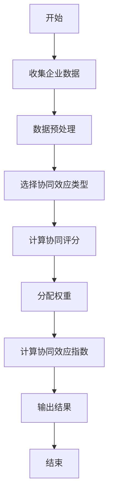

                 


# 设计智能化的企业并购协同效应评估模型

---

## 关键词：企业并购、协同效应、智能化评估、算法设计、系统架构

---

## 摘要：  
企业并购是企业战略发展的重要手段之一，而协同效应是决定并购成功与否的关键因素。本文提出了一种基于智能化的企业并购协同效应评估模型，通过分析协同效应的类型、设计评估算法、构建数学模型，并结合实际案例，展示了如何利用技术手段提升企业并购的决策效率和准确性。本文详细介绍了模型的设计思路、算法实现、系统架构以及实际应用，为企业的并购决策提供了科学依据。

---

## 第1章：企业并购协同效应的背景与概念

### 1.1 企业并购的基本概念  
企业并购（Mergers and Acquisitions, M&A）是指两个或多个企业之间的合并或收购行为。并购可以分为横向并购、纵向并购和混合并购，其目的是通过资源整合、成本优化和市场扩展来实现企业价值的最大化。  

协同效应是企业并购的核心驱动力，它是指并购后的企业在资源整合、运营效率、市场拓展等方面所产生的额外价值。  

### 1.2 协同效应的类型与重要性  
协同效应可以分为以下几种类型：  
1. **财务协同效应**：通过规模经济、成本分担或税收优化实现的财务效益。  
2. **战略协同效应**：通过市场扩展、品牌协同或技术共享实现的战略优势。  
3. **运营协同效应**：通过生产效率提升、供应链优化或管理经验共享实现的运营效益。  
4. **技术协同效应**：通过技术互补或研发资源共享实现的技术优势。  

协同效应的重要性在于它能够显著提升并购后的企业价值，降低并购风险，并为股东创造更大的价值。  

### 1.3 智能化评估的需求与优势  
传统的协同效应评估方法往往依赖于经验判断和人工分析，存在主观性强、效率低、精度低的问题。随着人工智能和大数据技术的发展，智能化评估成为可能。  
智能化评估的优势包括：  
- 高效性：通过算法和模型快速计算协同效应。  
- 客观性：基于数据驱动的分析，减少人为偏差。  
- 精准性：通过复杂模型捕捉潜在的协同机会。  

---

## 第2章：协同效应评估的核心要素与模型框架

### 2.1 协同效应的核心要素分析  
协同效应的评估需要考虑以下几个核心要素：  
1. **企业基本面**：包括企业的财务状况、市场地位、技术水平等。  
2. **整合潜力**：包括资源整合的可行性、文化兼容性等。  
3. **外部环境**：包括市场环境、政策环境、行业趋势等。  

### 2.2 协同效应评估模型的设计框架  
协同效应评估模型的框架包括以下步骤：  
1. **数据收集**：收集并购双方的企业数据，包括财务数据、运营数据、技术数据等。  
2. **数据预处理**：对数据进行清洗、归一化处理，确保数据的可用性。  
3. **模型构建**：基于协同效应的类型，构建数学模型或算法。  
4. **模型计算**：通过算法计算协同效应的大小，并进行权重分配。  
5. **结果分析**：对计算结果进行解读，并提出优化建议。  

### 2.3 协同效应评估模型的对比分析  
通过对比不同类型的协同效应，可以更好地理解模型的设计思路。例如，财务协同效应的计算可以基于成本节约，而战略协同效应的计算可以基于市场扩展潜力。  

---

## 第3章：协同效应评估的算法原理

### 3.1 协同效应评估的基本算法  
协同效应评估的算法主要包括以下几种：  
1. **协同评分算法**：基于企业的各项指标，计算协同评分。  
2. **权重分配算法**：根据协同效应的重要程度，分配不同的权重。  
3. **综合评估算法**：结合协同评分和权重分配，计算最终的协同效应指数。  

### 3.2 协同效应评估的流程图  
以下是协同效应评估的流程图：  



### 3.3 算法实现的Python代码示例  
以下是协同评分算法的Python代码示例：  

```python
def calculate_synergy_score(finance_score, strategy_score, operation_score, technology_score):
    # 计算协同评分
    finance_weight = 0.3
    strategy_weight = 0.3
    operation_weight = 0.2
    technology_weight = 0.2

    synergy_score = (finance_score * finance_weight +
                     strategy_score * strategy_weight +
                     operation_score * operation_weight +
                     technology_score * technology_weight)
    return synergy_score

# 示例数据
finance_score = 0.8
strategy_score = 0.7
operation_score = 0.6
technology_score = 0.5

print("协同效应指数：", calculate_synergy_score(finance_score, strategy_score, operation_score, technology_score))
```

---

## 第4章：协同效应评估的数学模型与公式

### 4.1 协同效应指数公式  
协同效应指数的计算公式如下：  

$$协同效应指数 = \sum_{i=1}^{n} w_i \cdot f_i$$  

其中，$w_i$ 是第 $i$ 个协同效应的权重，$f_i$ 是第 $i$ 个协同效应的评分。  

### 4.2 权重分配公式  
权重分配公式如下：  

$$w_i = \frac{f_i}{\sum_{j=1}^{n} f_j}$$  

---

## 第5章：协同效应评估系统的架构设计

### 5.1 系统功能设计  
协同效应评估系统的功能模块包括：  
1. 数据输入模块：用于输入企业数据。  
2. 数据处理模块：用于数据清洗和归一化处理。  
3. 模型计算模块：用于计算协同效应指数。  
4. 结果展示模块：用于输出评估结果。  

### 5.2 系统架构图  
以下是协同效应评估系统的架构图：  


### 5.3 系统接口设计  
系统接口设计如下：  
- 输入接口：接受企业数据和协同效应类型。  
- 输出接口：返回协同效应指数和权重分配结果。  

---

## 第6章：项目实战与案例分析

### 6.1 项目环境配置  
协同效应评估系统的运行环境包括：  
- 操作系统：Linux/Windows/MacOS  
- 开发工具：Python、Jupyter Notebook  
- 依赖库：NumPy、Pandas、Matplotlib  

### 6.2 核心代码实现  
以下是协同效应评估系统的Python代码实现：  

```python
import numpy as np
import pandas as pd

def calculate_synergy_score(dataframe):
    # 数据预处理
    dataframe = dataframe.dropna()
    dataframe = dataframe.apply(lambda x: x / x.max(), axis=0)
    
    # 计算协同评分
    finance_score = dataframe['finance'].mean()
    strategy_score = dataframe['strategy'].mean()
    operation_score = dataframe['operation'].mean()
    technology_score = dataframe['technology'].mean()
    
    # 分配权重
    finance_weight = 0.3
    strategy_weight = 0.3
    operation_weight = 0.2
    technology_weight = 0.2
    
    synergy_score = (finance_score * finance_weight +
                     strategy_score * strategy_weight +
                     operation_score * operation_weight +
                     technology_score * technology_weight)
    
    return synergy_score

# 示例数据
data = {
    'finance': [0.8, 0.7, 0.6],
    'strategy': [0.7, 0.8, 0.5],
    'operation': [0.6, 0.7, 0.6],
    'technology': [0.5, 0.6, 0.7]
}

dataframe = pd.DataFrame(data)
print("协同效应指数：", calculate_synergy_score(dataframe))
```

### 6.3 案例分析  
以某企业并购案例为例，计算协同效应指数，并分析结果。  

---

## 第7章：总结与展望

### 7.1 总结  
本文提出了一种智能化的企业并购协同效应评估模型，通过算法和数学模型的设计，为企业的并购决策提供了科学依据。  

### 7.2 未来展望  
未来，协同效应评估模型可以通过引入更多数据源（如文本数据、图像数据）和更复杂的算法（如深度学习）进一步优化。  

### 7.3 最佳实践 tips  
- 在数据预处理阶段，建议对数据进行归一化处理，确保模型的准确性。  
- 在权重分配阶段，可以根据行业特点和企业需求进行调整。  
- 在模型计算阶段，建议结合企业实际情况进行验证和优化。  

---

## 作者：AI天才研究院 & 禅与计算机程序设计艺术

