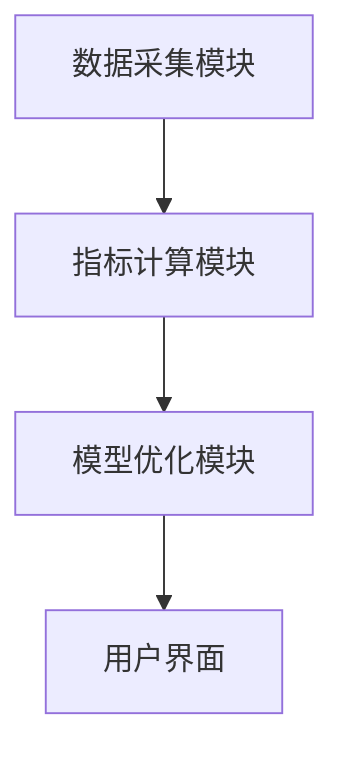
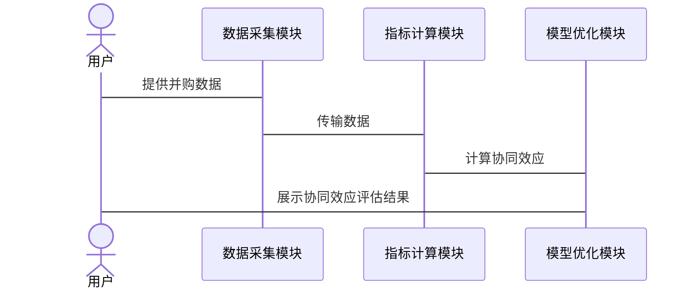

                 


# 设计智能化的企业并购后协同效应量化评估模型

## 关键词：企业并购、协同效应、量化评估、数学模型、系统架构

## 摘要：  
企业并购是企业战略发展的重要手段，而并购后的协同效应是决定并购成功与否的关键因素。本文旨在设计一种智能化的企业并购后协同效应量化评估模型，通过系统化的分析和建模，帮助企业更好地评估和实现并购后的协同效应。文章从协同效应的定义、影响因素、量化方法、系统架构设计等多个维度进行详细探讨，并通过实际案例分析，展示模型的应用和效果。

---

# 第一部分：企业并购与协同效应概述

## 第1章：企业并购的基本概念

### 1.1 企业并购的定义与类型  
企业并购是指一家企业通过购买或合并另一家企业，以实现战略目标的过程。并购的类型包括：  
- **横向并购**：同一行业内的企业并购，旨在扩大市场份额。  
- **纵向并购**：产业链上下游企业并购，以控制供应链。  
- **混合并购**：与主业无直接关联的企业并购，通常用于多元化战略。  

### 1.2 协同效应的定义与特征  
协同效应是指并购后企业通过资源整合实现的成本节约或收益增加。其主要特征包括：  
- **互补性**：并购双方资源互补，产生协同效应。  
- **整合性**：需要通过组织结构调整和资源整合实现。  
- **动态性**：协同效应可能随市场环境和企业战略变化而变化。  

### 1.3 协同效应量化评估的意义  
协同效应的量化评估能够帮助企业在并购决策中：  
1. **优化并购选择**：通过量化评估筛选出具有更高协同潜力的目标企业。  
2. **制定整合策略**：根据评估结果制定资源整合和协同实现的具体方案。  
3. **监控整合效果**：通过量化指标跟踪整合过程中的协同效应实现情况。  

---

## 第2章：企业并购后协同效应的影响因素

### 2.1 企业战略与文化匹配  
- **战略一致性**：并购双方的战略目标是否一致直接影响协同效应的实现。  
- **文化融合**：企业文化差异可能导致协同效应的降低或失败。  

### 2.2 资源整合与共享  
- **资源互补性**：并购双方在技术、市场、管理等方面的资源互补性。  
- **资源共享效率**：资源共享的效率和成本直接影响协同效应的实现。  

### 2.3 组织结构与管理协调  
- **组织架构整合**：并购后的组织架构设计是否合理影响协同效应的实现。  
- **管理协调机制**：高效的管理协调机制是协同效应实现的重要保障。  

### 2.4 市场与竞争环境  
- **市场整合效应**：并购后在市场中的整合效应，如扩大市场份额。  
- **竞争环境变化**：并购可能引起市场竞争格局的变化，影响协同效应。  

---

## 第3章：协同效应量化评估的理论基础

### 3.1 协同效应的度量方法  
- **传统财务指标法**：如净现值（NPV）、内部收益率（IRR）等，用于衡量并购的财务收益。  
- **经济增加值法**：通过经济增加值（EVA）衡量并购后的价值创造能力。  
- **市场价值法**：通过股价变化等市场指标衡量并购的市场反应。  

### 3.2 协同效应的数学模型构建  
#### 3.2.1 协同效应的数学表达式  
$$ 协同效应 = \text{整合后的价值} - \text{整合前的价值} $$  
#### 3.2.2 模型假设与变量定义  
- 假设：并购双方资源互补，协同效应可分解为成本协同和收入协同两部分。  
- 变量：协同效应（C）、成本协同（C_cost）、收入协同（C_revenue）。  

#### 3.2.3 模型的验证与优化  
通过实际案例数据验证模型的准确性，并根据验证结果优化模型参数。  

---

## 第4章：协同效应量化评估的指标体系

### 4.1 协同效应的主要指标  
- **财务指标**：如净利润增长率、成本节约率等。  
- **运营指标**：如生产效率提升、供应链优化等。  
- **顾客指标**：如客户满意度、市场份额提升等。  

### 4.2 指标权重的确定方法  
- **层次分析法（AHP）**：通过构建层次结构确定各指标的权重。  
- **主成分分析法（PCA）**：通过因子分析提取主成分，确定指标权重。  
- **专家评分法**：通过专家评分确定各指标的权重。  

---

## 第5章：协同效应量化评估的系统架构

### 5.1 系统功能设计  
- **数据采集模块**：采集并购双方的财务数据、运营数据等。  
- **指标计算模块**：根据设定的指标体系计算协同效应。  
- **模型优化模块**：通过数据反馈优化协同效应评估模型。  

### 5.2 系统架构设计  


### 5.3 系统交互流程  


---

## 第6章：项目实战

### 6.1 环境安装  
- **工具安装**：安装Python、Pandas、Scikit-learn等工具。  
- **数据准备**：收集并购双方的财务数据和运营数据。  

### 6.2 核心代码实现  
```python
import pandas as pd
from sklearn.decomposition import PCA

# 数据加载
df = pd.read_csv('并购数据.csv')

# 数据预处理
df = df.dropna()

# PCA分析
pca = PCA(n_components=2)
principal_components = pca.fit_transform(df)

# 协同效应计算
# 简单示例：计算成本协同
cost_savings = df['成本前'] - df['成本后']
print("平均成本协同：", cost_savings.mean())
```

### 6.3 案例分析  
以某企业并购案例为例，通过代码计算协同效应，并展示结果。  

### 6.4 项目小结  
总结项目实现的关键步骤和成果，强调模型的实际应用价值。  

---

## 第7章：总结与展望

### 7.1 总结  
本文设计了一种智能化的企业并购后协同效应量化评估模型，通过理论分析、模型构建和系统实现，为企业并购决策提供了有力支持。  

### 7.2 展望  
未来可以进一步优化模型，引入机器学习算法，提升协同效应的预测精度和效率。  

---

## 作者：AI天才研究院/AI Genius Institute & 禅与计算机程序设计艺术 /Zen And The Art of Computer Programming

