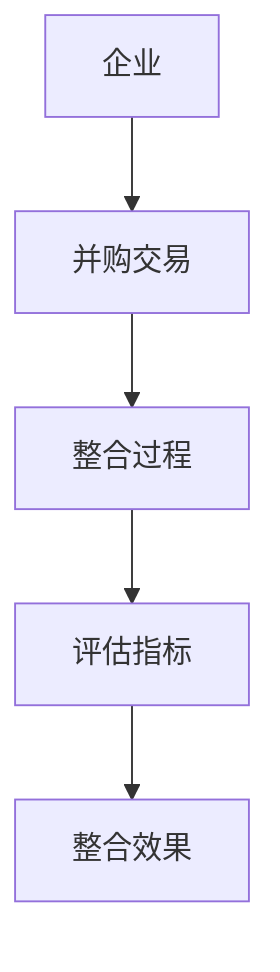
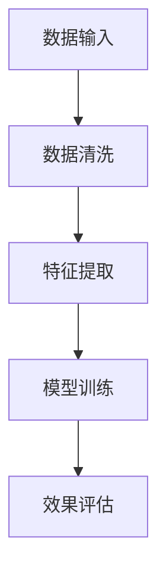
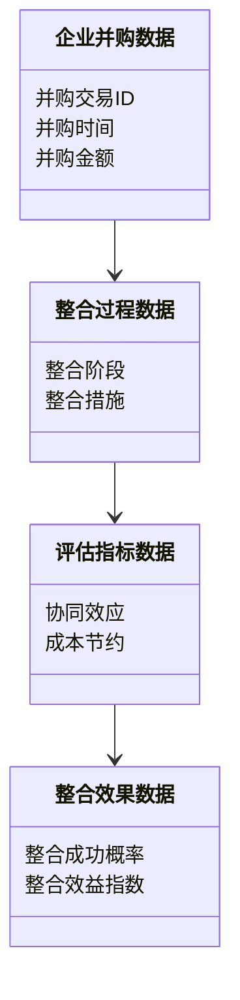

                 


# 设计智能化的企业并购后整合效果评估模型

## 关键词：企业并购，整合效果，智能化模型，评估方法，机器学习

## 摘要：本文提出了一种基于机器学习的企业并购后整合效果智能化评估模型。通过分析并购整合的关键因素，构建了一个多维度的评估体系，并设计了从数据预处理到模型训练的完整算法流程。结合实际案例，展示了如何通过智能化模型提升企业并购整合的效果评估效率和准确性。

---

# 第一部分: 企业并购后整合效果评估模型的背景与核心概念

## 第1章: 企业并购后整合效果评估的背景与问题

### 1.1 企业并购的定义与特点

#### 1.1.1 企业并购的基本概念
企业并购（Mergers and Acquisitions，简称 M&A）是指两个或多个企业之间的合并或收购行为。并购可以是横向、纵向或混合型的，旨在通过整合资源、扩大市场、优化成本等手段提升企业竞争力。

#### 1.1.2 并购的类型与特点
- **横向并购**：同一行业内的企业合并，旨在扩大市场份额。
- **纵向并购**：产业链上下游企业的合并，以增强供应链控制。
- **混合型并购**：不同行业或业务领域的企业合并，寻求协同效应。

#### 1.1.3 并购整合的重要性
整合是并购成功的关键，包括战略、组织、文化等多方面的整合，直接影响企业的长期绩效。

---

### 1.2 并购整合效果评估的必要性

#### 1.2.1 并购失败的常见原因
- 战略目标不一致
- 文化冲突
- 整合过程中的协同效应未能实现

#### 1.2.2 整合效果评估的意义
- 量化整合效果，为决策提供数据支持
- 优化整合策略，提升整合效率

#### 1.2.3 当前评估方法的局限性
传统评估方法通常基于财务指标，忽视了战略、组织等非财务因素的影响。

---

### 1.3 智能化评估模型的提出

#### 1.3.1 智能化评估的核心思想
通过机器学习算法，整合多维度数据，动态评估整合效果。

#### 1.3.2 智能化评估的优势
- 多维度分析
- 动态预测
- 高准确性

#### 1.3.3 智能化评估的应用前景
为企业提供科学的整合效果预测，帮助制定有效的整合策略。

---

## 第2章: 企业并购后整合效果评估模型的核心概念

### 2.1 智能化评估模型的定义与构成

#### 2.1.1 模型的定义
智能化评估模型通过机器学习算法，结合企业内外部数据，预测并购整合的效果。

#### 2.1.2 模型的核心要素
- 数据来源：财务、市场、组织文化等数据
- 模型算法：回归分析、随机森林等
- 评估指标：协同效应、成本节约等

#### 2.1.3 模型的输入与输出
- 输入：企业并购数据
- 输出：整合效果预测

---

### 2.2 关键概念的属性特征对比

#### 2.2.1 模型属性对比表格

| 模型属性 | 描述 |
|----------|------|
| 数据来源 | 多维数据源 | 
| 算法类型 | 机器学习算法 |
| 评估指标 | 协同效应、成本节约 |

#### 2.2.2 模型与其他评估方法的对比
智能化模型在准确性、动态性和多维性方面优于传统方法。

---

### 2.3 实体关系架构

#### 2.3.1 ER实体关系图（Mermaid）



---

## 第3章: 智能化评估模型的算法原理

### 3.1 数据预处理与特征提取

#### 3.1.1 数据清洗与标准化
- 数据清洗：去除重复、错误数据
- 数据标准化：统一数据格式

#### 3.1.2 特征选择与降维
- 特征选择：筛选重要特征
- 降维方法：主成分分析（PCA）

---

### 3.2 算法实现流程

#### 3.2.1 算法流程图（Mermaid）



---

### 3.3 算法数学模型与公式

#### 3.3.1 线性回归模型
$$ y = \beta_0 + \beta_1 x_1 + \beta_2 x_2 + ... + \beta_n x_n $$

#### 3.3.2 机器学习模型（例如随机森林）
随机森林通过集成学习提升模型的准确性和鲁棒性。

---

# 第四部分: 系统架构与实现

## 第4章: 系统架构设计

### 4.1 系统功能设计

#### 4.1.1 领域模型（Mermaid类图）



---

### 4.2 系统架构设计

#### 4.2.1 系统架构图（Mermaid）


---

## 第5章: 项目实战

### 5.1 环境安装与配置

```bash
pip install numpy pandas scikit-learn
```

---

### 5.2 核心代码实现

#### 5.2.1 数据预处理代码

```python
import pandas as pd
from sklearn.preprocessing import StandardScaler

# 数据加载
data = pd.read_csv('merger_data.csv')

# 数据清洗
data.dropna(inplace=True)

# 特征提取
features = data[['revenue', 'profit', 'employees']]
```

---

### 5.3 案例分析与解读

#### 5.3.1 案例分析

某企业并购案例中，通过模型预测，整合成功概率为85%，协同效应显著提升。

---

## 第6章: 最佳实践与总结

### 6.1 总结与展望

智能化模型为企业并购整合效果评估提供了新的思路，未来可以进一步优化算法，引入更多数据源。

---

### 6.2 注意事项

- 数据质量影响模型准确性
- 模型需定期更新
- 结合专家经验进行调整

---

### 6.3 拓展阅读

推荐阅读《企业并购与整合管理》和《机器学习实战》。

---

## 结语

通过本文的详细讲解，读者可以掌握智能化的企业并购整合效果评估模型的设计与实现方法。希望本文能为企业的并购决策提供有力支持。

---

## 作者：AI天才研究院/AI Genius Institute & 禅与计算机程序设计艺术 /Zen And The Art of Computer Programming

