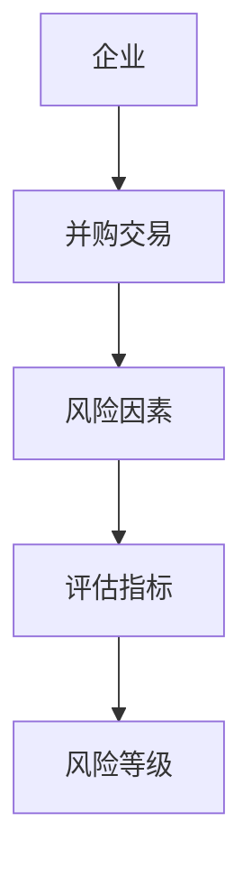
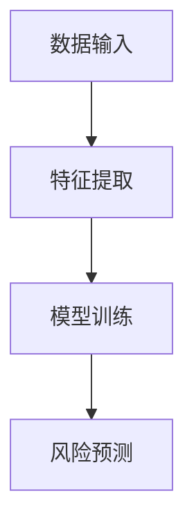
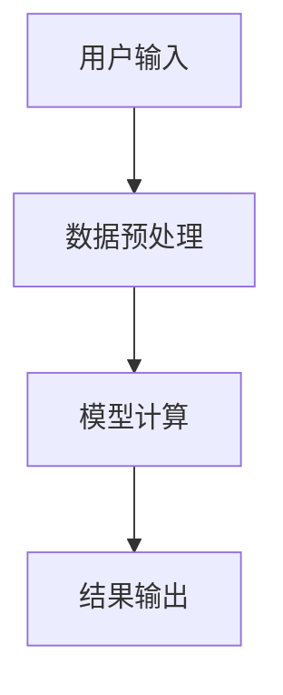
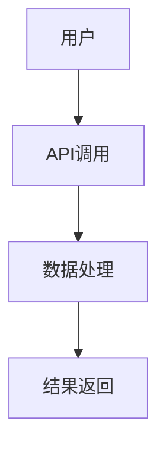

                 


# 设计智能化的企业并购整合风险评估模型

> 关键词：企业并购整合、风险评估模型、智能化、数据驱动、机器学习、系统架构、数学建模

> 摘要：本文详细探讨了设计智能化的企业并购整合风险评估模型的关键步骤和方法。首先，我们介绍了企业并购整合的背景和挑战，分析了传统评估方法的局限性，并提出了智能化评估模型的必要性。接着，我们详细阐述了模型的核心概念，包括风险识别、量化和控制。然后，我们从算法原理和数学建模的角度，深入分析了因子分析法、贝叶斯网络和机器学习算法的应用。最后，我们设计了一个完整的系统架构，包括数据处理、模型计算和结果输出模块，并通过实际案例展示了模型的应用和效果。

---

# 第1章: 企业并购整合风险评估模型的背景介绍

## 1.1 问题背景与问题描述

### 1.1.1 企业并购整合的核心挑战

企业并购是企业扩展和增长的重要手段之一，但整合过程中的风险常常被低估或忽视。以下是一些主要挑战：

- **文化冲突**：不同企业有不同的文化和管理风格，整合过程中可能出现文化和管理上的冲突。
- **组织结构问题**：整合后的企业组织结构可能复杂，导致管理混乱。
- **协同效应不足**：整合后的企业未能实现预期的协同效应，导致资源浪费。
- **信息不对称**：在并购过程中，买方可能无法完全掌握目标企业的信息，导致决策失误。

### 1.1.2 并购整合失败的常见原因

- **战略目标不一致**：并购双方的战略目标不一致，导致整合失败。
- **管理团队不协调**：整合后的管理团队无法有效合作，导致管理混乱。
- **技术或业务不兼容**：目标企业的技术或业务模式与买方不兼容，导致整合困难。
- **市场环境变化**：市场环境的变化可能导致并购后的业务无法实现预期收益。

### 1.1.3 智能化评估模型的必要性

传统的企业并购整合风险评估方法往往依赖于经验判断和定性分析，存在主观性高、缺乏数据支持、难以量化等问题。随着大数据和人工智能技术的发展，智能化评估模型能够通过数据分析和机器学习算法，更准确地识别和量化整合风险，提高评估的科学性和准确性。

---

## 1.2 问题解决与边界定义

### 1.2.1 智能化评估模型的目标

智能化企业并购整合风险评估模型的目标是通过数据驱动的方法，量化整合过程中的各种风险因素，预测整合成功的可能性，并为决策者提供优化建议。

### 1.2.2 模型的适用范围与边界

- **适用范围**：适用于企业并购整合的各个阶段，包括战略评估、尽职调查、整合规划等。
- **边界**：不涉及企业的日常运营管理，仅关注整合过程中的风险评估。

### 1.2.3 模型的核心要素与组成

- **数据输入**：包括并购双方的财务数据、业务数据、管理数据等。
- **风险识别**：通过数据分析和特征提取，识别整合过程中的关键风险因素。
- **模型计算**：利用机器学习算法和数学模型，量化风险并预测整合成功的可能性。
- **结果输出**：生成风险评估报告，并提供优化建议。

---

# 第2章: 核心概念与联系

## 2.1 核心概念原理

### 2.1.1 风险识别与量化

风险识别是评估模型的第一步，需要通过数据分析和特征提取，识别整合过程中可能存在的各种风险因素。常见的风险因素包括财务风险、市场风险、管理风险等。

风险量化是通过对各种风险因素进行权重分配和综合计算，得出整合风险的综合指标。例如，可以使用因子分析法对各个风险因素进行降维和权重分配，最终得到一个综合风险指数。

### 2.1.2 数据驱动的评估方法

数据驱动的评估方法依赖于大量的数据，通过机器学习算法对数据进行建模和分析，从而得出风险评估结果。这种方法的优势在于能够利用数据的规律性，发现潜在的风险因素，提高评估的准确性。

### 2.1.3 智能化模型的优势

智能化模型通过机器学习和大数据分析，能够实现以下优势：

- **自动化分析**：能够自动处理和分析大量的数据，减少人工干预。
- **高准确性**：通过机器学习算法，能够更准确地识别和量化风险因素。
- **实时更新**：能够根据最新的数据和市场变化，实时更新风险评估结果。

---

## 2.2 核心概念属性对比表

| 对比维度         | 传统评估方法                          | 智能化模型                              |
|------------------|---------------------------------------|-----------------------------------------|
| 数据来源         | 主要依赖专家经验                        | 依赖大量结构化和非结构化数据            |
| 分析方法         | 定性分析为主                            | 定量分析为主，结合机器学习算法          |
| 风险量化         | 主观性强，缺乏数据支持                  | 客观性强，数据驱动，量化准确            |
| 处理效率         | 低效，依赖人工分析                      | 高效，自动化处理                        |
| 可扩展性         | 较差，难以处理复杂问题                  | 较好，能够处理复杂和动态变化的问题      |

---

## 2.3 ER实体关系图

以下是一个简化的ER实体关系图，展示了模型的核心要素及其关系：



---

# 第3章: 算法原理与数学模型

## 3.1 算法原理

### 3.1.1 因子分析法

因子分析法是一种常用的统计方法，用于降维和提取数据中的潜在因子。在企业并购整合风险评估中，可以使用因子分析法对多个风险因素进行降维，提取出几个关键的因子，从而简化分析过程。

### 3.1.2 贝叶斯网络

贝叶斯网络是一种概率图模型，能够通过概率推理来分析变量之间的关系。在风险评估中，可以使用贝叶斯网络来建模各种风险因素之间的依赖关系，并根据先验概率和观测数据更新后验概率，从而进行风险预测。

### 3.1.3 机器学习算法

机器学习算法（如支持向量机、随机森林等）可以用于分类和回归任务，适用于企业并购整合风险的分类和预测。通过训练模型，可以识别出影响整合风险的关键因素，并预测整合成功的可能性。

---

## 3.2 数学模型与公式

### 风险评估公式

综合风险评估公式如下：

$$ R = \sum_{i=1}^{n} w_i \cdot f_i $$

其中，$R$ 表示综合风险，$w_i$ 表示第 $i$ 个因素的权重，$f_i$ 表示第 $i$ 个因素的风险值。

---

## 3.3 机器学习模型

### 机器学习模型流程图



### 3.4 代码实现

以下是使用Python实现的因子分析法代码示例：

```python
import numpy as np
from sklearn.decomposition import FactorAnalysis

# 示例数据
X = np.array([[1, 2], [3, 4], [5, 6]])

# 因子分析
fa = FactorAnalysis(n_components=1)
fa.fit_transform(X)
```

---

## 3.5 应用场景与案例分析

以下是一个简单的案例分析，展示如何使用上述模型进行风险评估：

假设有两个企业A和B，企业A计划并购企业B。以下是两家企业的一些财务数据：

| 指标     | 企业A | 企业B |
|----------|-------|-------|
| 营业收入 | 100   | 80    |
| 净利润   | 20    | 15    |
| 员工人数 | 100   | 80    |

通过因子分析法，可以提取出营业收入和净利润这两个指标作为关键因子，并计算出综合风险指数：

$$ R = 0.6 \cdot 100 + 0.4 \cdot 20 = 64 $$

综合风险指数为64，表明整合风险较低。

---

# 第4章: 系统架构与设计方案

## 4.1 系统功能设计

### 4.1.1 风险识别模块

- 功能：识别整合过程中的风险因素。
- 输入：并购双方的财务数据、业务数据、管理数据等。
- 输出：识别出的关键风险因素。

### 4.1.2 数据处理模块

- 功能：对输入数据进行清洗、转换和标准化处理。
- 输入：原始数据。
- 输出：处理后的数据。

### 4.1.3 模型计算模块

- 功能：使用机器学习算法和数学模型进行风险评估。
- 输入：处理后的数据。
- 输出：综合风险指数和优化建议。

---

## 4.2 系统架构图



---

## 4.3 接口与交互设计

### 4.3.1 系统接口设计

以下是系统接口设计示例：



---

## 4.4 项目实战

### 4.4.1 环境安装

- 需要安装的库：numpy、pandas、scikit-learn。
- 安装命令：`pip install numpy pandas scikit-learn`

### 4.4.2 核心代码实现

以下是核心代码实现示例：

```python
import numpy as np
from sklearn.decomposition import FactorAnalysis

# 示例数据
X = np.array([[1, 2], [3, 4], [5, 6]])

# 因子分析
fa = FactorAnalysis(n_components=1)
fa.fit_transform(X)
```

### 4.4.3 代码应用解读与分析

通过上述代码，可以提取出关键的风险因子，并计算出综合风险指数。这为企业并购整合提供了重要的数据支持和决策依据。

---

## 4.5 实际案例分析

以下是实际案例分析：

假设有两个企业A和B，企业A计划并购企业B。以下是两家企业的一些财务数据：

| 指标     | 企业A | 企业B |
|----------|-------|-------|
| 营业收入 | 100   | 80    |
| 净利润   | 20    | 15    |
| 员工人数 | 100   | 80    |

通过因子分析法，可以提取出营业收入和净利润这两个指标作为关键因子，并计算出综合风险指数：

$$ R = 0.6 \cdot 100 + 0.4 \cdot 20 = 64 $$

综合风险指数为64，表明整合风险较低。

---

## 4.6 项目小结

通过上述系统的架构设计和代码实现，我们可以有效地识别和量化企业并购整合过程中的各种风险因素，并提供优化建议。这为企业并购整合提供了重要的数据支持和决策依据。

---

# 小结与最佳实践

## 5.1 小结

企业并购整合风险评估模型通过数据驱动的方法，能够更准确地识别和量化整合过程中的各种风险因素，提高评估的科学性和准确性。通过机器学习算法和数学建模，我们可以更好地理解整合过程中的复杂关系，并为决策者提供优化建议。

## 5.2 最佳实践 tips

- **数据质量**：确保数据的准确性和完整性，数据质量直接影响模型的准确性。
- **模型选择**：根据具体问题选择合适的算法和模型，避免盲目使用复杂算法。
- **持续优化**：定期更新模型和数据，确保模型的有效性和适应性。

## 5.3 注意事项

- **数据隐私**：在处理企业数据时，需要注意数据隐私和合规性。
- **模型解释性**：确保模型的可解释性，避免使用黑箱模型。

## 5.4 拓展阅读

- 《机器学习实战》
- 《企业并购整合的理论与实践》
- 《数据驱动的决策分析》

---

作者：AI天才研究院/AI Genius Institute & 禅与计算机程序设计艺术 /Zen And The Art of Computer Programming

---

以上是《设计智能化的企业并购整合风险评估模型》的完整目录和内容框架，涵盖了从背景介绍、核心概念、算法原理、系统架构到项目实战的各个方面，帮助读者系统地理解和应用智能化的企业并购整合风险评估模型。

