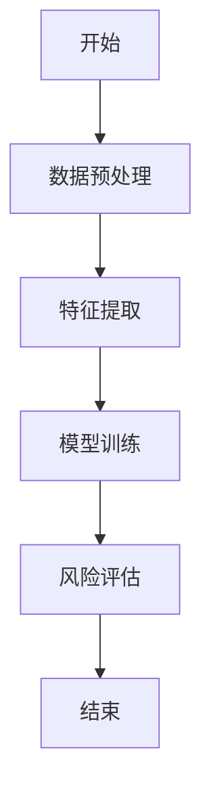
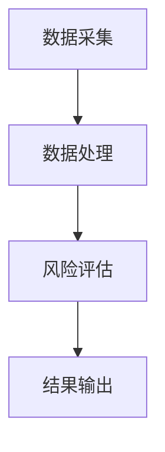

                 


# 设计智能化的企业并购文化整合风险评估模型

---

## 关键词：
企业并购、文化整合、风险评估、智能化模型、人工智能、大数据

---

## 摘要：
随着企业并购活动的频繁进行，文化整合风险成为影响并购成功的关键因素。本文提出了一种基于智能化技术的企业并购文化整合风险评估模型，结合人工智能和大数据分析，构建了多维度的风险评估体系。通过机器学习算法和系统架构设计，模型能够有效识别和量化文化整合风险，为企业并购决策提供科学依据。

---

## 第一部分：背景与核心概念

### 第1章：企业并购与文化整合概述

#### 1.1 企业并购的背景与意义
- 1.1.1 并购的定义与分类
  - 并购（Mergers and Acquisitions，M&A）是指一家企业合并或收购另一家企业的一部分或全部股权。
  - 分为横向并购、纵向并购和混合并购。
- 1.1.2 并购的驱动因素与动机
  - 战略协同效应、市场扩展、成本优势、技术获取等。
- 1.1.3 并购中的文化整合挑战
  - 文化冲突、管理风格差异、员工适应性问题等。

#### 1.2 文化整合的核心要素
- 1.2.1 企业文化的定义与特征
  - 企业文化的内涵包括企业愿景、价值观、行为规范等。
- 1.2.2 文化整合的关键维度
  - 组织结构、管理风格、员工价值观、沟通方式等。
- 1.2.3 文化整合的阶段模型
  - 冷却期、磨合期、融合期。

---

### 附录A：文化整合关键维度对比表

| 维度 | 描述 | 示例 |
|------|------|------|
| 组织结构 | 企业的管理层次和部门设置 | 矩阵式 vs. 项目式 |
| 管理风格 | 领导者的行为方式 | 威权式 vs. 参与式 |
| 员工价值观 | 员工对企业目标的认同度 | 高度认同 vs. 低认同 |
| 沟通方式 | 员工之间的信息传递方式 | 正式 vs. 非正式 |

---

## 第二部分：智能化技术与方法

### 第2章：智能化技术在文化整合中的应用

#### 2.1 AI与大数据在文化整合中的作用
- 2.1.1 人工智能在文化分析中的应用
  - 自然语言处理（NLP）用于分析企业文档中的文化特征。
  - 机器学习用于预测文化整合的成功率。
- 2.1.2 大数据分析在文化整合中的价值
  - 数据挖掘技术用于识别文化整合的关键影响因素。
  - 数据可视化技术用于展示文化整合的风险分布。

---

## 第三部分：模型设计与实现

### 第3章：文化整合风险评估模型的设计

#### 3.1 模型设计的核心要素
- 3.1.1 数据源的选取与处理
  - 数据来源：企业并购案例、员工满意度调查、管理层访谈记录。
  - 数据预处理：清洗、转换、标准化。
- 3.1.2 模型的输入与输出
  - 输入：企业文化特征、管理风格、员工价值观等。
  - 输出：文化整合风险评分（低、中、高）。
- 3.1.3 风险评估的指标体系
  - 文化契合度、管理兼容性、员工适应性。

---

### 附录B：文化整合风险评估指标体系的ER图

```mermaid
erd
  企业并购案例
  员工满意度调查
  管理层访谈记录
  组织结构
  管理风格
  员工价值观
  文化整合风险
```

---

### 第4章：模型的算法实现

#### 4.1 算法选择与实现
- 4.1.1 机器学习算法的选择
  - 支持向量机（SVM）用于分类问题。
  - 随机森林用于特征重要性分析。
- 4.1.2 算法实现的步骤
  1. 数据清洗与特征提取。
  2. 模型训练与参数调优。
  3. 模型评估与验证。

#### 4.2 算法流程图（Mermaid）



---

## 第四部分：系统架构与实现

### 第5章：系统架构设计

#### 5.1 系统功能模块设计
- 5.1.1 数据采集模块
  - 功能：采集企业并购案例数据。
- 5.1.2 数据处理模块
  - 功能：清洗、转换、标准化数据。
- 5.1.3 风险评估模块
  - 功能：基于机器学习模型评估文化整合风险。

#### 5.2 系统架构图（Mermaid）



---

## 第五部分：项目实战与案例分析

### 第6章：项目实战

#### 6.1 环境安装与配置
- 6.1.1 开发环境的选择
  - Python 3.8及以上版本。
- 6.1.2 依赖库的安装
  - 安装 `scikit-learn`, `pandas`, `numpy`, `matplotlib`。

#### 6.2 核心代码实现
- 6.2.1 数据处理代码
  ```python
  import pandas as pd
  import numpy as np

  # 读取数据
  data = pd.read_csv('merger_data.csv')
  # 数据清洗
  data.dropna(inplace=True)
  # 数据标准化
  from sklearn.preprocessing import StandardScaler
  scaler = StandardScaler()
  scaled_data = scaler.fit_transform(data)
  ```

- 6.2.2 模型训练代码
  ```python
  from sklearn.ensemble import RandomForestClassifier
  model = RandomForestClassifier(n_estimators=100)
  model.fit(scaled_data, target)
  ```

- 6.2.3 结果输出代码
  ```python
  # 预测风险评分
  predictions = model.predict(scaled_data)
  # 打印结果
  print("文化整合风险评分：", predictions)
  ```

---

## 第六部分：总结与展望

### 第7章：总结与最佳实践

#### 7.1 模型的总结与优化
- 7.1.1 模型的优势与不足
  - 优势：能够快速识别文化整合风险。
  - 不足：需要大量高质量的数据支持。
- 7.1.2 模型的优化方向
  - 引入时间序列分析，考虑文化整合的动态变化。

#### 7.2 最佳实践与注意事项
- 7.2.1 数据收集的注意事项
  - 确保数据的完整性和准确性。
- 7.2.2 模型应用中的常见问题
  - 数据偏差可能导致模型预测不准确。
- 7.2.3 未来研究方向
  - 结合区块链技术，提高数据的安全性和可信度。

---

## 附录：数学模型与公式

### 附录A：文化整合风险评估的数学模型

$$ R = \sum_{i=1}^{n} \lambda_i \cdot f_i $$
其中，$R$ 表示风险评估结果，$\lambda_i$ 表示各因素的权重，$f_i$ 表示各因素的评估值。

---

### 附录B：算法流程图（Mermaid）


---

## 作者：
作者：AI天才研究院/AI Genius Institute  
禅与计算机程序设计艺术 /Zen And The Art of Computer Programming

