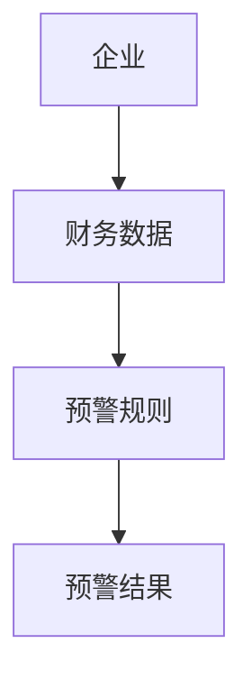
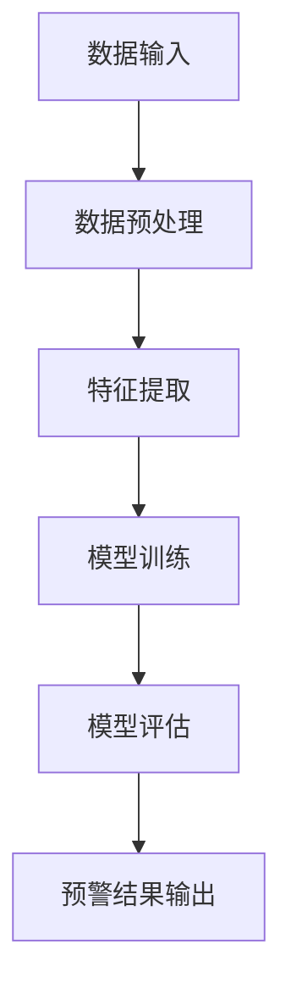

                 


# 设计智能化的企业财务压力预警系统

> 关键词：企业财务压力预警系统，智能化，大数据分析，机器学习，财务健康评估，实时监控

> 摘要：本文详细探讨了设计智能化企业财务压力预警系统的背景、核心概念、算法原理、系统架构以及实际项目实现。通过结合大数据分析和机器学习技术，提出了一种基于财务指标的智能化预警模型，并通过实际案例展示了系统的应用场景和效果。

---

## 第一部分: 企业财务压力预警系统背景与核心概念

### 第1章: 问题背景与系统目标

#### 1.1 问题背景
企业的财务健康状况是衡量企业生存与发展的重要指标。然而，传统的财务分析方法通常依赖于定期的财务报表，存在滞后性，无法及时捕捉到潜在的财务风险。在经济波动加剧的背景下，企业需要一种能够实时监控财务状况、提前预警潜在风险的智能化系统。

#### 1.2 系统目标
- 实时监测企业的财务状况。
- 基于多维度数据，构建智能化预警模型。
- 提供可操作的预警结果，辅助企业进行财务决策。

#### 1.3 系统边界与外延
- 数据来源：财务报表、业务数据、市场数据等。
- 使用场景：企业内部财务部门、管理层、外部投资者等。
- 对接系统：ERP系统、财务管理系统等。

### 第2章: 核心概念与联系

#### 2.1 核心概念
- **财务压力**：指企业在财务方面面临的短期或长期压力，可能表现为流动性不足、盈利能力下降等。
- **智能化预警**：通过机器学习算法，实时分析企业财务数据，识别潜在风险。

#### 2.2 实体关系图（ER图）


## 第二部分: 算法原理

### 第3章: 数据预处理与特征提取

#### 3.1 数据清洗
- 处理缺失值、异常值。
- 数据标准化与归一化。

#### 3.2 特征选择
- 基于财务指标（如流动比率、速动比率、净利率等）构建特征集。

### 第4章: 模型训练与评估

#### 4.1 算法选择
- 使用逻辑回归或支持向量机（SVM）进行分类。

#### 4.2 模型流程


#### 4.3 代码实现
```python
from sklearn.linear_model import LogisticRegression
from sklearn.model_selection import train_test_split
import pandas as pd

# 数据加载与预处理
df = pd.read_csv('financial_data.csv')
df = df.dropna()  # 删除缺失值
df = df[['流动比率', '速动比率', '净利率']]  # 特征选择

# 划分训练集与测试集
X = df.drop('预警结果', axis=1)
y = df['预警结果']
X_train, X_test, y_train, y_test = train_test_split(X, y, test_size=0.2)

# 模型训练
model = LogisticRegression()
model.fit(X_train, y_train)

# 模型评估
print("训练集准确率:", model.score(X_train, y_train))
print("测试集准确率:", model.score(X_test, y_test))
```

## 第三部分: 数学模型

### 第5章: 预警模型构建

#### 5.1 多元线性回归模型
$$ y = \beta_0 + \beta_1x_1 + \beta_2x_2 + \dots + \beta_nx_n + \epsilon $$

其中：
- $y$ 是预警结果（0表示正常，1表示财务压力）。
- $x_i$ 是各个财务指标。
- $\beta_i$ 是回归系数。
- $\epsilon$ 是误差项。

#### 5.2 模型优化
- 使用Lasso回归或 Ridge回归进行正则化。

## 第四部分: 系统分析与架构设计

### 第6章: 问题场景与系统功能

#### 6.1 问题场景
- 实时监控企业的财务数据。
- 多维度分析财务状况。

#### 6.2 功能模块
- 数据采集模块：实时获取财务数据。
- 数据处理模块：清洗与特征提取。
- 模型计算模块：预警结果输出。

### 第7章: 系统架构设计

#### 7.1 系统架构图


## 第五部分: 项目实战

### 第8章: 环境安装与代码实现

#### 8.1 环境安装
- 安装Python、Pandas、Scikit-learn等库。

#### 8.2 核心代码实现
```python
from sklearn.ensemble import RandomForestClassifier
import pandas as pd

# 数据加载
df = pd.read_csv('financial_data.csv')

# 特征工程
features = df[['流动资产', '速动资产', '负债总额', '净利润率']]
target = df['财务压力预警']

# 划分数据集
X_train, X_test, y_train, y_test = train_test_split(features, target, test_size=0.2)

# 模型训练
model = RandomForestClassifier()
model.fit(X_train, y_train)

# 预测与评估
y_pred = model.predict(X_test)
print("准确率:", accuracy_score(y_test, y_pred))
print("召回率:", recall_score(y_test, y_pred))
```

## 第六部分: 总结与展望

### 第9章: 总结

#### 9.1 系统设计总结
- 基于机器学习的财务压力预警系统能够有效实时监控企业财务状况。
- 通过多维度数据分析，提高了预警的准确性和及时性。

### 第10章: 展望与改进建议

#### 10.1 改进建议
- 引入时间序列分析，提高模型的时序预测能力。
- 结合自然语言处理技术，分析财务报告中的文本信息。

---

## 作者信息

作者：AI天才研究院/AI Genius Institute & 禅与计算机程序设计艺术 /Zen And The Art of Computer Programming

