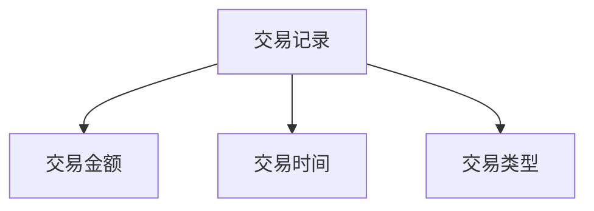
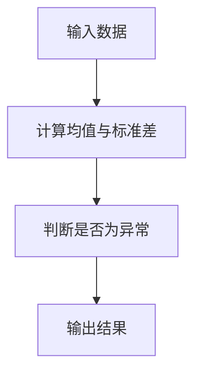
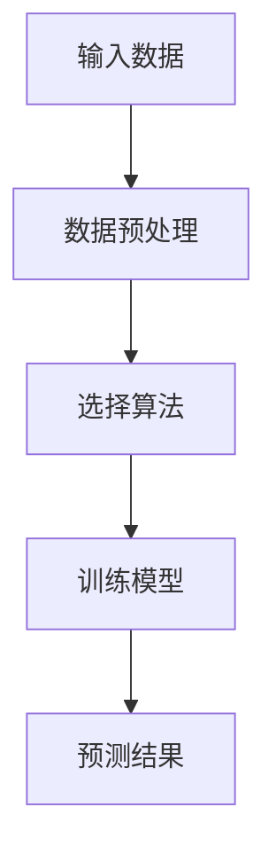
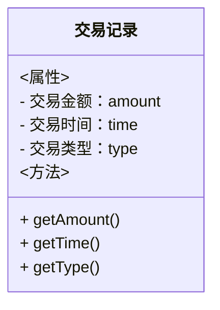

                 


# 设计智能化的企业财务异常交易检测系统

> 关键词：财务异常交易，智能化检测，机器学习，深度学习，异常检测算法

> 摘要：本文详细探讨了设计智能化的企业财务异常交易检测系统的核心概念、算法原理、系统架构以及实际应用。通过结合统计学方法、机器学习和深度学习，提出了一种高效准确的异常交易检测方案，旨在帮助企业及时发现和预防财务风险。

---

# 第一章：企业财务异常交易检测系统背景介绍

## 1.1 问题背景与重要性

### 1.1.1 财务异常交易的定义与特征

财务异常交易是指在企业的财务活动中，某些交易行为偏离正常模式或行业标准，可能涉及欺诈、舞弊或其他不正当行为。其主要特征包括：

- **金额异常**：交易金额显著偏离历史数据或行业标准。
- **时间异常**：交易时间集中在特定时间段，或在非工作时间发生。
- **关联性异常**：交易涉及的主体之间存在特殊关联，如关联交易。
- **频率异常**：交易频率突然增加或减少，与业务规模不符。

### 1.1.2 异常交易对企业的影响

异常交易可能导致企业面临严重的财务损失和声誉损害。例如，欺诈性交易可能直接导致资金流失，而隐藏的关联交易可能影响企业决策的透明性和公正性。此外，异常交易还可能引发法律风险和监管处罚。

### 1.1.3 智能化检测的必要性

传统的财务审计方法依赖于人工检查，效率低且覆盖面有限。随着企业规模的扩大和交易复杂性的增加，智能化检测成为必要选择。通过引入人工智能技术，可以实时监控大量数据，快速识别异常行为，从而提高检测效率和准确性。

## 1.2 问题描述与目标

### 1.2.1 财务异常交易的主要类型

- **虚构交易**：通过虚构交易记录虚增收入或资产。
- **关联交易**：利用关联方进行利益输送，掩盖真实财务状况。
- **金额造假**：通过调整交易金额虚增或虚减收入。
- **时间造假**：通过调整交易时间掩盖财务问题。

### 1.2.2 系统设计的核心目标

- 实时监控：对企业的财务交易进行实时监控，及时发现异常。
- 高精度检测：利用先进算法，准确识别异常交易。
- 可扩展性：系统能够适应不同规模和类型的企业。
- 可解释性：检测结果能够被财务人员理解和分析。

### 1.2.3 系统边界与外延

- 数据范围：包括企业的交易流水、财务报表、关联交易记录等。
- 时间范围：覆盖企业的历史交易数据和实时交易数据。
- 用户范围：面向企业的财务部门、审计部门和高层管理者。

## 1.3 系统设计的核心要素

### 1.3.1 数据来源与处理

数据来源包括企业的ERP系统、财务软件、银行交易流水等。数据处理步骤包括数据清洗、特征提取和数据标注。

### 1.3.2 算法模型选择

选择适合的算法模型，如基于统计的异常检测、基于机器学习的分类模型和基于深度学习的序列建模。

### 1.3.3 系统架构设计

系统架构包括数据采集模块、数据处理模块、算法模块、结果展示模块和用户界面模块。

---

# 第二章：核心概念与原理

## 2.1 异常交易检测的核心概念

### 2.1.1 数据特征分析

通过分析交易金额、时间、频率等特征，识别异常交易的潜在模式。

### 2.1.2 算法模型原理

介绍异常检测算法的基本原理，包括统计方法和机器学习方法。

### 2.1.3 系统架构特点

系统采用模块化设计，各模块协同工作，确保高效性和可扩展性。

## 2.2 核心概念属性对比

### 2.2.1 数据特征对比表

| 数据特征 | 正常交易 | 异常交易 |
|----------|----------|----------|
| 金额     | 符合预期 | 明显偏离 |
| 时间     | 均匀分布 | 集中异常 |
| 频率     | 符合业务 | 突然变化 |

### 2.2.2 算法模型对比表

| 算法类型 | 统计方法 | 机器学习 | 深度学习 |
|----------|----------|----------|----------|
| 优点     | 简单高效 | 高精度   | 自适应性 |
| 缺点     | 易受分布影响 | 需大量数据 | 计算复杂 |

## 2.3 ER实体关系图



---

# 第三章：异常检测算法原理

## 3.1 统计学方法

### 3.1.1 基于均值与标准差的异常检测

通过计算数据的均值和标准差，判断数据点是否偏离均值超过一定倍数。

$$ z = \frac{x - \mu}{\sigma} $$

其中，$x$ 是数据点，$\mu$ 是均值，$\sigma$ 是标准差。若 $z > 3$ 或 $z < -3$，则判定为异常。

### 3.1.2 基于百分位数的异常检测

使用百分位数确定数据的范围，超出范围的点视为异常。

$$ P_{n} = \text{np.percentile}(data, n) $$

### 3.1.3 算法流程图



## 3.2 机器学习方法

### 3.2.1 基于聚类的异常检测

使用聚类算法将数据分成簇，孤立点即为异常。

### 3.2.2 基于分类的异常检测

将数据分为正常和异常两类，使用分类算法进行预测。

### 3.2.3 算法流程图



---

# 第四章：数学模型与公式推导

## 4.1 统计模型

### 4.1.1 均值-方差模型

$$ \mu = \frac{1}{n}\sum_{i=1}^{n}x_i $$
$$ \sigma^2 = \frac{1}{n-1}\sum_{i=1}^{n}(x_i - \mu)^2 $$

## 4.2 机器学习模型

### 4.2.1 支持向量机（SVM）

$$ \text{max} \quad \frac{1}{2} \|w\|^2 $$
$$ \text{subject to} \quad y_i(w \cdot x_i + b) \geq 1 $$

### 4.2.2 随机森林

通过集成多个决策树进行投票或平均，提高准确性和鲁棒性。

---

# 第五章：系统分析与架构设计

## 5.1 系统功能设计

### 5.1.1 领域模型



### 5.1.2 系统架构


## 5.2 接口设计

### 5.2.1 数据接口

- 数据输入接口：从ERP系统获取交易数据。
- 数据输出接口：将检测结果输出到财务系统。

### 5.2.2 用户接口

- 管理界面：供财务人员查看和分析检测结果。
- 报警界面：实时显示异常交易报警信息。

---

# 第六章：项目实战与实现

## 6.1 环境安装

### 6.1.1 安装Python环境

使用Anaconda安装Python 3.8以上版本，并安装必要的库如numpy、pandas、scikit-learn。

## 6.2 核心代码实现

### 6.2.1 数据预处理

```python
import pandas as pd
import numpy as np

# 加载数据
data = pd.read_csv('transactions.csv')

# 数据清洗
data.dropna(inplace=True)
data['amount'] = data['amount'].astype(float)
```

### 6.2.2 异常检测算法实现

```python
from sklearn.ensemble import IsolationForest

model = IsolationForest(n_estimators=100, random_state=42)
model.fit(data[['amount', 'time']])
```

### 6.2.3 结果展示

```python
import matplotlib.pyplot as plt

outliers = model.predict(data[['amount', 'time']])
plt.scatter(data['time'], data['amount'], c=outliers, cmap='viridis')
plt.show()
```

## 6.3 案例分析

### 6.3.1 案例背景

分析某企业的交易数据，发现隐藏的关联交易。

### 6.3.2 数据分析与结果解读

通过算法检测，识别出异常交易并进行详细分析，找出隐藏的关联交易。

---

# 第七章：总结与展望

## 7.1 总结

本文详细探讨了设计智能化的企业财务异常交易检测系统的核心概念、算法原理和系统架构，并通过实际案例展示了系统的实现过程。

## 7.2 展望

未来，随着人工智能技术的不断发展，异常交易检测系统将更加智能化和高效化。可能的发展方向包括引入更先进的深度学习模型、结合自然语言处理技术进行文本分析，以及实现多维度的实时监控。

---

作者：AI天才研究院/AI Genius Institute & 禅与计算机程序设计艺术 /Zen And The Art of Computer Programming

