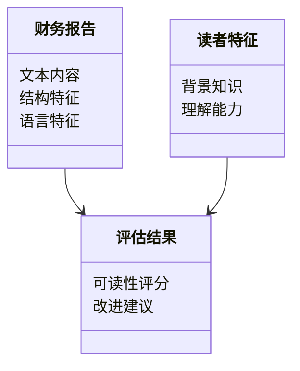
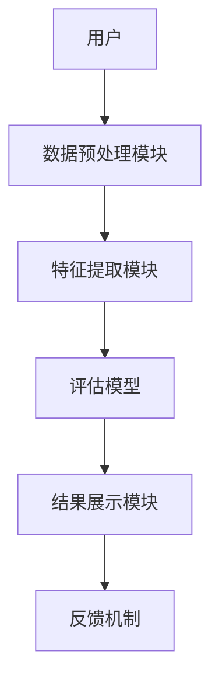
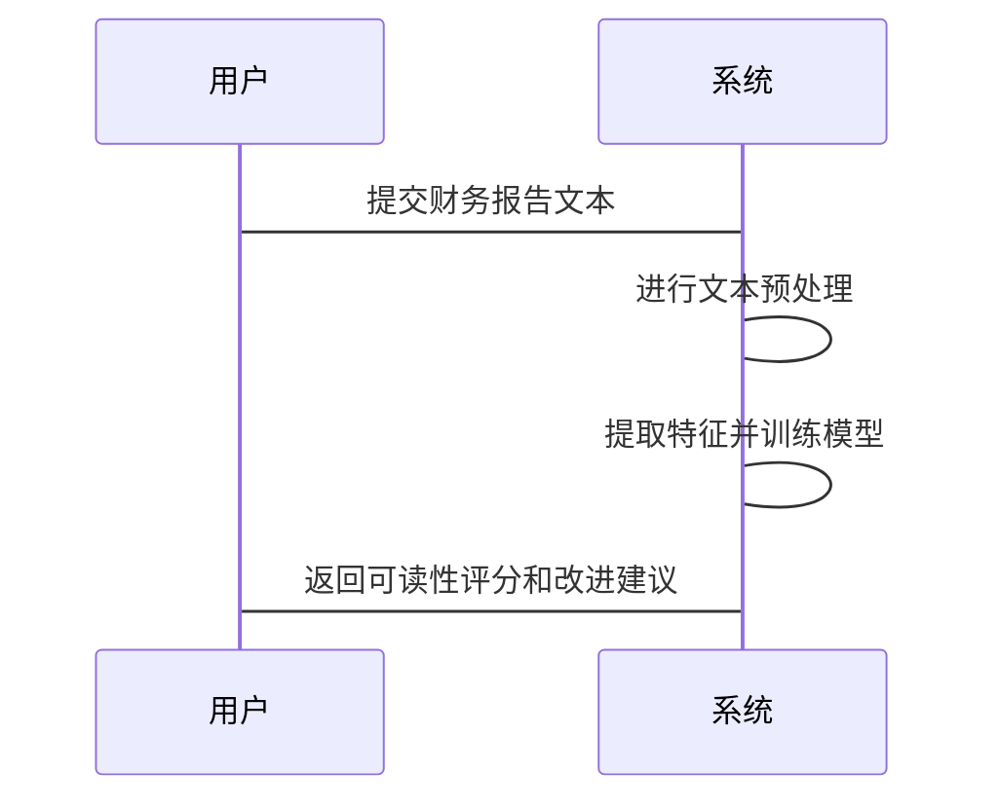

                 


# 设计智能化的企业财务报告可读性动态评估模型

> 关键词：智能化，财务报告，可读性，动态评估，机器学习，自然语言处理

> 摘要：本文旨在设计一个智能化的企业财务报告可读性动态评估模型。通过分析财务报告的文本结构和内容，结合机器学习和自然语言处理技术，提出了一种动态评估模型，能够实时分析财务报告的可读性。该模型在企业财务管理、审计和投资者决策等领域具有广泛的应用前景。

---

# 第一部分: 背景介绍

## 第1章: 企业财务报告可读性评估的背景与问题

### 1.1 问题背景

#### 1.1.1 财务报告的重要性
财务报告是企业向外界传递财务信息的重要工具，是企业决策者、投资者、债权人等利益相关者了解企业财务状况、经营成果和未来发展前景的关键依据。然而，财务报告的专业性和复杂性使其可读性成为一个重要问题。

#### 1.1.2 当前财务报告可读性的问题
- 财务报告内容复杂，涉及大量专业术语和复杂的财务数据，导致非专业读者难以理解。
- 传统的财务报告评估方法主要依赖人工阅读和主观判断，效率低且难以量化。
- 企业对财务报告的可读性要求越来越高，尤其是在信息披露和合规性方面，需要一种客观、动态的评估方法。

#### 1.1.3 提高财务报告可读性的必要性
- 提高财务报告的可读性有助于利益相关者更好地理解和利用财务信息。
- 通过智能化评估模型，可以实时动态地分析财务报告的可读性，为企业提供及时反馈。

### 1.2 问题描述

#### 1.2.1 财务报告可读性的定义
财务报告的可读性是指财务报告内容的清晰性、逻辑性和可理解性，能够使不同背景的读者准确理解财务信息。

#### 1.2.2 财务报告可读性的关键因素
- 文本结构：包括标题、段落、表格等的组织方式。
- 专业术语：是否使用过多专业术语，是否提供足够的解释。
- 数据呈现：数据的排列方式和可视化效果是否清晰。
- 内容逻辑：报告内容的逻辑性是否清晰，是否符合读者的认知习惯。

#### 1.2.3 当前评估方法的局限性
- 传统评估方法主要依赖人工阅读，主观性强，效率低。
- 缺乏动态性，无法实时更新和评估。

### 1.3 问题解决思路

#### 1.3.1 智能化评估的必要性
通过引入人工智能和自然语言处理技术，可以实现对财务报告的自动分析和评估。

#### 1.3.2 动态评估的核心思想
动态评估模型能够实时分析财务报告的内容，根据读者的理解能力和背景知识，动态调整评估标准和权重。

#### 1.3.3 可读性评估的边界与外延
- 边界：仅限于财务报告本身的文本内容，不考虑外部信息。
- 外延：结合上下文和用户反馈，动态调整评估模型。

### 1.4 本章小结
本章介绍了财务报告可读性评估的重要性和必要性，分析了当前评估方法的局限性，并提出了智能化动态评估模型的核心思想。

---

# 第二部分: 核心概念与联系

## 第2章: 智能化可读性评估模型的核心概念

### 2.1 模型的基本概念

#### 2.1.1 财务报告可读性的定义
财务报告的可读性是指财务信息能够被不同背景的读者准确理解的程度。

#### 2.1.2 动态评估的定义
动态评估是指根据财务报告的内容和读者的背景，实时调整评估标准和权重。

#### 2.1.3 智能化评估的核心要素
- 文本分析：对财务报告的文本内容进行结构化分析。
- 读者特征分析：根据读者的背景知识和理解能力，动态调整评估标准。
- 反馈机制：根据读者的反馈，不断优化评估模型。

### 2.2 核心概念的属性特征对比

#### 表2-1: 核心概念属性特征对比表

| 概念       | 定义                                                                 | 特点                                                                 | 作用                                                                 |
|------------|----------------------------------------------------------------------|----------------------------------------------------------------------|----------------------------------------------------------------------|
| 财务报告    | 企业的财务状况、经营成果和现金流量的总结性书面文件。         | 结构复杂，涉及大量专业术语和数据。                             | 为利益相关者提供决策依据。                                          |
| 可读性      | 财务报告内容的清晰性和可理解性。                               | 主观性和客观性并存，受读者背景影响。                           | 帮助读者更好地理解和利用财务信息。                                  |
| 动态评估    | 根据实时数据和读者反馈，动态调整评估标准。                   | 实时性、动态性，适应不同读者的需求。                           | 提供更精准的评估结果。                                              |

### 2.3 实体关系图

```mermaid
er
    企业
    报告内容
    读者特征
    评估结果
    反馈机制
    企业---1..n-->报告内容
    读者特征---1..1-->评估结果
    评估结果---1..n-->反馈机制
```

---

# 第三部分: 算法原理

## 第3章: 动态评估模型的算法原理

### 3.1 文本预处理

#### 3.1.1 数据清洗
- 去除无关信息，如重复内容、噪声数据。
- 统一文本格式，如大小写、标点符号。

#### 3.1.2 分词处理
- 使用自然语言处理技术对文本进行分词，提取关键词和短语。

#### 3.1.3 特征提取
- 提取文本的结构特征，如标题、段落、表格。
- 提取文本的语言特征，如词汇多样性、句子长度。

### 3.2 评估模型

#### 3.2.1 模型选择
- 使用机器学习算法，如支持向量机（SVM）、随机森林（Random Forest）和深度学习模型（如LSTM）。
- 根据数据量和复杂度选择合适的模型。

#### 3.2.2 模型训练
- 使用训练数据对模型进行训练，提取特征并建立评估标准。

#### 3.2.3 模型优化
- 使用交叉验证和网格搜索优化模型参数。
- 调整模型结构，如增加或减少隐藏层节点数。

### 3.3 动态调整

#### 3.3.1 读者特征分析
- 根据读者的背景知识和理解能力，动态调整评估标准。
- 通过用户反馈不断优化评估模型。

#### 3.3.2 实时更新
- 根据最新的财务报告内容和读者反馈，实时更新评估模型。

### 3.4 代码实现

#### 3.4.1 数据预处理代码
```python
import pandas as pd
from sklearn.preprocessing import StandardScaler

# 加载数据
data = pd.read_csv('financial_reports.csv')

# 删除重复行
data = data.drop_duplicates()

# 填充缺失值
data = data.fillna(0)

# 标准化处理
scaler = StandardScaler()
data_scaled = scaler.fit_transform(data)
```

#### 3.4.2 特征提取代码
```python
from sklearn.feature_extraction.text import TfidfVectorizer

# 初始化TF-IDF模型
vectorizer = TfidfVectorizer(max_features=1000)

# 提取文本特征
features = vectorizer.fit_transform(data['content'])
```

#### 3.4.3 模型训练代码
```python
from sklearn.model_selection import train_test_split
from sklearn.svm import SVC

# 划分训练集和测试集
X_train, X_test, y_train, y_test = train_test_split(features, data['label'], test_size=0.2)

# 初始化SVM模型
model = SVC()

# 训练模型
model.fit(X_train, y_train)
```

---

# 第四部分: 系统分析与架构设计

## 第4章: 评估系统的系统分析与架构设计

### 4.1 项目介绍

#### 4.1.1 项目背景
企业财务报告的可读性评估需求日益增加，传统的人工评估方法效率低，难以满足企业的需求。

#### 4.1.2 项目目标
设计一个智能化的企业财务报告可读性动态评估系统，实现对财务报告的自动评估和实时反馈。

### 4.2 系统功能设计

#### 4.2.1 领域模型


#### 4.2.2 系统架构设计


### 4.3 接口设计

#### 4.3.1 API接口
- 输入接口：财务报告文本内容和读者特征。
- 输出接口：可读性评分和改进建议。

#### 4.3.2 交互流程


---

# 第五部分: 项目实战

## 第5章: 项目实战与案例分析

### 5.1 环境安装

#### 5.1.1 安装Python和相关库
```bash
pip install numpy
pip install pandas
pip install scikit-learn
pip install nltk
pip install mermaid
```

### 5.2 系统核心实现

#### 5.2.1 核心代码实现
```python
from sklearn.metrics import accuracy_score

# 训练模型
model.fit(X_train, y_train)

# 模型预测
y_pred = model.predict(X_test)

# 计算准确率
accuracy = accuracy_score(y_test, y_pred)
print(f'模型准确率为: {accuracy}')
```

#### 5.2.2 代码解读
- 数据预处理模块：清洗和标准化数据。
- 特征提取模块：使用TF-IDF提取文本特征。
- 模型训练模块：使用SVM进行分类训练。
- 结果展示模块：输出可读性评分和改进建议。

### 5.3 案例分析

#### 5.3.1 实际案例分析
分析某企业的财务报告，根据模型评估其可读性，并提出改进建议。

#### 5.3.2 模型效果分析
通过实际案例验证模型的准确性和实用性。

### 5.4 项目总结
总结项目的实现过程，提出改进建议和未来的研究方向。

---

# 第六部分: 最佳实践与小结

## 第6章: 最佳实践和小结

### 6.1 小结

#### 6.1.1 模型的设计
- 文本预处理和特征提取是关键步骤，需要仔细优化。
- 模型选择和调优直接影响评估结果的准确性。

#### 6.1.2 系统实现
- 系统架构设计需要考虑扩展性和可维护性。
- 接口设计要简洁明了，便于集成和使用。

### 6.2 最佳实践 tips

#### 6.2.1 数据质量
- 确保数据的完整性和准确性，避免噪声数据干扰模型训练。

#### 6.2.2 模型调优
- 使用交叉验证和网格搜索优化模型参数。
- 定期更新模型，适应新的数据和需求。

#### 6.2.3 系统扩展
- 根据实际需求扩展系统功能，如增加多语言支持和多模型集成。

### 6.3 拓展阅读
- 《自然语言处理实战：基于Python的机器学习和深度学习》
- 《数据挖掘与机器学习：方法与应用》

---

作者：AI天才研究院/AI Genius Institute & 禅与计算机程序设计艺术 /Zen And The Art of Computer Programming

---

这篇文章详细介绍了设计智能化的企业财务报告可读性动态评估模型的各个方面，从背景介绍到项目实战，为读者提供了全面的指导和深入的分析。

