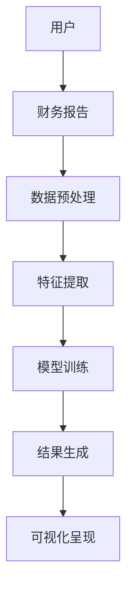
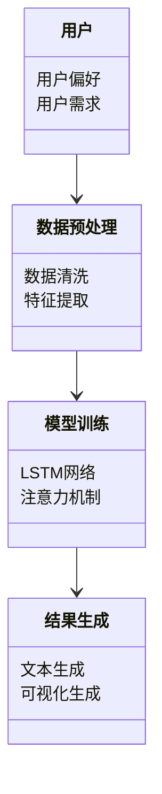
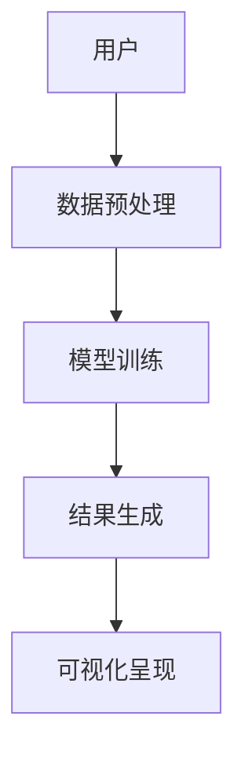
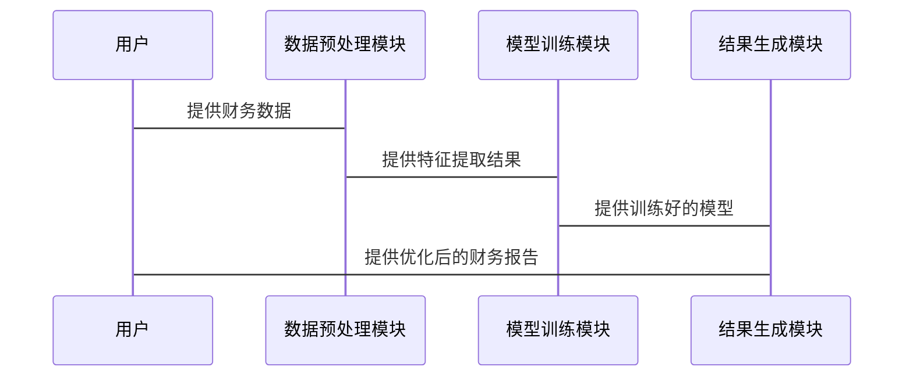

                 


# 设计智能化的企业财务报告可读性增强模型

> 关键词：企业财务报告，可读性增强，人工智能，自然语言处理，文本生成，数据可视化

> 摘要：随着企业数据量的不断增长，传统的财务报告由于信息复杂性和阅读体验的不足，难以满足现代企业的需求。本文提出了一种基于人工智能技术的企业财务报告可读性增强模型，通过数据预处理、特征提取、模型训练和结果生成等步骤，提升财务报告的可读性和用户理解效率。本文详细探讨了模型的设计原理、算法实现和系统架构，并通过实际案例展示了模型的应用效果。

---

# 第一部分: 企业财务报告可读性增强模型的背景与概念

## 第1章: 问题背景与定义

### 1.1 问题背景

#### 1.1.1 传统财务报告的局限性
现代企业面临的财务数据量呈指数级增长，传统的财务报告由于信息复杂性和阅读体验的不足，导致用户难以快速理解和提取关键信息。例如，复杂的表格、术语密集的文本以及缺乏直观的可视化呈现，使得非专业用户难以高效利用这些数据。

#### 1.1.2 数据量爆炸对企业财务分析的影响
随着企业业务的扩展，财务数据来源多样化，包括财务报表、交易记录、市场分析报告等。这些数据不仅数量庞大，而且格式多样，传统的分析方法难以高效处理。

#### 1.1.3 用户需求与阅读体验的痛点
用户对财务报告的需求不仅仅是获取数据，而是希望快速理解数据背后的意义。然而，传统的财务报告缺乏个性化的呈现方式，无法满足不同用户的阅读习惯和理解能力。

### 1.2 智能化增强模型的定义

#### 1.2.1 模型的核心目标
智能化的企业财务报告可读性增强模型旨在通过人工智能技术，优化财务报告的呈现方式，使其更易于理解和分析。

#### 1.2.2 模型的边界与外延
模型的边界包括数据输入（如财务数据和用户偏好）、特征提取（如文本特征和语义特征）以及输出（如优化后的文本和可视化结果）。外延则涉及模型的可扩展性和与其他系统的集成。

#### 1.2.3 模型的核心要素组成
模型的核心要素包括数据预处理、特征提取、模型训练和结果生成。

### 1.3 核心概念与联系

#### 1.3.1 数据预处理与特征提取
数据预处理包括清洗、标准化和格式统一。特征提取则通过文本挖掘和语义分析，提取关键信息。

#### 1.3.2 文本生成与可读性优化
文本生成模块负责将财务数据转化为自然语言文本，并通过优化算法提升可读性。

#### 1.3.3 可视化辅助理解
可视化模块通过图表和图形的方式，帮助用户更直观地理解财务数据。

#### 1.3.4 ER实体关系图


---

# 第二部分: 模型设计与算法原理

## 第2章: 模型设计

### 2.1 数据预处理与特征提取

#### 2.1.1 数据清洗与标准化
数据清洗包括去除重复值、处理缺失值和异常值。标准化则包括单位统一和格式统一。

#### 2.1.2 文本特征提取方法
文本特征提取方法包括词袋模型（Bag-of-Words）和词嵌入（Word2Vec）。例如，词袋模型通过统计词频来表示文本，而词嵌入则通过向量表示词义。

#### 2.1.3 语义特征提取
语义特征提取方法包括TF-IDF和BERT。例如，TF-IDF用于提取关键词，而BERT则用于提取上下文语义。

### 2.2 模型结构设计

#### 2.2.1 基于LSTM的序列建模
LSTM用于处理序列数据，例如财务报告中的时间序列数据。公式如下：
$$
f(t) = \text{LSTM}(x_t, f(t-1))
$$

#### 2.2.2 注意力机制的引入
注意力机制用于捕捉关键信息。例如，使用自注意力机制来处理文本序列：
$$
\text{Attention}(Q, K, V) = \text{softmax}\left(\frac{QK^T}{\sqrt{d_k}}\right)V
$$

#### 2.2.3 多任务学习的优化
多任务学习通过共享特征提取部分，同时优化多个任务（如文本生成和可视化生成）。例如，使用交叉熵损失函数进行优化。

---

## 第3章: 算法原理

### 3.1 算法实现步骤

#### 3.1.1 数据预处理
代码示例：
```python
import pandas as pd

# 读取数据
df = pd.read_csv('financial_report.csv')

# 数据清洗
df.drop_duplicates(inplace=True)
df.fillna(0, inplace=True)

# 特征提取
text_features = df['report'].values
```

#### 3.1.2 模型训练
使用LSTM和注意力机制进行训练：
$$
\text{LSTM}(x_t, h_{t-1}) = (\text{遗忘门}, \text{输入门}, \text{输出门})
$$

#### 3.1.3 模型优化
使用Adam优化器进行训练，并通过交叉验证选择最优超参数。

### 3.2 算法原理的数学模型

#### 3.2.1 LSTM公式
$$
i_t = \sigma(W_i x_t + U_i h_{t-1})
$$
$$
f_t = \sigma(W_f x_t + U_f h_{t-1})
$$
$$
o_t = \sigma(W_o x_t + U_o h_{t-1})
$$
$$
c_t = f_t \cdot c_{t-1} + i_t \cdot tanh(W_c x_t + U_c h_{t-1})
$$
$$
h_t = o_t \cdot tanh(c_t)
$$

#### 3.2.2 注意力机制公式
$$
\text{Attention}(Q, K, V) = \sum_{i=1}^{n}\text{softmax}(\frac{QK_i}{\sqrt{d_k}})V_i
$$

---

## 第4章: 系统分析与架构设计

### 4.1 问题场景介绍

#### 4.1.1 项目介绍
本项目旨在设计一个智能化的企业财务报告可读性增强模型，通过数据预处理、特征提取、模型训练和结果生成，提升财务报告的可读性和用户理解效率。

### 4.2 系统功能设计

#### 4.2.1 领域模型


### 4.3 系统架构设计

#### 4.3.1 系统架构图


### 4.4 系统接口设计

#### 4.4.1 数据预处理接口
代码示例：
```python
def preprocess(data):
    # 数据清洗
    data = data.drop_duplicates()
    data = data.fillna(0)
    return data
```

### 4.5 系统交互设计

#### 4.5.1 交互流程


---

## 第5章: 项目实战

### 5.1 环境安装

#### 5.1.1 安装依赖
```bash
pip install numpy pandas tensorflow transformers matplotlib
```

### 5.2 系统核心实现

#### 5.2.1 数据预处理实现
代码示例：
```python
import pandas as pd

def preprocess_data(data):
    data = data.drop_duplicates()
    data = data.fillna(0)
    return data

# 使用示例
df = pd.read_csv('financial_report.csv')
df_preprocessed = preprocess_data(df)
```

#### 5.2.2 模型训练实现
代码示例：
```python
import tensorflow as tf
from tensorflow.keras.layers import LSTM, Dense, Dropout

model = tf.keras.Sequential([
    LSTM(64, return_sequences=True),
    Dropout(0.2),
    LSTM(32),
    Dense(1)
])
model.compile(optimizer='adam', loss='mean_squared_error')
model.fit(x_train, y_train, epochs=10, batch_size=32)
```

#### 5.2.3 结果生成实现
代码示例：
```python
import matplotlib.pyplot as plt

def visualize_results(data):
    plt.figure(figsize=(10, 6))
    plt.plot(data['prediction'], label='预测值')
    plt.plot(data['actual'], label='实际值')
    plt.legend()
    plt.show()

visualize_results(df)
```

### 5.3 实际案例分析

#### 5.3.1 数据准备
使用财务报告数据，包括收入、支出、利润等指标。

#### 5.3.2 模型训练
训练模型以预测财务数据的趋势，并生成优化后的文本报告。

#### 5.3.3 结果分析
通过可视化图表和文本报告，分析模型的预测效果和可读性提升情况。

### 5.4 项目小结

#### 5.4.1 项目总结
通过本项目，我们实现了智能化的企业财务报告可读性增强模型，提升了财务报告的可读性和用户理解效率。

#### 5.4.2 项目收获
掌握了数据预处理、模型训练和结果生成的全过程，熟悉了LSTM和注意力机制的应用。

---

## 第6章: 优化与扩展

### 6.1 模型优化

#### 6.1.1 算法优化
引入多模态数据（如图像和语音）提升模型的泛化能力。

#### 6.1.2 性能优化
使用强化学习优化模型的可读性生成过程。

### 6.2 拓展应用

#### 6.2.1 其他应用场景
将模型应用于其他领域的报告生成，如医疗报告和法律文件。

### 6.3 实际应用中的注意事项

#### 6.3.1 数据隐私问题
确保数据处理过程中的隐私保护。

#### 6.3.2 模型泛化能力
通过数据增强和迁移学习提升模型的泛化能力。

---

## 第7章: 总结与展望

### 7.1 总结

#### 7.1.1 核心内容回顾
通过智能化模型，我们成功提升了企业财务报告的可读性和用户理解效率。

#### 7.1.2 重要结论
智能化模型的应用为企业财务分析提供了新的思路。

### 7.2 未来展望

#### 7.2.1 智能化模型的未来发展
随着AI技术的不断进步，智能化模型将在更多领域得到应用。

#### 7.2.2 技术创新方向
探索更先进的算法和模型架构，提升模型的性能和可解释性。

---

作者：AI天才研究院/AI Genius Institute & 禅与计算机程序设计艺术 /Zen And The Art of Computer Programming

