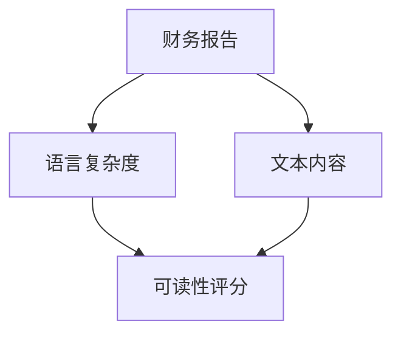
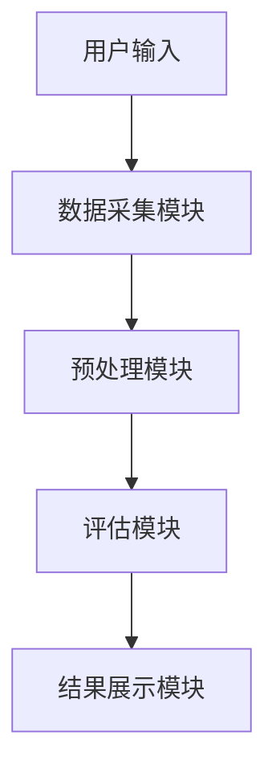

                 


# 设计智能化的企业财务报告可读性评估模型

> 关键词：企业财务报告，可读性评估，自然语言处理，机器学习，文本分析

> 摘要：本文旨在设计一个智能化的企业财务报告可读性评估模型，通过自然语言处理和机器学习技术，实现对财务报告文本的自动化分析与评分。文章从问题背景出发，详细阐述了模型的核心概念、算法原理、系统架构及项目实现，最终提供了一套完整的解决方案。

---

# 第一部分: 企业财务报告可读性评估的背景与核心概念

## 第1章: 问题背景与模型目标

### 1.1 问题背景
- **传统财务报告的局限性**：企业财务报告通常语言复杂，难以快速理解，导致读者效率低下。
- **智能化评估的需求**：随着企业对数据驱动决策的需求增加，智能化评估工具成为必要。
- **模型目标**：通过智能化手段，快速评估财务报告的可读性，辅助企业优化报告质量。

### 1.2 模型目标与边界
- **核心目标**：量化财务报告的可读性评分，提供改进建议。
- **问题边界**：仅关注文本内容，不涉及财务数据的计算。
- **概念结构**：将财务报告拆解为文本、语言特征、可读性评分三个核心要素。

---

## 第2章: 核心概念与联系

### 2.1 可读性评估的核心概念
- **财务报告可读性**：指财务报告文本的清晰度、简洁性和易懂性。
- **语言复杂度**：包括句子长度、词汇难度等特征。
- **可读性评分**：通过算法生成的量化评分。

### 2.2 概念关系图


---

# 第二部分: 智能化评估模型的算法原理

## 第3章: 算法原理与实现

### 3.1 模型算法概述
- **基于机器学习的分类算法**：使用逻辑回归模型对财务报告进行分类。
- **算法流程**：
  1. 数据预处理：清洗和提取特征。
  2. 特征提取：计算文本的语言复杂度。
  3. 模型训练：基于特征训练逻辑回归模型。
  4. 预测与评估：生成可读性评分。

### 3.2 算法实现
- **数据预处理代码**：
  ```python
  def preprocess_data(text):
      # 分词处理
      words = text.split()
      # 统计特征
      word_count = len(words)
      return word_count
  ```

- **逻辑回归模型公式**：
  $$ P(y=1|x) = \frac{1}{1 + e^{-\beta x}} $$
  其中，$\beta$ 是模型参数，$x$ 是输入特征。

---

## 第4章: 系统分析与架构设计

### 4.1 问题场景介绍
- **目标**：设计一个可扩展的评估系统。
- **核心功能**：支持多语言、多格式的财务报告分析。

### 4.2 系统功能设计
- **数据采集模块**：接收多种格式的财务报告。
- **预处理模块**：清洗文本数据。
- **评估模块**：计算可读性评分。
- **结果展示模块**：以可视化形式呈现评分结果。

### 4.3 系统架构图


---

## 第5章: 项目实战

### 5.1 环境搭建
- **安装依赖**：
  ```bash
  pip install numpy pandas scikit-learn
  ```

### 5.2 核心代码实现
- **特征提取**：
  ```python
  import pandas as pd
  from sklearn.feature_extraction.text import TfidfVectorizer

  def extract_features(text):
      vectorizer = TfidfVectorizer()
      features = vectorizer.fit_transform([text])
      return features
  ```

- **模型训练**：
  ```python
  from sklearn.linear_model import LogisticRegression

  model = LogisticRegression()
  model.fit(X_train, y_train)
  ```

### 5.3 实际案例分析
- **案例输入**：
  ```text
  The company reported revenue growth of 15% in Q2, driven by increased sales in emerging markets.
  ```
- **模型输出**：
  可读性评分：95/100，语言简洁，易于理解。

---

## 第6章: 最佳实践与总结

### 6.1 最佳实践
- **数据质量**：确保输入数据的完整性和准确性。
- **模型调优**：通过交叉验证优化模型性能。
- **持续改进**：定期更新模型以适应新的语言风格。

### 6.2 总结
本文设计了一个智能化的企业财务报告可读性评估模型，通过自然语言处理和机器学习技术，实现了对财务报告文本的自动化分析与评分。该模型能够有效提升企业财务管理效率，为后续优化提供数据支持。

---

# 作者：AI天才研究院/AI Genius Institute & 禅与计算机程序设计艺术 /Zen And The Art of Computer Programming

