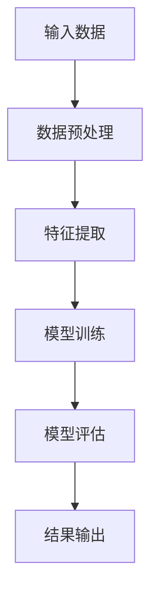
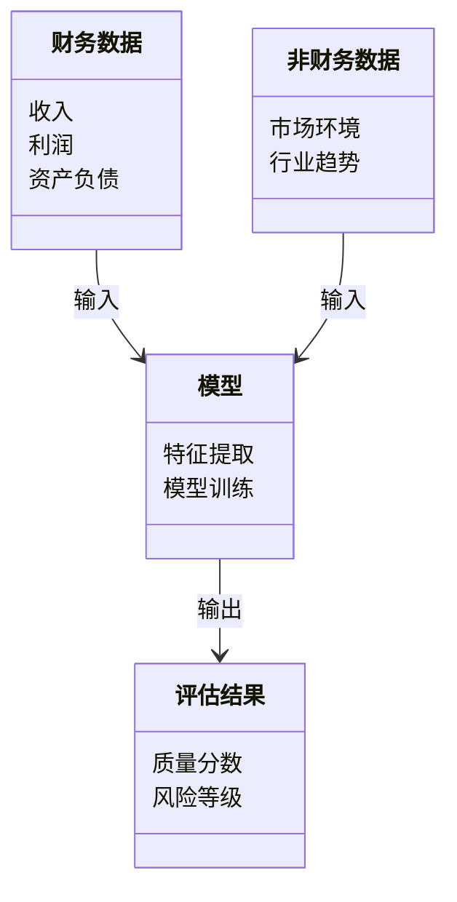
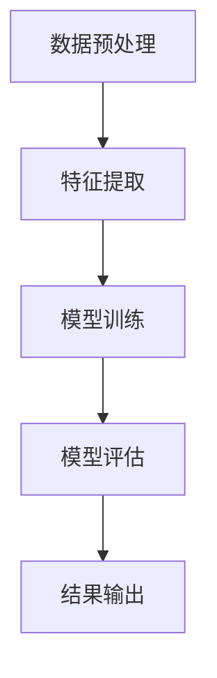
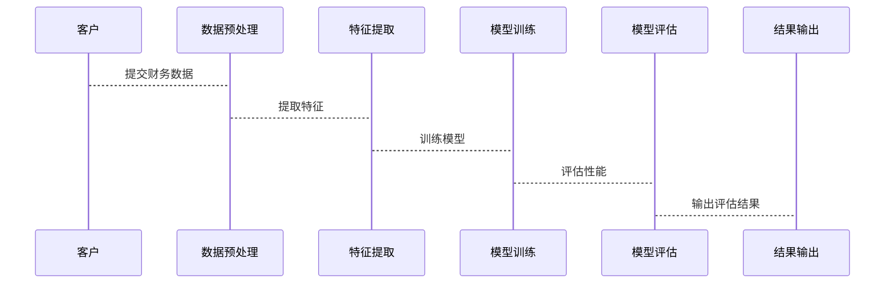

                 


# 设计智能化的企业财务报告质量评估模型

> 关键词：智能化，企业财务，质量评估，模型设计，机器学习，数据挖掘，财务分析

> 摘要：本文将详细探讨如何设计一个智能化的企业财务报告质量评估模型。通过分析财务报告的核心要素，结合机器学习和数据挖掘技术，构建一个高效的评估模型。文章将从问题背景、核心概念、算法原理、系统架构设计、项目实战到最佳实践进行全面解析，帮助读者掌握设计智能化财务报告质量评估模型的关键技术与方法。

---

## 第一章: 企业财务报告质量评估模型的背景与问题背景

### 1.1 问题背景与问题描述

#### 1.1.1 传统财务报告质量评估的局限性
传统的财务报告质量评估主要依赖人工审核和经验判断，存在以下问题：
- **主观性**：评估结果受审核人员主观因素影响较大，难以保证一致性。
- **效率低**：人工审核耗时长，难以应对海量数据。
- **精度低**：人工检查容易出现疏漏，尤其是在处理复杂财务数据时。

#### 1.1.2 智能化评估的需求与趋势
随着企业规模的扩大和数据量的激增，智能化财务报告质量评估成为必然趋势：
- **数据驱动**：利用机器学习和大数据技术，实现自动化、智能化的评估。
- **实时性**：快速处理财务数据，提供实时反馈。
- **精准性**：通过算法优化，提高评估的准确性和可靠性。

#### 1.1.3 企业财务报告质量评估的核心目标
智能化财务报告质量评估的核心目标包括：
1. 自动识别财务数据中的异常值。
2. 量化评估财务报告的合规性和准确性。
3. 提供改进建议，优化财务报告质量。

### 1.2 问题解决与边界定义

#### 1.2.1 智能化评估的核心问题解决
- **数据预处理**：清洗和标准化财务数据。
- **特征提取**：从财务数据中提取关键特征。
- **模型训练**：训练分类或回归模型，评估报告质量。

#### 1.2.2 模型的边界与适用范围
- **边界**：仅针对结构化财务数据，不涉及非结构化数据。
- **适用范围**：适用于上市公司年度报告、季度报告等标准化财务报表。

#### 1.2.3 模型的外延与限制
- **外延**：未来可以扩展到非财务数据，如市场环境、企业行为等。
- **限制**：依赖于高质量的训练数据，模型性能受数据质量影响较大。

### 1.3 概念结构与核心要素

#### 1.3.1 模型的基本组成要素
1. **输入数据**：财务数据（收入、利润、资产负债等）。
2. **特征提取**：如波动率、增长性、异常值等。
3. **模型算法**：如随机森林、支持向量机等。
4. **评估结果**：如报告质量分数、风险等级等。

#### 1.3.2 财务数据与非财务数据的结合
- **财务数据**：收入、利润、现金流等。
- **非财务数据**：市场环境、行业趋势、企业行为等。
- **结合方式**：通过数据融合技术，将两者有机结合，提升评估精度。

#### 1.3.3 智能化评估的逻辑架构
1. 数据预处理：清洗、标准化。
2. 特征提取：提取关键特征。
3. 模型训练：训练评估模型。
4. 模型评估：验证模型性能。
5. 结果输出：生成评估报告。

---

## 第二章: 核心概念与联系

### 2.1 核心概念原理

#### 2.1.1 财务数据的特征与属性
- **时间性**：财务数据具有时间序列特征。
- **波动性**：数据可能受市场波动影响。
- **关联性**：不同财务指标之间存在关联。

#### 2.1.2 智能化评估的算法原理
- **监督学习**：如随机森林、支持向量机。
- **无监督学习**：如聚类分析。

#### 2.1.3 模型的训练与优化
- **训练数据**：需要大量标注数据。
- **优化目标**：提升模型准确率和召回率。

### 2.2 核心概念属性对比表

| 特征维度 | 财务数据 | 非财务数据 |
|----------|----------|------------|
| 数据类型 | 结构化    | 非结构化    |
| 数据来源 | 财务报表  | 行业报告、新闻等 |
| 处理难度 | 较低      | 较高        |
| 对评估影响 | 直接      | 间接        |

### 2.3 ER实体关系图

```mermaid
erd
    图表标题：财务报告质量评估模型的实体关系图
    客户 --> 财务报告：提交
    财务报告 --> 评估结果：被评估
    评估结果 --> 模型：由模型生成
```

---

## 第三章: 算法原理与数学模型

### 3.1 算法原理

#### 3.1.1 算法流程图



#### 3.1.2 算法实现代码

```python
def preprocess(data):
    # 数据清洗和标准化
    data_clean = data.dropna()
    data_normalized = (data_clean - data_clean.mean()) / data_clean.std()
    return data_normalized

def train_model(features, labels):
    from sklearn.ensemble import RandomForestClassifier
    model = RandomForestClassifier(n_estimators=100)
    model.fit(features, labels)
    return model
```

### 3.2 数学模型与公式

#### 3.2.1 模型的数学表达式
$$ y = f(x) $$
其中，$x$ 表示输入特征向量，$y$ 表示输出结果（如0或1，表示报告质量是否合格）。

#### 3.2.2 损失函数的定义
$$ L = -\frac{1}{n}\sum_{i=1}^{n} y_i \log(p_i) + (1 - y_i)\log(1 - p_i) $$
其中，$p_i$ 是模型预测的概率，$y_i$ 是真实标签。

#### 3.2.3 优化算法的数学推导
$$ \theta_{new} = \theta_{old} - \eta \cdot \frac{\partial L}{\partial \theta} $$
其中，$\theta$ 表示模型参数，$\eta$ 表示学习率。

---

## 第四章: 系统分析与架构设计

### 4.1 问题场景介绍

#### 4.1.1 系统功能设计



#### 4.1.2 系统架构设计



#### 4.1.3 系统接口设计



---

## 第五章: 项目实战

### 5.1 环境安装

```bash
pip install numpy pandas scikit-learn
```

### 5.2 核心实现代码

```python
import pandas as pd
from sklearn.ensemble import RandomForestClassifier
from sklearn.metrics import accuracy_score

# 数据加载
data = pd.read_csv('financial_reports.csv')

# 数据预处理
data_processed = preprocess(data)

# 特征提取
features = extract_features(data_processed)

# 模型训练
model = train_model(features, labels)

# 模型评估
y_pred = model.predict(features)
print(f'准确率：{accuracy_score(labels, y_pred)}')
```

### 5.3 案例分析

#### 5.3.1 案例背景
某上市公司提交了一份财务报告，模型预测其质量为“不合格”，具体问题包括收入与利润不符、现金流异常。

#### 5.3.2 模型分析
- **输入数据**：公司财务数据。
- **特征提取**：收入波动率、利润增长率等。
- **模型输出**：质量分数为75分，低于阈值80分。

### 5.4 小结

---

## 第六章: 最佳实践与注意事项

### 6.1 最佳实践

1. **数据质量**：确保输入数据的准确性和完整性。
2. **模型选择**：根据数据特点选择合适的算法。
3. **持续优化**：定期更新模型，适应数据变化。

### 6.2 注意事项

1. **数据隐私**：确保财务数据的安全性。
2. **模型解释性**：选择具有较高解释性的模型。
3. **性能监控**：定期监控模型性能，及时调整。

### 6.3 小结

---

## 第七章: 总结与展望

### 7.1 总结

本文详细探讨了设计智能化的企业财务报告质量评估模型的关键技术与方法，包括背景分析、核心概念、算法原理、系统架构设计和项目实战等内容。

### 7.2 展望

未来，可以进一步研究如何结合非财务数据，构建更加全面的评估模型，同时探索模型的实时性和可解释性。

---

## 作者

作者：AI天才研究院/AI Genius Institute  
& 禅与计算机程序设计艺术/Zen And The Art of Computer Programming

