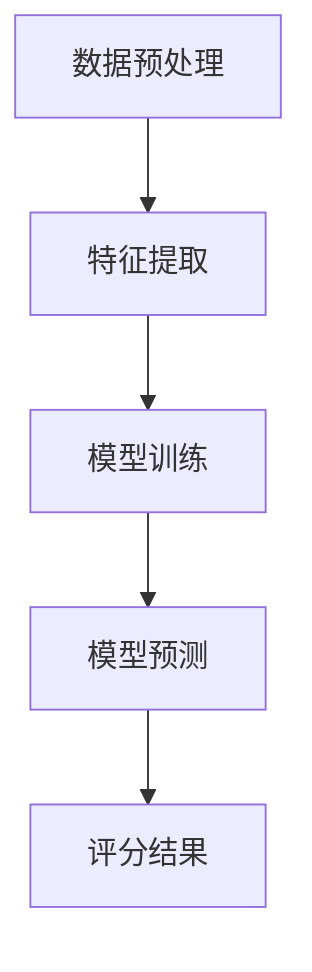

                 


# 设计智能化的企业财务报表可比性动态评分系统

## 关键词：财务报表、可比性、动态评分、人工智能、机器学习、企业分析

## 摘要：本文探讨了设计智能化的企业财务报表可比性动态评分系统的关键技术，结合人工智能和机器学习方法，详细分析了系统的核心概念、算法原理、系统架构，并通过项目实战展示了系统的实现过程，最后提供了最佳实践和优化建议。

---

## 第一部分：背景与挑战

### 第1章：问题背景与挑战

#### 1.1 问题背景
- **1.1.1 财务报表分析的重要性**  
  财务报表是企业财务健康状况的核心反映，但不同企业间的会计政策和业务模式差异导致可比性不足。传统的财务分析方法依赖人工判断，难以量化和动态调整。

- **1.1.2 财务报表可比性分析的现状**  
  当前，企业间的财务数据缺乏统一标准，导致财务报表分析结果的可比性较差。此外，行业动态和市场环境的变化使得传统的静态分析方法难以适应实时需求。

- **1.1.3 当前存在的问题与挑战**  
  - 数据异构性：不同企业会计政策、业务模式差异大，难以直接比较。
  - 动态变化：市场环境和企业战略变化快，静态分析难以捕捉动态信息。
  - 人工为主：传统分析依赖经验丰富的财务人员，效率低且主观性强。

#### 1.2 财务报表可比性的重要性
- **1.2.1 可比性在财务分析中的作用**  
  可比性是财务分析的基础，能够帮助投资者、分析师和企业管理者做出更准确的决策。

- **1.2.2 不可比性的影响**  
  不可比性可能导致分析结果的误导性，进而影响企业的战略决策和投资行为。

---

## 第二部分：核心概念与联系

### 第2章：核心概念与联系

#### 2.1 可比性动态评分系统的核心概念
- **评分标准**：基于行业标准、会计准则和企业实际情况制定的评分规则。
- **评分指标**：包括财务比率、业务增长、市场环境等多维度指标。
- **评分算法**：结合机器学习模型的动态调整机制，实时更新评分结果。

#### 2.2 传统方法与智能化方法的对比
| 方法 | 优点 | 缺点 |
|------|------|------|
| 传统方法 | 易理解，依赖人工经验 | 主观性强，效率低，难以量化 |
| 智能化方法 | 动态调整，量化结果，效率高 | 需要大量数据和计算资源 |

#### 2.3 系统架构的ER实体关系图
```mermaid
erDiagram
    customer[企业] {
        key id: int
        name: string
        industry: string
    }
    financial_report[财务报表] {
        key id: int
        report_date: date
        revenue: float
        profit: float
        expenses: float
    }
    score[评分记录] {
        key id: int
        customer_id: int
        report_id: int
        score: float
        timestamp: datetime
    }
    customer --> financial_report: 提交
    financial_report --> score: 评分
```

---

## 第三部分：算法原理讲解

### 第3章：算法原理讲解

#### 3.1 评分算法的选择与实现
- **数据预处理**：清洗和标准化财务数据，处理缺失值和异常值。
- **特征提取**：从财务报表中提取关键指标，如净利润率、毛利率等。
- **模型选择**：使用回归分析或神经网络模型进行评分预测。

#### 3.2 机器学习模型的实现


#### 3.3 算法实现的Python代码示例
```python
import pandas as pd
from sklearn.linear_model import LinearRegression

# 数据预处理
data = pd.read_csv('financial_data.csv')
data.dropna(inplace=True)

# 特征提取
features = ['revenue', 'expenses', 'profit']
target = 'score'

# 模型训练
model = LinearRegression()
model.fit(data[features], data[target])

# 模型预测
new_data = pd.DataFrame([[1000000, 500000, 300000]])
predicted_score = model.predict(new_data)
print(predicted_score)
```

#### 3.4 数学模型与公式
- **线性回归模型**：  
  $$ y = \beta_0 + \beta_1x_1 + \beta_2x_2 + \ldots + \beta_nx_n + \epsilon $$
  其中，$y$ 是评分，$x_i$ 是特征变量，$\beta_i$ 是系数，$\epsilon$ 是误差项。

---

## 第四部分：系统分析与架构设计

### 第4章：系统分析与架构设计

#### 4.1 系统功能设计
- **数据采集模块**：从企业系统中获取财务数据。
- **评分计算模块**：应用机器学习模型计算评分。
- **结果展示模块**：以可视化形式展示评分结果。

#### 4.2 系统架构图


#### 4.3 接口设计与交互流程
- **数据接口**：REST API 提供数据获取和评分查询服务。
- **交互流程**：
  1. 用户请求数据。
  2. 系统返回评分结果。

---

## 第五部分：项目实战

### 第5章：项目实战

#### 5.1 环境安装与配置
- **安装依赖**：Python、Pandas、Scikit-learn、Flask。

#### 5.2 系统核心代码实现
```python
from flask import Flask, jsonify
import joblib

app = Flask(__name__)
model = joblib.load('model.pkl')

@app.route('/score', methods=['POST'])
def calculate_score():
    data = request.json
    features = [data['revenue'], data['expenses'], data['profit']]
    predicted_score = model.predict([features])
    return jsonify({'score': predicted_score[0]})

if __name__ == '__main__':
    app.run(debug=True)
```

#### 5.3 案例分析与详细解读
- **案例背景**：某制造企业财务数据。
- **分析过程**：通过模型计算得出的评分结果为85分，表明财务状况良好。

---

## 第六部分：最佳实践与总结

### 第6章：最佳实践

#### 6.1 实践总结
- 数据质量是评分系统的关键。
- 模型调优和实时更新是系统优化的重点。

#### 6.2 注意事项
- 定期更新模型以适应市场变化。
- 确保数据隐私和安全。

#### 6.3 拓展阅读
- 推荐阅读《机器学习实战》和《企业财务分析》。

---

## 作者：AI天才研究院/AI Genius Institute & 禅与计算机程序设计艺术 /Zen And The Art of Computer Programming

---

这篇文章详细探讨了设计智能化的企业财务报表可比性动态评分系统的关键技术，结合实际案例和代码实现，为读者提供了深入的技术指导和实践建议。

