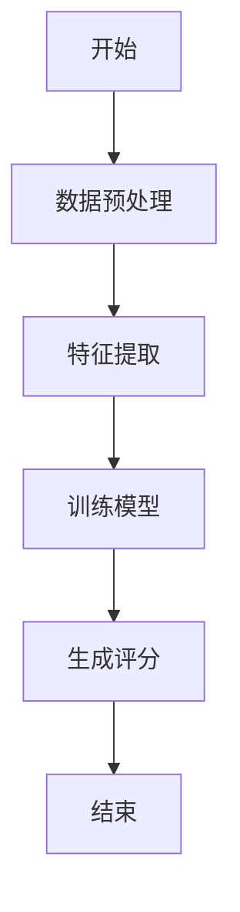
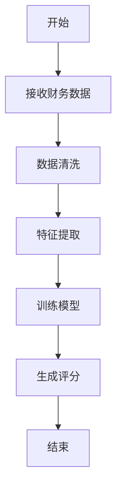
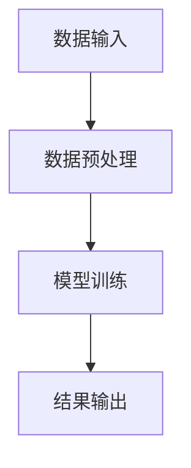

                 


# 设计智能化的企业财务报表可比性评分系统

## 关键词：智能化、财务报表、可比性、评分系统、机器学习、数据分析

## 摘要：  
本文旨在设计一个智能化的企业财务报表可比性评分系统，通过数据分析和机器学习技术，解决传统财务报表分析中的可比性问题。该系统能够自动提取财务数据特征，构建评分模型，并生成可比性评分结果，为企业决策提供支持。本文详细阐述了系统的设计思路、核心算法、系统架构以及实现案例。

---

# 第1章 问题背景与需求分析

## 1.1 财务报表可比性的重要性

### 1.1.1 财务报表的基本概念与作用  
财务报表是企业财务状况的反映，包括资产负债表、利润表和现金流量表。它是企业内外部利益相关者评估企业财务健康状况的重要工具。  

### 1.1.2 可比性在财务报表分析中的意义  
可比性是指不同企业的财务数据在相同维度上具有可比性。可比性是财务报表分析的基础，能够帮助投资者、债权人和管理层进行横向比较，评估企业绩效和行业地位。  

### 1.1.3 传统可比性评估的局限性  
传统可比性评估依赖人工分析，存在以下问题：  
- 数据维度复杂，难以标准化。  
- 人工判断主观性强，缺乏客观依据。  
- 数据量大，分析效率低。  

## 1.2 问题描述与目标设定

### 1.2.1 企业财务数据异质性问题  
企业财务数据因行业、规模和会计政策不同而异，导致可比性差。  

### 1.2.2 可比性评分系统的目标  
设计一个智能化的评分系统，能够自动评估企业财务报表的可比性，提供客观评分结果。  

### 1.2.3 系统边界与外延  
系统仅关注财务数据本身，不涉及企业外部环境和非财务信息。  

## 1.3 问题解决思路

### 1.3.1 数据驱动的解决方案  
通过机器学习和数据分析技术，从财务数据中提取特征，构建评分模型。  

### 1.3.2 智能化评分系统的构建逻辑  
- 数据预处理：清洗、标准化。  
- 特征提取：选择关键财务指标。  
- 模型训练：训练评分模型。  
- 结果解释：生成评分并解释。  

### 1.3.3 核心要素与系统架构  
- 数据输入：企业财务数据。  
- 数据处理：特征提取与标准化。  
- 模型构建：机器学习算法。  
- 输出结果：可比性评分。  

## 1.4 本章小结  
本章分析了财务报表可比性的重要性，指出了传统评估方法的局限性，并提出了智能化评分系统的设计目标和构建思路。  

---

# 第2章 核心概念与系统架构

## 2.1 智能化评分系统的原理

### 2.1.1 数据预处理与特征提取  
- 数据清洗：处理缺失值、异常值。  
- 特征提取：选择关键财务指标（如收入增长率、利润率等）。  

### 2.1.2 模型训练与评分机制  
- 使用机器学习算法（如随机森林、支持向量机）训练模型。  
- 根据模型输出结果生成可比性评分。  

### 2.1.3 结果解释与反馈优化  
- 解释评分结果，提供改进建议。  
- 根据反馈优化模型。  

## 2.2 核心概念属性对比

### 2.2.1 数据特征与模型参数对比表  
| 数据特征       | 模型参数         |
|----------------|-----------------|
| 收入增长率     | 特征重要性       |
| 净利率         | 模型类型         |
| 资产负债率     | 超参数设置       |

### 2.2.2 系统模块与功能对比表  
| 系统模块       | 功能描述         |
|----------------|-----------------|
| 数据输入模块   | 接收财务数据     |
| 数据处理模块   | 清洗与标准化     |
| 模型训练模块   | 训练评分模型     |
| 结果输出模块   | 生成评分结果     |

## 2.3 系统实体关系图

```mermaid
er
actor: 用户
system: 智能评分系统
database: 财务数据存储
process: 数据处理与评分
rules: 可比性评分标准

actor --> system: 提交财务数据
system --> database: 存储数据
database --> process: 数据处理
process --> system: 生成评分
system --> actor: 返回评分结果
```

## 2.4 本章小结  
本章详细介绍了智能化评分系统的原理，通过对比表和实体关系图，展示了系统的核心概念和架构。  

---

# 第3章 算法原理与数学模型

## 3.1 评分算法选择

### 3.1.1 机器学习算法对比  
- 线性回归：适合线性关系，但可能无法捕捉复杂特征。  
- 随机森林：适合非线性关系，特征重要性分析能力强。  
- 支持向量机：适合小样本数据，但计算复杂度高。  

### 3.1.2 算法选择依据  
根据数据规模和特征复杂度选择随机森林算法。  

## 3.2 算法原理与流程

### 3.2.1 随机森林算法原理  
随机森林是一种集成学习算法，通过构建多棵决策树并集成预测结果。  

### 3.2.2 算法流程图



### 3.2.3 算法实现步骤  
1. 数据预处理：清洗、标准化。  
2. 特征提取：选择关键财务指标。  
3. 训练模型：使用随机森林算法训练。  
4. 生成评分：预测并输出可比性评分。  

## 3.3 算法数学模型

### 3.3.1 随机森林算法的数学表达  
随机森林的预测结果是多棵决策树预测结果的加权平均（回归）或投票（分类）。  

### 3.3.2 特征重要性计算  
使用特征重要性得分（如Gini重要性）评估各个特征对模型的贡献。  

## 3.4 本章小结  
本章详细讲解了随机森林算法的原理和实现步骤，并通过流程图和数学公式展示了算法的核心思想。  

---

# 第4章 系统分析与架构设计

## 4.1 项目背景与目标

### 4.1.1 项目背景  
设计一个智能化的财务报表可比性评分系统，解决传统方法的局限性。  

### 4.1.2 项目目标  
实现一个能够自动评估企业财务报表可比性的系统。  

## 4.2 系统功能设计

### 4.2.1 功能模块划分  
- 数据输入模块：接收财务数据。  
- 数据处理模块：清洗与标准化。  
- 模型训练模块：训练评分模型。  
- 结果输出模块：生成评分结果。  

### 4.2.2 功能流程图



## 4.3 系统架构设计

### 4.3.1 模块化架构  
- 数据预处理模块：负责数据清洗和标准化。  
- 模型训练模块：负责训练评分模型。  
- 结果输出模块：负责生成评分结果。  

### 4.3.2 系统架构图



## 4.4 接口设计与交互流程

### 4.4.1 系统接口设计  
- 数据接口：接收财务数据。  
- 模型接口：调用评分模型。  
- 输出接口：返回评分结果。  

### 4.4.2 交互流程图

```mermaid
sequenceDiagram
actor 用户
system 系统

用户 -> 系统: 提交财务数据
系统 -> 数据预处理: 清洗数据
数据预处理 -> 模型训练: 提取特征
模型训练 -> 系统: 生成评分
系统 -> 用户: 返回评分结果
```

## 4.5 本章小结  
本章详细分析了系统的功能模块、架构设计和交互流程，展示了系统的核心组成部分和工作流程。  

---

# 第5章 项目实战

## 5.1 环境安装与配置

### 5.1.1 安装Python与相关库  
安装Python和机器学习库（如scikit-learn、pandas）。  

### 5.1.2 数据预处理代码

```python
import pandas as pd

# 读取数据
data = pd.read_csv('financial_data.csv')

# 数据清洗
data.dropna(inplace=True)
data = data.drop_duplicates()

# 标准化处理
from sklearn.preprocessing import StandardScaler
scaler = StandardScaler()
scaled_data = scaler.fit_transform(data)
```

### 5.1.3 模型训练代码

```python
from sklearn.ensemble import RandomForestRegressor
from sklearn.metrics import mean_squared_error

# 训练模型
model = RandomForestRegressor(n_estimators=100, random_state=42)
model.fit(scaled_data, target_scores)

# 预测结果
predicted_scores = model.predict(scaled_data)
print('均方误差:', mean_squared_error(target_scores, predicted_scores))
```

## 5.2 系统实现与代码解读

### 5.2.1 核心代码实现  
模型训练和评分生成的代码实现。  

### 5.2.2 代码功能分析  
- 数据预处理：清洗和标准化数据。  
- 模型训练：训练随机森林模型。  
- 结果生成：预测并输出评分结果。  

## 5.3 实际案例分析

### 5.3.1 案例数据准备  
选择一个行业的企业数据作为案例。  

### 5.3.2 数据分析与结果解读  
通过系统生成的评分结果，分析企业的可比性。  

## 5.4 项目总结

### 5.4.1 成功经验  
- 系统实现了智能化评分，提高了效率。  
- 特征提取和模型选择对结果影响显著。  

### 5.4.2 改进方向  
- 数据来源多样性：引入更多数据源。  
- 模型优化：尝试其他算法或优化超参数。  

## 5.5 本章小结  
本章通过实际案例展示了系统的实现过程和应用效果，总结了成功经验并提出了改进方向。  

---

# 第6章 最佳实践与小结

## 6.1 设计过程中的经验与教训

### 6.1.1 数据质量的重要性  
数据清洗和标准化对模型性能影响显著。  

### 6.1.2 模型选择的注意事项  
根据数据规模和特征复杂度选择合适的算法。  

## 6.2 系统设计的注意事项

### 6.2.1 数据隐私保护  
确保数据安全和隐私保护。  

### 6.2.2 模型泛化能力  
避免过拟合，确保模型在不同数据集上的表现稳定。  

## 6.3 本章小结  
本章总结了设计过程中的经验和教训，并提出了系统设计的注意事项，为后续优化提供了参考。  

---

# 附录

## 附录A 术语表

## 附录B 参考文献  

---

# 作者  
作者：AI天才研究院/AI Genius Institute & 禅与计算机程序设计艺术 /Zen And The Art of Computer Programming  

---

# 结语  
通过本文的详细阐述，我们设计了一个智能化的企业财务报表可比性评分系统，展示了其在实际应用中的潜力和价值。希望本文能够为相关领域的研究和实践提供有益的参考。

