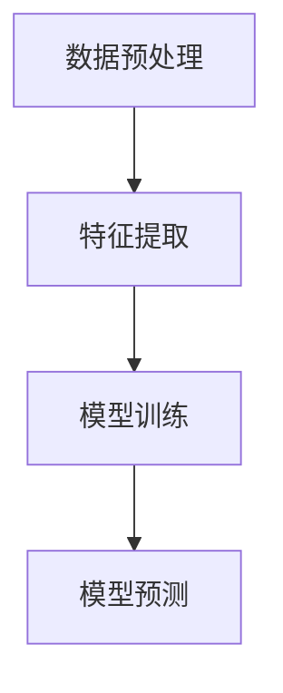
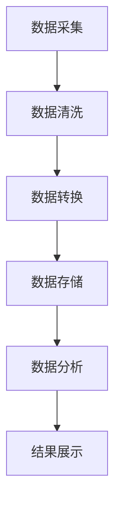
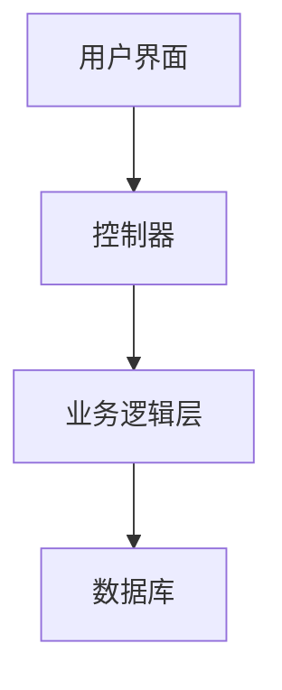

                 


# 设计智能化的企业财务报表同行业动态对比分析系统

## 关键词：智能化财务分析，企业财务报表，行业动态对比，机器学习，数据可视化，系统架构设计

## 摘要：  
本文详细探讨了设计智能化的企业财务报表同行业动态对比分析系统的各个方面。从问题背景到系统架构设计，从算法实现到项目实战，系统地介绍了如何利用智能化技术提升企业财务报表分析的效率和准确性。本文还通过实际案例分析，展示了该系统的实际应用场景和优势，并提出了系统优化和未来发展的建议。

---

# 第1章: 企业财务报表分析的智能化需求

## 1.1 问题背景与挑战

### 1.1.1 传统财务报表分析的局限性
传统财务报表分析依赖人工操作，存在以下问题：
- 数据量大：企业财务报表包含大量数据，人工分析效率低。
- 数据复杂：财务数据涉及多个维度，人工分析难以全面覆盖。
- 对比困难：同行业动态对比需要实时数据，人工操作难以实现动态更新。

### 1.1.2 同行业动态对比分析的重要性
同行业动态对比分析可以帮助企业：
- 发现行业趋势：通过对比同行业数据，发现行业发展趋势。
- 优化财务管理：通过分析行业数据，优化企业的财务策略。
- 提高决策效率：快速获取行业动态，辅助企业决策。

### 1.1.3 智能化分析的必要性
智能化分析可以解决传统方法的不足：
- 自动化处理：通过自动化技术实现数据采集、清洗和分析。
- 高效对比：利用机器学习算法快速进行行业动态对比。
- 智能决策：通过智能化系统提供决策支持。

## 1.2 问题描述与目标

### 1.2.1 财务报表数据的复杂性
财务报表数据包括收入、支出、利润等多维度信息，需要进行复杂的处理和分析。

### 1.2.2 同行业动态对比的核心问题
同行业动态对比需要解决以下问题：
- 数据获取：如何获取同行业的财务数据？
- 数据清洗：如何处理脏数据？
- 数据分析：如何进行高效对比？

### 1.2.3 系统设计的目标与边界
系统设计目标：
- 实现企业财务报表的智能化分析。
- 提供同行业动态对比功能。
- 输出直观的可视化结果。

系统设计边界：
- 仅限于财务数据的分析，不涉及其他业务数据。
- 不考虑企业的内部数据隐私问题。

## 1.3 核心概念与系统架构

### 1.3.1 核心概念的定义与属性
| 核心概念 | 定义 | 属性 |
|----------|------|------|
| 数据采集 | 获取企业财务报表数据 | 实时性、准确性、完整性 |
| 数据预处理 | 清洗和转换数据 | 去重、格式统一、异常值处理 |
| 智能分析 | 利用算法进行对比分析 | 机器学习、深度学习、统计分析 |

### 1.3.2 系统架构的初步设计
系统架构包括以下层次：
- 数据层：存储企业财务数据。
- 业务逻辑层：处理数据，进行对比分析。
- 表现层：展示分析结果。

### 1.3.3 实体关系图（ER图）
```mermaid
erDiagram
    customer : 企业
    report : 财务报表
    industry : 行业
    analysis : 分析结果
    customer --> report : 提交
    report --> industry : 归属
    report --> analysis : 生成
```

---

# 第2章: 数据获取与预处理

## 2.1 数据来源与获取方式

### 2.1.1 企业财务报表数据的来源
数据来源包括：
- 企业内部系统：ERP、财务管理系统。
- 第三方数据源：行业数据库、公开财务报表。

### 2.1.2 数据清洗与标准化
数据清洗步骤：
- 去重：删除重复数据。
- 格式统一：将不同格式的数据统一化。
- 填充缺失值：使用均值、中位数等方法填充缺失值。

### 2.1.3 数据预处理的流程
数据预处理流程：
1. 数据采集：获取企业财务报表数据。
2. 数据清洗：处理脏数据。
3. 数据转换：将数据转换为适合分析的格式。

## 2.2 数据存储与管理

### 2.2.1 数据库设计与选择
数据库设计：
- 表结构设计：企业ID、报表日期、收入、支出等字段。
- 数据模型：关系型数据库，支持事务处理。

### 2.2.2 数据模型的设计
数据模型包括：
- 企业表：存储企业基本信息。
- 报表表：存储财务报表数据。
- 行业表：存储行业分类信息。

### 2.2.3 数据存储的优化
数据存储优化措施：
- 分库设计：按企业或行业分库。
- 索引优化：在常用查询字段上建立索引。

---

# 第3章: 智能化分析算法原理

## 3.1 算法原理概述

### 3.1.1 机器学习在财务分析中的应用
机器学习在财务分析中的应用：
- 数据分类：判断企业财务状况。
- 回归分析：预测企业未来财务表现。
- 聚类分析：发现行业趋势。

### 3.1.2 算法选择与优化
算法选择：
- 线性回归：适合线性关系的数据。
- 支持向量机：适合小样本数据分类。
- 随机森林：适合非线性关系的数据。

### 3.1.3 算法流程图


## 3.2 算法实现与代码示例

### 3.2.1 数据预处理代码
```python
import pandas as pd

# 读取数据
data = pd.read_csv('financial_data.csv')

# 删除缺失值
data = data.dropna()

# 去重
data = data.drop_duplicates()

# 填充缺失值
data = data.fillna(data.mean())
```

### 3.2.2 模型训练代码
```python
from sklearn.model import LinearRegression

# 特征提取
X = data[['收入', '支出']]
y = data['利润']

# 模型训练
model = LinearRegression()
model.fit(X, y)
```

### 3.2.3 结果预测代码
```python
# 预测结果
predicted = model.predict(X)
```

---

# 第4章: 系统功能设计

## 4.1 功能模块划分

### 4.1.1 数据采集模块
- 数据采集：从企业内部系统或第三方数据源获取数据。
- 数据清洗：处理脏数据。

### 4.1.2 数据处理模块
- 数据转换：将数据转换为适合分析的格式。
- 数据存储：将处理后的数据存储到数据库中。

### 4.1.3 智能分析模块
- 数据分析：利用机器学习算法进行分析。
- 结果展示：输出分析结果。

## 4.2 功能流程图


---

# 第5章: 系统架构设计

## 5.1 系统架构概述

### 5.1.1 分层架构设计
分层架构包括：
- 表现层：用户界面。
- 业务逻辑层：处理业务逻辑。
- 数据层：存储数据。

### 5.1.2 模块化设计
模块化设计包括：
- 数据采集模块：负责数据采集。
- 数据处理模块：负责数据清洗和转换。
- 智能分析模块：负责数据分析和结果展示。

### 5.1.3 高可用性设计
高可用性设计包括：
- 数据备份：定期备份数据。
- 负载均衡：分担服务器压力。
- 容错设计：防止单点故障。

## 5.2 系统架构图


---

# 第6章: 项目实战与优化

## 6.1 环境安装与配置

### 6.1.1 Python环境安装
安装Python：
```bash
# 安装Python
python --version
```

### 6.1.2 依赖库安装
安装依赖库：
```bash
pip install pandas numpy scikit-learn matplotlib
```

## 6.2 核心代码实现

### 6.2.1 数据预处理代码
```python
import pandas as pd
import numpy as np

data = pd.read_csv('financial_data.csv')

# 删除缺失值
data = data.dropna()

# 去重
data = data.drop_duplicates()

# 填充缺失值
data = data.fillna(data.mean())
```

### 6.2.2 模型训练代码
```python
from sklearn.linear_model import LinearRegression

X = data[['收入', '支出']]
y = data['利润']

model = LinearRegression()
model.fit(X, y)
```

### 6.2.3 结果预测代码
```python
predicted = model.predict(X)
```

---

# 作者：AI天才研究院/AI Genius Institute & 禅与计算机程序设计艺术 /Zen And The Art of Computer Programming

