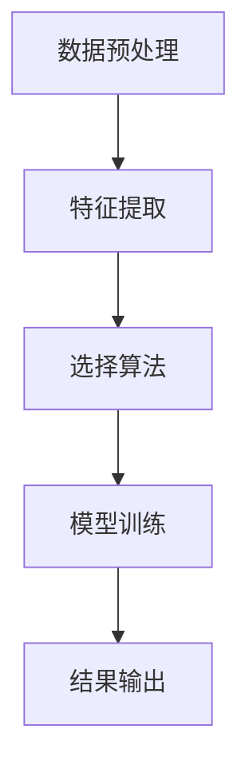
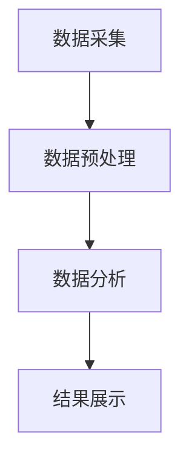
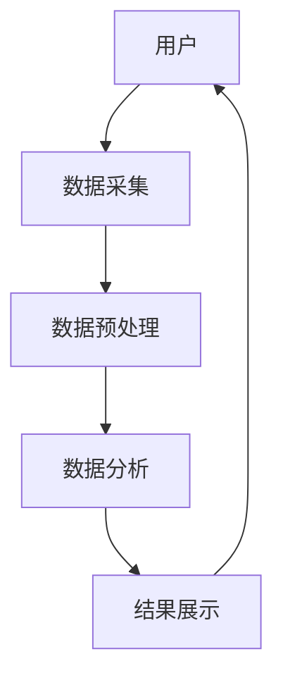

                 


```markdown
# 设计智能化的企业财务报表同行业对比分析系统

> 关键词：智能化财务分析、同行业对比、机器学习、数据预处理、聚类分析、系统架构设计

> 摘要：本文详细探讨了设计智能化的企业财务报表同行业对比分析系统的关键技术与实现方案。通过结合机器学习算法和大数据处理技术，提出了一套高效的财务数据处理与分析方法。本文从系统背景与意义、核心概念、算法原理、系统架构设计、项目实战等多个维度展开，深入分析了智能化财务报表分析系统的构建过程，为企业的财务管理提供了新的思路与实践方向。

---

# 第1章: 企业财务报表同行业对比分析概述

## 1.1 财务报表分析的背景与意义
### 1.1.1 财务报表分析的基本概念
财务报表是企业在经营活动中重要的记录工具，主要包括资产负债表、利润表和现金流量表。通过对财务报表的分析，可以全面了解企业的财务状况、经营成果和现金流量。

### 1.1.2 同行业对比分析的重要性
同行业对比分析是企业财务管理中的重要环节，通过将企业自身与同行业其他企业进行对比，可以发现自身的优势与不足，为决策提供数据支持。

### 1.1.3 智能化分析的必要性
随着企业数据量的急剧增长，传统的人工分析方式已无法满足高效、精准的需求，智能化分析成为必然趋势。

## 1.2 企业财务报表同行业对比分析的现状
### 1.2.1 传统财务分析的局限性
传统财务分析依赖人工经验，存在效率低、主观性强、结果不准确等问题。

### 1.2.2 数据量爆炸对企业分析的影响
随着企业数据量的增加，如何高效处理和分析海量数据成为企业财务部门面临的重要挑战。

### 1.2.3 智能化分析的市场需求
智能化分析能够快速处理大量数据，提供精准的分析结果，满足企业对高效财务管理的需求。

## 1.3 本章小结
本章从财务报表分析的基本概念出发，探讨了同行业对比分析的重要性，并结合当前数据量爆炸的背景，提出了智能化分析的必要性。

---

# 第2章: 企业财务报表同行业对比分析的核心概念

## 2.1 企业财务报表分析的基本概念
### 2.1.1 财务报表的构成
财务报表主要包括资产负债表、利润表和现金流量表，分别从不同角度反映企业的财务状况。

### 2.1.2 财务指标的分类
财务指标可以分为盈利能力、偿债能力、运营能力和成长能力四类。

### 2.1.3 同行业对比的定义
同行业对比是指将企业的财务指标与同行业其他企业的财务指标进行对比，分析其差异性和趋势。

## 2.2 同行业对比分析的原理
### 2.2.1 数据标准化的必要性
由于不同企业的财务数据可能存在量纲和量级的差异，需要对数据进行标准化处理，以便进行有效的对比分析。

### 2.2.2 行业基准的建立
行业基准是同行业对比分析的重要依据，通常可以通过行业平均值或行业最佳实践来建立。

### 2.2.3 数据差异化的处理方法
通过对数据进行标准化、归一化等处理，消除不同企业间的量纲差异，确保对比分析的有效性。

## 2.3 数据预处理与特征提取
### 2.3.1 数据清洗的基本步骤
数据清洗包括去除重复数据、处理缺失值、纠正异常值等步骤。

### 2.3.2 特征选择的方法
特征选择可以通过统计分析、相关性分析等方法，筛选出对分析结果影响较大的特征。

### 2.3.3 数据标准化的实现
通过归一化、标准化等方法，将不同量纲的财务数据转换为统一尺度，便于后续分析。

## 2.4 本章小结
本章详细介绍了企业财务报表分析的核心概念，包括财务报表的构成、财务指标的分类以及同行业对比分析的原理和数据预处理方法。

---

# 第3章: 智能化企业财务报表分析的算法原理

## 3.1 文本相似度计算
### 3.1.1 余弦相似度的定义
余弦相似度是一种常用的文本相似度计算方法，其公式为：
$$\text{相似度} = \frac{\vec{A} \cdot \vec{B}}{|\vec{A}| |\vec{B}|}$$

### 3.1.2 聚类分析的基本原理
聚类分析是一种无监督学习方法，通过将相似的数据点分组，发现数据中的潜在结构。

### 3.1.3 文本相似度计算的数学模型
文本相似度计算可以通过向量空间模型、词袋模型等方法实现，其中向量空间模型是常用的数学模型。

## 3.2 聚类分析算法
### 3.2.1 K-means算法的实现步骤
K-means算法的实现步骤包括：初始化聚类中心、计算每个数据点的最近聚类中心、更新聚类中心，直到收敛。

### 3.2.2 聚类中心的计算方法
聚类中心的计算方法是将每个聚类中的数据点取平均值，公式为：
$$\text{聚类中心} = \frac{1}{n}\sum_{i=1}^{n} x_i$$

### 3.2.3 聚类评估指标的对比分析
聚类评估指标包括轮廓系数、Davies-Bouldin指数等，可以通过对比分析选择最优的聚类结果。

## 3.3 算法实现的流程图


## 3.4 本章小结
本章详细讲解了智能化企业财务报表分析的算法原理，包括文本相似度计算和聚类分析的基本原理、实现步骤和数学模型。

---

# 第4章: 系统架构与设计方案

## 4.1 系统功能模块划分
### 4.1.1 数据采集模块
数据采集模块负责从企业财务系统中获取财务数据。

### 4.1.2 数据预处理模块
数据预处理模块对采集到的财务数据进行清洗、标准化和特征提取。

### 4.1.3 数据分析模块
数据分析模块利用机器学习算法对预处理后的数据进行建模和分析。

### 4.1.4 结果展示模块
结果展示模块将分析结果以可视化的方式呈现给用户。

## 4.2 系统架构设计
### 4.2.1 系统功能模块之间的关系


### 4.2.2 系统交互流程


## 4.3 本章小结
本章从系统功能模块划分和系统架构设计两个方面，详细介绍了智能化企业财务报表同行业对比分析系统的构建过程。

---

# 第5章: 项目实战与代码实现

## 5.1 环境配置
### 5.1.1 安装Python和相关库
安装Python和Pandas、Scikit-learn、Matplotlib等库，用于数据处理和可视化。

### 5.1.2 数据获取
从企业财务系统中获取财务数据，并将其存储为CSV格式。

## 5.2 核心代码实现
### 5.2.1 数据预处理代码
```python
import pandas as pd

# 读取数据
data = pd.read_csv('financial_data.csv')

# 处理缺失值
data = data.dropna()

# 标准化处理
from sklearn.preprocessing import StandardScaler
scaler = StandardScaler()
data_scaled = scaler.fit_transform(data)
```

### 5.2.2 聚类分析代码
```python
from sklearn.cluster import KMeans

# 初始化聚类中心
kmeans = KMeans(n_clusters=3, random_state=0)

# 训练模型
kmeans.fit(data_scaled)

# 获取聚类结果
clusters = kmeans.predict(data_scaled)
```

### 5.2.3 结果展示代码
```python
import matplotlib.pyplot as plt

# 绘制聚类结果
plt.scatter(data_scaled[:, 0], data_scaled[:, 1], c=clusters)
plt.show()
```

## 5.3 项目小结
本章通过具体的项目实战，详细讲解了智能化企业财务报表同行业对比分析系统的实现过程，包括环境配置、数据预处理、算法实现和结果展示。

---

# 第6章: 总结与展望

## 6.1 本章总结
本文详细探讨了设计智能化的企业财务报表同行业对比分析系统的关键技术与实现方案，包括系统背景、核心概念、算法原理、系统架构设计和项目实战。

## 6.2 未来展望
随着人工智能技术的不断发展，智能化财务分析将更加高效和精准。未来的研究方向可以包括更复杂的算法优化、多维度数据融合分析以及实时数据分析等。

## 6.3 最佳实践 tips
在实际应用中，建议企业结合自身需求，选择合适的算法和工具，逐步推进智能化财务分析的实施。

---

# 作者：AI天才研究院/AI Genius Institute & 禅与计算机程序设计艺术 /Zen And The Art of Computer Programming
```

