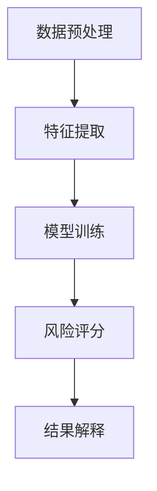

                 


# 设计智能化的企业财务报表舞弊风险评分系统

---

## 关键词：财务报表，舞弊风险，评分系统，人工智能，企业财务

---

## 摘要：  
本文详细探讨了设计智能化的企业财务报表舞弊风险评分系统的关键技术与方法。通过结合机器学习、数据分析和财务审计的最新进展，本文提出了一个基于多维度特征分析的智能化评分模型，能够有效识别和量化企业财务报表中的舞弊风险。文章从系统背景、核心概念、算法原理、系统架构到实际案例，全面分析了该系统的构建过程，并通过实战案例展示了其在企业风险管理中的实际应用价值。

---

# 第一部分：企业财务报表舞弊风险评分系统背景与核心概念

## 第1章：企业财务报表舞弊风险评分系统概述

### 1.1 企业财务报表舞弊的现状与挑战

#### 1.1.1 财务报表舞弊的定义与特征  
企业财务报表舞弊是指企业通过故意虚构、篡改或隐瞒财务数据，以误导利益相关者（如投资者、债权人、监管机构等）的行为。其主要特征包括：  
- **隐蔽性**：舞弊行为通常隐藏在正常的财务数据背后，难以直接察觉。  
- **目的性**：舞弊行为通常是为了掩盖财务问题、逃避债务或虚增业绩。  
- **多样性**：舞弊手段多样，包括虚增收入、隐瞒债务、虚减成本等。  

#### 1.1.2 当前企业财务报表舞弊的主要形式  
目前，企业财务报表舞弊的主要形式包括：  
1. **虚构交易**：通过伪造交易记录虚增收入或资产。  
2. **隐瞒负债**：通过隐藏债务或虚假抵销虚减负债。  
3. **虚增资产**：通过高估资产价值或虚构资产虚增资产总额。  
4. **操控利润**：通过调整收入和支出的时间性，操控利润表数据。  

#### 1.1.3 舞弊对企业及利益相关者的影响  
财务报表舞弊行为不仅损害企业的声誉和利益，还可能对利益相关者造成重大损失。例如：  
- 投资者可能基于虚假财务数据做出错误决策，导致投资损失。  
- 债权人可能因企业虚增资产或隐瞒负债而面临债务违约风险。  
- 监管机构可能因企业舞弊行为而失去对市场的有效监管。  

---

### 1.2 财务报表舞弊风险评分系统的重要性  

#### 1.2.1 传统财务审计的局限性  
传统财务审计主要依赖于人工检查和抽样分析，存在以下局限性：  
- **效率低下**：人工审计耗时长，成本高。  
- **主观性较强**：审计结果依赖于审计师的经验和判断。  
- **覆盖面有限**：抽样分析可能导致部分舞弊行为被遗漏。  

#### 1.2.2 智能化评分系统在企业财务管理中的价值  
智能化财务报表舞弊风险评分系统能够通过大数据分析和机器学习技术，快速识别财务数据中的异常模式，显著提升审计效率和准确性。其主要价值体现在：  
1. **实时监控**：系统可以实时分析财务数据，及时发现潜在舞弊行为。  
2. **精准识别**：通过多维度特征分析，系统能够精准识别高风险交易。  
3. **成本降低**：智能化系统可以大幅减少人工审计的时间和成本。  

#### 1.2.3 舞弊风险评分系统的社会与经济效益  
- **社会效益**：通过降低舞弊行为的发生率，维护市场秩序和投资者信心。  
- **经济效益**：帮助企业减少因舞弊行为导致的经济损失，提升财务管理效率。  

---

### 1.3 本章小结  
本章从企业财务报表舞弊的现状与挑战入手，分析了传统财务审计的局限性，并重点阐述了智能化舞弊风险评分系统的重要性和价值。下一章将详细探讨该系统的核心概念与技术实现。

---

## 第2章：财务报表舞弊风险评分系统的核心概念  

### 2.1 财务报表舞弊风险评分模型  

#### 2.1.1 模型的定义与核心要素  
财务报表舞弊风险评分模型是一种基于机器学习的预测模型，旨在通过分析财务数据中的异常特征，量化企业财务报表的舞弊风险。其核心要素包括：  
1. **输入数据**：包括财务数据、业务数据和外部数据。  
2. **模型算法**：采用机器学习算法（如随机森林、支持向量机等）进行风险预测。  
3. **输出结果**：生成舞弊风险评分和风险等级。  

#### 2.1.2 模型的输入变量与输出结果  
- **输入变量**：  
  - 财务数据：收入、成本、利润、资产、负债等。  
  - 业务数据：交易金额、交易时间、交易类型等。  
  - 外部数据：行业基准、市场环境、企业声誉等。  
- **输出结果**：  
  - 舞弊风险评分：0-100分，分数越高，风险越大。  
  - 风险等级：分为低、中、高三个等级。  

#### 2.1.3 模型的评价标准与优化方向  
- **评价标准**：准确率、召回率、F1分数等。  
- **优化方向**：  
  - 数据预处理：特征选择、数据清洗。  
  - 模型调优：参数优化、算法选择。  

---

### 2.2 舞弊风险评分系统的关键属性  

#### 2.2.1 数据驱动性  
系统基于大量历史数据和实时数据，通过数据挖掘和分析，发现潜在舞弊模式。  

#### 2.2.2 智能性与自适应性  
系统能够根据新的数据和环境变化，自动调整模型参数，提升预测准确性。  

#### 2.2.3 可解释性与可操作性  
系统的评分结果需要具有可解释性，便于财务人员理解和采取应对措施。  

---

### 2.3 财务报表舞弊风险评分系统的ER实体关系图  

```mermaid
erDiagram
    actor 用户角色 {
        <属性> 用户ID
        <属性> 用户类型
        <属性> 用户权限
    }
    entity 财务数据 {
        <属性> 会计科目
        <属性> 交易金额
        <属性> 交易时间
        <属性> 交易类型
    }
    entity 舞弊风险评分 {
        <属性> 评分结果
        <属性> 风险等级
        <属性> 可能性评分
        <属性> 影响程度评分
    }
    user --> 财务数据 : 提供
    财务数据 --> 舞弊风险评分 : 生成
```

---

### 2.4 本章小结  
本章详细阐述了财务报表舞弊风险评分系统的核心概念与关键属性，并通过ER实体关系图展示了系统的数据流和实体关系。下一章将深入探讨系统的算法原理和技术实现。

---

## 第3章：财务报表舞弊风险评分系统的算法原理  

### 3.1 评分模型的算法选择  

#### 3.1.1 传统统计模型  
传统统计模型（如逻辑回归）适用于小规模数据的分析，但在处理大规模复杂数据时表现有限。  

#### 3.1.2 机器学习模型  
- **支持向量机（SVM）**：适用于分类问题，但对高维数据的处理能力有限。  
- **随机森林**：通过集成学习提升模型的准确性和鲁棒性。  
- **梯度提升树（如XGBoost、LightGBM）**：在分类和回归任务中表现优秀。  

#### 3.1.3 深度学习模型  
- **神经网络**：适用于复杂非线性关系的建模，但在小样本数据上可能过拟合。  

---

### 3.2 基于机器学习的舞弊风险评分算法  



---

### 3.3 算法的数学模型与公式  

#### 3.3.1 线性回归模型  
$$ y = \beta_0 + \beta_1x_1 + \beta_2x_2 + \dots + \beta_nx_n + \epsilon $$
其中，$y$ 是输出变量，$x_i$ 是输入变量，$\beta_i$ 是模型参数，$\epsilon$ 是误差项。  

#### 3.3.2 逻辑回归模型  
$$ P(Y=1|X) = \frac{1}{1 + e^{-(\beta_0 + \beta_1x_1 + \dots + \beta_nx_n)}} $$  
通过极大似然估计法求解模型参数，实现分类任务。  

---

### 3.4 本章小结  
本章详细介绍了财务报表舞弊风险评分系统的算法选择和实现过程，并通过数学公式和流程图展示了系统的算法原理。下一章将从系统架构和实现的角度，进一步探讨系统的具体设计。

---

# 结语  
设计智能化的企业财务报表舞弊风险评分系统是一项复杂但具有重要意义的技术任务。通过结合机器学习、大数据分析和财务审计的最新进展，我们能够构建一个高效、准确的舞弊风险评分系统，为企业财务管理提供有力支持。未来，随着人工智能技术的不断发展，舞弊风险评分系统将更加智能化和精准化，为企业和社会创造更大的价值。

---

**作者：AI天才研究院/AI Genius Institute & 禅与计算机程序设计艺术 /Zen And The Art of Computer Programming**

