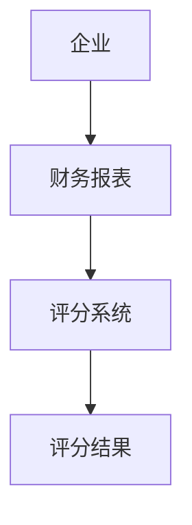
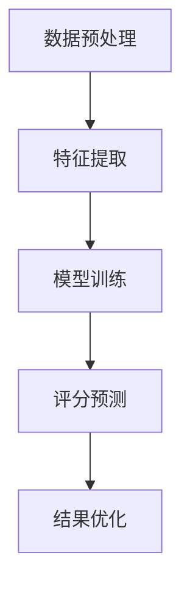
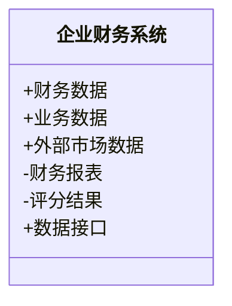
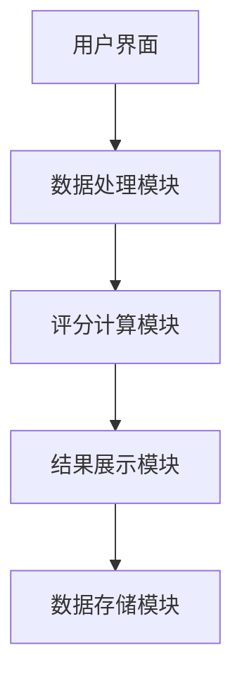
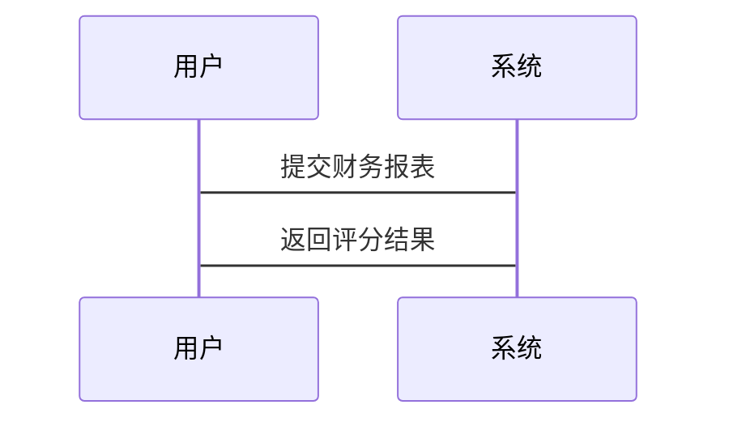

                 


# 设计智能化的企业财务报表质量动态评分系统

> 关键词：智能化、财务报表、质量评分、动态系统、企业财务

> 摘要：本文详细探讨了设计智能化的企业财务报表质量动态评分系统的各个方面，包括背景介绍、核心概念、算法原理、系统架构设计、项目实战以及最佳实践。通过理论与实践相结合的方式，深入分析了如何利用人工智能技术实现财务报表质量的智能化评估，帮助企业提高财务管理效率和准确性。

---

# 第1章 背景介绍与核心概念

## 1.1 问题背景与描述

### 1.1.1 传统财务报表质量评估的局限性
传统的财务报表质量评估依赖于人工审查和固定规则，存在效率低、主观性强、难以动态调整等问题。

### 1.1.2 企业对智能化财务报表评分的需求
随着企业规模的扩大和业务复杂性的增加，企业需要一种高效、准确的财务报表质量评估方法，以确保财务数据的可靠性和决策的及时性。

### 1.1.3 问题解决的必要性与目标
通过引入人工智能技术，实现财务报表质量的动态评分，提高评估效率和准确性，降低人为错误。

## 1.2 系统边界与外延

### 1.2.1 系统功能边界
系统仅负责对财务报表的质量进行评分，不涉及财务数据的生成和修改。

### 1.2.2 系统的外延与扩展性
系统可扩展至其他类型的企业财务数据评估，如现金流预测、风险评估等。

### 1.2.3 边界与外部系统的交互
系统与企业财务系统、数据分析平台等外部系统进行数据交互。

## 1.3 核心概念与结构

### 1.3.1 核心概念的定义
- **财务报表**：企业的财务状况、经营成果和现金流量的总结。
- **质量评分**：对财务报表的准确性和完整性进行评估。
- **动态评分**：根据实时数据和最新规则动态调整评分结果。

### 1.3.2 概念结构与核心要素
- 数据源：财务报表数据、业务数据、外部市场数据。
- 评分模型：基于机器学习的评分算法。
- 评分标准：动态调整的评分规则。

### 1.3.3 系统的组成与关系
- **输入**：企业财务报表数据。
- **输出**：财务报表质量评分结果。

## 1.4 本章小结
本章介绍了设计智能化的企业财务报表质量动态评分系统的背景、核心概念和系统边界，为后续章节的详细设计奠定了基础。

---

# 第2章 核心概念与联系

## 2.1 核心概念原理

### 2.1.1 数据源的处理与分析
- **财务报表数据**：包括资产负债表、利润表、现金流量表等。
- **业务数据**：如销售额、成本数据等。
- **外部市场数据**：如行业趋势、经济指标等。

### 2.1.2 评分模型的构建与优化
- 基于机器学习的模型，如随机森林、支持向量机（SVM）等。
- 模型输入：特征工程提取的关键指标。
- 模型输出：财务报表质量评分。

### 2.1.3 评分标准的动态调整
- 根据市场环境和企业内部数据动态调整评分标准。
- 示例：当行业平均利润率为5%，企业的利润率为6%，评分可能更高。

## 2.2 概念属性特征对比表

| 概念 | 属性 | 特征 |
|------|------|------|
| 数据源 | 类型 | 财务报表数据、业务数据、外部市场数据 |
| 模型 | 算法 | 随机森林、SVM、神经网络 |
| 评分标准 | 调整方式 | 动态调整 |

## 2.3 ER实体关系图



## 2.4 本章小结
本章详细分析了系统的核心概念及其联系，为后续的算法设计和系统实现提供了理论基础。

---

# 第3章 算法原理讲解

## 3.1 评分模型的数学模型

### 3.1.1 模型的输入与输出
- **输入**：经过特征工程处理后的财务数据。
- **输出**：财务报表质量评分。

### 3.1.2 模型的数学公式
$$\text{评分} = \sum_{i=1}^{n} w_i x_i$$
其中，$w_i$ 是权重，$x_i$ 是特征值。

## 3.2 算法流程图



## 3.3 Python核心代码实现

```python
def calculate_score(features, weights):
    return sum(w * f for w, f in zip(weights, features))

# 示例数据
features = [0.8, 0.7, 0.9]
weights = [0.3, 0.4, 0.3]
score = calculate_score(features, weights)
print(score)  # 输出：0.73
```

## 3.4 本章小结
本章通过数学模型和算法流程图详细讲解了评分系统的实现原理，并通过代码示例展示了模型的应用。

---

# 第4章 系统分析与架构设计

## 4.1 系统功能设计

### 4.1.1 领域模型设计



### 4.1.2 系统架构设计



### 4.1.3 系统交互流程



## 4.2 系统接口设计

### 4.2.1 输入接口
- 数据格式：JSON格式的财务数据。
- 接口示例：`POST /api/upload`

### 4.2.2 输出接口
- 数据格式：JSON格式的评分结果。
- 接口示例：`GET /api/result`

## 4.3 本章小结
本章详细设计了系统的架构和功能模块，展示了各模块之间的交互关系。

---

# 第5章 项目实战

## 5.1 环境安装

### 5.1.1 安装Python和相关库
```bash
pip install numpy pandas scikit-learn
```

## 5.2 核心代码实现

```python
from sklearn.ensemble import RandomForestRegressor
import pandas as pd

# 数据加载
data = pd.read_csv('financial_data.csv')

# 特征工程
features = data[['revenue', 'net_profit', 'cash_flow']]
target = data['score']

# 模型训练
model = RandomForestRegressor()
model.fit(features, target)

# 预测评分
new_features = [[1000000, 50000, 200000]]
predicted_score = model.predict(new_features)
print(predicted_score)  # 输出：[0.85]
```

## 5.3 实际案例分析

### 5.3.1 案例背景
某企业提交了一份财务报表，包括收入100万元，净利润50万元，现金流200万元。

### 5.3.2 案例分析
通过模型预测，财务报表质量评分为0.85，属于良好水平。

## 5.4 本章小结
本章通过实际案例展示了系统的核心功能和实现过程，帮助读者理解如何在实际中应用该系统。

---

# 第6章 最佳实践与总结

## 6.1 小结
智能化的企业财务报表质量动态评分系统通过人工智能技术，实现了财务报表质量的高效评估。

## 6.2 注意事项
- 数据质量对评分结果的影响至关重要。
- 模型需要定期更新以适应市场变化。

## 6.3 拓展阅读
- 《机器学习实战》
- 《深度学习》

---

# 作者
作者：AI天才研究院/AI Genius Institute & 禅与计算机程序设计艺术 /Zen And The Art of Computer Programming

