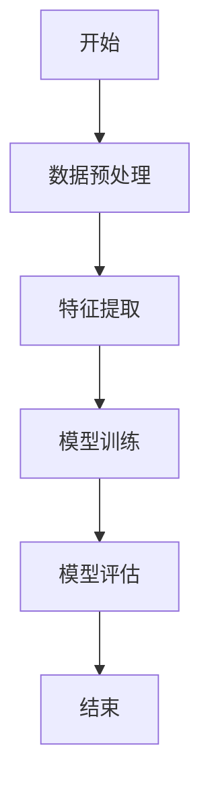
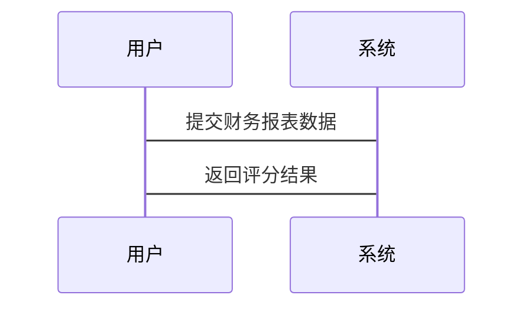

                 


# 设计智能化的企业财务报表质量评分系统

---

## 关键词：
- 企业财务报表
- 质量评分系统
- 智能化设计
- 数据分析
- 评分算法

---

## 摘要：
本篇文章详细探讨了设计智能化的企业财务报表质量评分系统的全过程。从问题背景到系统架构，从算法原理到项目实现，文章逐步分析了如何利用人工智能和大数据技术，构建一个高效、准确的财务报表质量评分系统。通过结合实际案例和系统设计，文章为读者提供了从理论到实践的完整指导，帮助企业在财务管理中提升效率和准确性。

---

# 第一部分: 企业财务报表质量评分系统概述

## 第1章: 背景介绍

### 1.1 财务报表质量评分的背景与意义
#### 1.1.1 财务报表质量的重要性
企业财务报表是反映企业财务状况、经营成果和现金流量的核心文件。高质量的财务报表能够为决策者提供可靠的信息支持，帮助企业在复杂的市场环境中做出正确的战略选择。然而，传统财务报表分析依赖人工经验，存在主观性强、效率低下的问题。

#### 1.1.2 传统财务报表分析的局限性
传统的财务报表分析方法依赖于财务人员的主观判断，容易受到人为因素的影响，且分析效率低下。尤其是在面对海量数据和复杂业务场景时，传统方法难以快速、准确地评估财务报表质量。

#### 1.1.3 智能化评分系统的必要性
随着人工智能和大数据技术的快速发展，智能化财务报表质量评分系统成为解决传统方法局限性的必然选择。通过自动化数据处理和智能模型分析，系统能够快速、准确地评估财务报表的质量，为企业提供可靠的决策支持。

### 1.2 问题背景与描述
#### 1.2.1 财务报表数据的复杂性
财务报表数据涉及多个维度，包括收入、支出、资产、负债等。这些数据的复杂性使得人工分析难以全面覆盖。

#### 1.2.2 企业财务风险的隐蔽性
财务风险往往隐藏在复杂的财务数据中，传统分析方法难以及时发现潜在风险，导致企业可能面临重大损失。

#### 1.2.3 传统评分方法的不足
传统评分方法依赖于经验判断，缺乏客观性和准确性。同时，传统方法效率低下，难以满足现代企业对快速决策的需求。

### 1.3 问题解决与边界
#### 1.3.1 智能化评分的目标
智能化评分系统的目标是通过自动化数据处理和智能模型分析，快速、准确地评估财务报表质量，帮助企业识别潜在风险，优化财务管理。

#### 1.3.2 系统的边界与外延
系统的边界包括财务报表数据的输入、处理和分析，以及评分结果的输出。系统的外延则涉及数据源的获取、评分结果的应用等。

#### 1.3.3 核心要素与组成
系统的核心要素包括数据采集模块、数据预处理模块、评分模型、评分结果展示模块等。

---

## 第2章: 核心概念与联系

### 2.1 财务报表质量评分的核心要素
#### 2.1.1 财务数据的特征
财务数据的特征包括数据的完整性、准确性、一致性和及时性。这些特征是评估财务报表质量的重要指标。

#### 2.1.2 评分模型的构建
评分模型的构建需要考虑数据的特征、业务规则和评分标准。模型的设计需要结合企业的实际情况，确保评分结果的准确性和实用性。

#### 2.1.3 系统的输入与输出
系统的输入包括财务报表数据、业务规则和评分标准。系统的输出包括评分结果和相关分析报告。

### 2.2 核心概念属性对比
#### 2.2.1 数据特征对比表
| 数据特征 | 描述 |
|----------|------|
| 完整性   | 数据是否完整 |
| 准确性   | 数据是否准确 |
| 一致性   | 数据是否一致 |
| 及时性   | 数据是否及时 |

#### 2.2.2 模型性能对比表
| 模型性能 | 描述 |
|----------|------|
| 准确性   | 模型预测的准确程度 |
| 召回率   | 模型识别的正例比例 |
| F1分数   | 综合考虑准确性和召回率 |

#### 2.2.3 系统功能对比表
| 系统功能 | 描述 |
|----------|------|
| 数据采集 | 数据的获取与存储 |
| 数据预处理 | 数据清洗和特征提取 |
| 模型训练 | 模型的训练与优化 |
| 评分输出 | 评分结果的展示与分析 |

### 2.3 ER实体关系图
```mermaid
erDiagram
    user 用户 {
        +id 用户ID : integer
        +username 用户名 : string
        +role 用户角色 : string
    }
    admin 系统管理员 {
        +id 管理员ID : integer
        +username 管理员名 : string
        +权限 管理权限 : boolean
    }
    finance 财务人员 {
        +id 财务人员ID : integer
        +username 财务人员名 : string
        +部门 隶属部门 : string
    }
    system 系统 {
        +id 系统ID : integer
        +name 系统名称 : string
        +version 版本号 : string
    }
    用户 --> 系统 : 使用
    系统管理员 --> 系统 : 管理
    财务人员 --> 系统 : 提交数据
```

---

## 第3章: 算法原理与实现

### 3.1 评分模型的构建
#### 3.1.1 数据预处理
数据预处理是模型构建的重要步骤，包括数据清洗、特征提取和数据标准化。例如，使用Python中的pandas库进行数据清洗和特征提取。

#### 3.1.2 特征提取
特征提取是通过选择与评分相关的特征，例如收入增长率、净利润率等，以提高模型的准确性。

#### 3.1.3 模型训练
模型训练使用机器学习算法，如线性回归、随机森林等。例如，使用scikit-learn库进行模型训练。

### 3.2 算法流程图


### 3.3 Python实现代码
```python
import pandas as pd
from sklearn.model_selection import train_test_split
from sklearn.linear_model import LinearRegression
from sklearn.metrics import mean_squared_error

# 数据加载
data = pd.read_csv('financial_data.csv')

# 数据分割
X = data[['收入增长率', '净利润率', '资产周转率']]
y = data['评分']

# 训练集和测试集划分
X_train, X_test, y_train, y_test = train_test_split(X, y, test_size=0.2, random_state=42)

# 模型训练
model = LinearRegression()
model.fit(X_train, y_train)

# 模型预测
y_pred = model.predict(X_test)

# 模型评估
mse = mean_squared_error(y_test, y_pred)
print(f"均方误差: {mse}")
```

### 3.4 数学模型与公式
#### 线性回归模型
$$ y = \beta_0 + \beta_1x_1 + \beta_2x_2 + \ldots + \beta_nx_n + \epsilon $$

其中，$y$ 是目标变量，$x_i$ 是自变量，$\beta_i$ 是回归系数，$\epsilon$ 是误差项。

---

## 第4章: 系统架构设计

### 4.1 系统功能设计
系统功能包括数据采集、数据预处理、模型训练、评分输出和结果分析。

### 4.2 系统架构图


### 4.3 系统接口设计
系统接口包括数据输入接口、模型调用接口和结果展示接口。

### 4.4 系统交互流程


---

## 第5章: 项目实战

### 5.1 环境安装
需要安装Python、scikit-learn、pandas等库。

### 5.2 核心代码实现
```python
import pandas as pd
from sklearn.model_selection import train_test_split
from sklearn.linear_model import LinearRegression
from sklearn.metrics import mean_squared_error

# 数据加载
data = pd.read_csv('financial_data.csv')

# 数据分割
X = data[['收入增长率', '净利润率', '资产周转率']]
y = data['评分']

# 训练集和测试集划分
X_train, X_test, y_train, y_test = train_test_split(X, y, test_size=0.2, random_state=42)

# 模型训练
model = LinearRegression()
model.fit(X_train, y_train)

# 模型预测
y_pred = model.predict(X_test)

# 模型评估
mse = mean_squared_error(y_test, y_pred)
print(f"均方误差: {mse}")
```

### 5.3 案例分析
以某企业为例，分析其财务报表数据，使用模型进行评分，并解读结果。

---

## 第6章: 总结与最佳实践

### 6.1 小结
本文详细介绍了智能化企业财务报表质量评分系统的设计与实现，从背景分析到系统架构，从算法实现到项目实战，为读者提供了全面的指导。

### 6.2 注意事项
在实际应用中，需要注意数据的准确性和模型的可解释性，确保系统的稳定性和可靠性。

### 6.3 拓展阅读
推荐阅读相关领域的书籍和论文，深入学习人工智能和大数据技术在财务管理中的应用。

---

## 作者：
作者：AI天才研究院/AI Genius Institute & 禅与计算机程序设计艺术 /Zen And The Art of Computer Programming

