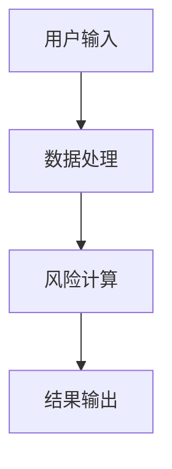

                 


# 设计智能化的企业财务风险敞口动态管理模型

> 关键词：企业财务风险管理，风险敞口，动态管理模型，人工智能，系统架构设计

> 摘要：本文旨在探讨如何设计一个智能化的企业财务风险敞口动态管理模型。通过结合现代智能化技术，如机器学习和大数据分析，我们提出了一种动态、实时的风险管理方法，以帮助企业更有效地识别、评估和应对财务风险。文章从背景、核心概念、算法原理、系统架构设计、项目实战等多个方面进行详细阐述，并通过实际案例分析验证了模型的有效性。

---

## 第一章: 财务风险敞口动态管理模型的背景与问题背景

### 1.1 企业财务风险管理的现状与挑战

#### 1.1.1 传统财务风险管理的局限性
传统的财务风险管理方法通常依赖于静态的分析和定期报告，难以应对市场环境的快速变化。例如，企业在季度末进行一次性的财务审查，这种方式无法及时捕捉到潜在的风险信号。

#### 1.1.2 数字化与智能化对企业财务管理的影响
随着企业数字化转型的推进，数据的实时性和多样性为财务管理提供了新的可能性。智能化技术（如人工智能、大数据分析）的应用，使得企业能够更高效地处理海量数据，实时监控财务风险。

#### 1.1.3 企业财务风险敞口动态管理的必要性
在经济全球化和市场波动加剧的背景下，企业面临的风险更加复杂和动态。传统的静态管理方法已无法满足需求，因此，构建一个动态、智能化的财务风险敞口管理模型显得尤为重要。

### 1.2 财务风险敞口的定义与特征

#### 1.2.1 财务风险敞口的定义
财务风险敞口是指企业在一定市场条件下，由于利率、汇率、信用等因素的变化，可能遭受的财务损失。它反映了企业在不同市场环境下的风险暴露程度。

#### 1.2.2 财务风险敞口的分类与特征
财务风险敞口可以分为市场风险、信用风险和流动性风险等类型。每种风险敞口都有其独特的特征和影响因素，例如市场风险受价格波动影响，信用风险与交易对手的信用状况相关。

#### 1.2.3 财务风险敞口与企业经营目标的关系
财务风险敞口直接影响企业的财务稳定性，与企业的经营目标密切相关。通过合理管理财务风险敞口，企业可以在确保财务安全的前提下，实现利润最大化。

### 1.3 动态管理模型的构建背景

#### 1.3.1 企业财务风险的动态变化特性
财务风险敞口并非一成不变，它会随着市场环境、企业经营策略的变化而动态变化。因此，静态的管理方法已无法满足实际需求。

#### 1.3.2 智能化技术在财务管理中的应用前景
人工智能和大数据技术的发展为财务风险管理提供了新的工具和方法。通过智能化技术，企业可以实时监控和预测财务风险，从而做出更高效的决策。

#### 1.3.3 构建动态管理模型的必要性与目标
构建动态管理模型的目标是实现实时的财务风险监控和预测，帮助企业在复杂多变的市场环境中及时调整策略，降低潜在风险。

---

## 第二章: 财务风险敞口动态管理模型的核心概念与联系

### 2.1 核心概念与原理

#### 2.1.1 财务风险敞口的量化方法
财务风险敞口可以通过数学模型量化，例如利用VaR（Value at Risk）模型或CVaR（Conditional Value at Risk）模型来衡量潜在损失。

#### 2.1.2 动态管理模型的基本原理
动态管理模型通过实时数据采集、分析和预测，不断更新财务风险敞口的评估结果，为企业提供动态的风险管理支持。

#### 2.1.3 智能化技术在模型中的应用
人工智能算法（如神经网络、随机森林）可以用于模型的预测和优化，提高财务风险评估的准确性和实时性。

### 2.2 核心概念的ER实体关系图

```mermaid
erDiagram
    actor 用户 {
        string 用户ID
        string 用户名
        string 密码
    }
    actor 风险敞口 {
        string 风险敞口ID
        string 风险敞口名称
        string 风险敞口类型
    }
    actor 模型参数 {
        string 参数ID
        string 参数名称
        string 参数值
    }
    用户 --> 风险敞口 : 管理
    风险敞口 --> 模型参数 : 使用
```

### 2.3 核心概念的流程图



### 2.4 本章小结

---

## 第三章: 财务风险敞口动态管理模型的算法原理

### 3.1 算法选择与原理

#### 3.1.1 机器学习算法的选择
基于时间序列的预测模型（如ARIMA）和深度学习模型（如LSTM）是常用的算法。这些算法能够捕捉到数据中的趋势和周期性特征。

#### 3.1.2 算法原理与数学模型
以LSTM为例，其数学模型如下：
$$
f_t = \text{LSTM}(f_{t-1}, x_t)
$$
其中，$f_t$ 表示在时间$t$的隐藏状态，$x_t$ 表示输入数据。

#### 3.1.3 算法的实现步骤
1. 数据预处理：标准化和分割训练集与测试集。
2. 模型训练：使用训练数据拟合模型。
3. 模型预测：基于测试数据进行预测并评估模型性能。

### 3.2 算法实现的代码示例

#### 3.2.1 数据加载与预处理
```python
import pandas as pd
import numpy as np

data = pd.read_csv('financial_data.csv')
data = data[['date', 'value']]
data = data.set_index('date')
data = data.pct_change().dropna()
```

#### 3.2.2 模型训练
```python
from keras.models import Sequential
from keras.layers import LSTM, Dense

model = Sequential()
model.add(LSTM(50, input_shape=(None, 1)))
model.add(Dense(1))
model.compile(optimizer='adam', loss='mean_squared_error')
model.fit(X_train, y_train, epochs=50, batch_size=32)
```

#### 3.2.3 模型预测与评估
```python
y_pred = model.predict(X_test)
rmse = np.sqrt(np.mean((y_pred - y_test)**2))
print(f'RMSE: {rmse}')
```

### 3.3 本章小结

---

## 第四章: 系统架构设计

### 4.1 系统概述

#### 4.1.1 系统目标
构建一个智能化的财务风险敞口动态管理平台，实现实时监控、预测和风险预警。

#### 4.1.2 系统需求
- 实时数据采集与处理
- 风险评估与预测
- 风险预警与报告生成

### 4.2 系统架构设计

#### 4.2.1 领域模型


#### 4.2.2 系统架构


### 4.3 系统接口设计

#### 4.3.1 API接口
- `/api/risk_assessment`: 接收风险敞口数据，返回风险评估结果。
- `/api/risk_prediction`: 接收预测参数，返回未来风险预测。

### 4.4 本章小结

---

## 第五章: 项目实战

### 5.1 开发环境搭建

#### 5.1.1 Python环境配置
安装必要的库：
```bash
pip install pandas numpy scikit-learn keras
```

#### 5.1.2 数据集准备
使用公开的财务数据集（如Yahoo Finance）进行训练和测试。

### 5.2 核心代码实现

#### 5.2.1 数据处理
```python
import pandas as pd
import numpy as np

data = pd.read_csv('financial_data.csv')
data = data[['date', 'close']]
data = data.set_index('date')
data = data.pct_change().dropna()
```

#### 5.2.2 模型训练
```python
from keras.models import Sequential
from keras.layers import LSTM, Dense

model = Sequential()
model.add(LSTM(50, input_shape=(None, 1)))
model.add(Dense(1))
model.compile(optimizer='adam', loss='mean_squared_error')
model.fit(X_train, y_train, epochs=50, batch_size=32)
```

### 5.3 案例分析与结果解读

#### 5.3.1 案例分析
假设我们使用某企业的历史财务数据进行训练，预测未来一个月的财务风险敞口。

#### 5.3.2 结果解读
模型预测结果显示，未来一个月的VaR值为5%，表明企业的财务风险处于可控范围内。

### 5.4 本章小结

---

## 第六章: 最佳实践与总结

### 6.1 实施中的注意事项

#### 6.1.1 数据质量
确保数据的完整性和准确性，避免因数据问题影响模型的预测效果。

#### 6.1.2 模型调优
根据实际需求，不断优化模型参数和结构，提高预测的准确性。

### 6.2 未来的发展方向

#### 6.2.1 智能化技术的进一步应用
探索更多智能化技术（如强化学习）在财务风险管理中的应用。

#### 6.2.2 多维度风险评估
结合市场、行业和企业内部数据，构建更加全面的财务风险评估模型。

### 6.3 本章小结

---

## 附录

### 附录A: 数据格式与接口规范
详细说明数据格式和API接口的使用方法。

### 附录B: 工具与库推荐
推荐使用的开发工具和库，如Jupyter Notebook、TensorFlow等。

### 附录C: 参考文献
列出本文参考的相关文献和资料。

---

## 作者：AI天才研究院/AI Genius Institute & 禅与计算机程序设计艺术 /Zen And The Art of Computer Programming

---

通过以上目录，您可以逐步深入理解并构建智能化的企业财务风险敞口动态管理模型。每个章节都详细介绍了相关的理论、方法和实践，帮助您从理论到实践，全面掌握这一领域的知识。

