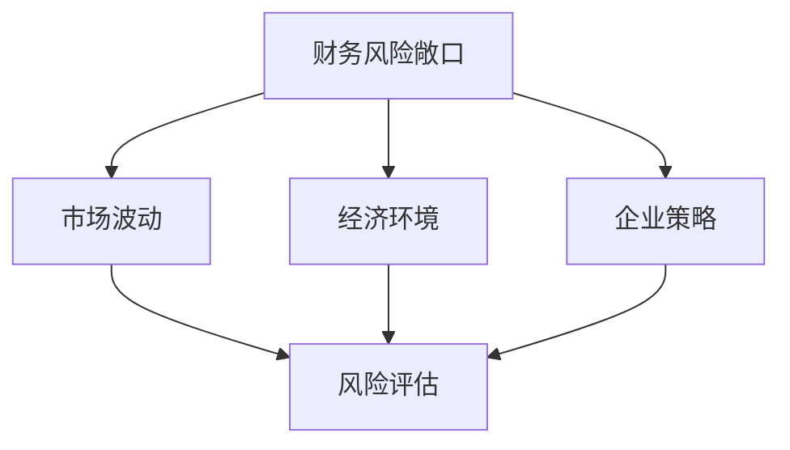
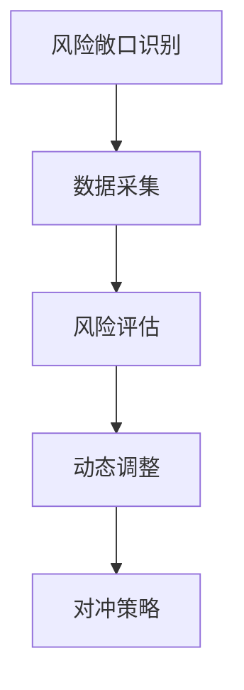
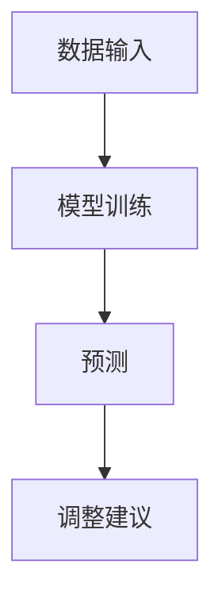
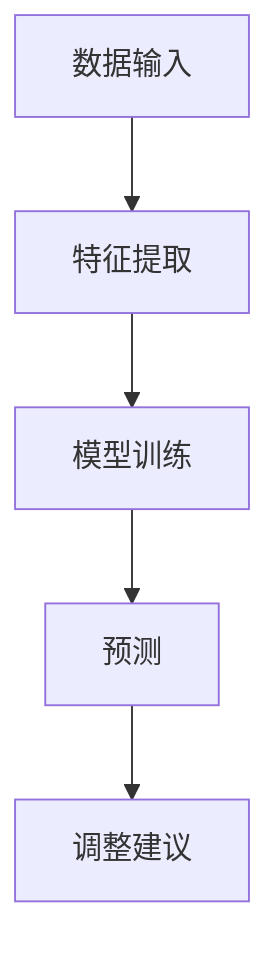
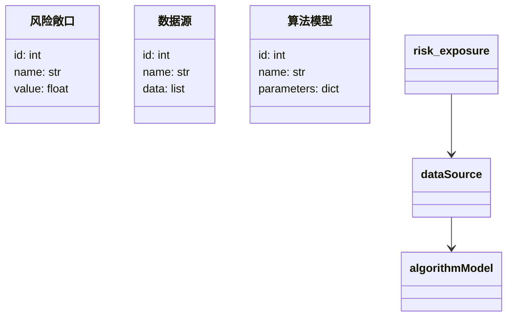
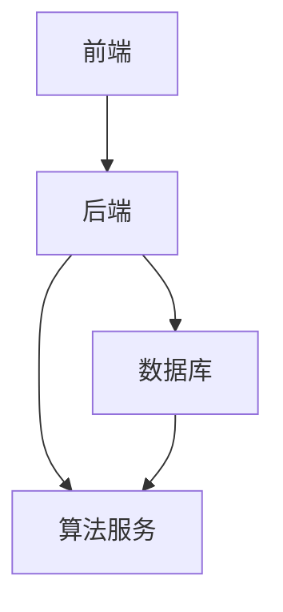

                 


# 设计智能化的企业财务风险敞口动态调整与对冲模型

> 关键词：企业财务风险，风险敞口，动态调整，对冲模型，人工智能，风险管理

> 摘要：本文详细探讨了设计智能化的企业财务风险敞口动态调整与对冲模型的核心概念、算法原理、系统架构和项目实战。文章从企业财务风险敞口的定义、动态变化的驱动因素、动态调整策略、对冲机制等多方面进行深入分析，结合实际案例，展示如何通过智能化技术实现企业财务风险的动态管理和优化。文章最后总结了设计和实施此类模型的关键点，并展望了未来的发展方向。

---

## 第一部分: 企业财务风险敞口动态调整与对冲模型的背景与概念

### 第1章: 企业财务风险敞口的定义与重要性

#### 1.1 企业财务风险敞口的定义
财务风险敞口是指企业在经营过程中由于市场波动、经济环境变化等因素，可能面临的财务损失或收益变动。企业财务风险敞口的核心特征包括：可测性、动态性、可控性以及相关性。

表1-1：财务风险敞口的核心特征对比

| 特征 | 描述 |
|------|------|
| 可测性 | 风险敞口可以通过定量方法进行测量和评估 |
| 动态性 | 风险敞口随时间变化，受到多种因素的影响 |
| 可控性 | 企业可以通过调整策略和对冲手段来降低风险敞口 |
| 相关性 | 风险敞口与其他财务指标和市场变量密切相关 |



#### 1.2 企业财务风险敞口的分类
企业财务风险敞口可以根据不同的维度进行分类，主要包括市场风险、信用风险、流动性风险和操作风险。每种风险类型都有其独特的特征和影响方式。

表1-2：企业财务风险敞口的分类

| 类型 | 描述 |
|------|------|
| 市场风险 | 由于市场价格波动导致的损失 |
| 信用风险 | 由于交易对手违约导致的损失 |
| 流动性风险 | 由于资产流动性不足导致的损失 |
| 操作风险 | 由于内部操作失误导致的损失 |

#### 1.3 企业财务风险敞口的动态变化
财务风险敞口的动态变化主要受到市场环境、企业内部策略调整以及外部经济政策变化等因素的影响。企业需要实时监测这些变化，以便及时调整风险管理策略。

---

### 第2章: 财务风险敞口动态调整与对冲的必要性

#### 2.1 企业风险管理的重要性
企业风险管理是确保企业稳健经营的重要手段。通过有效的风险管理，企业可以最大限度地降低潜在损失，优化资本配置，提升整体经营效率。

#### 2.2 财务风险敞口动态调整的必要性
在动态变化的市场环境中，企业需要根据实时数据和市场趋势，不断调整其财务风险敞口，以适应外部环境的变化。动态调整可以帮助企业在风险和收益之间找到最佳平衡点。

#### 2.3 对冲在财务风险管理中的作用
对冲是降低财务风险敞口的重要手段。通过对冲交易，企业可以在不改变整体投资策略的情况下，有效降低特定风险的影响。对冲策略的选择和优化是实现高效风险管理的关键。

---

## 第二部分: 财务风险敞口动态调整与对冲模型的核心概念

### 第3章: 财务风险敞口动态调整的核心要素

#### 3.1 风险敞口的识别与量化
风险敞口的识别与量化是动态调整的基础。通过分析企业的财务数据和市场信息，可以准确识别潜在风险，并通过量化指标评估其影响程度。

表3-1：风险敞口的识别与量化指标

| 指标 | 描述 |
|------|------|
| 波动率 | 描述资产价格的波动程度 |
| Value at Risk (VaR) | 在一定置信水平下，可能的最大损失 |
| Conditional Value at Risk (CVaR) | 在 VaR 基础上的尾部风险度量 |



#### 3.2 财务风险敞口的动态调整策略
动态调整策略需要结合实时数据和市场趋势，选择合适的调整时机和方式。常见的动态调整策略包括基于场景分析的调整、基于压力测试的调整以及基于实时数据的调整。

#### 3.3 财务风险敞口调整的数学模型
数学模型是实现动态调整的核心工具。时间序列分析和机器学习算法是常用的模型类型，能够有效捕捉市场趋势和风险变化。

图3-1: 时间序列分析流程图



---

### 第4章: 对冲模型的核心原理

#### 4.1 对冲的基本概念与原理
对冲是一种通过匹配资产组合来降低特定风险的策略。通过对冲交易，企业可以有效减少市场波动对企业财务状况的影响。

#### 4.2 对冲在风险控制中的应用
对冲策略在金融衍生品、资产配置和市场中性投资等领域有广泛应用。通过对冲，企业可以在不改变整体投资策略的情况下，降低特定风险。

#### 4.3 对冲策略的选择与优化
对冲策略的选择需要综合考虑企业的风险承受能力、市场环境和投资目标。优化对冲策略可以帮助企业实现风险与收益的最佳平衡。

---

## 第三部分: 财务风险敞口动态调整与对冲模型的算法原理

### 第5章: 动态调整算法的设计与实现

#### 5.1 时间序列分析
时间序列分析是动态调整的重要工具。通过分析历史数据，可以预测未来的市场趋势，并指导调整策略的选择。

图5-1: 时间序列分析流程图


#### 5.2 机器学习算法
机器学习算法能够有效捕捉市场中的非线性关系，提高风险评估的准确性。常用的算法包括支持向量机、随机森林和神经网络等。

图5-2: 机器学习算法流程图



#### 5.3 算法实现的Python代码示例

```python
import pandas as pd
from sklearn.linear_model import LinearRegression
from sklearn.metrics import mean_squared_error

# 数据加载
data = pd.read_csv('risk_data.csv')

# 特征和目标变量分离
X = data[['market_fluctuation', 'economic_indicator']]
y = data['risk_exposure']

# 模型训练
model = LinearRegression()
model.fit(X, y)

# 预测
y_pred = model.predict(X)

# 评估
mse = mean_squared_error(y, y_pred)
print(f"均方误差：{mse}")
```

---

### 第6章: 对冲模型的算法实现

#### 6.1 对冲策略的选择
对冲策略的选择需要考虑企业的风险承受能力和市场环境。常见的对冲策略包括delta中性和风险中性等。

#### 6.2 对冲模型的实现
对冲模型的实现需要结合动态调整的结果，选择合适的对冲工具和策略。

#### 6.3 对冲策略的优化
通过对冲策略的优化，可以进一步降低风险敞口，提高风险管理效率。

---

## 第四部分: 系统分析与架构设计

### 第7章: 系统功能设计

#### 7.1 领域模型设计
领域模型是系统设计的核心，描述了系统中的核心实体及其关系。

图7-1: 领域模型类图



#### 7.2 系统架构设计
系统架构设计需要考虑系统的可扩展性、可维护性和性能优化。

图7-2: 系统架构图



---

## 第五部分: 项目实战

### 第8章: 项目实施与案例分析

#### 8.1 环境安装与配置
项目实施需要安装必要的软件和工具，包括Python、Jupyter Notebook和相关库的安装。

#### 8.2 核心代码实现
以下是核心代码实现的示例：

```python
import pandas as pd
from sklearn.linear_model import LinearRegression
from sklearn.metrics import mean_squared_error

# 数据加载
data = pd.read_csv('risk_data.csv')

# 特征和目标变量分离
X = data[['market_fluctuation', 'economic_indicator']]
y = data['risk_exposure']

# 模型训练
model = LinearRegression()
model.fit(X, y)

# 预测
y_pred = model.predict(X)

# 评估
mse = mean_squared_error(y, y_pred)
print(f"均方误差：{mse}")
```

#### 8.3 案例分析与结果解读
通过实际案例分析，展示模型的应用效果和实际价值。

---

## 第六部分: 总结与展望

### 第9章: 总结与最佳实践

#### 9.1 总结
本文详细探讨了智能化的企业财务风险敞口动态调整与对冲模型的设计与实现，结合实际案例，展示了如何通过智能化技术实现企业风险管理的优化。

#### 9.2 最佳实践
在实际应用中，企业需要结合自身的业务特点和市场环境，选择合适的模型和策略。同时，需要不断优化模型，提高风险管理的效率和效果。

---

## 附录

### 附录A: 相关数学公式

$$\text{VaR} = \mu + z \cdot \sigma$$

其中，$\mu$ 是均值，$z$ 是标准正态分布的分位数，$\sigma$ 是标准差。

### 附录B: 数据来源与参考文献

[1]风险管理基础理论，作者：XXX

[2]时间序列分析方法，作者：XXX

---

作者：AI天才研究院/AI Genius Institute & 禅与计算机程序设计艺术 /Zen And The Art of Computer Programming

