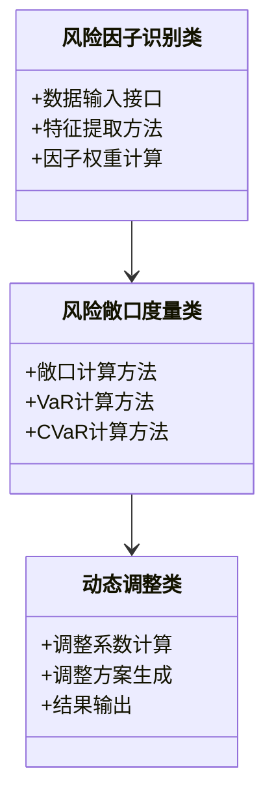
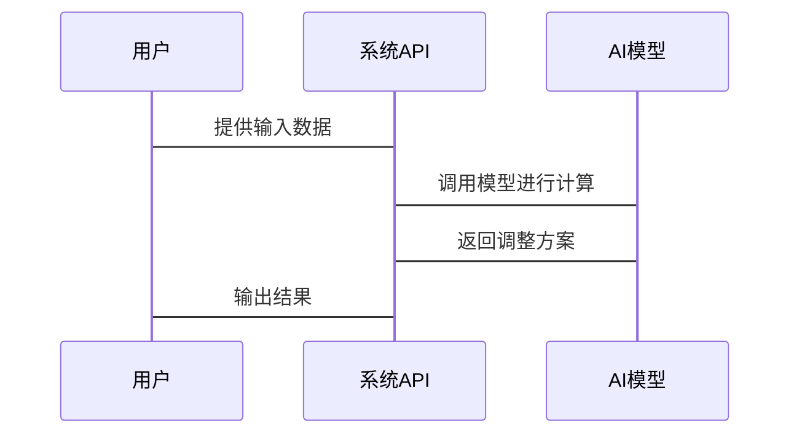

                 


# 设计智能化的企业财务风险敞口动态调整模型

> **关键词**：企业财务风险管理，风险敞口，动态调整模型，智能化，风险管理算法，系统架构设计

> **摘要**：本文旨在设计一种智能化的企业财务风险敞口动态调整模型，通过结合现代数据分析技术和人工智能算法，实现对财务风险敞口的实时监控与动态调整。文章从背景与核心概念出发，详细阐述了模型的算法原理、系统架构设计、项目实战案例以及最佳实践，为企业财务风险管理提供了一种新的思路和方法。

---

## 第一部分: 背景与核心概念

### 第1章: 企业财务风险敞口动态调整模型的背景与问题描述

#### 1.1 财务风险敞口的基本概念
- **1.1.1 财务风险的定义与分类**  
  财务风险是指企业在经营过程中，由于内外部环境变化而导致财务损失的可能性。常见的财务风险包括市场风险、信用风险、流动性风险等。

- **1.1.2 财务风险敞口的内涵与外延**  
  风险敞口是指企业在特定市场条件下，由于资产、负债或表外项目的变化而产生的潜在损失。它衡量了企业在面对市场波动时的敏感程度。

- **1.1.3 财务风险敞口在企业经营中的重要性**  
  风险敞口是企业风险管理的核心内容，直接影响企业的财务稳定性、投资决策和资本成本。

#### 1.2 企业财务风险管理的现状与挑战
- **1.2.1 传统财务风险管理方法的局限性**  
  传统方法依赖于静态分析和历史数据，难以应对快速变化的市场环境。

- **1.2.2 数字化与智能化对企业财务风险管理的影响**  
  随着大数据和人工智能技术的发展，企业能够实时收集和处理海量数据，从而实现更精准的风险管理。

- **1.2.3 当前企业财务风险管理的主要痛点**  
  包括数据孤岛、实时性不足、模型精度低等问题。

#### 1.3 动态调整模型的提出与目标
- **1.3.1 动态调整模型的提出背景**  
  随着市场的不确定性增加，企业需要一种能够实时调整风险敞口的动态模型。

- **1.3.2 动态调整模型的核心目标**  
  实现对风险敞口的实时监控、量化分析和动态调整，从而降低潜在风险。

- **1.3.3 动态调整模型的预期效果与价值**  
  提高企业风险管理的效率和准确性，增强企业的抗风险能力。

#### 1.4 本章小结
本章通过介绍财务风险敞口的基本概念、当前风险管理的挑战以及动态调整模型的提出背景，为后续模型的设计奠定了基础。

---

## 第二部分: 智能化企业财务风险敞口动态调整模型的核心概念与联系

### 第2章: 财务风险敞口动态调整模型的核心概念

#### 2.1 财务风险敞口动态调整模型的定义与构成
- **2.1.1 动态调整模型的定义**  
  动态调整模型是一种基于实时数据和人工智能算法的模型，能够根据市场变化动态调整企业的风险敞口。

- **2.1.2 模型的核心构成要素**  
  包括风险因子识别、风险敞口度量、动态调整机制等。

- **2.1.3 模型的输入与输出**  
  输入包括市场数据、财务数据等，输出为调整后的风险敞口和风险建议。

#### 2.2 财务风险敞口动态调整的关键概念
- **2.2.1 风险因子的定义与分类**  
  风险因子是指影响企业财务风险的各类因素，如市场波动率、信用评级等。

- **2.2.2 风险敞口的度量方法**  
  包括VaR（在险价值）、CVaR（条件在险价值）等方法。

- **2.2.3 动态调整的机制与原理**  
  基于实时数据和算法模型，动态调整企业的资产配置和负债结构。

#### 2.3 模型的核心概念属性对比
- **2.3.1 概念属性的特征对比表格**  
  | 概念       | 输入     | 输出     | 方法      |
  |------------|----------|----------|-----------|
  | 风险因子   | 市场数据 | 风险值   | 统计分析  |
  | 风险敞口   | 资产负债 | 风险值   | 风险度量  |
  | 动态调整   | 实时数据 | 调整方案 | 算法模型  |

- **2.3.2 概念之间的关系与依赖**  
  风险因子影响风险敞口，风险敞口通过动态调整机制进行优化。

#### 2.4 模型的ER实体关系图
- **2.4.1 实体关系图的Mermaid流程图**

```mermaid
erDiagram
    actor 用户
    actor 系统
    actor 数据源
    database 风险因子数据库
    database 风险敞口数据库
    database 调整方案数据库

    用户 --> 系统: 提供输入
    系统 --> 数据源: 获取数据
    系统 --> 风险因子数据库: 查询因子
    系统 --> 风险敞口数据库: 查询敞口
    系统 --> 调整方案数据库: 存储方案
```

#### 2.5 本章小结
本章通过详细阐述动态调整模型的核心概念及其之间的关系，为后续的算法设计和系统实现奠定了基础。

---

## 第三部分: 动态调整模型的算法原理与数学模型

### 第3章: 动态调整模型的算法原理

#### 3.1 动态调整模型的算法概述
- **3.1.1 算法的基本思路**  
  通过实时数据输入，利用机器学习算法进行风险因子识别和权重分配，最终生成动态调整方案。

- **3.1.2 算法的核心步骤**  
  1. 数据预处理：清洗和标准化数据。  
  2. 风险因子识别：基于特征工程提取关键风险因子。  
  3. 动态调整：利用回归或分类算法生成调整方案。

- **3.1.3 算法的输入输出关系**  
  输入：市场数据、财务数据；输出：调整后的风险敞口和建议。

#### 3.2 动态调整模型的数学模型
- **3.2.1 风险敞口的度量公式**  
  $$ \text{VaR} = \mu + z \times \sigma $$
  其中，$\mu$ 是平均值，$z$ 是标准正态分布的分位数，$\sigma$ 是标准差。

- **3.2.2 动态调整的数学表达**  
  $$ \text{调整后敞口} = \text{当前敞口} \times \text{调整系数} $$
  调整系数由模型预测得出。

- **3.2.3 模型的优化目标函数**  
  $$ \min \sum_{i=1}^{n} (y_i - \hat{y}_i)^2 $$
  其中，$y_i$ 是实际值，$\hat{y}_i$ 是预测值。

#### 3.3 算法的实现流程
- **3.3.1 数据预处理步骤**  
  1. 数据清洗：去除缺失值和异常值。  
  2. 数据标准化：归一化处理。  

- **3.3.2 风险因子的识别与权重分配**  
  使用主成分分析（PCA）提取关键因子，并通过回归分析确定因子的权重。

- **3.3.3 动态调整的计算与结果输出**  
  基于机器学习模型（如随机森林或神经网络）进行预测，并输出调整方案。

#### 3.4 算法的Python实现
```python
import pandas as pd
import numpy as np
from sklearn.ensemble import RandomForestRegressor

# 数据预处理
data = pd.read_csv('financial_data.csv')
data = data.dropna().reset_index(drop=True)

# 特征工程
features = data.drop(columns=['target'])
target = data['target']

# 训练模型
model = RandomForestRegressor()
model.fit(features, target)

# 预测调整系数
new_data = pd.DataFrame({'feature1': [value1], 'feature2': [value2]})
predicted_adjustment = model.predict(new_data)
```

#### 3.5 本章小结
本章详细讲解了动态调整模型的算法原理和数学模型，为后续的系统实现提供了理论基础。

---

## 第四部分: 系统分析与架构设计

### 第4章: 问题场景介绍与系统功能设计

#### 4.1 问题场景介绍
- **4.1.1 企业财务风险管理的场景分析**  
  包括日常运营中的风险监控、投资决策中的风险评估等。

- **4.1.2 系统需求分析**  
  用户需求：实时监控、动态调整、风险报告。  
  系统功能：数据采集、风险评估、调整方案生成。

#### 4.2 系统功能设计
- **4.2.1 领域模型设计**  
  使用Mermaid类图展示系统的核心类及其关系。



- **4.2.2 系统架构设计**  
  使用Mermaid架构图展示系统的整体架构。


- **4.2.3 接口设计**  
  RESTful API：用于数据输入和结果输出。

- **4.2.4 交互设计**  
  使用Mermaid序列图展示用户与系统的交互流程。



#### 4.3 本章小结
本章通过系统分析和架构设计，明确了系统的功能模块和实现方式。

---

## 第五部分: 项目实战与案例分析

### 第5章: 项目实战

#### 5.1 环境安装与数据准备
- **5.1.1 环境安装**  
  安装Python、Jupyter Notebook、相关库（如pandas、scikit-learn）。

- **5.1.2 数据准备**  
  下载财务数据，清洗并存储为CSV格式。

#### 5.2 系统核心实现
- **5.2.1 风险因子识别**  
  使用特征工程提取关键因子。

- **5.2.2 风险敞口度量**  
  计算VaR和CVaR值。

- **5.2.3 动态调整**  
  基于机器学习模型生成调整方案。

#### 5.3 案例分析
- **5.3.1 案例背景**  
  某企业面临市场波动，需要调整风险敞口。

- **5.3.2 数据分析与处理**  
  清洗和标准化数据，提取特征。

- **5.3.3 模型训练与预测**  
  使用随机森林模型预测调整系数。

- **5.3.4 结果解读**  
  输出调整方案，并分析其效果。

#### 5.4 本章小结
本章通过实际案例分析，展示了动态调整模型的实现过程和应用效果。

---

## 第六部分: 最佳实践与总结

### 第6章: 最佳实践与总结

#### 6.1 最佳实践 tips
- 数据质量管理：确保数据的准确性和完整性。  
- 模型优化：通过调参和交叉验证提高模型精度。  
- 系统维护：定期更新模型和数据，确保系统的实时性。

#### 6.2 小结
本文详细介绍了智能化的企业财务风险敞口动态调整模型的设计与实现过程，通过理论分析和实际案例，验证了模型的有效性和实用性。

#### 6.3 注意事项
- 模型的实时性依赖于数据的及时更新。  
- 模型的准确性依赖于数据质量和算法选择。  
- 系统的安全性需要通过加密和权限控制来保障。

#### 6.4 拓展阅读
建议读者深入学习机器学习在金融领域的应用，以及复杂系统的架构设计。

---

## 作者：AI天才研究院/AI Genius Institute & 禅与计算机程序设计艺术/Zen And The Art of Computer Programming

---

**这篇文章通过系统化的分析与设计，详细阐述了智能化的企业财务风险敞口动态调整模型的实现过程，从理论到实践，为企业的风险管理提供了新的思路和方法。**

