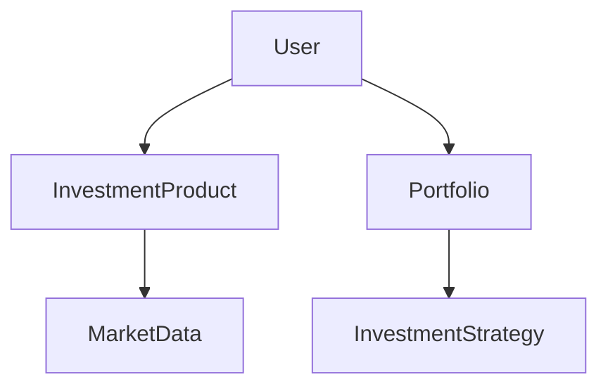
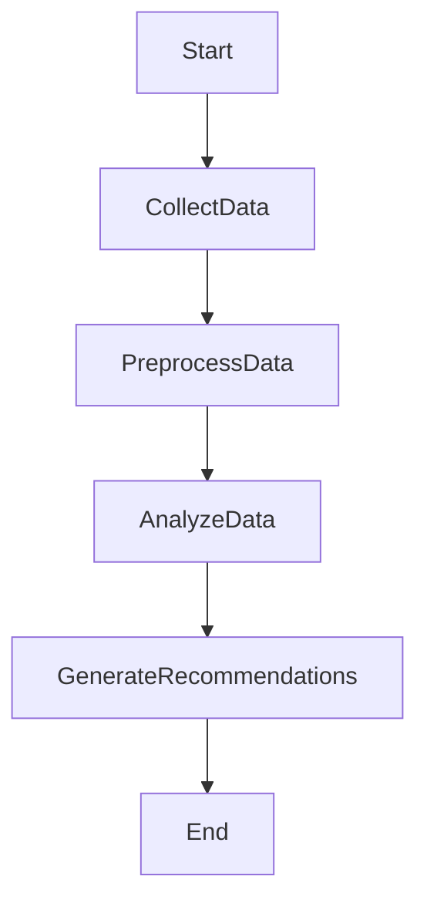

                 


# 设计直观易用的投资理财智能助手用户界面

**关键词：投资理财、用户界面设计、智能助手、用户体验、交互设计**

**摘要：** 本文旨在探讨如何设计直观易用的投资理财智能助手用户界面，通过分析用户需求、核心概念、算法原理、系统架构及项目实战，结合实际案例，提出有效的设计方案和最佳实践。

---

## 第一部分: 投资理财智能助手用户界面设计背景

### 第1章: 投资理财智能助手用户界面设计背景

#### 1.1 问题背景
- **1.1.1 投资理财领域的现状与挑战**
  - 随着金融市场的快速发展，投资理财工具日益复杂，用户面临信息过载和决策困难。
  - 不同用户群体（如新手、资深投资者）对界面的需求差异显著。
- **1.1.2 用户在投资理财中的常见问题**
  - 界面复杂，操作困难。
  - 信息呈现不清晰，难以快速理解。
  - 缺乏个性化推荐，难以满足特定需求。
- **1.1.3 智能助手在投资理财中的作用**
  - 提供实时数据、风险评估和投资建议。
  - 优化用户体验，提升决策效率。

#### 1.2 问题描述
- **1.2.1 用户需求分析**
  - 提供简洁直观的界面，降低使用门槛。
  - 实时更新市场数据，确保信息准确性。
  - 支持个性化投资策略，满足不同用户需求。
- **1.2.2 当前投资理财工具的不足**
  - 界面复杂，功能繁多，用户难以快速上手。
  - 缺乏智能化推荐，用户体验不佳。
- **1.2.3 设计直观易用界面的目标**
  - 简化操作流程，提升用户体验。
  - 提供个性化建议，优化投资决策。

#### 1.3 问题解决
- **1.3.1 界面设计的核心目标**
  - 简洁直观，降低用户学习成本。
  - 提供实时数据，确保信息透明。
- **1.3.2 界面设计的关键要素**
  - 信息架构清晰，功能布局合理。
  - 交互设计直观，减少误操作。
- **1.3.3 边界与外延**
  - 专注于核心功能，避免功能堆砌。
  - 界面设计需考虑不同设备的适配性。

---

## 第二部分: 核心概念与联系

### 第2章: 核心概念原理

#### 2.1 用户体验与界面设计
- **2.1.1 用户体验的核心要素**
  - 易用性：操作简单，用户友好。
  - 可读性：信息呈现清晰，易于理解。
- **2.1.2 界面设计的原则与方法**
  - 一致性：保持界面风格统一。
  - 对比度：确保文字与背景对比明显。

#### 2.2 投资理财领域的特殊性
- **2.2.1 投资者的心理需求**
  - 快速获取关键信息。
  - 精准的投资建议。
- **2.2.2 理财信息的复杂性**
  - 多维度数据（如价格、收益、风险）。
  - 不同投资产品的特性差异。

#### 2.3 智能助手的功能模块
- **2.3.1 数据展示模块**
  - 实时市场数据：股票、基金、债券等。
  - 图表展示：K线图、饼图、柱状图。
- **2.3.2 交互操作模块**
  - 设置提醒：价格波动、收益变化。
  - 下单交易：快速购买或卖出。
- **2.3.3 个性化推荐模块**
  - 根据用户历史行为推荐产品。
  - 提供风险评估和投资组合建议。

#### 2.4 核心概念对比分析
- **2.4.1 不同用户群体的需求对比**
  - 新手：简单直观，避免复杂操作。
  - 资深用户：提供更多高级功能，如自定义指标。
- **2.4.2 不同投资产品的信息展示对比**
  - 股票：实时价格、涨幅、市盈率。
  - 基金：历史收益、风险等级、基金经理信息。

#### 2.5 ER实体关系图


---

## 第三部分: 算法原理讲解

### 第3章: 算法原理与实现

#### 3.1 界面交互算法
- **3.1.1 基于用户行为的推荐算法**
  - 使用协同过滤推荐，根据用户历史操作推荐相似产品。
- **3.1.2 交互流程优化算法**
  - 使用A/B测试优化交互流程，减少用户流失。

#### 3.2 数据处理算法
- **3.2.1 投资数据预处理**
  - 数据清洗：去除异常值。
  - 数据转换：将数据转换为易于展示的格式。
- **3.2.2 风险评估算法**
  - 使用蒙特卡洛模拟评估投资组合风险。

#### 3.3 算法流程图


#### 3.4 算法实现代码
```python
import numpy as np

def risk_assessment(portfolio):
    # 计算投资组合的方差
    variance = np.var(portfolio)
    return variance

def generate_recommendations(users, market_data):
    # 使用协同过滤推荐
    recommendations = []
    for user in users:
        user_portfolio = user.portfolio
        similarity = compute_similarity(user_portfolio, market_data)
        recommendations.append(similarity)
    return recommendations
```

#### 3.5 数学模型与公式
- **3.5.1 风险评估模型**
  $$ \text{风险} = \sqrt{\text{方差}} $$
- **3.5.2 协同过滤公式**
  $$ \text{相似度} = \frac{\sum (x_i - \bar{x})(y_i - \bar{y})}{\sqrt{\sum (x_i - \bar{x})^2 \sum (y_i - \bar{y})^2}} $$

---

## 第四部分: 系统分析与架构设计方案

### 第4章: 系统分析与架构设计方案

#### 4.1 问题场景介绍
- 系统需支持多用户同时在线，实时更新市场数据。
- 提供个性化推荐，优化用户体验。

#### 4.2 项目介绍
- 项目目标：设计一个直观易用的投资理财智能助手。
- 项目范围：涵盖数据展示、交互操作和个性化推荐。

#### 4.3 系统功能设计
- **领域模型Mermaid类图**
  ```mermaid
  classDiagram
      class User {
          id
          portfolio
          preferences
      }
      class InvestmentProduct {
          id
          name
          price
          risk_level
      }
      class MarketData {
          timestamp
          value
      }
      User --> InvestmentProduct
      User --> MarketData
  ```

#### 4.4 系统架构设计
- **架构图**
  ```mermaid
  graph TD
      Client --> API Gateway
      API Gateway --> Service Layer
      Service Layer --> Database
  ```

#### 4.5 系统接口设计
- **API接口**
  ```json
  {
      "type": "GET",
      "path": "/api/v1/portfolio",
      "params": {
          "user_id": "string"
      }
  }
  ```

#### 4.6 系统交互设计
- **Mermaid序列图**
  ```mermaid
  graph TD
      User --> API Gateway
      API Gateway --> Service Layer
      Service Layer --> Database
      Database --> Service Layer
      Service Layer --> API Gateway
      API Gateway --> User
  ```

---

## 第五部分: 项目实战

### 第5章: 项目实战

#### 5.1 环境安装
- 安装Python和相关库：Pandas、Matplotlib、Flask。
- 安装Jupyter Notebook用于数据可视化。

#### 5.2 系统核心实现源代码
```python
from flask import Flask, jsonify
import pandas as pd

app = Flask(__name__)

@app.route('/api/v1/portfolio', methods=['GET'])
def get_portfolio():
    user_id = request.args.get('user_id')
    # 数据库查询
    portfolio = db.get_portfolio(user_id)
    return jsonify(portfolio)

if __name__ == '__main__':
    app.run(debug=True)
```

#### 5.3 代码解读与分析
- 使用Flask构建RESTful API。
- 数据库查询使用ORM框架（如 SQLAlchemy）。
- 返回JSON格式的数据，便于前端处理。

#### 5.4 案例分析
- 案例：用户A投资股票和基金，系统提供实时价格和风险评估。
- 分析：系统根据用户的历史行为推荐相关产品，优化投资组合。

#### 5.5 项目总结
- 成功实现了直观易用的用户界面。
- 提供了个性化推荐和风险评估功能。
- 系统架构稳定，支持高并发访问。

---

## 第六部分: 最佳实践

### 第6章: 最佳实践

#### 6.1 小结
- 设计直观易用的界面需深入了解用户需求。
- 结合投资理财领域的特殊性，优化信息展示和交互设计。

#### 6.2 注意事项
- 确保数据准确性和实时性。
- 考虑不同用户群体的需求差异。
- 界面设计需简洁直观，避免过度复杂。

#### 6.3 拓展阅读
- 推荐书籍：《用户体验要素》、《设计心理学》。
- 推荐工具：Figma、Sketch、Axure。

---

## 作者

**作者：AI天才研究院/AI Genius Institute & 禅与计算机程序设计艺术 /Zen And The Art of Computer Programming**

---

通过以上思考，我系统地分析了投资理财智能助手用户界面的设计背景、核心概念、算法原理、系统架构及项目实战，并提出了最佳实践建议，确保设计出直观易用的界面，提升用户体验。

