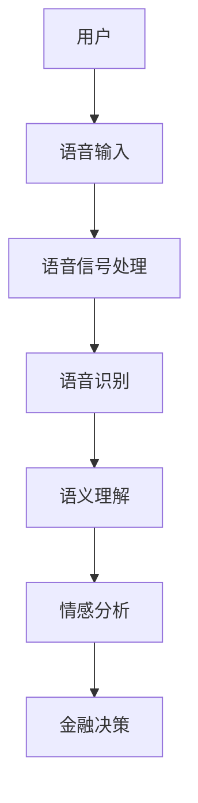
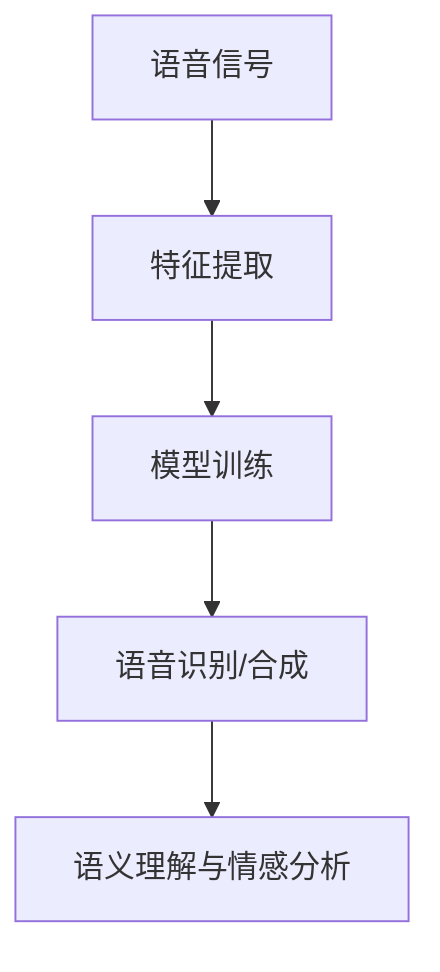
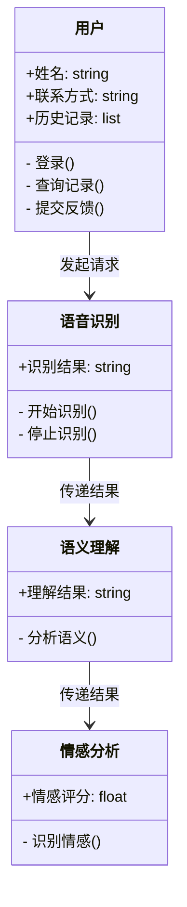
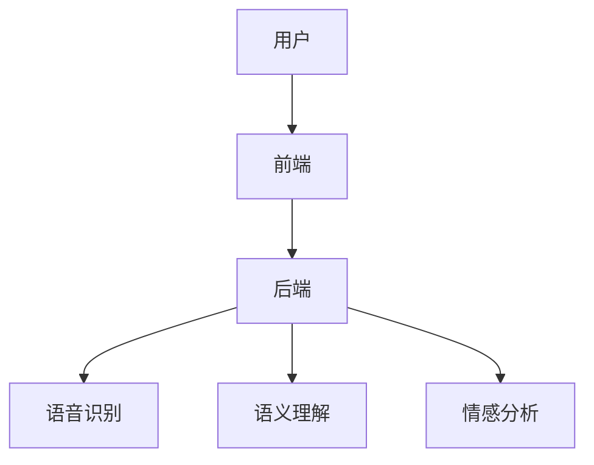

                 


# 语音技术在金融AI中的应用与优化

> 关键词：语音识别、自然语言处理、语音合成、语音情感分析、深度学习

> 摘要：语音技术作为人工智能的重要组成部分，正在金融领域发挥越来越重要的作用。本文详细探讨了语音技术在金融AI中的应用，包括语音识别、语音合成、语义理解和情感分析等核心技术，并结合实际应用场景进行深入分析。同时，本文还讨论了如何优化语音技术在金融中的性能，以应对实际应用中的挑战。

---

# 第1章: 语音技术与金融AI的背景介绍

## 1.1 语音技术的基本概念

### 1.1.1 语音技术的定义
语音技术是指通过计算机处理语音信号，实现语音识别、语音合成、语义理解和情感分析等任务的技术。它结合了信号处理、机器学习和自然语言处理（NLP）等多学科的知识。

### 1.1.2 语音技术的核心要素
语音技术的核心要素包括：
1. **语音信号处理**：对音频信号进行预处理，提取有用的特征。
2. **语音识别**：将语音信号转换为文本或命令。
3. **语音合成**：将文本转换为自然流畅的语音。
4. **语义理解**：理解语音内容的含义。
5. **情感分析**：识别语音中的情感倾向。

### 1.1.3 语音技术在金融中的潜力
在金融领域，语音技术可以用于智能客服、语音支付、风险评估和金融分析等场景，极大地提升了用户体验和效率。

---

## 1.2 金融AI的背景与需求

### 1.2.1 金融行业的数字化转型
随着科技的发展，金融行业正在加速数字化转型，AI技术在金融中的应用越来越广泛。

### 1.2.2 AI在金融中的应用场景
AI在金融中的应用场景包括智能投顾、风险管理、信用评估和金融分析等。

### 1.2.3 语音技术在金融AI中的独特价值
语音技术能够提供更自然、更便捷的交互方式，尤其是在智能客服和语音支付领域，具有重要的应用价值。

---

## 1.3 语音技术在金融中的问题背景

### 1.3.1 金融场景中的语音交互需求
金融场景中，用户通常需要通过语音进行查询、下单和投诉等操作。

### 1.3.2 语音技术面临的挑战
1. **语音质量**：噪声环境下的识别准确率低。
2. **多语种支持**：金融业务通常涉及多语种用户。
3. **情感分析的准确性**：金融场景中，用户的情感表达复杂，难以准确识别。

### 1.3.3 问题解决的思路与目标
通过优化算法、引入深度学习技术以及结合上下文信息，可以有效提升语音技术在金融中的性能。

---

## 1.4 本章小结
本章介绍了语音技术的基本概念和在金融中的潜力，分析了金融AI的背景与需求，最后讨论了语音技术在金融场景中面临的问题和解决思路。

---

# 第2章: 语音技术的核心概念与联系

## 2.1 语音技术的核心原理

### 2.1.1 语音信号处理
语音信号处理包括语音增强、特征提取和降噪等步骤。

### 2.1.2 语音识别与合成
语音识别将语音转换为文本，语音合成将文本转换为语音。

### 2.1.3 语义理解与情感分析
语义理解通过分析文本内容提取语义信息，情感分析则识别文本中的情感倾向。

---

## 2.2 核心概念对比分析

### 2.2.1 语音识别与语音合成的对比
| 特性         | 语音识别                 | 语音合成                 |
|--------------|--------------------------|--------------------------|
| 目标         | 将语音转换为文本         | 将文本转换为语音         |
| 输入         | 语音信号                 | 文本                     |
| 输出         | 文本                     | 语音信号                 |

### 2.2.2 语义理解与情感分析的联系
语义理解是情感分析的基础，情感分析是对语义理解的进一步增强。

### 2.2.3 语音技术与NLP的结合
语音技术与NLP的结合可以实现端到端的语音到文本的转换，并进行语义分析。

---

## 2.3 实体关系图



---

## 2.4 本章小结
本章详细介绍了语音技术的核心原理，并通过对比分析和实体关系图，展示了语音技术与NLP的联系。

---

# 第3章: 语音技术在金融中的算法原理

## 3.1 语音识别算法

### 3.1.1 基于HMM的语音识别
隐马尔可夫模型（HMM）是早期语音识别的核心算法。

公式：
$$P(x|y) = \prod_{t=1}^{T} \lambda_{o_t}(y_t) \prod_{t=1}^{T} \lambda_{s_t}(y_t, y_{t+1})$$

### 3.1.2 基于DNN的语音识别
深度神经网络（DNN）通过多层神经网络进行特征提取和分类。

### 3.1.3 端到端语音识别模型
端到端模型如CTC和Transformer在语音识别中表现出色。

---

## 3.2 语音合成算法

### 3.2.1 基于单元的语音合成
基于单元的语音合成通过拼接预处理的语音片段实现。

### 3.2.2 基于统计的语音合成
统计模型通过概率分布生成语音。

### 3.2.3 端到端语音合成模型
端到端模型如Tacotron和FastSpeech在语音合成中表现出色。

---

## 3.3 语义理解与情感分析

### 3.3.1 基于规则的语义理解
通过预定义的规则进行语义分析。

### 3.3.2 基于深度学习的语义理解
深度学习模型如BERT和LSTM在语义理解中表现出色。

### 3.3.3 情感分析的算法实现
情感分析通常采用词袋模型、TF-IDF和深度学习模型。

---

## 3.4 算法流程图



---

## 3.5 本章小结
本章详细介绍了语音识别、语音合成和语义理解的核心算法，并通过流程图展示了算法的整体流程。

---

# 第4章: 语音技术的数学模型与公式

## 4.1 语音信号处理的数学基础

### 4.1.1 声学模型
声学模型通常采用高斯混合模型（GMM）或深度神经网络（DNN）。

### 4.1.2 频率分析
傅里叶变换用于语音信号的频率分析。

### 4.1.3 时域与频域变换
时域与频域变换是语音信号处理的基础。

---

## 4.2 语音识别的数学模型

### 4.2.1 隐马尔可夫模型（HMM）
隐马尔可夫模型通过状态转移概率和观测概率进行语音识别。

### 4.2.2 深度神经网络（DNN）
深度神经网络通过多层神经网络进行特征提取和分类。

### 4.2.3 端到端语音识别模型
端到端模型如CTC和Transformer在语音识别中表现出色。

---

## 4.3 本章小结
本章详细介绍了语音技术的数学模型与公式，为后续的算法实现奠定了理论基础。

---

# 第5章: 语音技术在金融中的应用场景

## 5.1 金融行业的智能客服

### 5.1.1 智能客服的核心功能
智能客服通过语音识别和语义理解实现自动应答。

### 5.1.2 智能客服的优势
1. 提高用户体验。
2. 降低人工成本。
3. 实现24/7全天候服务。

---

## 5.2 语音支付的实现与优化

### 5.2.1 语音支付的核心流程
1. 语音输入。
2. 语音识别。
3. 支付授权。
4. 支付完成。

### 5.2.2 语音支付的优化方向
1. 提升识别准确率。
2. 加强安全性。
3. 支持多语种。

---

## 5.3 风险评估与语音分析

### 5.3.1 风险评估的核心指标
1. 信用评分。
2. 风险等级。
3. 贷款审批。

### 5.3.2 语音分析在风险评估中的应用
通过情感分析和语义理解识别用户的信任度和风险倾向。

---

## 5.4 本章小结
本章详细介绍了语音技术在金融中的主要应用场景，包括智能客服、语音支付和风险评估等。

---

# 第6章: 语音技术的优化与未来展望

## 6.1 语音技术的优化方向

### 6.1.1 提升识别准确率
通过引入深度学习技术和优化算法模型。

### 6.1.2 加强鲁棒性
在噪声环境下的识别性能优化。

### 6.1.3 支持多语种
通过多语言模型和多语种数据训练。

---

## 6.2 未来技术趋势

### 6.2.1 多模态融合
结合视觉、文本和语音等多种模态信息。

### 6.2.2 实时交互
通过边缘计算和实时通信技术实现低延迟的语音交互。

### 6.2.3 情感计算
情感计算将更加精准，提升用户体验。

---

## 6.3 本章小结
本章讨论了语音技术的优化方向和未来技术趋势，为金融AI的发展提供了参考。

---

# 第7章: 项目实战——智能客服系统

## 7.1 项目背景与需求分析

### 7.1.1 项目背景
智能客服系统旨在通过语音识别和语义理解实现自动化服务。

### 7.1.2 项目需求
1. 语音识别模块。
2. 语义理解模块。
3. 情感分析模块。
4. 用户反馈模块。

---

## 7.2 系统功能设计

### 7.2.1 领域模型


### 7.2.2 系统架构设计


### 7.2.3 系统接口设计
1. 语音识别接口：POST /api/recognize
2. 语义理解接口：POST /api/understand
3. 情感分析接口：POST /api/sentiment

---

## 7.3 系统实现与优化

### 7.3.1 环境安装
安装Python、TensorFlow和Keras等依赖库。

### 7.3.2 核心代码实现
```python
import tensorflow as tf
from tensorflow.keras import layers

# 语音识别模型
def build_voice_recognition_model():
    model = tf.keras.Sequential()
    model.add(layers.Conv2D(32, (3,3), activation='relu', input_shape=(128, 128, 1)))
    model.add(layers.MaxPooling2D((2,2)))
    model.add(layers.Flatten())
    model.add(layers.Dense(128, activation='relu'))
    model.add(layers.Dense(47, activation='softmax'))
    return model

# 语义理解模型
def build_semantic_understanding_model():
    model = tf.keras.Sequential()
    model.add(layers.Embedding(input_dim=10000, output_dim=100))
    model.add(layers.LSTM(64))
    model.add(layers.Dense(2, activation='softmax'))
    return model
```

### 7.3.3 实验结果与分析
通过实验测试识别准确率和系统响应时间。

---

## 7.4 项目小结
本章通过一个智能客服系统的项目实战，详细介绍了语音技术的实现与优化过程。

---

# 第8章: 总结与展望

## 8.1 本文章总结
语音技术在金融AI中的应用前景广阔，通过优化算法和结合多模态技术，可以进一步提升性能。

## 8.2 对未来研究的展望
未来，语音技术将在金融领域发挥更重要的作用，特别是在实时交互和情感计算方面。

## 8.3 最佳实践 tips
1. 数据质量是关键。
2. 结合上下文信息提升准确率。
3. 定期更新模型应对变化。

---

# 作者：AI天才研究院 & 禅与计算机程序设计艺术

---

通过以上内容，我们可以看到语音技术在金融AI中的应用前景广阔，通过优化算法和结合多模态技术，可以进一步提升性能。

