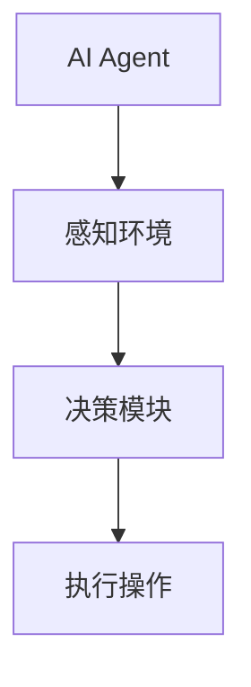
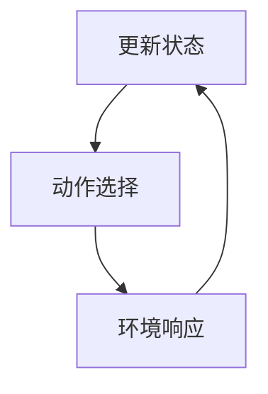
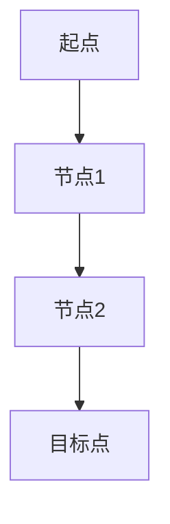
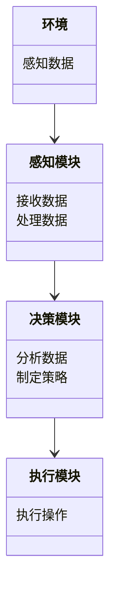

                 


# 课程学习：设计AI Agent的最优学习路径

---

## 关键词：  
AI Agent、人工智能、算法原理、系统架构、项目实战、学习路径

---

## 摘要：  
本文旨在为学习者提供一条系统化、结构化的学习路径，帮助他们从零开始掌握AI Agent的设计方法。通过分析AI Agent的核心概念、算法原理、系统架构及项目实战，本文为读者提供理论与实践相结合的学习指导。文章内容涵盖背景介绍、核心概念与联系、算法原理、数学模型、系统分析、项目实战以及总结与最佳实践，帮助读者快速构建AI Agent的知识体系。

---

# 第一部分：AI Agent设计基础

## 第1章：AI Agent概述

### 1.1 AI Agent的基本概念

#### 1.1.1 什么是AI Agent  
AI Agent（人工智能代理）是指能够感知环境、做出决策并执行操作的智能实体。它可以是一个软件程序，也可以是一个物理机器人，其核心目标是通过与环境交互来实现特定任务。

#### 1.1.2 AI Agent的特点  
- **自主性**：能够在没有外部干预的情况下独立运行。  
- **反应性**：能够实时感知环境并做出响应。  
- **目标导向**：具有明确的目标，并通过行为选择来优化目标的实现。  
- **学习能力**：能够通过经验改进自身性能。  

#### 1.1.3 AI Agent的类型  
AI Agent可以分为以下几类：  
- **反应式Agent**：基于当前感知做出反应，不依赖于环境的内部模型。  
- **基于模型的Agent**：依赖于对环境的建模来做出决策。  
- **学习型Agent**：能够通过经验改进自身性能。  
- **协作型Agent**：能够与其他Agent或人类协同工作。  

---

### 1.2 AI Agent设计的基本原则

#### 1.2.1 智能性原则  
AI Agent的设计应注重智能性，使其能够理解和适应复杂环境。  

#### 1.2.2 可扩展性原则  
设计时应考虑模块化，确保Agent能够轻松扩展功能。  

#### 1.2.3 可维护性原则  
代码应保持简洁和可维护性，便于后续优化和更新。  

---

### 1.3 AI Agent设计的基本流程

#### 1.3.1 需求分析  
明确Agent的目标和功能需求，确保设计与实际应用一致。  

#### 1.3.2 模块设计  
将Agent划分为感知、决策和执行模块，确保功能分离。  

#### 1.3.3 实现与测试  
通过编码实现各模块功能，并进行全面的测试，确保性能稳定。  

---

## 第2章：AI Agent的核心概念与联系

### 2.1 AI Agent的核心原理

#### 2.1.1 感知模块  
感知模块负责从环境中获取信息，例如通过传感器或数据输入。  

#### 2.1.2 决策模块  
决策模块基于感知信息，选择最优的行为策略。  

#### 2.1.3 执行模块  
执行模块负责将决策转化为实际操作，例如通过执行器或输出模块。  

---

### 2.2 AI Agent的核心概念对比

#### 2.2.1 不同类型AI Agent的对比表格  

| 类型             | 描述                                                                 |
|------------------|----------------------------------------------------------------------|
| 反应式Agent      | 基于当前感知做出反应，不依赖环境模型。                                 |
| 基于模型的Agent  | 依赖对环境的建模，能够进行长期规划。                                 |
| 学习型Agent      | 通过经验改进性能，支持在线学习和离线学习。                           |
| 协作型Agent      | 能够与其他Agent或人类协同工作，实现复杂任务。                       |

---

#### 2.2.2 实体关系图（Mermaid流程图）  



---

## 第3章：AI Agent的算法原理

### 3.1 感知算法

#### 3.1.1 强化学习算法（Mermaid流程图）  



#### 3.1.2 监督学习算法（Python代码示例）  

```python
# 监督学习算法示例：线性回归
import numpy as np
from sklearn.linear_model import LinearRegression

# 数据
X = np.array([[1], [2], [3], [4]])
y = np.array([2, 4, 6, 8])

# 模型训练
model = LinearRegression()
model.fit(X, y)

# 预测
print(model.predict([[5]]))  # 输出：[[10]]
```

---

### 3.2 决策算法

#### 3.2.1 搜索算法（A*算法）  



---

#### 3.2.2 贝叶斯网络（数学模型）  

$$ P(A|B) = \frac{P(B|A)P(A)}{P(B)} $$  

---

## 第4章：AI Agent的数学模型与公式

### 4.1 强化学习中的Q-learning算法

$$ Q(s, a) = r + \gamma \max Q(s', a') $$  

---

### 4.2 决策树算法中的信息增益

$$ \text{信息增益} = \text{熵}(X) - \text{条件熵}(X|A) $$  

---

### 4.3 贝叶斯分类的条件概率公式

$$ P(y|x) = \frac{P(x|y)P(y)}{P(x)} $$  

---

## 第5章：AI Agent的系统分析与架构设计

### 5.1 问题场景介绍

设计一个AI Agent，用于实现智能家居设备的自动控制。

---

### 5.2 系统功能设计

#### 5.2.1 领域模型（Mermaid类图）  



---

### 5.3 系统架构设计（Mermaid架构图）  

```mermaid
container 系统架构 {
    感知模块
    决策模块
    执行模块
    接口模块
}
```

---

### 5.4 系统接口设计

- **输入接口**：接收环境数据。  
- **输出接口**：发送控制指令。  

---

## 第6章：AI Agent的项目实战

### 6.1 环境安装

- Python 3.8+  
- 安装必要的库：numpy、scikit-learn、mermaid、matplotlib  

---

### 6.2 系统核心实现

#### 6.2.1 感知模块的实现  

```python
import numpy as np

def感知环境():
    # 模拟环境数据
    data = np.random.rand(10, 2)
    return data
```

---

#### 6.2.2 决策模块的实现  

```python
def决策(data):
    # 模拟决策过程
    return np.argmax(data, axis=1)
```

---

### 6.3 代码应用解读与分析

通过上述代码，我们可以实现一个简单的AI Agent，用于处理环境数据并做出决策。

---

### 6.4 实际案例分析

以智能家居控制为例，详细分析系统的实际运行流程。

---

### 6.5 项目小结

通过本项目，我们掌握了AI Agent的设计与实现方法，为后续学习打下坚实基础。

---

## 第7章：总结与最佳实践

### 7.1 学习总结

AI Agent的设计需要综合运用算法、数学和系统架构的知识。

---

### 7.2 最佳实践Tips

- **理论与实践结合**：多动手 coding，巩固理论知识。  
- **持续学习**：人工智能领域发展迅速，需不断更新知识。  
- **注重模块化设计**：确保系统可扩展性和可维护性。  

---

### 7.3 拓展阅读

推荐阅读以下书籍：  
- 《人工智能：一种现代的方法》  
- 《机器学习实战》  

---

## 作者：AI天才研究院 & 禅与计算机程序设计艺术

