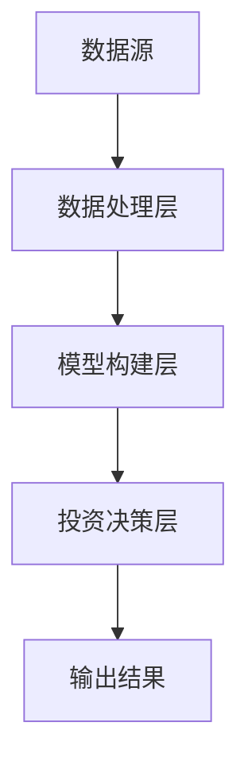
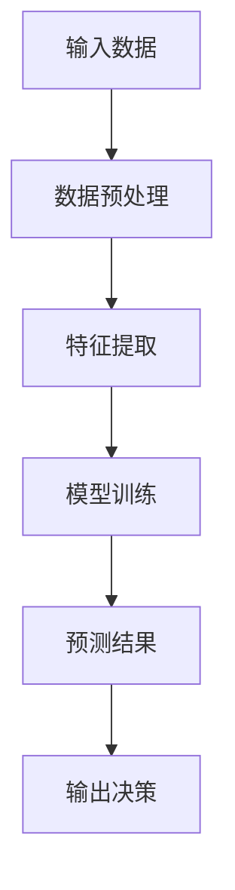

                 


# 费雪到现代：成长型投资的发展

> 关键词：成长型投资，菲利普·费雪，投资策略，系统分析，项目实战，风险管理

> 摘要：本文系统地探讨了成长型投资的发展历程，从菲利普·费雪的经典理论到现代的投资策略，结合实际案例和系统分析，深入剖析了成长型投资的核心要素、风险管理、算法实现及未来趋势。

---

## 第一部分: 成长型投资的理论基础

### 第1章: 成长型投资的核心概念

#### 1.1 投资的基本概念
- 投资的定义与分类
- 成长型投资的定义与特点
- 成长型投资与其他投资类型（如价值投资、套利）的对比

#### 1.2 成长型投资的背景与意义
- 成长型投资的起源与发展
- 成长型投资在现代金融体系中的地位
- 成长型投资的适用场景与局限性

#### 1.3 成长型投资的核心要素
- 企业的成长性：收入、利润、市场份额的增长
- 企业的盈利能力：ROE、净利润率、毛利率
- 企业的竞争优势：护城河、创新能力和管理能力

### 第1.4 费雪的成长型投资理论

#### 1.4.1 费雪的成长型投资理论概述
- 费雪的成长型投资理念的核心思想
- 费雪的成长股筛选标准：利润增长、稳定的收益、合理的估值

#### 1.4.2 费雪与现代成长型投资的对比
- 费雪理论与现代成长型投资的异同
- 现代成长型投资对费雪理论的继承与创新

### 第1.5 现代成长型投资的发展

#### 1.5.1 现代成长型投资的理论基础
- 基于基本面分析的现代成长型投资策略
- 市场情绪与市场周期对成长型投资的影响

#### 1.5.2 现代成长型投资的核心策略
- 成长与估值的平衡：PEG指标的应用
- 分散投资与长期持有的风险管理方法

---

## 第二部分: 成长型投资的系统分析与架构设计

### 第2章: 成长型投资的系统分析

#### 2.1 成长型投资的系统架构

##### 2.1.1 系统模块划分
- 数据采集模块：企业财务数据、市场数据、行业数据
- 模型构建模块：成长性评估模型、估值模型
- 投资决策模块：组合优化、风险控制

##### 2.1.2 系统功能设计
- 数据处理：清洗、整合、特征提取
- 模型实现：基于机器学习的成长股筛选
- 决策支持：可视化分析、策略回测

##### 2.1.3 系统架构图


#### 2.2 成长型投资的算法实现

##### 2.2.1 成长型投资算法的选择
- 基于机器学习的算法：随机森林、支持向量机
- 基于统计学的算法：回归分析、时间序列分析

##### 2.2.2 成长型投资的数学模型
- 成长性评估模型：
  $$ 成长性评分 = \alpha \cdot 收入增长率 + \beta \cdot 利润增长率 $$
- 估值模型：
  $$ 合理估值 = 市盈率 \cdot 净利润 $$

##### 2.2.3 算法流程图


### 第2.3 成长型投资的风险管理

#### 2.3.1 风险来源分析
- 市场风险：整体市场的波动
- 企业风险：企业自身经营状况
- 利率风险：利率变化对估值的影响
- 汇率风险：汇率波动对跨国投资的影响

#### 2.3.2 风险控制策略
- 分散投资：通过多元化降低风险
- 定期评估：动态调整投资组合
- 仓位管理：根据市场变化调整持仓比例
- 止损策略：设定止损点控制亏损

---

## 第三部分: 成长型投资的项目实战

### 第3章: 项目实战

#### 3.1 环境安装与数据准备

##### 3.1.1 环境配置
- 安装Python、Pandas、NumPy、Scikit-learn
- 数据源获取：股票数据API（如Yahoo Finance）

##### 3.1.2 数据预处理
- 数据清洗：处理缺失值、异常值
- 数据转换：标准化、归一化
- 特征提取：收入增长率、利润增长率、市盈率等

#### 3.2 核心代码实现

##### 3.2.1 数据处理代码
```python
import pandas as pd
import numpy as np

# 数据加载
df = pd.read_csv('stock_data.csv')

# 数据清洗
df.dropna(inplace=True)
df['收入增长率'] = (df['收入'] / df['收入'].shift(1)) - 1
df['利润增长率'] = (df['利润'] / df['利润'].shift(1)) - 1
```

##### 3.2.2 成长性评估模型
```python
from sklearn.ensemble import RandomForestClassifier

# 特征矩阵和标签
X = df[['收入增长率', '利润增长率', '市盈率']]
y = df['是否成长股']

# 模型训练
model = RandomForestClassifier()
model.fit(X, y)

# 预测结果
pred = model.predict(X)
```

##### 3.2.3 投资组合优化
```python
import matplotlib.pyplot as plt

# 绘制成长性评分分布
plt.hist(pred, bins=10)
plt.title('成长性评分分布')
plt.show()
```

#### 3.3 实际案例分析

##### 3.3.1 案例背景
- 选取某行业的成长型公司进行分析
- 数据分析与模型预测结果对比

##### 3.3.2 案例分析与解读
- 模型预测结果的准确性分析
- 投资组合的实际表现与预期对比
- 风险管理策略的有效性评估

---

## 第四部分: 总结与展望

### 第4章: 总结与展望

#### 4.1 投资策略总结
- 成长型投资的核心要素回顾
- 现代成长型投资的风险管理方法
- 投资组合优化的关键点

#### 4.2 成长型投资的未来趋势
- 数字化与智能化在成长型投资中的应用
- 全球化背景下的成长型投资机会
- 可持续投资与社会责任投资的结合

---

## 作者：AI天才研究院/AI Genius Institute & 禅与计算机程序设计艺术 /Zen And The Art of Computer Programming

