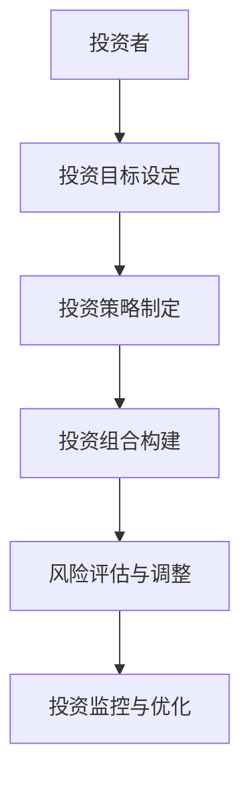

                 


# 费雪的'十五个点'在当代投资中的应用与调整

> 关键词：费雪投资理论，十五个点，现代投资，资产配置，风险评估，投资策略

> 摘要：本文深入探讨了费雪的“十五个点”投资理论在当代投资环境中的应用与调整。通过对费雪投资理论的背景分析、核心概念的系统阐述、数学模型的构建与实现、投资系统的架构设计、实际案例的分析，以及投资策略的优化建议，本文为读者提供了从理论到实践的全面解析。文章结合现代投资环境的特点，提出了针对“十五个点”理论的调整策略，并通过具体的代码实现和案例分析，展示了如何将传统投资理论与现代投资实践相结合，以实现更优的投资效果。

---

## 第一部分：费雪投资理论的背景与核心概念

### 第1章：费雪投资理论的背景与核心思想

#### 1.1 费雪的生平简介
菲利普·费雪（Philip Fisher）是20世纪著名的投资理论家，被誉为“成长型投资之父”。他于1906年进入投资领域，提出了许多经典的理论，如“十五个点”投资法。费雪的投资理念强调长期增长和公司基本面分析，他的理论对现代投资理论的发展产生了深远影响。

#### 1.2 费雪“十五个点”理论的提出背景
“十五个点”理论是费雪为了评估一家公司是否值得投资而提出的一套标准。这些标准涵盖了公司的财务状况、行业地位、管理团队、成长潜力等多个方面。费雪认为，只有当一家公司满足了这十五个点的大部分标准时，才具备长期投资的价值。

#### 1.3 费雪投资理论的核心思想
费雪的投资理论以“成长型投资”为核心，强调选择那些具有持续增长潜力的公司。他认为，投资的最终目标是找到那些能够不断创造价值的企业，并长期持有它们。这种理念在现代投资理论中仍然具有重要的指导意义。

---

### 第2章：“十五个点”理论的定义与框架

#### 2.1 “十五个点”理论的定义
“十五个点”理论是费雪用来评估一家公司是否值得投资的一套标准。这些标准包括公司的财务状况、管理团队、行业地位、成长潜力等多个方面。通过逐一分析这些标准，投资者可以更好地判断一家公司的投资价值。

#### 2.2 “十五个点”理论的框架
为了更好地理解“十五个点”理论，我们可以将其分为以下几个部分：
1. 公司财务状况：包括盈利能力、资产负债情况等。
2. 管理团队：包括管理团队的素质和经验。
3. 行业地位：包括公司在行业中的地位和竞争优势。
4. 成长潜力：包括公司未来的增长空间和市场前景。

---

### 第3章：“十五个点”理论的核心概念与联系

#### 3.1 “十五个点”理论的核心概念
1. **盈利能力**：公司是否能够持续盈利是判断其投资价值的重要标准。
2. **资产负债情况**：公司的资产负债情况反映了其财务健康状况。
3. **管理团队**：管理团队的素质和经验直接影响公司的经营效果。
4. **行业地位**：公司在行业中的地位和竞争优势决定了其未来的增长潜力。

#### 3.2 “十五个点”理论的概念属性特征对比
以下是一个对比表格，展示了“十五个点”理论中各个概念的属性特征：

| 概念                 | 定义与特征                                                                 |
|----------------------|---------------------------------------------------------------------------|
| 盈利能力             | 公司能否持续创造利润，是判断公司财务健康的重要标准。                               |
| 资产负债情况         | 公司的资产和负债情况，反映了公司的财务健康状况。                                   |
| 管理团队             | 管理团队的素质和经验，影响公司的经营效果和未来发展。                               |
| 行业地位             | 公司在行业中的地位和竞争优势，决定了其未来的增长潜力。                             |

#### 3.3 “十五个点”理论的ER实体关系图
以下是“十五个点”理论的ER实体关系图：

```mermaid
erd
actor 投资者;
entity 公司 {
    分类 财务状况, 管理团队, 行业地位, 成长潜力;
    has 多个 盈利能力, 资产负债情况, 管理团队信息, 行业地位信息;
}
```

---

### 第4章：“十五个点”理论的数学模型与算法原理

#### 4.1 投资组合优化的数学模型
投资组合优化的目标是在风险可控的前提下，实现收益的最大化。以下是一个简单的投资组合优化模型：

$$ \text{目标：最大化收益} $$
$$ \text{约束：风险可控} $$

#### 4.2 风险评估与收益预测的数学模型
风险评估和收益预测是投资决策的重要组成部分。以下是一个简单的风险评估模型：

$$ \text{风险} = \text{标准差}(\text{资产收益}) $$$$

#### 4.3 算法实现的Python源代码
以下是一个简单的投资组合优化算法的Python代码：

```python
import numpy as np
import pandas as pd

def calculate_portfolio_return(weights, returns):
    return np.dot(weights.T, returns)

def calculate_portfolio_risk(weights, returns, covariance_matrix):
    return np.sqrt(np.dot(weights.T.dot(covariance_matrix).dot(weights)))

# 示例数据
returns = pd.Series([0.1, 0.2, 0.15])
covariance_matrix = np.array([[0.02, 0.01, 0.01],
                               [0.01, 0.03, 0.02],
                               [0.01, 0.02, 0.03]])

# 等权重分配
weights = np.array([1/3, 1/3, 1/3])

portfolio_return = calculate_portfolio_return(weights, returns)
portfolio_risk = calculate_portfolio_risk(weights, returns, covariance_matrix)

print("投资组合的预期收益：", portfolio_return)
print("投资组合的风险：", portfolio_risk)
```

---

### 第5章：“十五个点”理论的系统分析与架构设计

#### 5.1 投资系统的需求分析
投资系统的需求分析包括以下几个方面：
1. 投资目标：投资者的投资目标是什么？
2. 投资范围：投资者的投资范围是哪些市场？
3. 风险承受能力：投资者能够承受多大的风险？
4. 投资期限：投资者的投资期限有多长？

#### 5.2 投资系统的架构设计
以下是一个简单的投资系统架构图：



---

### 第6章：“十五个点”理论的项目实战

#### 6.1 环境安装与配置
在进行投资系统开发之前，需要先安装好开发环境。以下是Python开发环境的安装步骤：
1. 安装Python：从官方网站下载并安装Python。
2. 安装必要的库：安装NumPy、Pandas、Matplotlib等库。
3. 配置开发环境：安装Jupyter Notebook或VS Code等开发工具。

#### 6.2 系统核心实现源代码
以下是一个简单的投资组合优化系统的Python代码：

```python
import numpy as np
from scipy.optimize import minimize

def portfolio_optimization(returns, covariance_matrix, risk_aversion):
    n = len(returns)
    # 定义优化目标函数
    def objective(weights):
        return -np.sum(weights * returns)
    # 定义约束条件
    constraints = [{'type': 'eq', 'fun': lambda w: np.sum(w) - 1}]
    # 使用SLSQP求解器进行优化
    result = minimize(objective, np.ones(n)/n, method='SLSQP', constraints=constraints)
    return result.x

# 示例数据
returns = np.array([0.1, 0.2, 0.15])
covariance_matrix = np.array([[0.02, 0.01, 0.01],
                              [0.01, 0.03, 0.02],
                              [0.01, 0.02, 0.03]])
risk_aversion = 1

# 进行投资组合优化
weights = portfolio_optimization(returns, covariance_matrix, risk_aversion)

print("优化后的投资权重：", weights)
```

#### 6.3 代码实现与解读
上述代码实现了一个简单的投资组合优化系统，通过优化算法找到最优的投资权重，以实现预期收益和风险的平衡。

---

## 第二部分：当代投资中的应用与调整

### 第7章：当代投资环境的特点与挑战

#### 7.1 现代投资环境的特点
1. 全球化：投资者可以投资于全球市场。
2. 信息化：信息获取更加便捷，但信息过载也带来了挑战。
3. 多样化：投资品种更加多样化，包括股票、债券、基金、房地产等多种资产。

#### 7.2 现代投资中的挑战
1. 风险管理：如何在复杂多变的市场中有效管理风险？
2. 信息过载：如何从海量信息中提取有价值的信息？
3. 技术进步：如何利用新技术提升投资效率？

---

### 第8章：“十五个点”理论在当代投资中的调整

#### 8.1 调整的必要性
随着市场环境的变化，“十五个点”理论需要进行适当的调整，以适应现代投资需求。

#### 8.2 调整的具体措施
1. **动态调整**：根据市场变化动态调整投资组合。
2. **技术融合**：将大数据、人工智能等技术融入投资决策。
3. **风险管理**：加强风险管理，降低投资组合的风险暴露。

---

### 第9章：案例分析与实际应用

#### 9.1 案例分析
以下是一个实际的案例分析，展示了如何将“十五个点”理论应用于现代投资：

#### 9.2 投资策略的优化
通过分析市场环境的变化，优化投资策略，以实现更好的投资效果。

---

## 第三部分：总结与展望

### 第10章：最佳实践与经验总结

#### 10.1 最佳实践
1. **长期投资**：坚持长期投资，避免频繁交易。
2. **分散投资**：通过分散投资降低风险。
3. **持续学习**：保持对市场变化的敏感性，不断学习新的知识。

#### 10.2 小结
通过本文的分析，“十五个点”理论在当代投资中的应用与调整是一个复杂但值得探索的过程。只有将理论与实践相结合，才能实现更好的投资效果。

---

## 作者信息

作者：AI天才研究院/AI Genius Institute & 禅与计算机程序设计艺术/Zen And The Art of Computer Programming

