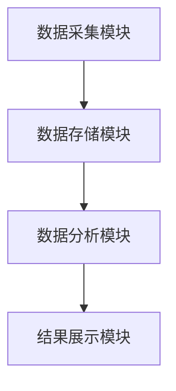
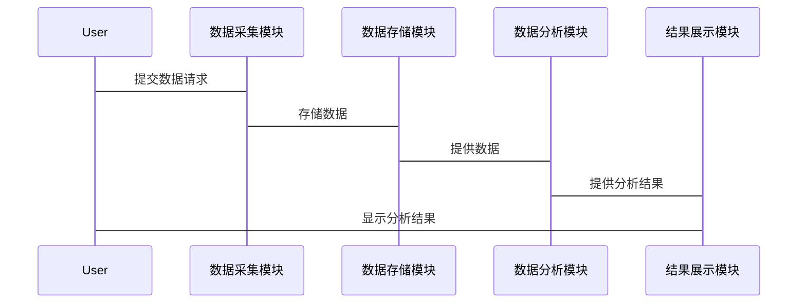

                 


# 费雪的产业链分析技巧

## 关键词：产业链分析，费雪分析法，投资决策，行业研究，数学模型

## 摘要：  
费雪的产业链分析技巧是一种通过系统性分析产业链的各个环节及其相互关系，从而评估行业竞争力和投资潜力的方法。本文从产业链的基本概念出发，详细探讨了费雪分析法的核心原理、数学模型、系统架构及实际应用案例。通过具体的行业案例分析，展示了如何利用费雪的产业链分析技巧优化投资决策，并提供了实际操作中的最佳实践和注意事项。

---

# 第1章: 产业链分析的背景与意义

## 1.1 产业链的基本概念  
### 1.1.1 产业链的定义与构成  
产业链是指从原材料供应、生产加工、分销到最终消费者的完整链条，通常分为上游（原材料供应）、中游（生产加工）和下游（分销与消费）三个部分。  

### 1.1.2 产业链分析的重要性  
产业链分析帮助企业识别行业中的关键环节，评估各环节的竞争力和协同效应，从而优化资源配置和降低成本。  

### 1.1.3 产业链分析的背景与现状  
随着全球经济的复杂化，产业链的全球化分工和本地化生产趋势并存，产业链分析成为企业制定战略的重要工具。  

## 1.2 费雪分析法的起源与演变  
### 1.2.1 费雪分析法的提出  
费雪分析法由投资大师菲利普·费雪提出，主要用于通过分析企业的供应链和上下游关系，寻找具有持续竞争优势的企业。  

### 1.2.2 费雪分析法的发展历程  
随着经济学和管理学的发展，费雪分析法不断完善，逐渐形成了系统化的产业链分析框架。  

### 1.2.3 费雪分析法与其他产业链分析方法的对比  
费雪分析法注重产业链的协同效应和竞争优势，与波特五力分析法和价值链分析法有显著区别。  

## 1.3 产业链分析的意义与价值  
### 1.3.1 产业链分析对企业投资决策的作用  
通过分析产业链的结构，投资者可以识别行业中的龙头企业和潜在风险。  

### 1.3.2 产业链分析对行业发展的推动作用  
产业链分析有助于优化行业分工，提高整体效率。  

### 1.3.3 产业链分析的局限性与改进方向  
产业链分析依赖于数据的准确性和模型的合理性，未来需要结合大数据和人工智能技术进一步完善。

---

# 第2章: 费雪产业链分析的核心概念

## 2.1 产业链的结构与组成  
### 2.1.1 产业链的上游、中游和下游  
- **上游**：原材料供应商，如芯片制造业的晶圆供应商。  
- **中游**：生产加工企业，如半导体制造商。  
- **下游**：分销商和消费者，如电子产品零售商。  

### 2.1.2 各环节之间的关系与影响  
- 上游原材料的价格波动直接影响中游企业的成本。  
- 下游市场需求的变化会反向影响中游和上游的产能布局。  

### 2.1.3 产业链的稳定性与竞争力分析  
- 竞争力强的产业链通常具有较高的行业集中度和高效的供应链管理。  

## 2.2 费雪分析法的核心要素  
### 2.2.1 市场需求与供给的平衡点  
通过分析市场供需关系，确定产业链中哪些环节具有定价权。  

### 2.2.2 产业链各环节的协同效应  
- 协同效应强的产业链通常具有更高的效率和更低的成本。  

### 2.2.3 核心企业的竞争优势分析  
- 核心企业通常具有品牌优势、技术优势或成本优势。  

## 2.3 产业链分析的关键指标  
### 2.3.1 市场占有率分析  
- 通过分析各企业的市场份额，判断其在产业链中的地位。  

### 2.3.2 供应链效率评估  
- 通过分析库存周转率、交货周期等指标，评估供应链的效率。  

### 2.3.3 行业集中度分析  
- 行业集中度高通常意味着市场垄断性强，竞争压力小。  

---

# 第3章: 费雪产业链分析的数学模型与算法

## 3.1 产业链分析的数学模型  
### 3.1.1 市场影响力模型  
$$ \text{市场影响力} = \frac{\text{市场份额} \times \text{利润率}}{\text{行业平均利润率}} $$  

### 3.1.2 供应链效率模型  
$$ \text{供应链效率} = \frac{\text{订单完成时间}}{\text{平均生产周期}} $$  

### 3.1.3 竞争力评估模型  
$$ \text{竞争力指数} = \sum_{i=1}^{n} (\text{市场份额}_i \times \text{利润率}_i) $$  

## 3.2 费雪分析法的算法流程  
### 3.2.1 数据收集与处理  
- 数据来源包括行业报告、企业财报和市场调研。  

### 3.2.2 关键指标计算  
- 使用Python代码计算市场占有率、供应链效率等关键指标。  

### 3.2.3 产业链竞争力评估  
- 基于数学模型评估各环节的竞争力，识别潜在投资机会。  

## 3.3 算法实现与案例分析  
### 3.3.1 Python代码实现  
```python
import pandas as pd

# 数据加载
data = pd.read_csv('industry_data.csv')

# 计算市场占有率
market_share = data['revenue'] / data['industry_revenue'].sum()

# 计算竞争力指数
competitiveness_index = market_share * data['profit_margin']
```

### 3.3.2 案例分析与结果解读  
- 以某行业为例，展示如何通过Python代码计算市场占有率和竞争力指数，并解读结果。

---

# 第4章: 产业链分析的系统架构与设计

## 4.1 系统分析与架构设计  
### 4.1.1 系统功能模块划分  
- 数据采集模块、数据分析模块、结果展示模块。  

### 4.1.2 系统架构设计图  


### 4.1.3 系统接口设计  
- 数据接口：API用于数据导入和导出。  

### 4.1.4 系统交互序列图  


## 4.2 产业链分析的系统实现  
### 4.2.1 数据采集与处理  
- 使用爬虫技术采集行业数据，并进行清洗和预处理。  

### 4.2.2 指标计算与可视化  
- 使用Matplotlib或Seaborn进行数据可视化，展示市场占有率和供应链效率。  

### 4.2.3 竞争力评估与报告生成  
- 基于分析结果生成竞争力评估报告，提供投资建议。  

---

# 第5章: 项目实战——基于费雪分析法的行业案例分析

## 5.1 项目背景与目标  
### 5.1.1 项目背景介绍  
以新能源汽车行业为例，分析其产业链结构和竞争格局。  

### 5.1.2 项目目标与范围  
识别产业链中的关键环节，评估各环节的竞争力，为投资者提供决策支持。  

## 5.2 数据收集与处理  
### 5.2.1 数据来源与采集方法  
- 数据来源包括行业报告、企业财报和市场调研。  

### 5.2.2 数据清洗与预处理  
- 去除无效数据，填充缺失值，标准化数据格式。  

### 5.2.3 数据分析与可视化  
- 使用Python绘制市场占有率和供应链效率的柱状图和折线图。  

## 5.3 案例分析与结果解读  
### 5.3.1 上游原材料分析  
- 原材料价格波动对电池供应商的影响。  

### 5.3.2 中游制造环节分析  
- 主要厂商的市场占有率和利润率对比。  

### 5.3.3 下游分销与消费分析  
- 消费者偏好对终端销售的影响。  

## 5.4 项目小结  
通过案例分析，验证了费雪分析法的有效性，并展示了其在实际投资决策中的应用价值。

---

# 最佳实践与小结

## 5.5 最佳实践 tips  
- 数据的准确性和完整性是产业链分析的关键。  
- 在实际应用中，建议结合大数据和人工智能技术提升分析效率和准确性。  

## 5.6 小结  
费雪的产业链分析技巧是一种系统化的分析方法，能够帮助投资者和企业管理者更好地把握行业动态，优化资源配置。  

## 5.7 注意事项  
- 在实际操作中，要注意数据的时效性和行业特殊性。  
- 需要结合具体的行业背景和市场环境进行调整和优化。  

## 5.8 拓展阅读  
- 《投资学基础》  
- 《产业链分析与企业战略》  
- 《费雪投资哲学》  

---

# 作者：AI天才研究院/AI Genius Institute & 禅与计算机程序设计艺术 /Zen And The Art of Computer Programming

