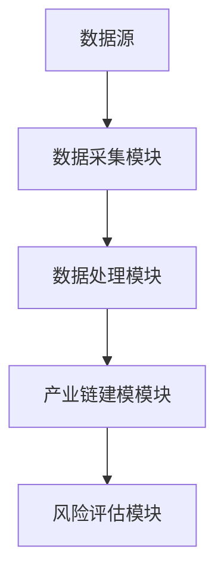

                 


# 费雪的产业链分析方法

> 关键词：产业链分析，费雪，经济模型，系统架构，数学公式，投资分析

> 摘要：本文系统地介绍了费雪的产业链分析方法，从理论基础到算法原理，从系统架构到项目实战，全面剖析了这一方法的核心思想和应用场景。文章首先从产业链分析的背景与意义入手，详细阐述了费雪方法的核心概念与联系，接着深入分析了其算法原理和数学模型，最后通过实际案例展示了该方法在项目中的应用。

---

## 第一部分: 费雪的产业链分析方法概述

### 第1章: 产业链分析的背景与意义

#### 1.1 产业链分析的基本概念

##### 1.1.1 产业链的定义与内涵
产业链是指从原材料供应到产品最终消费者的生产过程中的各个环节和参与者之间的相互联系和协作关系。它包括上游（原材料供应）、中游（生产加工）和下游（销售与消费）三个主要部分。

##### 1.1.2 产业链分析的重要性
产业链分析能够帮助企业识别关键节点、优化资源配置、降低运营成本，并在投资决策中提供科学依据。此外，产业链分析还能帮助政府制定产业政策，促进产业升级。

##### 1.1.3 产业链分析的应用领域
产业链分析广泛应用于经济学、投资学、管理学等领域。例如，在投资领域，可以通过产业链分析选择具有竞争优势的企业；在企业管理中，可以通过产业链分析优化供应链管理。

#### 1.2 费雪产业链分析方法的提出

##### 1.2.1 费雪的经济学背景
费雪（ Irving Fisher）是美国著名经济学家，以其在货币理论、资本理论和投资理论方面的贡献而闻名。他的理论为现代经济学奠定了重要基础。

##### 1.2.2 产业链分析的理论基础
费雪的产业链分析方法基于经济学的基本原理，尤其是供需理论和成本理论。他认为，产业链的运行效率取决于各环节之间的协调和优化。

##### 1.2.3 费雪方法的核心思想
费雪提出，产业链的优化需要从整体出发，分析各环节之间的关系，识别关键节点，并通过数学模型量化分析，从而实现资源的最优配置。

---

### 第2章: 产业链的核心概念与联系

#### 2.1 产业链的结构分析

##### 2.1.1 产业链的组成要素
产业链的组成要素包括：原材料供应、生产加工、分销网络、最终消费者等。

##### 2.1.2 产业链的上下游关系
产业链的上下游关系可以通过以下公式表示：
$$
U = D \times S
$$
其中，U 表示上游的供应能力，D 表示下游的需求量，S 表示供应链效率。

##### 2.1.3 产业链的循环与动态特征
产业链是一个动态系统，各环节之间的关系会随着市场环境的变化而调整。费雪通过数学模型描述了这种动态关系：
$$
C(t+1) = C(t) + \Delta C
$$
其中，C 表示产业链的运行效率，$\Delta C$ 表示变化量。

#### 2.2 费雪产业链分析的核心要素

##### 2.2.1 产业链的供需关系
供需关系是产业链的核心，可以通过以下公式表示：
$$
Q = S - D
$$
其中，Q 表示供需差异，S 表示供给量，D 表示需求量。

##### 2.2.2 产业链的成本结构
成本结构是影响产业链效率的重要因素，可以通过以下公式优化：
$$
Min \sum_{i=1}^{n} c_i x_i
$$
其中，$c_i$ 表示第 i 个环节的成本，$x_i$ 表示该环节的投入量。

##### 2.2.3 产业链的竞争格局
竞争格局可以通过市场集中度来衡量，常用的指标是CRn（行业集中度指数）：
$$
CR_n = \sum_{i=1}^{n} s_i
$$
其中，$s_i$ 表示第 i 个企业的市场份额。

#### 2.3 产业链分析的数学模型与公式

##### 2.3.1 产业链供需关系的数学表达
$$
S = D
$$
##### 2.3.2 产业链成本结构的公式
$$
C = \sum_{i=1}^{n} c_i
$$
##### 2.3.3 产业链竞争格局的评估指标
$$
CR_n = \sum_{i=1}^{m} w_i r_i
$$

---

### 第3章: 费雪产业链分析方法的算法原理

#### 3.1 费雪产业链分析的算法流程

##### 3.1.1 数据收集与处理
数据收集是产业链分析的第一步，需要获取各环节的供需数据、成本数据和竞争数据。

##### 3.1.2 产业链结构的建模
通过数学模型构建产业链的结构，识别关键节点和薄弱环节。

##### 3.1.3 产业链关键节点的识别
通过数据分析，识别出产业链中的关键节点，例如瓶颈环节或高成本环节。

##### 3.1.4 产业链风险的评估与预警
建立风险评估模型，对产业链的潜在风险进行预警和应对方案设计。

#### 3.2 费雪产业链分析的数学模型

##### 3.2.1 产业链供需平衡模型
$$
Q = S - D
$$
##### 3.2.2 产业链成本优化模型
$$
Min \sum_{i=1}^{n} c_i x_i
$$
##### 3.2.3 产业链风险评估模型
$$
R = \sum_{i=1}^{m} w_i r_i
$$

---

### 第4章: 产业链分析的系统架构设计

#### 4.1 系统功能设计

##### 4.1.1 数据采集模块
负责从数据库或外部接口获取产业链相关的数据。

##### 4.1.2 数据处理模块
对数据进行清洗、转换和标准化处理。

##### 4.1.3 产业链建模模块
基于数学模型构建产业链的结构模型。

##### 4.1.4 风险评估模块
对产业链的潜在风险进行评估和预警。

#### 4.2 系统架构图



#### 4.3 系统接口设计

##### 4.3.1 数据接口
定义数据输入和输出的格式，例如JSON或CSV。

##### 4.3.2 模型接口
定义模型的输入参数和输出结果。

##### 4.3.3 风险评估接口
定义风险评估的触发条件和输出结果。

---

### 第5章: 费雪产业链分析方法的项目实战

#### 5.1 项目环境安装

##### 5.1.1 系统需求
- Python 3.8+
- numpy, pandas, matplotlib等库

#### 5.2 系统核心实现源代码

##### 5.2.1 数据采集模块
```python
import requests
import json

def fetch_data(url):
    response = requests.get(url)
    return json.loads(response.text)
```

##### 5.2.2 数据处理模块
```python
import pandas as pd

def process_data(data):
    df = pd.DataFrame(data)
    return df
```

##### 5.2.3 产业链建模模块
```python
import numpy as np

def build_model(data):
    # 假设data为数据集
    X = np.array(data['X'])
    Y = np.array(data['Y'])
    # 构建模型
    return model
```

#### 5.3 案例分析

##### 5.3.1 案例背景
假设我们分析汽车行业的产业链，从原材料供应到整车制造再到销售。

##### 5.3.2 数据分析与建模
通过数据采集和处理，构建汽车产业链的供需模型：
$$
Q = S - D
$$
其中，S为汽车产量，D为市场需求量。

##### 5.3.3 优化方案
通过成本优化模型：
$$
Min \sum_{i=1}^{n} c_i x_i
$$
找到最优的成本配置方案。

---

### 第6章: 总结与最佳实践

#### 6.1 总结
费雪的产业链分析方法通过数学模型和系统架构设计，帮助我们全面理解产业链的运行机制，并优化资源配置。

#### 6.2 最佳实践

##### 6.2.1 数据准确性
确保数据的准确性和完整性。

##### 6.2.2 模型适用性
根据实际情况选择合适的模型。

##### 6.2.3 风险管理
建立有效的风险预警机制。

#### 6.3 小结
费雪的产业链分析方法是一种系统化的方法，能够帮助我们更好地理解产业链的运行机制，并在实际应用中优化资源配置。

#### 6.4 注意事项
在实际应用中，需要注意数据的质量和模型的适用性。

#### 6.5 拓展阅读
推荐阅读费雪的《利息理论》和相关经济学经典著作。

---

**作者：AI天才研究院/AI Genius Institute & 禅与计算机程序设计艺术 /Zen And The Art of Computer Programming**

