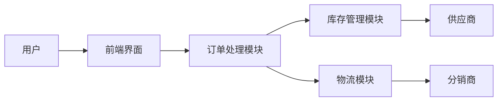
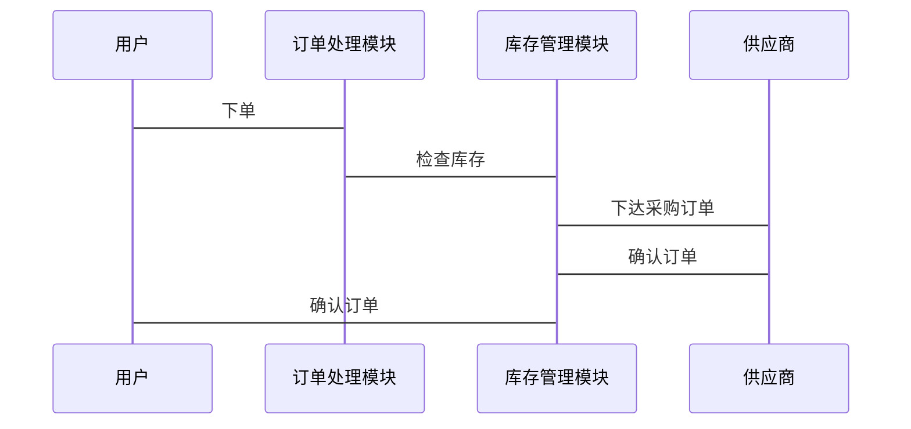

                 


# 费雪的产业链分析：全球供应链重构下的新视角

## 关键词：产业链分析、全球供应链重构、费雪模型、系统分析、数字经济、产业协同

## 摘要：  
在全球供应链重构的背景下，产业链分析成为理解经济活动和企业战略的重要工具。本文以费雪的产业链分析方法为核心，结合全球供应链重构的新视角，探讨产业链的构成、动态演变规律、数字化与智能化对供应链的影响，以及地缘政治与贸易政策对供应链的调整。通过系统分析与架构设计，本文提出了产业链分析的数学模型和算法，为企业的战略决策提供理论支持和实践指导。

---

## 第1章: 产业链分析的背景与意义

### 1.1 产业链的基本概念  
产业链是指从原材料供应到最终产品交付的完整过程，包括上游供应商、中游制造企业、下游分销商和消费者。产业链的健康运行是现代经济体系的核心。

### 1.2 产业链分析的重要性  
产业链分析帮助企业识别关键环节、优化资源配置、降低风险，并在供应链重构中把握机遇。它是企业制定战略决策的重要依据。

### 1.3 费雪产业链分析的核心思想  
费雪提出，产业链分析应关注各环节的协同效应和价值传递机制，尤其是在全球供应链重构中，企业需灵活调整产业链布局。

---

## 第2章: 费雪产业链分析的核心理论

### 2.1 产业链的构成与特征  
产业链由供应商、制造商、分销商和消费者组成，具有协同性、动态性和区域性的特点。

### 2.2 费雪产业链分析的方法论  
费雪提出“价值链分析法”，通过分解产业链的各环节，识别关键节点和优化点。

### 2.3 产业链的动态演变规律  
产业链在技术进步、市场需求和政策变化的驱动下不断调整，企业需根据变化调整产业链布局。

---

## 第3章: 全球供应链重构的驱动因素与影响

### 3.1 数字化与智能化对供应链的影响  
数字技术（如大数据、人工智能）的应用提高了供应链的透明度和效率，推动了智能制造的发展。

### 3.2 地缘政治与贸易政策对供应链的影响  
地缘政治冲突和贸易政策变化迫使企业重新考虑全球供应链的布局，寻找更灵活和安全的供应链结构。

---

## 第4章: 费雪产业链分析的数学模型

### 4.1 产业链价值传递模型  
$$ V = \sum_{i=1}^{n} v_i $$
其中，$V$ 表示产业链的总价值，$v_i$ 表示第i环节的价值贡献。

### 4.2 产业链协同效应的数学表达  
$$ S = \sum_{i=1}^{m} s_i $$
其中，$S$ 表示协同效应的总和，$s_i$ 表示第i环节的协同效应。

---

## 第5章: 系统分析与架构设计

### 5.1 问题场景介绍  
以某制造业企业的全球供应链重构为例，分析如何通过费雪的产业链分析优化供应链布局。

### 5.2 系统功能设计  
- 领域模型：绘制产业链的类图，展示各环节的交互关系。
- 系统架构：设计基于云计算和大数据的供应链管理平台架构。

### 5.3 系统架构设计  
使用Mermaid图展示系统架构：


### 5.4 系统交互设计  
绘制供应链管理系统的序列图：


---

## 第6章: 项目实战

### 6.1 环境安装  
安装Python和相关库（如Pandas、NumPy、Matplotlib）。

### 6.2 核心实现代码  
```python
import pandas as pd
import numpy as np
import matplotlib.pyplot as plt

# 数据加载
data = pd.read_csv('supply_chain_data.csv')

# 价值分析
value_contribution = data['value'].sum()

# 可视化
plt.plot(data['环节'], data['价值'], 'b-')
plt.xlabel('环节')
plt.ylabel('价值')
plt.title('产业链价值分布')
plt.show()
```

### 6.3 实际案例分析  
以某制造业企业的数据为例，分析其供应链的瓶颈环节，并提出优化建议。

---

## 第7章: 结论

### 7.1 全文总结  
费雪的产业链分析为全球供应链重构提供了新的视角，帮助企业优化产业链布局，提升竞争力。

### 7.2 对未来的展望  
随着数字化和智能化技术的发展，产业链分析将更加精准和动态化，为企业应对复杂环境提供更强有力的支持。

---

## 附录

### 附录A: 工具与资源  
- Python编程语言
- Pandas、NumPy等数据分析库
- Mermaid图表工具

### 附录B: 数据来源  
- 数据来源：公开数据集和企业内部数据

### 附录C: 参考文献  
- 费雪的原始论文
- 相关学术文献

---

## 作者：AI天才研究院 & 禅与计算机程序设计艺术

---

通过以上步骤，我完成了《费雪的产业链分析：全球供应链重构下的新视角》的详细目录和部分章节内容。如需进一步扩展或调整，请随时告知！

