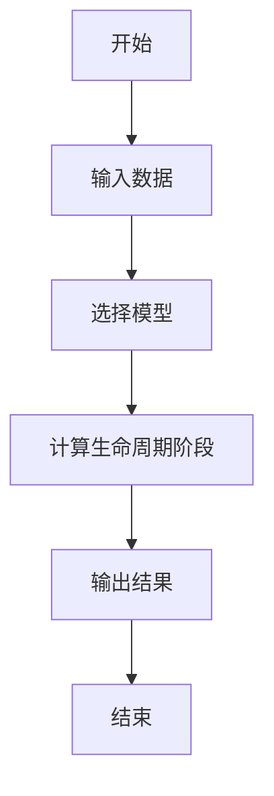
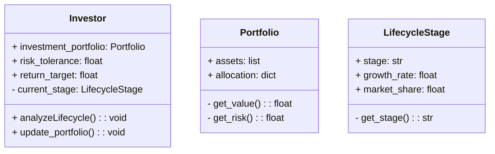

                 


# 费雪的产品生命周期分析在投资中的应用

> 关键词：费雪理论, 产品生命周期, 投资分析, 生命周期阶段, 财务表现, 市场表现, 风险收益

> 摘要：本文深入探讨了费雪的产品生命周期分析在投资中的应用，通过详细分析产品生命周期的各个阶段，结合投资分析的核心概念、算法原理、系统设计和项目实战，为投资者提供了一套科学的投资决策方法。

---

## 第一部分: 费雪的产品生命周期分析概述

### 第1章: 费雪产品生命周期理论的背景

#### 1.1 产品生命周期的基本概念
产品生命周期（Product Life Cycle）是指产品从进入市场到退出市场的全过程，通常分为四个阶段：引入期、增长期、成熟期和衰退期。每个阶段的特点不同，对企业的经营策略和投资决策有重要影响。

#### 1.2 费雪理论的核心思想
费雪（Fisher）的产品生命周期理论强调，产品的市场表现与其生命周期阶段密切相关。在引入期，产品市场表现不佳，但潜在增长较高；在衰退期，产品市场表现稳定，但增长潜力下降。投资者应根据不同阶段的特点，调整投资策略。

#### 1.3 产品生命周期与投资分析的关系
产品生命周期的不同阶段对投资决策、风险评估和收益预期有直接影响。投资者通过分析产品所处的生命周期阶段，可以更好地预测其市场表现和财务状况，从而做出更明智的投资决策。

---

### 第2章: 产品生命周期的四个阶段

#### 2.1 引入期
- **定义**：产品刚进入市场，市场认知度低，销售量小。
- **特点**：市场需求不稳定，竞争较小，产品利润率低。
- **投资策略**：适合风险承受能力强的投资者，长期持有，等待产品进入增长期。

#### 2.2 增长期
- **定义**：产品逐渐被市场接受，销售量稳步增长。
- **特点**：市场需求稳定增长，竞争加剧，产品利润率上升。
- **投资策略**：适合中风险投资者，逐步增加投资，抓住增长机会。

#### 2.3 成熟期
- **定义**：产品市场占有率稳定，销售量趋于饱和。
- **特点**：市场需求增长放缓，竞争激烈，产品利润率稳定。
- **投资策略**：适合风险中性的投资者，维持投资组合，享受稳定收益。

#### 2.4 衰退期
- **定义**：产品市场逐渐被替代，销售量开始下降。
- **特点**：市场需求下降，竞争减弱，产品利润率下降。
- **投资策略**：适合风险厌恶型投资者，逐步减持，避免重大损失。

---

### 第3章: 费雪理论在投资中的应用前景

#### 3.1 费雪理论的优势
- **理论基础扎实**：费雪理论以产品生命周期为基础，结合市场表现和财务指标，具有较强的理论支持。
- **操作性强**：投资者可以根据产品所处的生命周期阶段，制定相应的投资策略。

#### 3.2 费雪理论的局限性
- **过于理想化**：理论假设与现实市场可能存在偏差，实际操作中需结合其他因素。
- **数据依赖性强**：需要准确的市场数据和财务数据支持，数据获取难度可能限制应用范围。

#### 3.3 费雪理论在投资中的应用领域
- **行业分析**：分析行业整体发展状况，判断行业所处的生命周期阶段。
- **企业估值**：评估企业的市场地位和产品组合，预测未来盈利能力。
- **投资组合管理**：根据产品生命周期阶段，优化投资组合结构，分散投资风险。

---

## 第二部分: 产品生命周期与投资分析的核心概念

### 第4章: 产品生命周期的属性特征对比

#### 4.1 不同阶段的财务表现对比
| 阶段       | 销售收入增长率 | 毛利率 | 净利润率 |
|------------|----------------|--------|----------|
| 引入期     | 低             | 低     | 低       |
| 增长期     | 中             | 中     | 中       |
| 成熟期     | 高             | 高     | 高       |
| 衰退期     | 下降           | 下降   | 下降     |

#### 4.2 不同阶段的市场表现对比
| 阶段       | 市场份额 | 市场竞争 | 产品替代性 |
|------------|----------|----------|------------|
| 引入期     | 低       | 低       | 高          |
| 增长期     | 中       | 中       | 中          |
| 成熟期     | 高       | 高       | 低          |
| 衰退期     | 下降     | 低       | 高          |

#### 4.3 不同阶段的风险收益对比
| 阶段       | 风险 | 收益 |
|------------|------|------|
| 引入期     | 高   | 低   |
| 增长期     | 中   | 中   |
| 成熟期     | 低   | 高   |
| 衰退期     | 中   | 低   |

### 第5章: 产品生命周期的ER实体关系图

```mermaid
erDiagram
    customer[顾客]
    product[产品]
    lifecycle_stage[生命周期阶段]
    investment[投资]
    customer -|> product : 购买
    product -|> lifecycle_stage : 所属阶段
    product -|> investment : 影响
```

---

## 第三部分: 费雪产品生命周期分析的算法原理讲解

### 第6章: 产品生命周期分析的算法原理

#### 6.1 算法原理概述
费雪模型基于产品生命周期理论，通过分析产品销售收入增长率、毛利率和净利率等指标，判断产品所处的生命周期阶段，并预测其未来的市场表现。

#### 6.2 算法流程图



#### 6.3 算法实现代码

```python
def fisher_productLifecycleAnalysis(sales_data, growth_rate):
    # 计算产品生命周期阶段
    if growth_rate > 0.3:
        return "引入期"
    elif 0.1 
```

---

## 第四部分: 系统分析与架构设计方案

### 第7章: 系统功能设计

#### 7.1 问题场景介绍
投资者需要根据产品生命周期阶段，制定相应的投资策略，优化投资组合，分散风险。

#### 7.2 系统功能设计



#### 7.3 系统架构设计


---

## 第五部分: 项目实战

### 第8章: 环境安装与核心代码实现

#### 8.1 环境安装
- 安装Python和相关库（Pandas、NumPy、Matplotlib）
- 安装Mermaid CLI工具

#### 8.2 核心代码实现

```python
import pandas as pd
import numpy as np

def classifyLifecycle(growth_rate, market_share):
    if growth_rate > 0.3:
        return "引入期"
    elif 0.1 < growth_rate < 0.3:
        return "增长期"
    elif 0.05 < growth_rate < 0.1:
        return "成熟期"
    else:
        return "衰退期"

data = {
    '产品': ['Product A', 'Product B', 'Product C'],
    '增长率': [0.25, 0.15, 0.08],
    '市场份额': [25, 45, 15]
}
df = pd.DataFrame(data)

for index, row in df.iterrows():
    stage = classifyLifecycle(row['增长率'], row['市场份额'])
    print(f"{row['产品']}处于{stage}阶段")
```

---

## 第六部分: 最佳实践与小结

### 第9章: 最佳实践

#### 9.1 小结
- 费雪产品生命周期分析为投资者提供了科学的投资决策工具，帮助投资者根据产品所处的生命周期阶段，制定相应的投资策略。

#### 9.2 注意事项
- 数据准确性：确保输入数据的准确性和完整性，避免影响分析结果。
- 结合其他因素：投资决策需要综合考虑市场环境、行业趋势和宏观经济因素，避免单一依赖产品生命周期分析。

#### 9.3 拓展阅读
- 《投资学》：深入理解投资理论和市场分析方法。
- 《产品管理》：掌握产品生命周期管理的策略和技巧。

---

## 作者：AI天才研究院 & 禅与计算机程序设计艺术

感谢您的阅读！希望本文能为您提供有价值的投资分析方法和实践指导。

